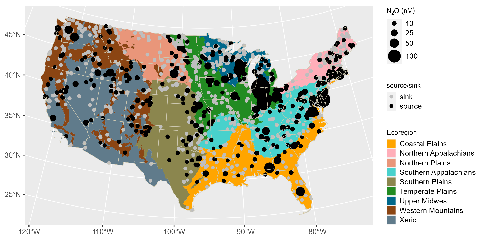

```{r setup, include=FALSE}
# Specify paths-----
# local path for each user.
localPath <- Sys.getenv("USERPROFILE")
#knitr::opts_knit$set(root.dir = "../") # set wd to root of RStudio project
knitr::opts_knit$set(root.dir = rprojroot::find_rstudio_root_file()) # set wd to root of RStudio project

# Libraries-----
# load libraries needed to run scripts in this .Rmd
# libraries loaded by sourcing an external script don't seem to
# be loaded into the global knitr environment
library(tidyverse) # dplyr, ggplot
library(flextable)

```

```{r source_scripts, message=FALSE, warning=FALSE, include=FALSE}
# Load results objects from disk for knitting (if they already exist) ----------
# vector of object names
objs <- c("dg",
          "national_stats",
          "ecoreg_stats",
          "em_min_max",
          "FluxBySize",
          "ipcc.n2o"
          )

N <- length(objs)

# list of file paths for objects saved
f <- list()
for(i in 1:N){
    f[i] <- paste0(Sys.getenv("RENV_PROJECT"), "/manuscript/manuscript_files/",
    objs[i], ".rda")
    }

# load files if they exist
for(i in 1:N){
  if(file.exists(f[[i]]))
    load(f[[i]])
  else
  # source scripts------
  # some libraries are called within this script.  Not sure if that is necessary
  # if libraries are also called above.  Thus far I'm including necessary
  # library calls in external script.
  # see above for .Rmd working directory
    source("manuscript/manuscript_support.R", local = knitr::knit_global())
}

# clean up workspace
rm(f, i, objs, N)

# load sample frame from model files folder
load("modelFiles/sframe.rda")

# remove the Great Salt Lake from sample frame
sframe <- sframe[-258807,]

# Check for figures. If not available, load and run source script --------

# vector of figure names
objs <- c("cond_effect_no3.tif",
          "figure1.png",
          "figure2.tiff",
          "n2oFluxAndEmissionRateVsContinuousArea.tiff",
          "n2oStarBySize.tiff",
          "SIfigure1.tiff"
          )

N <- length(objs)

# list of file paths for objects saved
f <- list()
for(i in 1:N){
    f[i] <- paste0(Sys.getenv("RENV_PROJECT"), "/manuscript/manuscript_figures/",
    objs[i])
    }

# load files if they exist
for(i in 1:N){
  if(file.exists(f[[i]]))
    print("Good! Figure already created")
  else
    print(paste0("missing figure: ", f[[1]]))
 }

# clean up workspace
rm(f, i, objs, N)
```

## Psuedo abstract

**Lakes, ponds, and reservoirs are estimated to be globally important sources of nitrous oxide (N~2~O) to the atmosphere [@DelSontro_etal_2018a], but recent evidence of N~2~O uptake across a broad range of waterbodies have called the accuracy of emission estimates into question. Here we use a new national-scale dataset on dissolved N~2~O and a Bayesian hierarchical model to predict N~2~O concentration and emission rates in `r sframe %>% summarize(nlake = n()) %>% pull() %>% format(., big.mark=",", scientific=FALSE)` waterbodies in the conterminous U.S. (CONUS). We found that N~2~O undersaturation was widespread through the CONUS, with an estimated `r national_stats$post_m_prop_sat * 100`% (95% credible interval: `r national_stats$LCL_prop_sat * 100` - `r national_stats$UCL_prop_sat * 100`%) of waterbodies functioning as N~2~O sinks. The model predicts dissolved N~2~O concentrations reasonably well based partly on interactions between nitrate (NO~3~) concentration, waterbody size, and water temperature. Despite working with the largest aquatic N~2~O dataset to date, our national-scale estimate of N~2~O emissions from CONUS waterbodies is poorly constrained, with a 95% credible interval ranging from net uptake to net emission (`r national_stats %>% select(LCL_fn2o) %>% pull() %>% round(., 0)` - `r national_stats %>% select(UCL_fn2o) %>% pull() %>% round(., 0)` metric tons N~2~O year^-1^). Widespread N~2~O undersaturation in CONUS waterbodies and a national-scale emission estimate that is too uncertain to determine if CONUS waterbodies are a net source or sink of N~2~O highlight the need to revisit N~2~O models which presume surface waters are a N~2~O source.**

## Introduction

Lakes, reservoirs, and ponds (waterbodies hereafter) are considered globally significant sources of nitrous oxide (N~2~O)[@DelSontro_etal_2018a], a potent greenhouse gas and contributor to stratospheric ozone destruction. It is generally assumed that N~2~O emissions from surface waters scale with inorganic nitrogen loading [@Mosier_etal_1998] or productivity [@DelSontro_etal_2018], but recent reports of N~2~O uptake across waterbodies in Canada [@Soued_etal_2016; @Webb_etal_2019] and Finland [@Kortelainen_etal_2020] have called this assumption into question. Furthermore, detailed investigations of individual waterbodies have shown that lentic N~2~O biogeochemistry is dynamic, with some waterbodies alternating between N~2~O sources and sinks in response to nitrogen availability, thermal stratification, and other factors [@Beaulieu_etal_2015; @Beaulieu_etal_2014; @Musenze_etal_2014].

While several measurement campaigns have demonstrated that waterbodies can function as N~2~O sinks[@Soued_etal_2016; @Webb_etal_2019; @Kortelainen_etal_2020; @Beaulieu_etal_2015; @Beaulieu_etal_2014; @Musenze_etal_2014], these studies have been conducted at limited spatial scales and encompassed small ranges in potential environmental drivers (e.g. nitrogen loading). Nitrous oxide dynamics have been investigated in streams and rivers spanning a broad range of environmental conditions, but these systems have been consistently found to be N~2~O sources [@Beaulieu_etal_2008; @Beaulieu_etal_2010; @Quick_etal_2019] and the controls on N~2~O biogeochemistry likely differ between flowing and standing waters. These limitations in data availability have complicated efforts to incorporate N~2~O consumption into freshwater N~2~O budgets.

## Results and Discussion

### N~2~O undersaturation extent

In this study we present the first national-scale survey of N~2~O concentrations and emissions from CONUS waterbodies. A generalized random-tessellation stratified survey design [@Stevens_Olsen_2004] was used to select a spatially-balanced and representative sample of `r dg %>% filter(sitetype == "PROB") %>% distinct(site.id) %>% summarize(n = n()) %>% pull()` sites from CONUS waterbodies that were at least 1 hectare in area, at least 1 meter deep, had at least 0.1 hectare of open water, and had a minimum residence time of one week[@EPAdesign] **(Fig. 1)**. Sample sites were distributed across all nine major CONUS ecoregions and varied widely in water chemistry, morphometry, watershed land-use, and climate [@epa_data]. `r round(((dg %>% dplyr::filter(n2o.src.snk == "sink") %>% {nrow(.)} / dg %>% distinct(site.id) %>% {nrow(.)}) * 100), 1)` percent of the sampled waterbodies were undersaturated in N~2~O and were therefore functioning as N~2~O sinks **(Fig. 1)**. These data, along with the survey design information, were used to develop a Bayesian hierarchical model to predict N~2~O concentrations for all `r sframe %>% summarize(nlake = n()) %>% pull() %>% format(., big.mark=",", scientific=FALSE)` CONUS waterbodies in the target population. At the population level, the majority of CONUS waterbodies (posterior mean = `r national_stats$post_m_prop_sat * 100`%, 95% CI: `r national_stats$LCL_prop_sat * 100` - `r national_stats$UCL_prop_sat * 100`) were predicted to be a net sink for N~2~O. The Western Mountains ecoregion had the smallest proportion of waterbodies predicted as N~2~O sinks (posterior mean = `r ecoreg_stats %>% filter(WSA9 == "WMT") %>% pull(post_m_prop_sat) * 100`%, 95% CI: `r ecoreg_stats %>% filter(WSA9 == "WMT") %>% pull(LCL_prop_sat) * 100` - `r ecoreg_stats %>% filter(WSA9 == "WMT") %>% pull(UCL_prop_sat) * 100`) and the Northern Plains had the greatest (posterior mean = `r ecoreg_stats %>% filter(WSA9 == "NPL") %>% pull(post_m_prop_sat) * 100`%, 95% CI: `r ecoreg_stats %>% filter(WSA9 == "NPL") %>% pull(LCL_prop_sat) * 100` - `r ecoreg_stats %>% filter(WSA9 == "NPL") %>% pull(UCL_prop_sat) * 100`), although the 95% credible intervals over the predictive distributions overlap across all ecoregions **(Table 1)**.



The estimated extent of N~2~O undersaturation in CONUS waterbodies was surprisingly high, particularly for waterbodies in nitrogen rich ecoregions that are managed for agricultural production. This finding runs counter to the long-standing paradigm that surface waters are a source of N~2~O to the atmosphere [@Mosier_etal_1998] and joins other recent reports that lentic waterbodies can function as N~2~O sinks. Webb et al. [@Webb_etal_2019] found that 67% of sampled reservoirs in an agricultural region of Canada were undersaturated with N~2~O during the summer months. An investigation of boreal systems in Canada found that 40% of rivers, lakes, and ponds sampled during the summer were functioning as N~2~O sinks[@Soued_etal_2016]. Similarly, 29% of surveyed boreal lakes in Finland were found to be N~2~O sinks during the summer [@Kortelainen_etal_2020]. While these latter surveys were conducted at regional scales, the national-scale results presented here provide the strongest evidence to date that most lentic waterbodies function as N~2~O sinks during the summer months. This pattern held across all 9 major ecoregions in the CONUS, despite the tremendous variation in climate, geology, waterbody morphology, and land use.

```{r table1, echo = FALSE}
# Set up data
table1_dat <- rbind(national_stats %>% 
        select(WSA9_NAME, 
               total_sa,
               post_m_mean_sat, LCL_mean_sat, UCL_mean_sat, 
               post_m_prop_sat, LCL_prop_sat, UCL_prop_sat, 
               post_m_mean_en2o, LCL_mean_en2o, UCL_mean_en2o, 
               post_m_fn2o, LCL_fn2o, UCL_fn2o),
      ecoreg_stats %>% 
        select(WSA9_NAME, 
               total_sa,
               post_m_mean_sat, LCL_mean_sat, UCL_mean_sat, 
               post_m_prop_sat, LCL_prop_sat, UCL_prop_sat, 
               post_m_mean_en2o, LCL_mean_en2o, UCL_mean_en2o,
               post_m_fn2o, LCL_fn2o, UCL_fn2o)) %>%
  mutate('Mean N2O saturation ratio' = paste0(post_m_mean_sat,
                                         " (", 
                                         LCL_mean_sat,
                                         " - ", 
                                         UCL_mean_sat, ")"),
         'N2O undersaturation extent' = paste0(post_m_prop_sat * 100,
                                               " (", 
                                               LCL_prop_sat * 100, 
                                               " - ", 
                                               UCL_prop_sat * 100,
                                               ")"),
         'N2O emission rate' = paste0(round(post_m_mean_en2o, digits = 3),
                                      " (", 
                                      round(LCL_mean_en2o, digits = 3), 
                                      " - ", 
                                      round(UCL_mean_en2o, digits = 3), 
                                      ")"),
         'N2O flux' = paste0(round(post_m_fn2o, digits = 0), 
                             " (", 
                             round(LCL_fn2o, digits = 0), 
                             " - ",
                             round(UCL_fn2o, digits = 0),
                             ")")) %>% 
  select(WSA9_NAME, total_sa, 'Mean N2O saturation ratio', 'N2O undersaturation extent', 'N2O emission rate', 'N2O flux') %>%
  rename('spatial domain' = WSA9_NAME,
         'waterbody surface area' = total_sa)

# create flextable
flextable(table1_dat) %>%
  set_header_labels('waterbody surface area' = "total waterbody surface area\n(hectares)",
                    'N2O undersaturation extent' = "N2O undersaturation extent\n(% waterbodies)",
                    'N2O emission rate' = "N2O emission rate\n(mg N2O m-2 d-1)",
                    'N2O flux' = "N2O flux\n(metric ton N2O y-1)") %>% # 1 megagram (Mg) = 1 1000 kg = 1 metric ton
  align(j=c(2:6), align = "center", part = "all") %>% # center align columns 2:4
  valign(valign = "top", part = "header") %>% # top align column names
  # caption doesn't show in .Rmd viewer, but renders correctly in .docx
  set_caption(
    caption = as_paragraph( # allows for formatting
      as_chunk("Table 1. Mean saturation ratio, undersaturation extent, emission rate, and flux estimates for N2O at the national and ecoregional scales.", 
               props = fp_text_default(bold = TRUE) # here is where we specify formatting (font, size, bold, etc)
      )
    ),
    align_with_table = FALSE) %>% # table is center aligned, ignore that and apply default left align to caption
  
  footnote(i = 1, j = 3:6,
           ref_symbols = "a",
           value = as_paragraph("Mean and 95% credible intervals based on 2000 draws from the posterior distribution"),
           part = "header"
  ) %>%
    footnote(i = 1, j = 4,
           ref_symbols = ", b",
           value = as_paragraph("Percent of population with N2O saturation ratio < 1."),
           part = "header",
           inline = TRUE
  ) %>%
  footnote(i = 1, j = 5:6,
           ref_symbols = ", c",
           value = as_paragraph("Negative values indicate N2O uptake"),
           part = "header",
           inline = TRUE
  ) %>%
  fontsize(size = 8, part = "all") %>% # doesn't apply to caption when as_paragraph is invoked.
  fontsize(size = 7, part = "footer") %>% #smaller font for footnote
    autofit() %>% # convenient column spacing
  fit_to_width(ft_1, max_width = 11) # scale to fill 8x11 paper, landscape
```

### N~2~O saturation ratio

#### Distribution

Despite widespread N~2~O undersaturation across CONUS waterbodies, the estimated means for N~2~O saturation ratio (ratio of measured to equilibrium concentration) were indistinguishable from one in all ecoregions **(Table 1, Fig. 2)**. The apparent contradiction of widespread N~2~O undersaturation with average dissolved N~2~O concentrations closer to equilibrium can be attributed to the prominent right skew predicted for dissolved N~2~O concentrations across the population of CONUS waterbodies **(Fig. 2)**. Across the CONUS, and within each of the nine major ecoregions, each predicted distribution of N~2~O saturation ratios had a median value less than 1, indicating that most waterbodies were undersaturated in these populations. However, the long right tails on these distributions, comprised of relatively rare waterbodies with very high levels of N~2~O supersaturation, were sufficient to drive the population means to values close to, or even greater than 1. Thus, most waterbodies in the CONUS were functioning as N~2~O sinks during the summer months, but a few functioned as strong N~2~O sources, particularly at high NO~3~ and high water temperature **(Fig. 3)**.

![Figure 2. Predicted distribution of N~2~O saturation values across waterbodies in the nine major ecoregions. Each blue line (n=2000) represents the distribution of values from a single realization of the posterior predictive distribution. Vertical black dashed and solid lines indicate point estimates of the median and mean, respectively, across all realizations (Table 1). Vertical red line indicates a saturation ratio of 1. x-axis is truncated at 3 to better show the area where 97% of the observations occurred.](manuscript_figures/figure2.tiff)

#### Controls on N~2~O

The model results suggest that NO~3~ may be an important predictor for N~2~O, but the relationship is complicated by interactions with water temperature and lake surface area **(Fig. 3)**. This finding mirrors reports from a survey of farm ponds in Canada where N~2~O was found to be associated with dissolved inorganic nitrogen (DIN) concentration, but the effect of DIN was conditional upon thermal stratification strength[@Webb_etal_2019]. These complex interactions may explain contrasting literature reports regarding the role of NO~3~ in regulating N~2~O. Several studies have reported positive correlations between NO~3~ and N~2~O in lakes [@Kortelainen_etal_2020; @Yang_etal_2015] whereas others have found no relationship [@Soued_etal_2016; @Whitfield_etal_2011]. It is possible that the NO~3~ \~ N~2~O relationship wasn't detected in the latter studies because it was confounded by interactions with temperature, lake size, thermal stratification, or other environmental variables.

The influence of NO~3~ levels on N~2~O saturation **(Fig. 3)** may reflect a relationship between NO~3~ levels and denitrification, a type of anaerobic metabolism that couples the oxidation of organic matter with the sequential reduction of NO~3~ to nitrite (NO~2~), nitric oxide (NO), N~2~O, and N~2~ [@Kuypers_etal_2018; @Richardson_etal_2009]. The reduction of NO~3~ to N~2~ can be incomplete, however, resulting in the release of N~2~O to the water column. Incomplete denitrification often occurs when NO~3~ is relatively abundant [@Beaulieu_etal_2015; @Beaulieu_etal_2014], likely because the final reduction of N~2~O to N~2~ is the least energetic reaction in the denitrification pathway, yielding less than 20% of the total energy yield of complete denitrification [@Koike_etal_1975; @Richardson_etal_2009]. When NO~3~ is limiting, however, denitrification can resort to scavenging N~2~O from the water column and reducing it to N~2~, thereby functioning as an N~2~O sink. N~2~O consumption via denitrification may explain the N~2~O undersaturation predicted at low NO~3~ levels, whereas denitrification may be a source of N~2~O at higher NO~3~ levels.

It is also possible that the correlation between N~2~O and NO~3~ reflects the simultaneous production of these solutes via nitrification. Nitrification, an aerobic process which can produce N~2~O as a byproduct, is the microbial oxidation of ammonium (NH~4~^+^) to NO~3~ [@Kuypers_etal_2018]. Nitrification may be more prevalent than denitrification in the predominantly well oxygenated surface waters where the N~2~O samples were collected because denitrification is an anaerobic process. However, denitrification can occur in anoxic microsites within particulate matter suspended in an aerobic water column [@Broman_etal_2021] and can be transported from anoxic sediments to the water surface via advection and diffusion [@DelSontro_etal_2018]. Thus the N~2~O - NO~3~ relationship may be reflective of some combination of N~2~O production/consumption via denitrification and N~2~O production via nitrification.

![Figure 3. Estimated interactive effects of surface water temperature (A and B) and waterbody size (B and D) with NO~3~ levels on the N~2~O saturation ratio.  A) The relationship between N~2~O saturation and surface water temperature, dependent upon nitrate (NO~3~) level.  The five, ordered, categorical levels for NO~3~ correspond to concentration ($\mu$g L^-1^) ranges in the observed data of 1) below detection, 2) $\geq$ 0.55 and \< 4.09, 3) $\geq$ 4.09 and \< 30.20, 4) $\geq$ 30.20 and \< 223.13, and 5) $\geq$ 223.13. B) The relationship between N~2~O saturation and NO~3~ level conditional on surface water temperature. The NO~3~ effect was estimated at 5 quantiles of the surface temperatures observed (10%, 25%, 50%, 75%, 90%). C) The relationship between N~2~O saturation and waterbody surface area (log-transformed hectares) conditional on NO~3~ level. D) The relationship between N~2~O saturation and NO~3~ level conditional on (log) waterbody surface area (5 quantiles).  Horizontal dashed lines in each panel reflect an N~2~O saturation value of 1.](manuscript_figures/cond_effect_no3.tif)

The estimated pattern of increasing N~2~O saturation with water temperature **(Fig. 3)** is  consistent with nitrogen transformations occurring through temperature sensitive biological processes, but the relationship was dependent on NO~3~ levels. At low NO~3~ levels, temperature was estimated to have a relatively minor effect on N~2~O saturation, possibly because N~2~O production/consumption was limited by substrate rather than temperature. The effect of temperature was more pronounced at greater NO~3~ levels, potentially reflecting the stimulatory effect of higher temperature on biological N~2~O production. Elevated water temperature may serve to magnify rates of N~2~O production that may be largely dictated by NO~3~ availability.

Nitrous oxide saturation ratio was also related to waterbody size **(Fig. 3)**.  Small waterbodies with low NO~3~ levels were predicted to be undersaturated, whereas small waterbodies with high NO~3~ were predicted to be highly supersaturated. Large waterbodies, regardless of NO~3~ status, were predicted to have N~2~O saturation ratios closer to equilibrium. When pooled across all ecoregions, the absolute magnitude of the difference between the measured and equilibrium N~2~O concentration, known as $\Delta$ N~2~O, decreased with increasing waterbody size class **(Fig. 4)**. This pattern holds regardless of whether N~2~O was supersaturated or undersaturated. Waterbody size and shape can affect dissolved gas concentration through several mechanisms. In waterbodies with low water volume to benthic surface area ratios, the mass of N~2~O consumed or produced in the sediments can be a substantial fraction of the mass of N~2~O dissolved in the water column [@Carpenter_1983]. Furthermore, sediment may warm faster in small and shallow waterbodies, whereas thermal stratification may substantially delay sediment warming in large and deep waterbodies, resulting in greater rates of N~2~O production or consumption in small lakes. Thermal stratification may also prevent the exchange of water between the lake surface and the hypolimnion, thereby preventing N~2~O depleted or enriched water from advecting to the lake surface [@Beaulieu_etal_2015; @Beaulieu_etal_2014].

Persistent patterns in the air-water gas exchange rate across lake size classes may also contribute to greater N~2~O disequilibrium in smaller waterbodies. Air-water gas exchange will vent excess N~2~O from surface waters or facilitate the invasion of air that can replenish depleted N~2~O in undersaturated waterbodies. Regardless of whether a waterbody is supersaturated or undersaturated in N~2~O, air-water gas exchange will function to move the dissolved N~2~O concentration toward equilibrium. One of the primary drivers of air-water gas exchange in lentic waters is wind speed [@Vachon_etal_2013]. Wind speeds tend to be greater in large lakes with long fetches and lower in small waterbodies, particularly if they are sheltered by shoreline vegetation. Thus, greater air-water gas exchange rates in large lakes may maintain dissolved N~2~O concentrations close to equilibrium, whereas the effect of biogeochemistry on dissolved N~2~O may be more pronounced in small waterbodies because low air-water gas exchange limits the rate at which excess N~2~O can be ventilated or depleted N~2~O can be replenished. While previous surveys have documented relationships between lake size and dissolved methane concentration [@Pighini_etal_2018; @Juutinen_etal_2009; @Borges_etal_2011], to the best of our knowledge this is the first study to document a relationship between lake size and $\Delta$ N~2~O.


## Emission Rates

The predicted emission rates for CONUS waterbodies spanned a broad range (95% CI min: `r em_min_max$min_LCL` - `r em_min_max$min_UCL` mg N~2~O m^-2^ d^-1^, 95% CI max: `r em_min_max$max_LCL` - `r em_min_max$max_UCL` mg N~2~O m^-2^ d^-1^), which was expected for this large and diverse collection of waterbodies, but within the range of values reported in the literature for lentic ecosystems [@Yang_etal_2015; @Kortelainen_etal_2020; @Webb_etal_2019]. Variability and magnitude of predicted N~2~O emission rates decreased with increasing waterbody size **(Fig. 5A)**, which reflects the relationship between N~2~O saturation and waterbody size **(Fig. 3C,D)**. Despite widespread N~2~O undersaturation predicted across CONUS waterbodies, the estimate for the national average N~2~O emission rate was centered over positive values (posterior mean = `r national_stats$post_m_mean_en2o`, 95% CI: `r national_stats$LCL_mean_en2o` - `r national_stats$UCL_mean_en2o` mg N~2~O m^-2^ d^-1^) **(Table 1)** and clearly exceeded the negative estimate for the national median (posterior mean = `r national_stats$post_m_median_en2o`, 95% CI: `r national_stats$LCL_median_en2o` - `r national_stats$UCL_median_en2o` mg N~2~O m^-2^ d^-1^). This departure from the median was due to relatively rare waterbodies with very high emission rates pulling the mean towards the direction of positive skew **(SI Fig. 1)**.

![Figure 5: A) Predicted N~2~O emission rate and B) flux plotted against waterbody size for all 465,896 waterbodies in the target population. Points and bars reflect the posterior means (points) and 95% credible intervals, respectively, based on 2000 draws from the posterior predictive distribution for each waterbody. C) A comparison of the estimated relative flux contributions from waterbodies in each size class to the total CONUS flux. The red line connects the mean of the posterior estimate of the ratio, at each size class, based on 2000 draws. The black polygon indicates the 95% credible intervals for the ratio estimates across the size classes](manuscript_figures/n2oFluxAndEmissionRateVsContinuousArea.tiff)

## Fluxes

Total N~2~O flux from the surface of CONUS waterbodies is a function of N~2~O emission rates and waterbody surface areas. The four smallest size classes (\< 50 Ha) in the survey design represented `r sframe %>% select(area_ha) %>% arrange(area_ha) %>% mutate(number = 1:nrow(.), proportion = number / nrow(.)) %>% filter(abs(50-area_ha) == min(abs(50-area_ha))) %>% pull(proportion) %>% round(2) * 100`% of all lakes in the population but were estimated to have contributed less, on average, to the total N~2~O flux from CONUS waterbodies **(Fig 5C)**. The reason for this pattern is two-fold. First, lakes in the smaller size classes constituted only `r sframe %>% select(area_ha) %>% arrange(area_ha) %>% mutate(cumulative = cumsum(area_ha), distribution = cumulative / sum(area_ha), delta50 = abs(50-area_ha)) %>% filter(delta50 == min(delta50)) %>% pull(distribution) %>% round(3) * 100`% of total waterbody surface area, thereby limiting their N~2~O flux. Second, widespread N~2~O uptake in these size classes largely offset the very high emission rates predicted to occur in a minority of the population. Waterbodies in the largest size class (\> 50 Ha) represented only `r sframe %>% select(area_ha) %>% arrange(area_ha) %>% mutate(number = 1:nrow(.), proportion = number / nrow(.)) %>% filter(abs(50-area_ha) == min(abs(50-area_ha))) %>% pull(proportion) %>% round(2) * 100 * -1 + 100`% of the total number of lakes in the population but had `r sframe %>% select(area_ha) %>% arrange(area_ha) %>% mutate(cumulative = cumsum(area_ha), distribution = cumulative / sum(area_ha), delta50 = abs(50-area_ha)) %>% filter(delta50 == min(delta50)) %>% pull(distribution) %>% round(3) * 100 * -1 +100`% of total lake surface area. This lake size class was estimated to be, on average, the largest contributor to the total N~2~O flux across CONUS **(Fig 5C)**, though the flux estimate is poorly constrained (posterior mean = `r FluxBySize %>% filter(size_cat == "50_max") %>% select(post_m_flux) %>% pull() %>% round(1)`, 95%CI: `r FluxBySize %>% filter(size_cat == "50_max") %>% select(LCL) %>% pull() %>% round(1)` - `r FluxBySize %>% filter(size_cat == "50_max") %>% select(UCL) %>% pull() %>% round(1)` metric tons N~2~O year^-1^). While uncertainty in N~2~O emission rates was smallest for large lakes **(Fig. 5A)**, these small uncertainties propagated to large uncertainties in flux when expressed across the surface area of large waterbodies **(Fig. 5B)**.

Despite the estimated widespread N~2~O undersaturation among CONUS waterbodies, the credible intervals for ecoregion-level flux estimates included zero for all but three ecoregions **(Table 1)**. Thus, status as a net source versus sink of N~2~O was uncertain for most ecoregions. However, the estimates for the Southern Appalachians, Southern Plains, and Temperate Plains included only positive values, suggesting they were likely to have functioned as net N~2~O sources.  We were also unable to infer any clear differences in total flux between ecoregions. This result may sound surprising given the large differences in environmental conditions across these ecoregions, but it should not be mistaken as inferring "no differences" as it primarily emphasizes the challenges in making sufficiently precise estimates at this scale; even with unprecedented data coverage, a robust survey methodology, and relatively advanced modeling techniques.

The estimate for flux across all CONUS waterbodies was centered over positive values (posterior mean = `r national_stats %>% select(post_m_fn2o) %>% pull() %>% round(., 0)` metric tons N~2~O year^-1^); however, the credible interval suggested a good deal of uncertainty and included zero (`r national_stats %>% select(LCL_fn2o) %>% pull() %>% round(., 0)` - `r national_stats %>% select(UCL_fn2o) %>% pull() %>% round(., 0)` metric tons N~2~O year^-1^). Again, we could not confidently infer the extent to which CONUS waterbodies, overall, were a net source or sink of N~2~O. Though we are unaware of independent estimates of N~2~O emissions from CONUS lakes and reservoirs, the Intergovernmental Panel on Climate Change (IPCC) estimated that CONUS drainage networks, inclusive of zero order streams through major river mouths, emit `r format(ipcc.n2o$surface, scientific = FALSE, big.mark = ",")` metric tons N~2~O year^-1^ [@epa_2023]. The IPCC estimates total N~2~O emissions from aquatic ecosystems as a fraction of the anthropogenic nitrogen that leaches from soils into surface water systems, but does not distinguish standing from flowing waters, thus a direct comparison between the IPCC estimate and the value reported here is not possible. However, the upper 95% credible interval of the N~2~O flux estimate for lakes and reservoirs reported here comprises only `r round((national_stats %>% select(UCL_fn2o) %>% pull() / ipcc.n2o$surface) * 100, digits = 1)` % of the IPCC estimate, suggesting the IPCC estimate is too high, possibly because the IPCC model does not allow for N~2~O consumption in lakes, ponds, and reservoirs. This limitation extends to many mechanistic models used to estimate N~2~O fluxes from inland waters [@Lauerwald_etal_2019; @Marzadri_etal_2021; @Marzadri_etal_2017].  Given our estimate of widespread N~2~O consumption in CONUS waterbodies, failure to include this dynamic in aquatic N~2~O models may yield low-biased emission estimates [@Lauerwald_etal_2023]. Recent models allowing for N~2~O consumption in inland waters are promising developments in this regard [@Yao_etal_2019; @Wang_etal_2023; @Maavara_etal_2019]. 

Not only is our estimate of N~2~O emissions from CONUS lakes and reservoirs small compared to the IPCC estimate, it is also small relative to other anthropogenic N~2~O sources, including wastewater treatment (88,00 metric tons N~2~O year^-1^), stationary combustion (84,000 metric tons N~2~O year^-1^), and manure management (66,000 metric tons N~2~O year^-1^) [@epa_2023]. Whether CONUS waterbodies were a net source or sink of N~2~O, their contribution to the US N~2~O budget was likely small by comparison.

Our annual flux estimates are derived from a model of single samples collected from individual waterbodies during the summer.  Our approach therefore implicitly assumes that our summertime observations are reflective of annual conditions. The literature contains strong evidence of seasonality in N~2~O emission rates, but the patterns differ among studies. Some systems have maximum N~2~O emission rates during the winter [@Musenze_etal_2014; @Kortelainen_etal_2020], others in the Fall [@Beaulieu_etal_2014], and yet others during the summer [@Beaulieu_etal_2010]. While our assumption of constant emissions across the year adds uncertainty to our annual flux estimate, it is difficult to determine, based on the literature, if this assumption has biased our estimates. 

## Conclusion

Our research is the first to suggest that most lakes and reservoirs in the CONUS function as N~2~O sinks during the summer.  Our observations of dissolved N~2~O were predicted reasonably well using a regression model with interactions between observed water temperature, NO~3~ concentration, and waterbody size (see SI). These modeling results suggested that NO~3~ levels may play a role in determining whether a waterbody functions as a sink or source of N~2~O, and the magnitude of the source or sink may be exaggerated with increasing water temperature. The degree of N~2~O disequilibrium also increased with decreasing waterbody size, possibly because smaller waterbodies have low air-water gas exchange rates.

Although waterbodies in the largest lake size class tend to have N~2~O levels close to equilibrium, they emit more N~2~O than the other size classes due to their expansive surface area. The N~2~O flux from these waterbodies is also more uncertain than the smaller lake size classes because relatively small uncertainties in dissolved and equilibrium N~2~O concentrations translate to large uncertainties in flux when propagated across the surface of large waterbodies. Uncertainty in the national flux estimate was too large to determine if CONUS waterbodies functioned as a net source or sink of N~2~O. While our sample included some of the largest waterbodies in the CONUS, efforts to improve the accuracy of the lentic N~2~O flux estimate should include an assessment of intra-waterbody spatial variation in N~2~O, which can be important in large waterbodies[@Salk_etal_2019; @Borges_etal_2023], as well as careful accounting of measurement an analytical uncertainty, which can propagate to uncertainties in flux estimates.

The smallest lake size classes were estimated to have both the highest and lowest levels of N~2~O saturation, depending largely on NO~3~ availability. It is unclear whether this variability is related to differences in NO~3~ loading or is an artifact of temporal variation in NO~3~ processing. For example, reservoirs have been shown to function as N~2~O sources in early summer when NO~3~ is replete, but switch to N~2~O sinks in later summer when the NO~3~ supply has been exhausted [@Beaulieu_etal_2014]. Most small waterbodies in the CONUS were estimated to have functioned as N~2~O sinks during the summer, but a small subset were also N~2~O emission hotspots. It is unknown if the high emitting waterbodies maintain those emissions throughout the summer, or if they convert to sinks later in the season.  A better understanding of the temporal evolution of N~2~O production and consumption is an important research need to determine the extent to which small waterbodies can remove excess nitrogen from surface waters and simultaneously mitigate N~2~O emissions.


# References

::: {#refs}
:::

# Methods

## Survey design

The population of interest (POI) for the 2017 NLA survey [@USEPA_NLA17_2022] was CONUS waterbodies of at least 1 hectare in area, at least 1 meter deep, with at least 0.1 hectare of open water, and a minimum residence time of one week **(Fig. 1)**. Inferences from the survey samples were assumed relevant to average conditions during the summer index period between June and end of September 2017. The POI was sampled according to a generalized random-tessellation design[@Stevens_Olsen_2004] with stratification along three factors: surface area (hectares; 5 ordered levels), ecoregion [@Omernik_1987; @Herlihy_etal_2008; @Omernik_Griffith_2014] (9 levels), and US state (excluding AK and HI; 48 levels). The size categories were sampled with unequal probability, such that larger lakes were over-sampled relative to smaller lakes. In total, 1091 waterbodies were sampled; and 95 of those waterbodies were re-visited for a second sample. The revisit samples were used to assess out-of-sample model performance.

## Sampling

Samples were collected from approximately the middle of each waterbody for analysis of algal toxins (microcystins and cylindrospermopsin), benthic macroinvertebrates, phytoplankton, atrazine, water chemistry, chlorophyll‐a, zooplankton, and dissolved N~2~O. Duplicate dissolved N~2~O samples were collected approximately 0.05 m below the water surface by drawing 105 mL of water into a 140 mL syringe equipped with a stopcock and containing 35 mL of air. The syringes were gently shaken for five minutes and the headspace gas transferred to a 30 mL syringe. Finally, the gas sample was transferred into a 12 mL pre-evacuated (\<50 mTorr) glass vial (Labco, Wales, UK) sealed with a PTFE/Silicone stacked on top of a grey chlorobutyl septa. The temperature of the water in the syringe was recorded immediately after the gas was transferred into the vial. Duplicate 20 mL air samples were collected from approximately 2 m above the water surface and transferred to 12 mL glass vials. A vertical profile of water temperature was measured at the same site.

Nitrous oxide partial pressure in the gas samples was measured via gas chromatography (Bruker 450, Billerica, MA, USA), an electron capture detector, and autosampler (CTC Analytics, PAL-xt, Zwingen, Switzerland). A 90:10 mixture of argon and methane was used as the carrier gas. The original dissolved N~2~O concentration was calculated from the measured headspace partial pressure, the temperature specific Bunsen coefficient, and a mass balance for the headspace equilibration system as described in Beaulieu et al. [@Beaulieu_etal_2012]. The equilibrium dissolved gas concentration at the time of sampling was calculated from the measured N~2~O partial pressure in the air samples, the measured barometric pressure, and the water temperature. Dissolved N~2~O concentration is presented as a saturation ratio, defined as the ratio of measured to equilibrium concentration.

Analytical, quality assurance, and field sampling details for all measurements can be found at the 2017 National Lakes Assessment Laboratory Operations Manual[@epa_lom], 2017 National Lakes Assessment Quality Assurance Project Plan [@epa_qapp], and 2017 National Lakes Assessment Field Operations Manual [@epa_fom], respectively. All data can be accessed online [@epa_data].

## Statistical inference

The survey samples were treated as a randomly selected subset of the POI, but with a pattern of "missingess" prescribed by the selection algorithm [@Gelman_etal_2014; @Zachmann_etal_2022]. For inferences, estimates were statistically adjusted to account for the selection mechanism using a Multilevel regression with poststratification (MRP) approach [@Gelman_Little_1997; @Park_etal_2004; @Gelman_etal_2020]. MRP is a model-based approach carried out in two steps. In the first step, the sampled response (*e.g.*, N~2~O) is conditioned on the survey design variables (*e.g.*, ecoregion, state, size) in a multilevel regression model. Multilevel models are often recommended for this adjustment because they naturally provide (1) regularized estimates along the design groupings; and (2) estimates for design levels that may be missing from the sample, but are part of the POI [@Gelman_Little_1997; @Gelman_etal_2020; @Kennedy_Gelman_2021]. In the second step of MRP, the fitted regression parameters are used to "poststratify" or re-weight the response based on a known or assumed distribution of units (*e.g.,* US lakes) in the POI [@Gelman_Little_1997; @Park_etal_2004; @Gelman_etal_2020; @Kennedy_Gelman_2021; @Zachmann_etal_2022]. Although it is typical to postratify estimates at a grouping level above the observational unit (*e.g.*, ecoregion), in this study, N~2~O flux needed to be calculated as a function of lake-level properties (*i.e.*, $N_2O_{flux} \propto \text{surface area}$). Therefore, predictions were made to each of the 465,897 individual lakes in the assumed POI. For group level inferences, the posterior predictive distribution of the response was summarized across all lakes in the groupings of interest. The fully Bayesian implementation made propagation of uncertainty from the waterbody-level predictions to higher level summaries straightforward.

The multilevel regression model was used to make probabilistic predictions for (1) dissolved and equilibrium N~2~O concentrations; (2) the N~2~O saturation ratio; and (3) the proportion of under-saturated water bodies (*i.e.*, saturation ratio \< 1). Saturation ratio was calculated as the ratio of dissolved to equilibrium N~2~O. Because dissolved and equilibrium N~2~O were each measured on the same sample units (*i.e.*, individual lakes), their joint distribution was modeled in order to account for potential statistical dependencies due to, for example, conditional dependencies on geography. The modeled response variable was, therefore, multivariate. Although the mean marginal probabilities estimated from separate models may have provided comparable estimates, the joint model allowing correlated responses was expected to better capture uncertainty and potentially improve out-of-sample predictions, should the variables be conditionally correlated [@Warton_etal_2015; @Poggiato_etal_2021]. 

The saturation ratio was not modeled or predicted directly, but was estimated *post hoc* as a "derived" quantity [@Link_Barker_2010; @Gelman_etal_2014] by dividing the posterior predictive distribution (PPD) for dissolved N~2~O by the PPD for equilibrium N~2~O. Similarly, the proportion of under-saturated lakes was calculated from this PPD as the proportion of lakes with a saturation ratio less than 1. All models were fit using the `brms` [@Burkner_2017] package in `R` [@R_Core_Team] as an interface to Stan [@Stan_Development_Team], a software for fitting fully Bayesian models using Hamiltonian Monte Carlo (HMC).Fully reproducible code, results, and model workflow details are provided in the Modeling Supplement Document. 

Our initial models conditioned the response on just the survey design variables, however, those models consistently resulted in poor fits to some aspects of the observed N~2~O data. These models worked reasonably well at replicating the central tendency of the observed N~2~O data, but other properties of the observed distributions, such as the variance, skewness, and kurtosis, proved difficult to replicate. A consequence of the relatively poor fit to the tail properties of the data was a downward bias in estimates of the saturation ratio. In subsequent models, a measure of NO~3~ levels was included as a covariate on the dissolved N~2~O response, which substantially improved the fit according to the posterior predictive model checks. In addition, including surface temperature and elevation measures as covariates on equilibrium N~2~O resulted in improvements, as did allowing for heterogeneous errors for both dissolved and equilibrium N~2~O. Both dissolved and equilibrium N~2~O were allowed to vary according to the survey design variables and environmental covariates.

Including covariates, however, necessitated additional steps in the MRP process. To make inferences to the POI, the covariates needed to be (1) fully observed across the POI or (2) their missingness needed to be modeled as with the N2O responses. For the lake area and elevation covariates, data was available for all lakes in the POI from previously compiled geospatial databases. However, surface temperature and NO~3~ were not observed for lakes outside of the sample. Therefore, a more complex model was developed to include surface temperature and NO~3~ as additional responses conditioned on the survey design variables and the fully observed covariates. This approach was similar to MRP approaches with "non-census" variables [@Kastellec_etal_2015]. It could also be described as a form of Bayesian structural equation model [@Merkle_etal_2021; @Merkle_Rosseel_2018].The dependence structure of this final model can be characterized where:

$$\begin{aligned} 
{p( \boldsymbol{N_2O_{diss}}}\ &|\ Survey,\ Area,\ {\boldsymbol{NO_3}},\ {\boldsymbol{Temp}}) \\ 
{p( \boldsymbol{N_2O_{equi}}}\ &|\ Survey,\ Elev,\ {\boldsymbol{Temp}})\\
{p( \boldsymbol{NO_3}}\ &|\ Survey,\ Area,\ {\boldsymbol{Temp}}) \\ 
{p( \boldsymbol{Temp}}\ &|\ Survey,\ Lat,\ Elev,\ Day)
\end{aligned}$$

Variables in bold text above were treated as partially observed with respect to the POI (*i.e.*, observed only in the sample), whereas variables not in bold were fully observed. The partially observed variables, including dissolved and equilibrium N~2~O, NO~3~, and surface temperature, were each modeled conditional on the survey design variables and other partially and/or fully observed covariates. In order to make predictions and propagate uncertainty through the dependency structure, the fitted multivariate model was used to first predict surface temperature in the POI, since it depended only on the fully observed covariates. That predictive distribution was then used alongside the relevant fully observed covariates to predict NO~3~ in the POI. Finally, the predictive distributions for temperature and NO~3~ were used in predicting both N~2~O responses in the POI.
