Modeling workflow: NLA N2O survey data
================
Roy Martin, Jake Beaulieu, Michael McManus
2024-03-18

# 1 Introduction

This supplement documents the modeling workflow used for estimating
dissolved and equilibrium N2O gas concentrations and saturation ratios
for freshwater lakes (natural and man-made) across the continental
United States (CONUS). Data for the estimates came from the 2017 Nation
Lakes Assessment (NLA) survey, which aimed to provide representative
samples for describing environmental conditions across CONUS lakes
during the summer index period of 2017 ([U.S. EPA
2015](#ref-USEPA_NLA_DESIGN_2017)). The population of interest (POI) for
this study was defined as all lakes and reservoirs in the CONUS that
were (1) larger than 1 hectare, (2) with at least 0.1 hectares of open
water, (3) at least 1 meter deep, and (4) with a residence time of less
than 1 week. The 2017 NLA sampling frame consisted of 465,897 lakes
delineated from georeferenced data documented in the National
Hydrography Dataset (NHD). The samples were drawn according to a
spatially balanced, stratified, and unequal probability design. Sampling
was stratified among categories of lake size (surface area in hectares),
WSA9 ecoregion, and US state (excluding AK and HI). The probability of
selection was greater for larger lakes relative to smaller ones in order
to sufficiently represent larger lakes in a sample of practical size.
Small lakes vastly outnumber large ones in the POI.

The POI was defined in this study explicitly by the NLA 2017 sampling
frame (([U.S. EPA 2015](#ref-USEPA_NLA_DESIGN_2017))). Therefore, the
effective and stated POI may depart in important ways that would be
difficult to confirm in practice. For example, it would be impractical
to visit all lakes in the sampling frame to determine which contained
less than 0.1 ha of open water or were less than 1 meter deep. These
conditions were evaluated in the field for sites that were sampled. If a
field crew arrived at a site that did not meet the conditions for
inclusion, another site could be chosen from an oversample frame. In
effect, the size of the stated POI is likely smaller than the 465,897
lakes described in the sampling frame and, therefore, the possibility of
some remaining biases in these estimates should be considered, if only
to emphasize that there remains uncertainty in the population-level
estimates beyond what was estimated from modeling. Though it may be
practically impossible to determine the precise magnitude or direction
in which any particular estimate could be biased, it is clear that
estimates could vary systematically given any substantial mismatches
between the POI and the sampling frame.

When making inferences to a POI from a sample, estimates should be
adjusted to address potential biases resulting from known differences
between the POI and sample. For this study, lakes in the POI were
missing from the sample not completely at random, but systematically and
according to the probability assigned by the survey design. This type of
“missingness” is not ignorable for making inferences from a sample, but
may be considered ignorable if the inferences are adjusted such that
they are conditional on the survey design ([Gelman et al.
2014](#ref-Gelman_etal_2014), Ch. 8; [Gelman, Hill, and Vehtari
2020](#ref-Gelman_etal_2020) Ch. 17). A straightforward approach to
adjustment is to simply include the design variables as predictors in a
regression model for the surveyed responses of interest ([Gelman, Hill,
and Vehtari 2020](#ref-Gelman_etal_2020), Ch. 17). Then, in a second
step referred to as “poststratification” ([Gelman, Hill, and Vehtari
2020](#ref-Gelman_etal_2020), Ch. 17), the model parameter estimates can
be used to make population-level estimates by summarizing over the known
distribution of the design variables in the POI or sub-populations
therein. Multilevel regression models are often preferred in this
approach, which is why it is often referred to as multilevel regression
with poststratification, or MRP ([Park, Gelman, and Bafumi
2004](#ref-Park_etal_2004); [Gelman and Little
1997](#ref-Gelman_Little_1997); [Gelman, Hill, and Vehtari
2020](#ref-Gelman_etal_2020), Ch. 17; [Kennedy and Gelman
2021](#ref-Kennedy_Gelman_2021)). Multilevel regression models are
recommended because they naturally provide regularized estimates along
the design groupings, which can improve out-of-sample inferences
([Gelman and Little 1997](#ref-Gelman_Little_1997)). Likewise, estimates
for group levels that may be missing from the sample (e.g., an unsampled
U.S. state), but are part of the POI, are straightforward using the
multilevel approach ([Gelman, Hill, and Vehtari
2020](#ref-Gelman_etal_2020) Ch. 17; [McElreath
2020](#ref-McElreath_2020)). For a worked and narrated example using
this approach, see a recent paper by Kennedy and Gelman ([Kennedy and
Gelman 2021](#ref-Kennedy_Gelman_2021)). For an example in the context
of national surveys of environmental resources, see a recent paper from
Zachmann and others ([Zachmann et al. 2022](#ref-Zachmann_etal_2022)).

In this study, we used the 2017 NLA survey data and an adjustment
approach similar to MRP to provide population-level estimates for (1)
dissolved and equilibrium N2O concentrations; (2) the N2O saturation
ratio (i.e., dissolved N2O/equilibrium N2O); and (3) the proportion of
under-saturated water bodies (i.e., saturation ratio \< 1). The
resulting estimates were later combined with lake-level attributes
(e.g., surface area) to provide estimates of N2O emission rates and
flux. A number of Bayesian multilevel regression models were fit to the
survey data and predictions from those models were checked against both
the data used in their fitting as well as a subset of held-out data from
re-visited sites. Because dissolved and equilibrium N2O were each
observed on the same sample units (a single site within each waterbody),
our regression models were constructed to estimate their joint
probability distribution. The multivariate response allowed for
conditional dependencies between dissolved and equilibrium N2O due to,
for example, physiography. Although predictions from separate models for
each N2O response may have provided comparable estimates, a joint model
was expected to better capture uncertainty and potentially improve
out-of-sample predictions, should the data be conditionally correlated
([Warton et al. 2015](#ref-Warton_etal_2015); [Poggiato et al.
2021](#ref-Poggiato_etal_2021)). The saturation ratio (saturation =
dissolved N2O/equilibrium N2O) was estimated as a derived quantity
calculated from the joint posterior predictive distribution of the two
N2O variables.

Our initial regression models were focused on conditioning the N2O data
on the survey design factors only, which included multilevel groupings
of the sampled lakes according to WSA9 ecoregion, states within
ecoregions, and size classes within states. Although these initial
models performed well at replicating the observed group-level means,
further model checking indicated that they did a relatively poor job of
replicating some tail properties, such as the long right tail of the
observed dissolved N2O data. As a result of this misfit, the predictive
distribution for the saturation ratio was also consistently biased low
relative to the observed data. In subsequent models, we found that
including an NO3 covariate was particularly helpful for better
replicating these extreme values. The addition of predictors for surface
temperature and lake surface area, along with interaction terms for
these predictors with NO3, also lead to apparent improvements. Likewise,
the inclusion of surface temperature and elevation covariates in the
equilibrium N2O response resulted in improvements over the initial
models, as did added flexibility in the distributional terms
(heterogeneous errors) for both dissolved and equilibrium N2O.

A number of additional, potentially relevant covariates were evaluated
in exploratory analyses and models, but are not covered in this
document. These variables are, however, available to the public should
the reader wish to further explore their utility. These measures, which
were taken at the time of N2O sampling or constructed from those
measures, included chlorophyll a concentration, dissolved oxygen (DO)
content at the surface, and a buoyancy metric. Some of these variables
are also covered in the data munging document at:
<https://github.com/USEPA/DissolvedGasNla/blob/master/scripts/dgIndicatorAnalysis.html>.
An exploratory analysis using classification trees in that document
suggested that NO3 as well as both mean depth and chlorophyll a
concentration were associated with dissolved N2O concentration. The
decision to not include these variables in the final model was based on
several issues. First, our primary goal was to make population-level
estimates for N2O while considering the survey design structure. As a
result, we were less concerned with exploring the relative contributions
of environmental correlates to N2O variation. However, our initial
models excluding all covariates proved to result in relatively poor fits
to important aspects of the observed data. In an attempt to improving
the fit, the NO3 covariate was then included due to the relatively large
effects implied in exploratory analyses (see “Sample Data Exploration”
to follow). Conversely, our evaluations of exploratory plots and models
with chlorophyll a, surface DO, and the BF covariates did not result in
similarly substantial improvements. Second, these other covariates were
only available in the sample and, therefore, were not fully observed in
the POI. As such, using them to make population-level predictions would
have come with additional complexity (discussed below) that didn’t
appear to be reciprocated by critical improvements in model fit.
Finally, several observations were missing from the sample for these
covariates. To include them in our model would have required sub-models
for the missing data, resulting in added complexity and computational
burden that, again, did not appear to be worth the added complexity and
computational burden. Hence, the progression of models presented in this
supplement was intended to efficiently convey the improvements in fit
following the addition of key covariates and parameterizations that
ultimately comprised the final model.

The first regression model we fit was constructed to estimate the joint
distribution of log-transformed dissolved and equilibrium N2O
conditional only on the the survey design factors, such that:

")

Indexing to each response,
:

![Y = \[y\_{p=1}, y\_{p=2}\] \sim MVN(\nu = \[\mu\_{p=1}, \mu\_{p=2}\], \Sigma)](https://latex.codecogs.com/png.image?%5Cdpi%7B110%7D&space;%5Cbg_white&space;Y%20%3D%20%5By_%7Bp%3D1%7D%2C%20y_%7Bp%3D2%7D%5D%20%5Csim%20MVN%28%5Cnu%20%3D%20%5B%5Cmu_%7Bp%3D1%7D%2C%20%5Cmu_%7Bp%3D2%7D%5D%2C%20%5CSigma%29 "Y = [y_{p=1}, y_{p=2}] \sim MVN(\nu = [\mu_{p=1}, \mu_{p=2}], \Sigma)")

Indexing to the observation level,
,
within each response:

} + \alpha_{1(pij)} + \alpha_{2(pijk)} + \alpha_{3(pijkl)}")

")

")

")


Each log-transformed observation,
,
for each N2O response variable,
,
was assumed to be drawn from a multivariate normal (MVN) distribution
with the parameters

and
,
where

is the multivariate mean and

is a covariance matrix containing the observation-level variances and
(residual) correlations.

The multivariate mean was defined by a vector of location parameters,
![\nu = \[\mu\_{p=1}, \mu\_{p=2}\]](https://latex.codecogs.com/png.image?%5Cdpi%7B110%7D&space;%5Cbg_white&space;%5Cnu%20%3D%20%5B%5Cmu_%7Bp%3D1%7D%2C%20%5Cmu_%7Bp%3D2%7D%5D "\nu = [\mu_{p=1}, \mu_{p=2}]"),
for each response,
.
As noted above, each location parameter was also defined according to a
linear combination of parameters indexed to each response

and observation
.
This linear combination included a fixed global intercept,
,
conditioned on the data, and three latent group-level effects matrices,
.
The effects in each of these matrices were also drawn from MVN
probability distributions centered on zero in
-dimensional
space. The spread of the effects around zero were determined by a
corresponding variance-covariance matrix,
.
The standard deviation parameters,

, of those matrices were conditioned on the data and captured
group-level standard deviations that controlled the spread of the
group-level effects for each response. The

parameter contained the group-level residual correlation matrix, wherein

denotes the group-level residual correlations (i.e., between responses).

The explicit indexing in the notation above conveys the relationship
between the parameters and each observation,
,
and emphasizes the nested structure of the observations within the group
effects. Specifically, each observation,
,
was nested in a lake size category,
,
which was nested in a state,
,
and ecoregion,
.
The group-level effects in
,
therefore, accounted for ecoregion-level deviations from the global
mean;

accounted for state-level group effects nested in ecoregions; and

accounted for lake size category effects within states and ecoregions.

Finally, the observation-level covariance term,
,
comprised of the observation-level standard deviations,
,
for each response, and

or the observation-level residual correlation matrix, wherein

captured residual correlation between responses.

For model fitting, priors were needed for all parameters conditioned
directly on the data, which included the global intercepts,
;
the scale parameters of the latent group effects,

and
;
and the correlation parameters,

and
.
A normal or Gaussian prior,
")
centered near the (log-scale) data means, was used as the prior for the
global mean parameter for each response. This prior was considered
minimally informative as it placed most (\~80%) of the prior mass over
values between about 2 and 27 ng/L for median N2O and median N2O
equilibrium concentration; and included support in the tails for values
approaching 0 ng/L on the lower end and 80 ng/L on the high end. We
placed
")
priors over all scale parameters, which placed most of the support
between values very close to 0 and values near 1 (central 80% density
interval from approximately 0.005 to 1.15). Finally, for the correlation
matrices, an
")
prior was used, which, for a 2-dimensional response, placed most support
for correlations between approximately -0.9 and 0.9. This prior seemed
reasonable as there is no direct causal link between these responses
that would warrant a very strong correlation . Any residual dependence
was expected to be conditional or indirect due to, for example, a common
correlate (e.g., elevation, temperature). For more information on prior
choice recommendations in Stan, see:
<https://github.com/stan-dev/stan/wiki/Prior-Choice-Recommendations>

The

package ([Bürkner 2017](#ref-Burkner_2017)) for

([R Core Team 2021](#ref-R_Core_Team_2021)) was used to fit all of the
models in a fully Bayesian setting. The formula syntax of the

package is similar to the syntax used in the

package that is widely used to fit mixed effects models in frequentist
settings. In either package, the linear predictor for

described above, but ignoring multivariate dependencies, would be
expressed as:

 + (1|WSA9:state) + (1|WSA9:state:size)")

In the

package, there is additional functionality and formula syntax for
multivariate responses, which allows for the varying intercepts of the
separate linear predictors in a multivariate model to be correlated
across responses, e.g.,:

 + (1|b|WSA9:state) + (1|c|WSA9:state:size) \\
  N_2O_{equi} \sim 1 + (1|a|WSA9) + (1|b|WSA9:state) + (1|c|WSA9:state:size) 
\end{aligned}")

The above formula syntax indicates that the linear predictor for both
N2O responses have the same group-level varying effects terms, and that
the effects associated with each of those terms can be correlated across
responses. The relevant sections of

code that are helpful for describing the first model above using

syntax are below:

``` r
# Assign separate linear predictors for the dissolved and equilibrium N2O responses
bf_n2o <- bf(log(n2o) ~ 1 + 
               (1 | a | WSA9) + 
               (1 | b | WSA9:state) + 
               (1 | c | WSA9:state:size_cat),
             family = gaussian())

bf_n2oeq <- bf(log(n2o_eq) ~ 1 + 
               (1 | a | WSA9) + 
               (1 | b | WSA9:state) +
               (1 | c | WSA9:state:size_cat),
             family = gaussian())

# Set priors for parameters
priors <- c(
  prior(normal(2, 1), class = "Intercept", resp = "logn2o"), # alpha_0
  prior(exponential(2), class = "sd", resp = "logn2o"), # sd alpha_1..3
  prior(exponential(2), class = "sigma", resp = "logn2o"), # observation level sd
  prior(normal(2, 1), class = "Intercept", resp = "logn2oeq"), 
  prior(exponential(2), class = "sd", resp = "logn2oeq"),
  prior(exponential(2), class = "sigma", resp = "logn2oeq"),
  prior(lkj(2), class = "rescor"), # observation level residual correlation
  prior(lkj(2), class = "cor") # correlation for group effects
  )

# Fit the multivariate model
n2o_mod1 <- brm(bf_n2o + bf_n2oeq + set_rescor(rescor = TRUE), ...)
```

The first two objects assigned in the above code example are the linear
predictors assigned to the dissolved and equilibrium N2O responses. The
second object is a list of priors as defined above. The third object
results from the `brm()` call to fit the model. In this syntax, the two
linear predictor objects are “added” along with the
`set_rescor(rescor = TRUE)` option, which defines whether the residual
correlation is to be modeled (TRUE) or not (FALSE). Note that, with
`set_rescor(rescor = FALSE)` and without the correlated group effects
(i.e., ‘a’, ‘b’, ‘c’),

would effectively treat the two responses as entirely independent in
fitting.

For the remainder of this document, only this simplified syntax is
presented to describe the model structure. For more information on

functionality and syntax with multivariate response models, see the
package vignette:
<https://cran.r-project.org/web/packages/brms/vignettes/brms_multivariate.html>.

The relevant code for the final model used for inference and described
in the main paper is below:

``` r
# Assign separate linear predictors for each response: N2O, N2o-eq, Surface temp, and NO3 level.

# N2O
bf_n2o <- bf(n2o ~ mo(no3_cat) +
               log_area +
               surftemp + 
               mo(no3_cat):log_area +
               mo(no3_cat):surftemp +
               (mo(no3_cat) | a | WSA9) + 
               (mo(no3_cat) | b | WSA9:state) + 
               (1 | c | WSA9:state:size_cat),
             shape ~ log_area +
               mo(no3_cat) +
               (1 | WSA9) + 
               (1 | WSA9:state) + 
               (1 | WSA9:state:size_cat),
             family = Gamma(link = "log"))

# Equilibrium N2O
bf_n2oeq <- bf(n2o_eq ~ surftemp +
                 log_elev +
                 surftemp:log_elev +
                 (1 | a | WSA9) + 
                 (1 | b | WSA9:state) +
                 (1 | c | WSA9:state:size_cat),
             shape ~ surftemp +
               log_elev +
               (1 | WSA9) + 
               (1 | WSA9:state) + 
               (1 | WSA9:state:size_cat),
             family = Gamma(link = "log"))

# Surface temperature
bf_temp <- bf(surftemp ~ lat +
                s(log_elev) +
                s(jdate) +
                (1 | a | WSA9) + 
                (1 | b | WSA9:state) +
                (1 | c | WSA9:state:size_cat),
              shape ~ lat,
              family = Gamma(link = "log"))

# NO3 level
bf_no3 <- bf(no3_cat ~ surftemp +
               log_area +
               (1 | a | WSA9) +
               (1 | b | WSA9:state) +
               (1 | c | WSA9:state:size_cat),
             family = cumulative(link = "logit", threshold="flexible"))

# Assign priors 
priors <- c( # N2O
  prior(normal(2, 1), class = "Intercept", resp = "n2o"),
  prior(normal(0, 1), class = "b", resp = "n2o"),
  prior(exponential(2), class = "sd", resp = "n2o"),
  prior(normal(5, 4), class = "Intercept", dpar = "shape", resp = "n2o"),
  prior(normal(0, 1), class = "b", dpar = "shape", resp = "n2o"),
  prior(exponential(2), class = "sd", dpar = "shape", resp = "n2o"),
  
  # Equil N2O
  prior(normal(2, 1), class = "Intercept", resp = "n2oeq"), 
  prior(normal(0, 1), class = "b", resp = "n2oeq"),  
  prior(exponential(2), class = "sd", resp = "n2oeq"),
  prior(normal(5, 4), class = "Intercept", dpar = "shape", resp = "n2oeq"),
  prior(normal(0, 1), class = "b", dpar = "shape", resp = "n2oeq"),
  prior(exponential(2), class = "sd", dpar = "shape", resp = "n2oeq"),
  
  # Surface temp
  prior(normal(3, 1), class = "Intercept", resp = "surftemp"), 
  prior(normal(0, 1), class = "b", resp = "surftemp"), 
  prior(exponential(0.5), class = "sds", resp = "surftemp"),
  prior(exponential(2), class = "sd", resp = "surftemp"),
  prior(normal(5, 4), class = "Intercept", dpar = "shape", resp = "surftemp"),
  prior(normal(0, 1), class = "b", dpar = "shape", resp = "surftemp"),
  
  # NO3
  prior(normal(0, 3), class = "Intercept", resp = "no3cat"),
  prior(normal(0, 1), class = "b", resp = "no3cat"),
  prior(exponential(1), class = "sd", resp = "no3cat"),
  
  prior(lkj(2), class = "cor")
  )

# Fit the multivariate model
n2o_mod6 <- brm(bf_n2o + bf_n2oeq + bf_temp + bf_no3 + set_rescor(rescor = FALSE), ...)
```

In this final model, the dissolved and equilibrium N2O responses were
each modeled with Gamma distributed errors. The Gamma error structure
appeared to result in slightly better performance in the predictive
checks compared to the Gaussian errors. This was primarily apparent in
the saturation ratio checks, which may have been more sensitive to model
performance in the tails of the N2O responses. Others have indicated
that the Gamma error distribution can work well for modeling dissolved
N2O data ([Webb et al. 2019](#ref-Webb_etal_2019)). The linear predictor
for dissolved N2O included the survey design effects along with
covariate terms for lake area (ha), NO3 level, and surface water
temperature. To accomodate heterogeneous errors, the shape parameter of
the Gamma distribution was modeled as a function of NO3 level, lake
area, and the survey design factors. The equilibrium N2O response was
modeled as a function of the survey design factors, lake elevation, and
lake surface temperature. The shape parameter was, again, allowed to
vary conditional on the survey factors, surface temperature, and
elevation.

The sub-model for the surface temperature response also assumed a Gamma
distributed error distribution and covariates included the survey design
variables, latitude, elevation, and Julian date. The shape parameter was
also modeled as a function of latitude to address increasing temperature
variance along the latitudinal gradient.

The NO3 sub-model was a cumulative logit model and the linear predictor
included all of the survey factors as well as surface temperature and
lake area.

Note that there was no observation-level residual correlation term for
this final model, since the residuals are undefined for the Gamma and
cumulative logit models. Dropping the observation-level residual
correlation term was deemed a reasonable compromise that enabled the
inclusion of NO3 as a covariate on dissolved N2O. The random intercepts,
however, still allowed for potential correlations between the four
responses at the group levels. As mentioned previously, including
covariates that were not available in the full POI necessitated some
additional steps in the poststratification process. To make
population-level inferences from a model with covariates, those
covariates need to be (1) fully observed across the POI or (2) their
“missingness” needs to be addressed with modeling. For the lake area and
elevation covariates, for example, data was available for the entire POI
from previously compiled geospatial databases. However, neither surface
temperature or NO3 were observed for lakes outside of the sample. That
is, they were partially observed with respect to the POI. Therefore, the
final multivariate model, coded above included these as additional
responses, with each also being conditioned on the survey design
structure and the fully observed covariates. The dependence structure
among the fully and partially observed variables in this model could be
described such that:

 \\ 
{p( \boldsymbol{N_2O_{equil}}} &| Survey, Elev, {\boldsymbol{Temp}})\\
{p( \boldsymbol{NO_3}} &| Survey, Area, {\boldsymbol{Temp}}) \\ 
{p( \boldsymbol{Temp}} &| Survey, Lat, Elev, Day)
\end{aligned}")

Variables in bold text above were partially observed with respect to the
POI (i.e., observed only in the sample), whereas variables not in bold
were considered fully observed. The partially observed variables, being
dissolved and equilibrium N2O, NO3, and surface temperature, were each
modeled conditional on the survey design variables and other partially
and/or fully observed covariates. This piece-wise approach then required
a more complex set of post-processing steps compared to a typical MRP
analysis. In order to propagate uncertainty through to the
population-level inferences, the fitted model was first used to predict
surface temperature in the target population, since it depended only on
the fully observed covariates. That predictive distribution was then
used alongside the relevant fully observed covariates to predict NO3 in
the target population. Finally, these predictive distributions for
temperature and NO3 were used to predict the N2O responses. These steps
were carried out in the “Predict to population” section below. This
approach is similar to MRP approaches with “non-census” variables
([Kennedy and Gelman 2015](#ref-Kastellec_etal_2015)). It could also be
described as a form of Bayesian structural equation model ([Merkle et
al. 2021](#ref-Merkle_etal_2021); [Merkle and Rosseel
2018](#ref-Merkle_Rosseel_2018)).

Finally, because N2O flux was to be later estimated as a function of
lake-level measures (*e.g.*, surface area), predictions for N2O were
made to each of the 465,897 individual lakes in the POI. For population
level estimates of dissolved N2O, equilibrium N2O, and N2O saturation,
the lake-level predictions were summarized across the relevant units
(*e.g.*, CONUS, ecoregion). Predictions were assumed relevant for
average conditions during the biological index period of 2017.

All of the models were constructed and assessed within in `R` ([R Core
Team 2021](#ref-R_Core_Team_2021)) using the `brms` package ([Bürkner
2017](#ref-Burkner_2017)) as an interface to Stan, a software package
for fitting fully Bayesian models via Hamiltonian Monte Carlo (HMC,
[Stan Development Team 2018b](#ref-Stan_Development_Team_2018_a),
[2018c](#ref-Stan_Development_Team_2018_b),
[2018a](#ref-Stan_Development_Team_2018_c)). More specific details on
the model structures and fits is provided in the “Model fitting” section
below.

# 2 Data

As explained in the data munging document document
(<https://github.com/USEPA/DissolvedGasNla/blob/master/scripts/dgIndicatorAnalysis.html>),
duplicate dissolved gas samples were collected at a depth of \~0.1m at
designated index sites distributed across 1091 lakes nationwide, of
which 95 were sampled twice as repeat visits. This subset of revisit
sites was used as a test set for assessing model fit and out-of-sample
performance.

Water samples were analyzed via gas chromotography and concentrations
were recorded to the nearest 0.001 nmol/L. As part of the survey design,
each gas observation was indexed to an individual lake selected with
unequal probability from 5 different lake size categories,
,
according to surface area (ha), and from within a state,
,
situated within an aggregated, WSA9 or Omernik ecoregion,
.
All WSA9 ecoregions were represented, including the Xeric (XER), Western
Mountain (WMT), Northern Plains (NPL), Southern Plains (SPL), Temperate
Plains (TPL), Coastal Plains (CPL), Upper Midwest (UMW), Northern
Appalachian (NAP), and Southern Appalachian (SAP) regions. Gas data from
the first and second (follow-up) visits were separated, with

*vs.*

observations each. In addition to the design variables, a number of
potentially useful covariates were also indexed to the gas observations,
including measures of NO3, surface water temperature, elevation,
chlorophyll a content, dissolved oxygen content, and waterbody size
(hectares). These gas data and covariates were previously described and
munged at:
<https://github.com/USEPA/DissolvedGasNla/blob/master/scripts/dataMunge.html>.

## 2.1 Import

That originally munged gas dataset was imported below.

``` r
load( file = paste0( localPath,
              "/Environmental Protection Agency (EPA)/",
              "ORD NLA17 Dissolved Gas - Documents/",
              "inputData/dg.2021-02-01.RData")
      )

save(dg, file = "C:/Users/rmartin/OneDrive - Environmental Protection Agency (EPA)/Documents/AE_Reservoirs/DissolvedGasNla/modelFiles/dg.rda") 
```

A new data frame for modeling was constructed from the original file,
including only the variables of interest: (1) the N2O gas observations;
(2) the survey design variables indexed to those observations; and (3)
measures and metrics considered potentially useful as covariates for
improving the fit and/or practical interpretation of the model. The
modeling data frame below excluded the second-visit observations, which
would later be used for model checking. Some variables from the imported
data were renamed for convenience. In addition, the NO3 covariate was
rounded according to the documented measurement precision and an
alternative version was created by log-transforming and re-coding the
variable as an ordered factor with five levels. The left-most cut point
separated observations below the detection limit from the completely
observed samples. The remaining cut points were drawn at equal distances
in the positive direction along the log scale.

``` r
dg %>%
  filter(sample.source == "DG") %>%
  nrow() # number of dissolved gas observations before filtering out probability sites and second visits
```

    ## [1] 1185

``` r
df_model <- dg %>%
  filter(sample.source == "DG", # dissolved gas info
         sitetype == "PROB") %>% # probability samples only
  filter(visit.no == 1) %>% # first-visit sites only
  mutate(n2o = round(dissolved.n2o.nmol, 2),
         n2o_eq = round(sat.n2o.nmol, 2),
         n2o_sat = n2o.sat.ratio,
         n2o_em = e.n2o.nmol.d,
         n2o_flux = f.n2o.m.d,
         WSA9 = factor(ag.eco9),
         state = factor(state.abb[match(state.nm, state.name)]),
         area_ha = area.ha,
         log_area = log(area_ha),
         chla = chla.result,
         log_chla = log(chla),
         elev = elevation,
         log_elev = log(elev + 1),
         do_surf = o2.surf,
         log_do = log(do_surf),
         bf_max = max.bf,
         sqrt_bf = sqrt(bf_max),
         size_cat = recode(area.cat6, # simpler naming conventions for the size categories
                           "(1,4]" = "min_4" ,
                           "(10,20]" = "10_20",
                           "(20,50]" = "20_50",
                           "(4,10]" = "4_10",
                           ">50" = "50_max")) %>%
  mutate(size_cat = factor(size_cat,
                           levels = c("min_4", "4_10", "10_20", "20_50", "50_max"),
                           ordered = TRUE)) %>%
  mutate(no3 = ifelse(nitrate.n.result <= 0.0005, 0.0005, round(nitrate.n.result, 4))) %>%# 1/2 mdl 0.01
  mutate(no3_cat = cut(log(no3), # convert no3 to ordered factor with 5 levels
                       breaks = c(-Inf, -7.5, -5.5, -3.5, -1.5, Inf),
                       labels =seq(1, 5, 1))) %>%
  mutate(no3_cat = factor(no3_cat,
                          levels = seq(1, 5, 1),
                          ordered = TRUE)) %>%
  mutate(date = as.Date(date.col)) %>%
  mutate(jdate = as.numeric(format(date, "%j"))) %>% 
  mutate(lat = map.lat.dd,
         lon = map.lon.dd) %>% # longitude
  mutate(surftemp = surftemp,
         log_surftemp = log(surftemp)) %>% 
  select(WSA9,
         state,
         size_cat,
         site.id,
         lat,
         lon,
         date,
         jdate,
         surftemp,
         log_surftemp,
         area_ha,
         log_area,
         elev,
         log_elev,
         chla,
         log_chla,
         do_surf,
         log_do,
         bf_max,
         sqrt_bf,
         n2o,
         n2o_eq,
         no3,
         no3_cat
         )

save(df_model, file = "C:/Users/rmartin/OneDrive - Environmental Protection Agency (EPA)/Documents/AE_Reservoirs/DissolvedGasNla/modelFiles/df_model.rda") 
```

A preview of the 984 probability samples to be used in modeling:

``` r
df_model %>%
  head()
```

    ## # A tibble: 6 × 24
    ##   WSA9  state size_cat site.id          lat   lon date       jdate surftemp
    ##   <fct> <fct> <ord>    <chr>          <dbl> <dbl> <date>     <dbl>    <dbl>
    ## 1 SAP   AL    50_max   NLA17_AL-10001  33.3 -87.4 2017-07-10   191     23.9
    ## 2 SAP   AL    50_max   NLA17_AL-10002  33.7 -86.2 2017-08-14   226     28.1
    ## 3 CPL   AL    50_max   NLA17_AL-10003  32.5 -87.8 2017-07-12   193     27.2
    ## 4 CPL   AL    20_50    NLA17_AL-10004  31.6 -88.4 2017-07-14   195     29  
    ## 5 CPL   AL    4_10     NLA17_AL-10005  33.4 -88.2 2017-07-11   192     28  
    ## 6 CPL   AL    10_20    NLA17_AL-10008  32.2 -87.8 2017-07-13   194     29  
    ## # ℹ 15 more variables: log_surftemp <dbl>, area_ha <dbl>, log_area <dbl>,
    ## #   elev <dbl>, log_elev <dbl>, chla <dbl>, log_chla <dbl>, do_surf <dbl>,
    ## #   log_do <dbl>, bf_max <dbl>, sqrt_bf <dbl>, n2o <dbl>, n2o_eq <dbl>,
    ## #   no3 <dbl>, no3_cat <ord>

A second data frame, including only the second visit observations was
constructed below. These data were later used as a “test set” to assess
the out-of-sample performance of the model developed on the first-visit
or “training set”.

``` r
df_test <- dg %>%
  filter(sample.source == "DG", # dissolved gas info
         sitetype == "PROB") %>% # probability samples only
  filter(visit.no == 2) %>% # second-visit sites only
  mutate(n2o = round(dissolved.n2o.nmol, 2),
         n2o_eq = round(sat.n2o.nmol, 2),
         n2o_sat = n2o.sat.ratio,
         n2o_em = e.n2o.nmol.d,
         n2o_flux = f.n2o.m.d,
         WSA9 = factor(ag.eco9),
         state = factor(state.abb[match(state.nm, state.name)]),
         area_ha = area.ha,
         log_area = log(area_ha),
         chla = chla.result,
         log_chla = log(chla),
         elev = elevation,
         log_elev = log(elev + 1),
         do_surf = o2.surf,
         log_do = log(do_surf),
         bf_max = max.bf,
         sqrt_bf = sqrt(bf_max),
         size_cat = recode(area.cat6, # simpler naming conventions for the size categories
                           "(1,4]" = "min_4" ,
                           "(10,20]" = "10_20",
                           "(20,50]" = "20_50",
                           "(4,10]" = "4_10",
                           ">50" = "50_max")) %>%
  mutate(size_cat = factor(size_cat,
                           levels = c("min_4", "4_10", "10_20", "20_50", "50_max"),
                           ordered = TRUE)) %>%
  mutate(no3 = ifelse(nitrate.n.result <= 0.0005, 0.0005, round(nitrate.n.result, 4))) %>%# 1/2 mdl 0.01
  mutate(no3_cat = cut(log(no3), # convert no3 to ordered factor with 5 levels
                       breaks = c(-Inf, -7.5, -5.5, -3.5, -1.5, Inf),
                       labels =seq(1, 5, 1))) %>%
  mutate(no3_cat = factor(no3_cat,
                          levels = seq(1, 5, 1),
                          ordered = TRUE)) %>%
  mutate(date = as.Date(date.col)) %>%
  mutate(jdate = as.numeric(format(date, "%j"))) %>% 
  mutate(lat = map.lat.dd,
         lon = map.lon.dd) %>% # longitude
  mutate(surftemp = surftemp,
         log_surftemp = log(surftemp)) %>% 
  select(WSA9,
         state,
         size_cat,
         site.id,
         lat,
         lon,
         date,
         jdate,
         surftemp,
         log_surftemp,
         area_ha,
         log_area,
         elev,
         log_elev,
         chla,
         log_chla,
         do_surf,
         log_do,
         bf_max,
         sqrt_bf,
         n2o,
         n2o_eq,
         no3,
         no3_cat
         )

save(df_test, file = "C:/Users/rmartin/OneDrive - Environmental Protection Agency (EPA)/Documents/AE_Reservoirs/DissolvedGasNla/modelFiles/df_test.rda") 
```

A preview of the re-visit data with 95 observations:

``` r
df_test %>%
  head()
```

    ## # A tibble: 6 × 24
    ##   WSA9  state size_cat site.id          lat    lon date       jdate surftemp
    ##   <fct> <fct> <ord>    <chr>          <dbl>  <dbl> <date>     <dbl>    <dbl>
    ## 1 SAP   AL    50_max   NLA17_AL-10001  33.3  -87.4 2017-08-14   226     28.2
    ## 2 CPL   AL    20_50    NLA17_AL-10004  31.6  -88.4 2017-08-16   228     29  
    ## 3 CPL   AR    50_max   NLA17_AR-10001  34.5  -92.3 2017-07-20   201     28.8
    ## 4 CPL   AR    4_10     NLA17_AR-10003  33.1  -92.7 2017-09-06   249     24.1
    ## 5 XER   AZ    50_max   NLA17_AZ-10001  33.6 -112.  2017-08-30   242     28  
    ## 6 WMT   AZ    20_50    NLA17_AZ-10006  33.8 -109.  2017-08-08   220     20.2
    ## # ℹ 15 more variables: log_surftemp <dbl>, area_ha <dbl>, log_area <dbl>,
    ## #   elev <dbl>, log_elev <dbl>, chla <dbl>, log_chla <dbl>, do_surf <dbl>,
    ## #   log_do <dbl>, bf_max <dbl>, sqrt_bf <dbl>, n2o <dbl>, n2o_eq <dbl>,
    ## #   no3 <dbl>, no3_cat <ord>

## 2.2 Target population

Below, the 2017 NLA sampling frame was imported and filtered to include
only lakes in the assumed POI. The resulting target population included
a total of 465,897 waterbodies.

``` r
df_pop <- read.csv(file = paste0(localPath,
              "/Environmental Protection Agency (EPA)/",
              "ORD NLA17 Dissolved Gas - Documents/",
              "inputData/NLA_Sample_Frame.csv"), header = T)

sframe <- df_pop %>%
  filter(nla17_sf != "Exclude2017") %>%
  filter(nla17_sf != "Exclude2017_Include2017NH") %>%
  filter(state != "DC") %>%
  filter(state != "HI") %>%
  droplevels() %>%
  mutate(WSA9 = factor(ag_eco9),
         WSA9 = forcats::fct_drop(WSA9), # remove NA level
         state = factor(state),
         size_cat = factor(area_cat6),
         lat = lat_dd83,
         lon = lon_dd83,
         log_area = log(area_ha),
         elev = elevation,
         log_elev = ifelse(elev <= 0, 0, elev), # assumed elev < 0 to be elev = 0
         log_elev = log(log_elev + 1)
         ) %>% 
  mutate(size_cat = recode(size_cat, 
                           "(1,4]" = "min_4" ,
                           "(10,20]" = "10_20",
                           "(20,50]" = "20_50",
                           "(4,10]" = "4_10",
                           ">50" = "50_max")) %>%
  mutate(size_cat = factor(size_cat, 
                           levels = c("min_4", "4_10", "10_20", "20_50", "50_max"),
                           ordered = TRUE)) %>%
  select(WSA9, state, size_cat, lat, lon, area_ha, log_area, elev, log_elev)

rm(df_pop)

save(sframe, file = "C:/Users/rmartin/OneDrive - Environmental Protection Agency (EPA)/Documents/AE_Reservoirs/DissolvedGasNla/modelFiles/sframe.rda") 
```

Below is a sample of the first ten rows of the POI:

``` r
sframe %>%
  head(10)
```

    ## # A tibble: 10 × 9
    ##    WSA9  state size_cat   lat   lon area_ha log_area  elev log_elev
    ##    <fct> <fct> <ord>    <dbl> <dbl>   <dbl>    <dbl> <int>    <dbl>
    ##  1 NAP   MA    50_max    42.4 -72.3   9544.     9.16   159     5.08
    ##  2 NAP   VT    50_max    42.8 -72.9    812.     6.70   454     6.12
    ##  3 NAP   ME    50_max    44.9 -69.2   1888.     7.54    60     4.11
    ##  4 NAP   NY    50_max    44.3 -74.1    525.     6.26   465     6.14
    ##  5 NAP   NY    50_max    43.2 -74.1   9493.     9.16   234     5.46
    ##  6 CPL   VA    50_max    37.4 -76.8    361.     5.89    17     2.89
    ##  7 SAP   VA    50_max    37.3 -77.7   1317.     7.18    45     3.83
    ##  8 CPL   VA    50_max    36.8 -76.6    339.     5.83     8     2.20
    ##  9 SAP   NC    50_max    36.5 -78.9   1102.     7.01   131     4.88
    ## 10 CPL   NC    50_max    35.9 -77.9    287.     5.66    36     3.61

Cross tabulations below show the structure of the target population with
respect to the survey design variables. The cross-tabulation shows that,
of course, each ecoregion does not contain each state. Therefore, states
were nested within ecoregions.

``` r
sframe %>%
  group_by(WSA9, state) %>%
  summarise(n = n(), .groups = "drop") %>%
  spread(state, n) 
```

    ## # A tibble: 9 × 49
    ##   WSA9     AL    AR    AZ    CA    CO    CT    DE    FL    GA    IA    ID    IL
    ##   <fct> <int> <int> <int> <int> <int> <int> <int> <int> <int> <int> <int> <int>
    ## 1 CPL    7326  6395    NA    NA    NA    NA   529 37888 23761    NA    NA    44
    ## 2 NAP      NA    NA    NA    NA    NA  2143    NA    NA    NA    NA    NA    NA
    ## 3 NPL      NA    NA    NA    NA    NA    NA    NA    NA    NA    NA    NA    NA
    ## 4 SAP    3877  2362    NA    NA    NA    NA    10    NA  9014    NA    NA   275
    ## 5 SPL      NA    NA    NA    NA  2006    NA    NA    NA    NA    NA    NA    NA
    ## 6 TPL      NA    NA    NA    NA    NA    NA    NA    NA    NA  5015    NA 10308
    ## 7 UMW      NA    NA    NA    NA    NA    NA    NA    NA    NA   205    NA    68
    ## 8 WMT      NA    NA   332  4261  2958    NA    NA    NA    NA    NA  1998    NA
    ## 9 XER      NA    NA   578  5043   606    NA    NA    NA    NA    NA   923    NA
    ## # ℹ 36 more variables: IN <int>, KS <int>, KY <int>, LA <int>, MA <int>,
    ## #   MD <int>, ME <int>, MI <int>, MN <int>, MO <int>, MS <int>, MT <int>,
    ## #   NC <int>, ND <int>, NE <int>, NH <int>, NJ <int>, NM <int>, NV <int>,
    ## #   NY <int>, OH <int>, OK <int>, OR <int>, PA <int>, RI <int>, SC <int>,
    ## #   SD <int>, TN <int>, TX <int>, UT <int>, VA <int>, VT <int>, WA <int>,
    ## #   WI <int>, WV <int>, WY <int>

The cross-tablulation below indicates that lake size category was nested
within state (which was nested in ecoregion). That is, not every
ecoregion:state contained every size category.

``` r
sframe %>%
  group_by(WSA9, state, size_cat) %>%
  summarise(n = n(), .groups = "drop") %>%
  spread(size_cat, n) 
```

    ## # A tibble: 110 × 7
    ##    WSA9  state min_4 `4_10` `10_20` `20_50` `50_max`
    ##    <fct> <fct> <int>  <int>   <int>   <int>    <int>
    ##  1 CPL   AL     5812   1078     253     119       64
    ##  2 CPL   AR     4178   1246     473     314      184
    ##  3 CPL   DE      380     72      42      28        7
    ##  4 CPL   FL    27613   6138    1918    1294      925
    ##  5 CPL   GA    20135   2814     481     238       93
    ##  6 CPL   IL       25     14      NA       2        3
    ##  7 CPL   KY      398     45      20       9       NA
    ##  8 CPL   LA    14429   3670    1163     699      636
    ##  9 CPL   MA      422    155      87      44       44
    ## 10 CPL   MD     1111    234      75      41       11
    ## # ℹ 100 more rows

Below, the sampling frame was used to create a typical
post-stratification table. There were 536 “types” or groupings of lakes
in the POI with respect to the sampling design. The total counts of
those lake types (n_lakes) and their proportions (prop_cell) relative to
the counts in the target population were tabulated.

``` r
pframe <- sframe %>%
  mutate(obs = 1) %>%
  group_by(WSA9, state, size_cat) %>%
  summarise(n_lakes = sum(obs), .groups = "drop") %>%
  ungroup() %>%
  mutate(prop_cell = n_lakes/sum(n_lakes)) %>%
  mutate(type = "population") 

save(pframe, file = "C:/Users/rmartin/OneDrive - Environmental Protection Agency (EPA)/Documents/AE_Reservoirs/DissolvedGasNla/modelFiles/pframe.rda")
```

``` r
pframe %>%
  head(10)
```

    ## # A tibble: 10 × 6
    ##    WSA9  state size_cat n_lakes prop_cell type      
    ##    <fct> <fct> <ord>      <dbl>     <dbl> <chr>     
    ##  1 CPL   AL    min_4       5812  0.0125   population
    ##  2 CPL   AL    4_10        1078  0.00231  population
    ##  3 CPL   AL    10_20        253  0.000543 population
    ##  4 CPL   AL    20_50        119  0.000255 population
    ##  5 CPL   AL    50_max        64  0.000137 population
    ##  6 CPL   AR    min_4       4178  0.00897  population
    ##  7 CPL   AR    4_10        1246  0.00267  population
    ##  8 CPL   AR    10_20        473  0.00102  population
    ##  9 CPL   AR    20_50        314  0.000674 population
    ## 10 CPL   AR    50_max       184  0.000395 population

## 2.3 Sample vs. population

Below, the distribution of waterbody types in the POI were compared to
their proportions in the observed sample. There were 352 waterbody types
in the sample compared to the 536 in the POI. There were 984
observations distributed across these 352 lake types in the sample; and
the number of samples was not distributed evenly across the types. Some
cells were represented by as few as 1 lake. In total, 536-352 = 184 lake
types in the population of interest were not represented in the sample.

``` r
samp_props <- df_model %>%
  mutate(obs = 1) %>%
  group_by(WSA9, state, size_cat) %>%
  summarize(n_lakes = sum(obs), .groups = "drop") %>%
  ungroup() %>%
  mutate(prop_cell = round(n_lakes / sum(n_lakes), 7)) %>%
  mutate(type = "sample") 

save(samp_props, file = "C:/Users/rmartin/OneDrive - Environmental Protection Agency (EPA)/Documents/AE_Reservoirs/DissolvedGasNla/modelFiles/samp_props.rda")
```

``` r
samp_props %>%
  print(n = 10)
```

    ## # A tibble: 352 × 6
    ##    WSA9  state size_cat n_lakes prop_cell type  
    ##    <fct> <fct> <ord>      <dbl>     <dbl> <chr> 
    ##  1 CPL   AL    min_4          1   0.00102 sample
    ##  2 CPL   AL    4_10           1   0.00102 sample
    ##  3 CPL   AL    10_20          1   0.00102 sample
    ##  4 CPL   AL    20_50          1   0.00102 sample
    ##  5 CPL   AL    50_max         1   0.00102 sample
    ##  6 CPL   AR    min_4          1   0.00102 sample
    ##  7 CPL   AR    4_10           1   0.00102 sample
    ##  8 CPL   AR    10_20          3   0.00305 sample
    ##  9 CPL   AR    20_50          1   0.00102 sample
    ## 10 CPL   AR    50_max         1   0.00102 sample
    ## # ℹ 342 more rows

Below, a graphical comparison was constructed to depict the distribution
of cells in the POI *vs.* those in the sample.

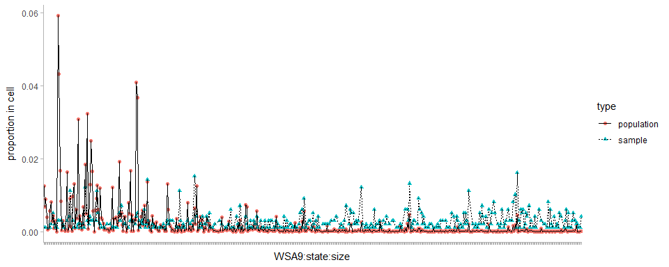

Another comparison between population and sample was constructed by
ecoregion below. Lakes in the Coastal Plains (CPL) ecoregion, for
example, were clearly undersampled relative to their proportion of the
population.

``` r
pframe_eco <- pframe %>%
  group_by(WSA9) %>%
  summarise(n_lakes = sum(n_lakes)) %>%
  ungroup() %>%
  mutate(prop_cell = round(n_lakes/sum(n_lakes), 7)) %>%
  ungroup() %>%
  mutate(type = 'population') 

samp_props_eco <- samp_props %>%
  group_by(WSA9) %>%
  summarise(n_lakes = sum(n_lakes)) %>%
  ungroup() %>%
  mutate(prop_cell = round(n_lakes/sum(n_lakes), 7)) %>%
  ungroup() %>%
  mutate(type = 'sample')

pframe_eco %>%
  bind_rows(samp_props_eco) %>%
  ggplot(mapping = aes(x = WSA9, y = prop_cell, group = type, linetype = type)) +
  geom_point(stat = "identity", aes( shape = type, color = type), size = 3) +
  geom_line() +
  theme_tidybayes() +
  xlab("Ecoregion") +
  ylab("proportion in cell") + 
  theme(legend.position = "top",
        legend.title = element_blank(),
        legend.text = element_text(size = 14)) +
  theme(text = element_text(size = 12))
```

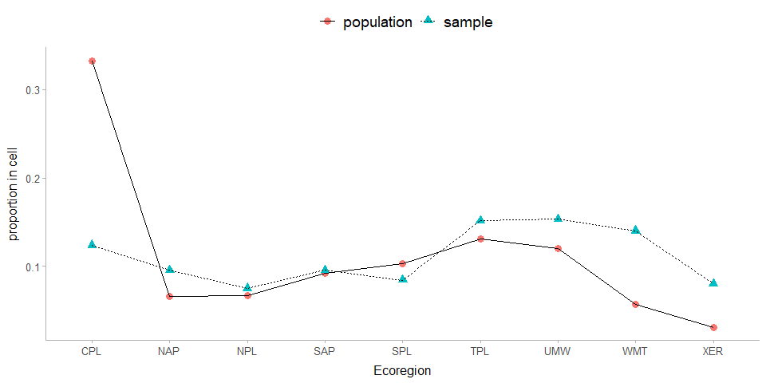

A similar comparison by state was constructed below.

``` r
pframe_state <- pframe %>%
  group_by(state) %>%
  summarise(n_lakes = sum(n_lakes)) %>%
  ungroup() %>%
  mutate(prop_cell = round(n_lakes/sum(n_lakes), 7)) %>%
  ungroup() %>%
  mutate(type = 'population')

samp_props_state <- samp_props %>%
  group_by(state) %>%
  summarise(n_lakes = sum(n_lakes)) %>%
  ungroup() %>%
  mutate(prop_cell = round(n_lakes/sum(n_lakes), 7)) %>%
  ungroup() %>%
  mutate(type = 'sample')

pframe_state %>%
  bind_rows(samp_props_state) %>%
  ggplot(mapping = aes(x = state, y = prop_cell, group = type, linetype = type)) +
  geom_point(stat = "identity", aes(shape = type, color = type)) +
  geom_line() +
  theme_tidybayes() +
  theme(axis.text.x = element_text(angle = 45)) +
  xlab("State") +
  ylab("proportion in cell")
```

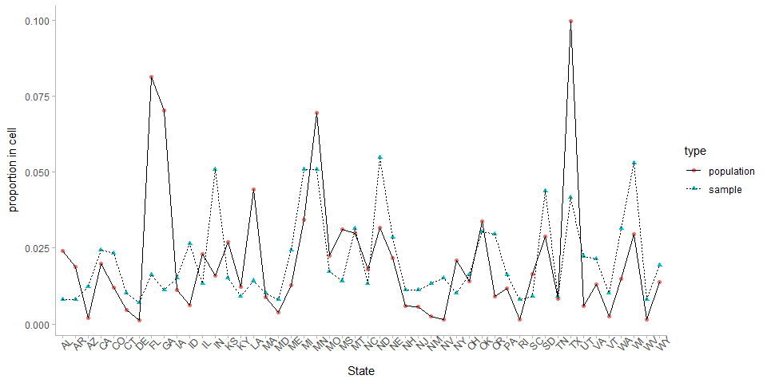

Finally, a comparison by NLA size category is shown below. Waterbodies
of the smallest size category were heavily under-sampled relative to the
POI and those from the larger size categories were over-sampled.

``` r
pframe_size <- pframe %>%
  group_by(size_cat) %>%
  summarise(n_lakes = sum(n_lakes)) %>%
  ungroup() %>%
  mutate(prop_cell = round(n_lakes/sum(n_lakes), 7)) %>%
  ungroup() %>%
  mutate(type = 'population')

samp_props_size <- samp_props %>%
  group_by(size_cat) %>%
  summarise(n_lakes = sum(n_lakes)) %>%
  ungroup() %>%
  mutate(prop_cell = round(n_lakes/sum(n_lakes), 7)) %>%
  ungroup() %>%
  mutate(type = 'sample')

pframe_size %>%
  bind_rows(samp_props_size) %>%
  ggplot(mapping = aes(x = size_cat, y = prop_cell, group = type, linetype = type)) +
  geom_point(stat = "identity", aes( shape = type, color = type)) +
  geom_line() +
  theme_tidybayes() +
  xlab("Size category") +
  ylab("proportion in cell")
```

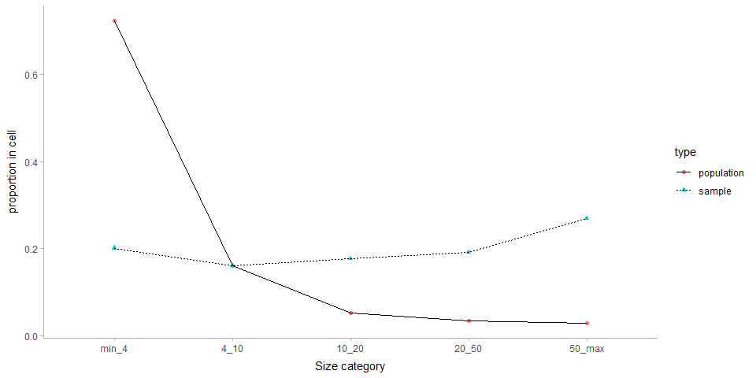

## 2.4 Sample-based estimates

Below are (naive) estimates, based only on the sample, for national
means for dissolved and equilibrium N2O and the saturation ratio.

Dissolved N2O:

``` r
df_model %>%
  summarise(mean = mean(n2o),
             sd = sd(n2o)) 
```

    ## # A tibble: 1 × 2
    ##    mean    sd
    ##   <dbl> <dbl>
    ## 1  8.72  9.52

Equilibrium N2O:

``` r
df_model %>%
  summarise(mean = mean(n2o_eq),
             sd = sd(n2o_eq))
```

    ## # A tibble: 1 × 2
    ##    mean    sd
    ##   <dbl> <dbl>
    ## 1  7.48 0.845

Saturation ratio:

``` r
df_model %>%
  summarise(mean = mean(n2o / n2o_eq),
             sd = sd(n2o / n2o_eq)) 
```

    ## # A tibble: 1 × 2
    ##    mean    sd
    ##   <dbl> <dbl>
    ## 1  1.17  1.30

Roughly 67% of lakes in the sample were under-saturated (i.e.,
saturation ratio \< 1):

``` r
df_model %>%
  summarise(prop_undersat = sum((n2o / n2o_eq) < 1) / 984) 
```

    ## # A tibble: 1 × 1
    ##   prop_undersat
    ##           <dbl>
    ## 1         0.666

Using only the sample observations again, a plot was constructed of the
overall mean (dashed line) along with the ecoregion-specific means
(black circles). The shaded areas indicate +/- 1 standard deviation.
Neither dissolved N2O nor the saturation ratio were clearly structured
by ecoregion in the sample, but there did appear to be some potential
structure along this variable in the equilibrium N2O observations.


The same summary by state is below.

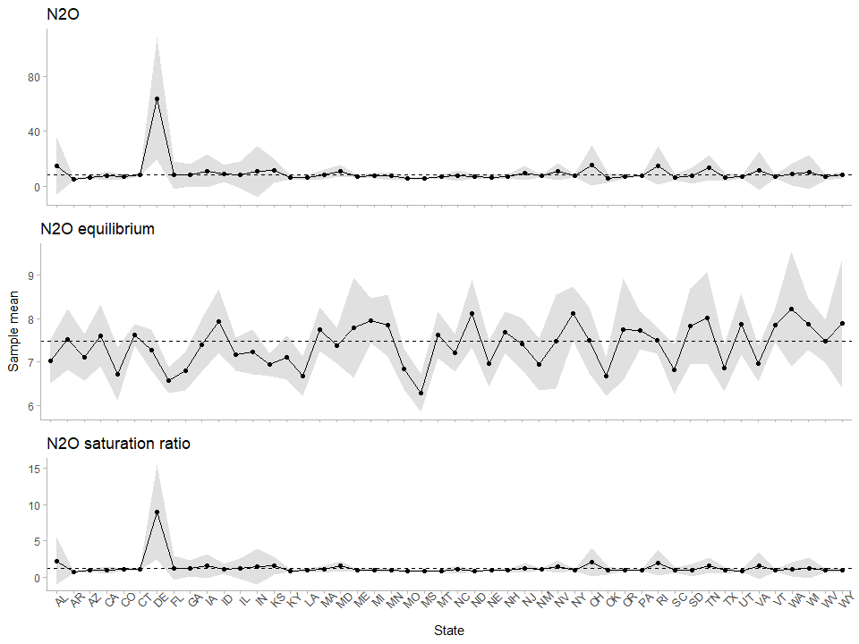

Finally, the same summary by size category.

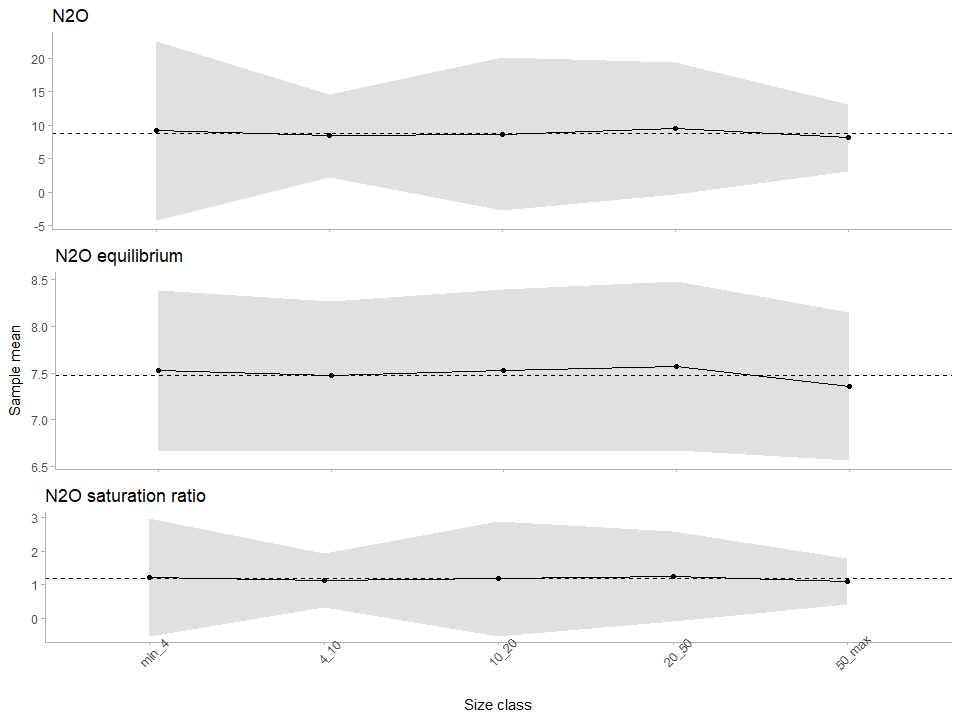

## 2.5 Sample data exploration

Below, the distribution N2O concentrations for the sample was summarized
using a density and rug plot. Note the natural log scale of the x-axis.
Both the dissolved and equilibrium N2O data had considerable right skew
even after the log transformation. This was not unexpected and has been
noted in other studies (*e.g.*, [Webb et al.
2019](#ref-Webb_etal_2019)). The saturation ratio was also skewed
(sat_ratio = n2o / n2o_eq).

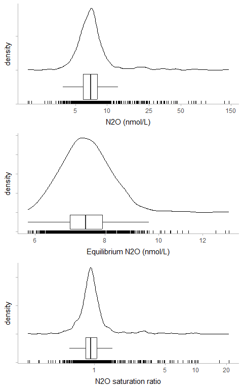

Below are plots of dissolved N2O vs. NO3 and some other potential
covariates. This first plot shows log(N2O) vs. log(NO3), as well as the
ordinal categories assigned to NO3 (vertical lines). The leftmost
vertical line is dashed and separates the NO3 observations below the
detection limit. The trend is increasing and nonlinear on the log scale,
with increasing variance in N2O as NO3 increased.

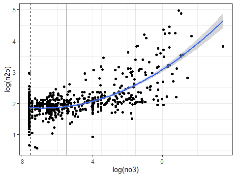

Below is a plot of N2O vs. the surface temperature observations.

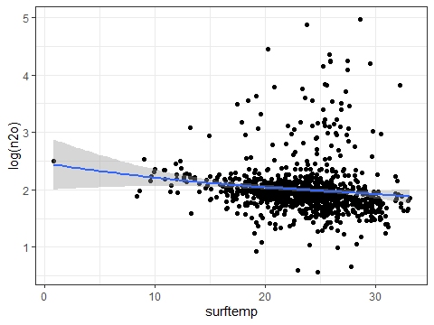

Below are plots of dissolved N2O vs. NO3 for 3 quantiles of the surface
temperature measurements (quantiles increasing from 1 to 3). This plot
suggested that the NO3 effect on N2O may have been stronger in lakes
with higher observed temperatures.

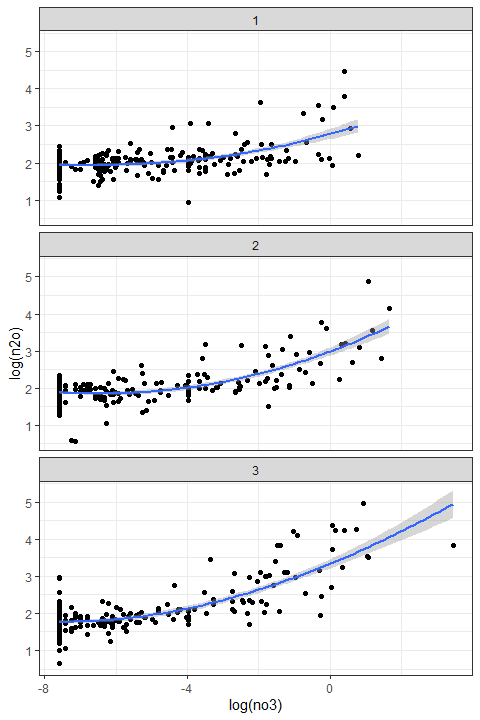

Below is a plot of N2O vs. the natural log of the surface area data for
each lake from the NHD. The plot doesn’t suggest a strong effect, but
the pattern of variation suggests more variability in dissolved N2O in
smaller lakes.

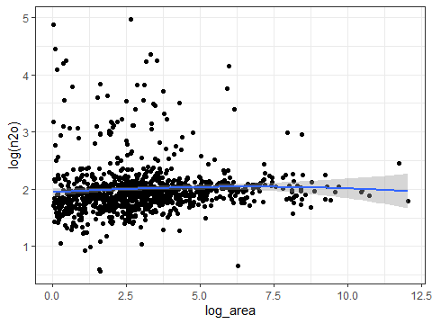

The next plot below shows the relationship between dissolved N2O and NO3
at 3 different quantiles (increasing 1 to 3) of the log-scaled lake
surface area estimates. This plot perhaps suggests a weaker NO3 effect
in the largest lakes.

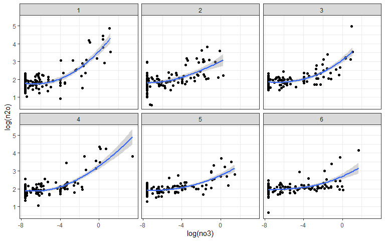

Below is a plot of N2O vs. the natural log of the dissolved oxygen
measurements. Measurements for DO were missing from 4 samples and these
observations were excluded from the plot below. The plot suggests a
positive effect of DO, but the pattern may be dominated by extreme
values at the upper and lower end of log(DO).

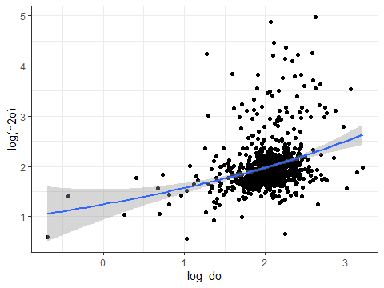

The next plot below shows the relationship between dissolved N2O and NO3
at 3 different quantiles (increasing 1 to 3) of the log-scaled dissolved
oxygen measurements. Measurements for DO were missing from 4 samples and
these observations were excluded from the plot below. This plot doesn’t
suggest a clear interaction of DO with NO3.

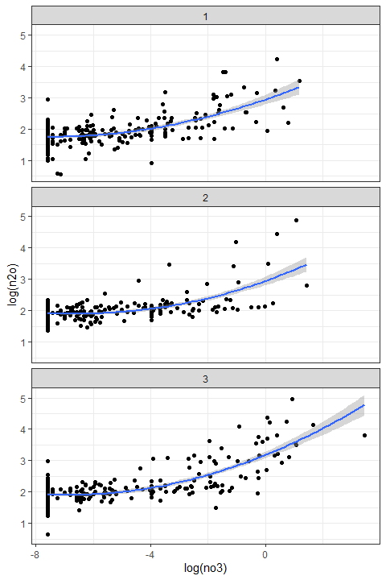

Below is a plot of N2O vs. the natural log of the chlorophyll a
measurements. Measurements were missing from 4 samples and these
observations were excluded from the plot. The plot suggests perhaps a
slight negative effect of chl-a.

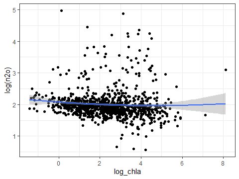

The next plot below shows the relationship between dissolved N2O and NO3
at 3 different quantiles (increasing 1 to 3) of the log-scaled
chlorophyll a measurements. Measurements for chl-a were missing from 4
samples and these observations were excluded from the plot below. There
is no clear interaction indicated in the plot below, but the NO3 effect
may be stronger at high chl-a levels.

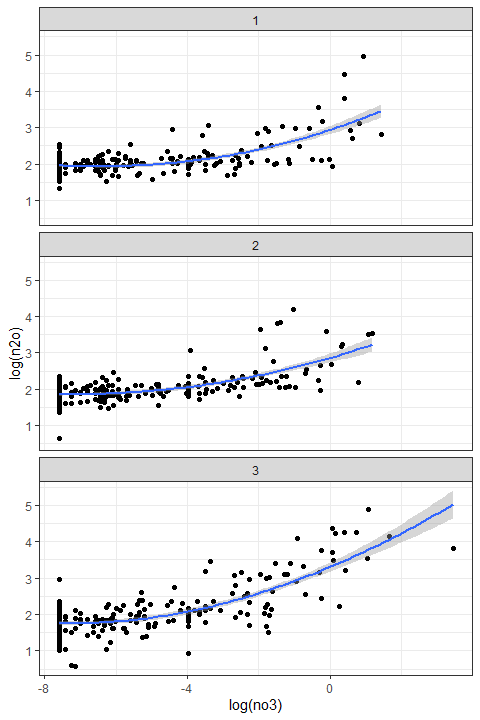

Below is a plot of N2O vs. a square root transformation of the bouyancy
factor (BF) metric. Again, measurements were missing from 4 samples and
these observations were excluded from the plot. The plot suggests
perhaps a slight negative effect of the BF metric.

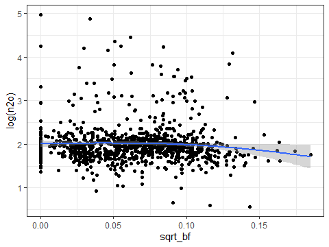

The next plot below shows the relationship between dissolved N2O and NO3
at 3 different quantiles (increasing 1 to 3) of the BF metric. There is
no clear interaction indicated in the plot below.

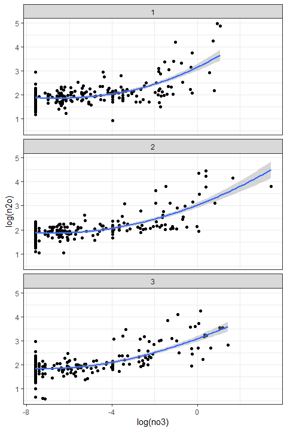

Similar plots are below, but with NO3 expressed as an ordered
categorical variable with 5 levels. The positive and monotonic trends
area similar to the previous plots where NO3 was treated as continuous.
Note the large number of observations in the first NO3 category (no3_cat
= 1). This category represented all of the observations for NO3 that
were below the detection limit, which was most of the data.

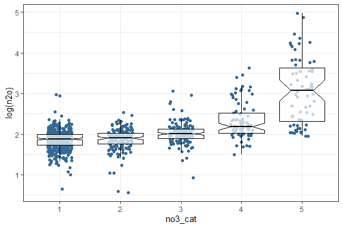

The plot below is N2O vs NO3 for three quantiles (increasing) of surface
temperature.

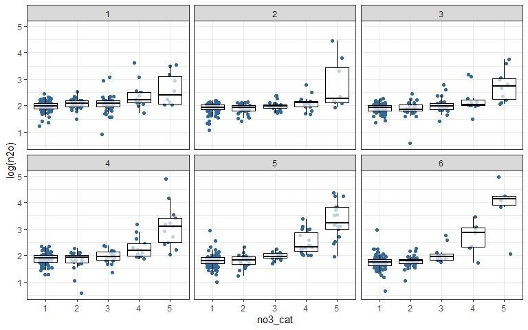

The plot below is N2O vs NO3 for three quantiles (increasing) of (log)
surface area.

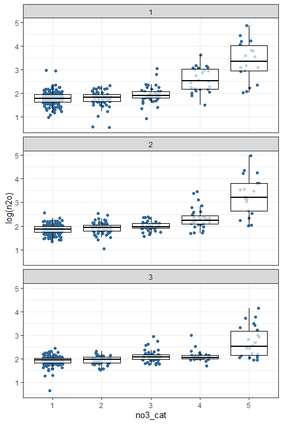

Below is a plot of log(dissolved N2O) vs. log(NO3) by ecoregion, which
suggested that the NO3 effect on dissolved N2O may have varied by
ecoregion.

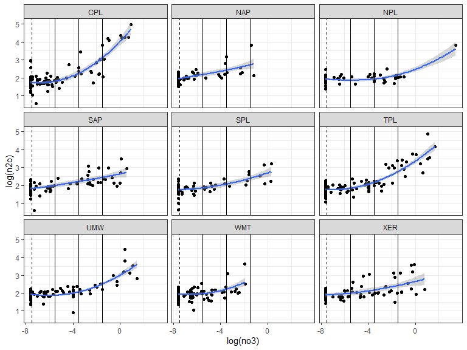

Below is the same plot as above but for the ordered categorical version
of NO3.

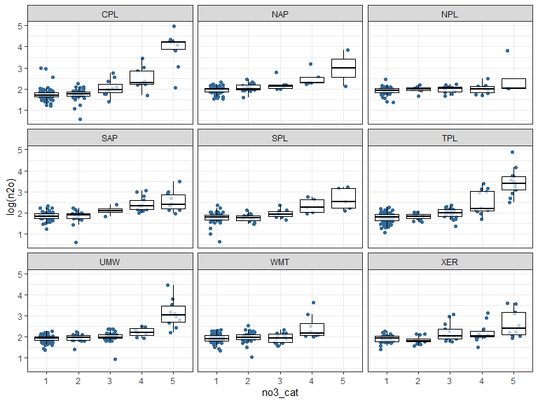

A plot below shows the relationships between dissolved N2O and log(NO3)
by state, but within just the Temperate Plains (TPL) ecoregion. Within
states, the number of observations were relatively small, but the trends
were perhaps more linear.

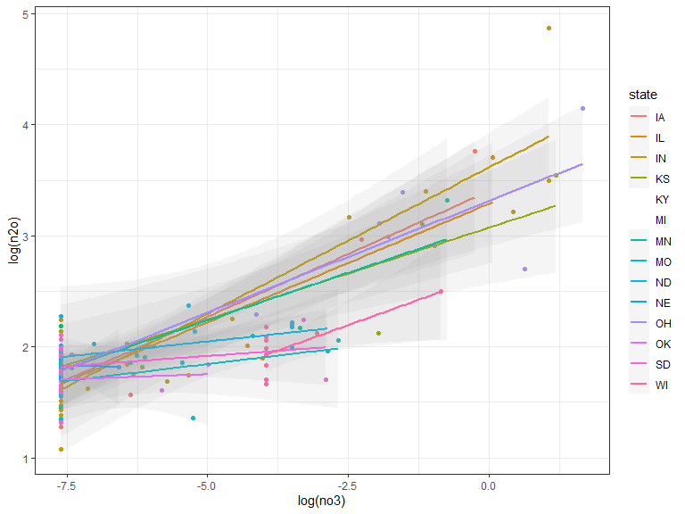

# 3 Model Fitting

## 3.1 Model 1

The first model for the two N2O responses, conditioned only on the study
design factors.

``` r
bf_n2o <- bf(log(n2o) ~ 1 + 
               (1 | a | WSA9) + 
               (1 | b | WSA9:state) + 
               (1 | c | WSA9:state:size_cat),
             family = gaussian())

bf_n2oeq <- bf(log(n2o_eq) ~ 1 + 
               (1 | a | WSA9) + 
               (1 | b | WSA9:state) +
               (1 | c | WSA9:state:size_cat),
             family = gaussian())

priors <- c(
  prior(normal(2, 1), class = "Intercept", resp = "logn2o"), # centered near data mean
  prior(exponential(2), class = "sd", resp = "logn2o"),
  prior(exponential(2), class = "sigma", resp = "logn2o"),
  prior(normal(2, 1), class = "Intercept", resp = "logn2oeq"), # centered near data mean
  prior(exponential(2), class = "sd", resp = "logn2oeq"),
  prior(exponential(2), class = "sigma", resp = "logn2oeq"),
  prior(lkj(2), class = "rescor"),
  prior(lkj(2), class = "cor")
  )

n2o_mod1 <- brm(bf_n2o + bf_n2oeq + set_rescor(rescor = TRUE),
                data = df_model,
                prior = priors,
                control = list(adapt_delta = 0.99, max_treedepth = 14),
                #sample_prior = "only",
                save_pars = save_pars(all = TRUE),
                seed = 145,
                chains=4, 
                iter=5000, 
                cores=4)

save(n2o_mod1, file = "C:/Users/rmartin/OneDrive - Environmental Protection Agency (EPA)/Documents/AE_Reservoirs/DissolvedGasNla/modelFiles/n2o_mod1.rda")
```

### 3.1.1 Summarize fit

The summaries of the estimated parameters and key HMC convergence
diagnostics for the fitted model are printed below. There were no
apparent issues with the HMC sampling. All

values were less than 1.01 and effective sample size
()
calculations suggested that the posterior contained a sufficient number
of effective samples for conducting inference.

    ##  Family: MV(gaussian, gaussian) 
    ##   Links: mu = identity; sigma = identity
    ##          mu = identity; sigma = identity 
    ## Formula: log(n2o) ~ 1 + (1 | a | WSA9) + (1 | b | WSA9:state) + (1 | c | WSA9:state:size_cat) 
    ##          log(n2o_eq) ~ 1 + (1 | a | WSA9) + (1 | b | WSA9:state) + (1 | c | WSA9:state:size_cat) 
    ##    Data: df_model (Number of observations: 984) 
    ##   Draws: 4 chains, each with iter = 5000; warmup = 2500; thin = 1;
    ##          total post-warmup draws = 10000
    ## 
    ## Priors: 
    ## Intercept_logn2o ~ normal(2, 1)
    ## Intercept_logn2oeq ~ normal(2, 1)
    ## L ~ lkj_corr_cholesky(2)
    ## Lrescor ~ lkj_corr_cholesky(2)
    ## <lower=0> sd_logn2o ~ exponential(2)
    ## <lower=0> sd_logn2oeq ~ exponential(2)
    ## <lower=0> sigma_logn2o ~ exponential(2)
    ## <lower=0> sigma_logn2oeq ~ exponential(2)
    ## 
    ## Group-Level Effects: 
    ## ~WSA9 (Number of levels: 9) 
    ##                                          Estimate Est.Error l-95% CI u-95% CI
    ## sd(logn2o_Intercept)                         0.04      0.03     0.00     0.13
    ## sd(logn2oeq_Intercept)                       0.06      0.02     0.03     0.11
    ## cor(logn2o_Intercept,logn2oeq_Intercept)     0.05      0.44    -0.80     0.83
    ##                                          Rhat Bulk_ESS Tail_ESS
    ## sd(logn2o_Intercept)                     1.00     2475     4230
    ## sd(logn2oeq_Intercept)                   1.00     3326     5332
    ## cor(logn2o_Intercept,logn2oeq_Intercept) 1.01     1141     3129
    ## 
    ## ~WSA9:state (Number of levels: 96) 
    ##                                          Estimate Est.Error l-95% CI u-95% CI
    ## sd(logn2o_Intercept)                         0.26      0.03     0.21     0.32
    ## sd(logn2oeq_Intercept)                       0.04      0.01     0.03     0.05
    ## cor(logn2o_Intercept,logn2oeq_Intercept)     0.24      0.15    -0.07     0.52
    ##                                          Rhat Bulk_ESS Tail_ESS
    ## sd(logn2o_Intercept)                     1.00     3199     4775
    ## sd(logn2oeq_Intercept)                   1.00     3549     5476
    ## cor(logn2o_Intercept,logn2oeq_Intercept) 1.00     3332     5553
    ## 
    ## ~WSA9:state:size_cat (Number of levels: 352) 
    ##                                          Estimate Est.Error l-95% CI u-95% CI
    ## sd(logn2o_Intercept)                         0.09      0.04     0.01     0.16
    ## sd(logn2oeq_Intercept)                       0.02      0.01     0.00     0.03
    ## cor(logn2o_Intercept,logn2oeq_Intercept)    -0.22      0.37    -0.85     0.58
    ##                                          Rhat Bulk_ESS Tail_ESS
    ## sd(logn2o_Intercept)                     1.00      863     1397
    ## sd(logn2oeq_Intercept)                   1.00      928     1365
    ## cor(logn2o_Intercept,logn2oeq_Intercept) 1.00     1661     2807
    ## 
    ## Population-Level Effects: 
    ##                    Estimate Est.Error l-95% CI u-95% CI Rhat Bulk_ESS Tail_ESS
    ## logn2o_Intercept       2.02      0.04     1.95     2.09 1.00     2641     3963
    ## logn2oeq_Intercept     2.00      0.02     1.96     2.04 1.00     3446     4550
    ## 
    ## Family Specific Parameters: 
    ##                Estimate Est.Error l-95% CI u-95% CI Rhat Bulk_ESS Tail_ESS
    ## sigma_logn2o       0.40      0.01     0.37     0.42 1.00     2749     5523
    ## sigma_logn2oeq     0.08      0.00     0.08     0.09 1.00     4790     6698
    ## 
    ## Residual Correlations: 
    ##                         Estimate Est.Error l-95% CI u-95% CI Rhat Bulk_ESS
    ## rescor(logn2o,logn2oeq)     0.21      0.04     0.14     0.27 1.00     6172
    ##                         Tail_ESS
    ## rescor(logn2o,logn2oeq)     7243
    ## 
    ## Draws were sampled using sampling(NUTS). For each parameter, Bulk_ESS
    ## and Tail_ESS are effective sample size measures, and Rhat is the potential
    ## scale reduction factor on split chains (at convergence, Rhat = 1).

In the summary above, the estimated standard deviations for the varying
group effects on the mean behavior of the dissolved N2O response
suggested fairly low, but non-zero variability across each of the three
levels. The standard deviations estimated for the same varying effects
for equilibrium N2O were also relatively small. Finally, note the
relatively small, but positive residual correlation between the two N2O
responses.

Before investing too much into inferences from this model, however, the
model fit was evaluated below using a series of graphical posterior
predictive checks (PPC, [Gelman et al. 2014](#ref-Gelman_etal_2014);
[Gelman, Hill, and Vehtari 2020](#ref-Gelman_etal_2020), Ch. 11).

### 3.1.2 Model checks

#### 3.1.2.1 Dissolved N2O

Below are a series of panels illustrating graphical PPCs for the
dissolved N2O component of the multivariate model. The top left panel
compares a density plot of the observed data (black line) to density
estimates drawn for 200 samples from the posterior predictive
distribution (PPD; blue lines) of the fitted model. The top right panel
compares the cumulative density distributions in the same manner. The
left middle panel compares means *vs.* standard deviations for 1000
draws from the PPD (blue dots) to the sample mean *vs.* standard
deviation (black dot). The right middle panel compares skewness *vs.*
kurtosis for 1000 draws from the PPD to the skewness *vs.* kurtosis
estimates for the observed data. The bottom left panel compares max
*vs.* min values for 1000 draws from the PPD to the max *vs.* min values
of the sample data. Finally, the bottom right panel shows the observed
*vs.* average predicted values for each observation in the sample. The
average predicted values were calculated as the mean prediction for each
observation in the PPD based on 1000 draws.

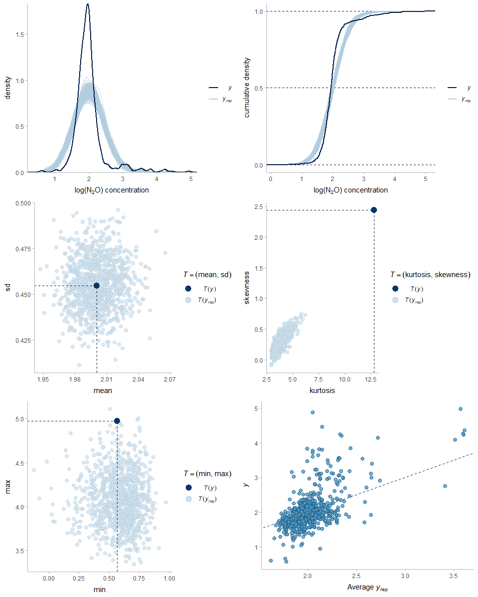

The general takeaway from the PPCs above was that the model replicated
the central tendency of the observed data fairly well, but failed to
sufficiently replicate other important aspects of the distribution, such
as skewness and kurtosis. The observed *vs.* average predictions
scatterplot also suggested substantial heteroscedasticity in the errors.

The same checks were run below, but for the test set of 95 held-out,
second-visit data points. The patterns in misfit were similar to the
patterns indicated in the PPCs with the training data above.

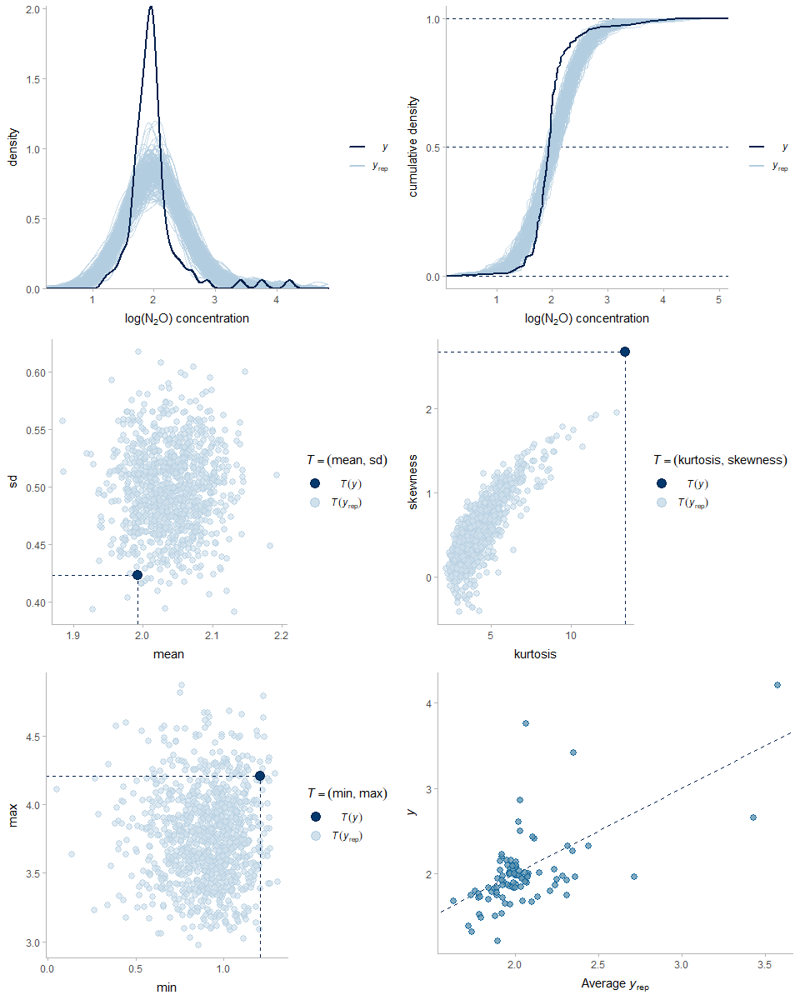

#### 3.1.2.2 Equilibrium N2O

Below are PPCs for the equilibrium N2O component of the model. As with
the dissolved N2O PPCs, the model seemed to do an OK job at replicating
the central tendency, but performed less well at replicating other
important aspects of the overall distribution.

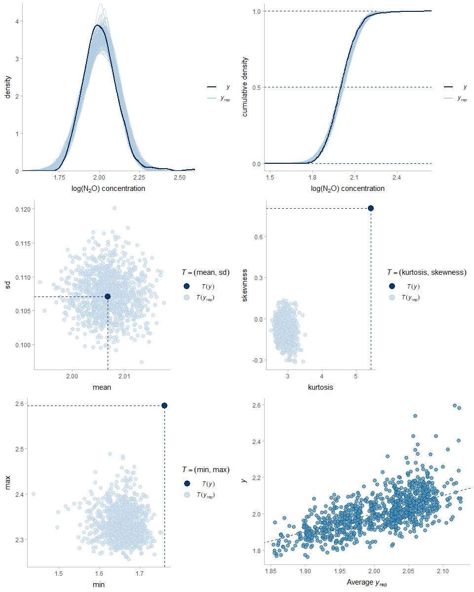

Below are the same PPCs for equilibrium N2O in the re-visit sites.

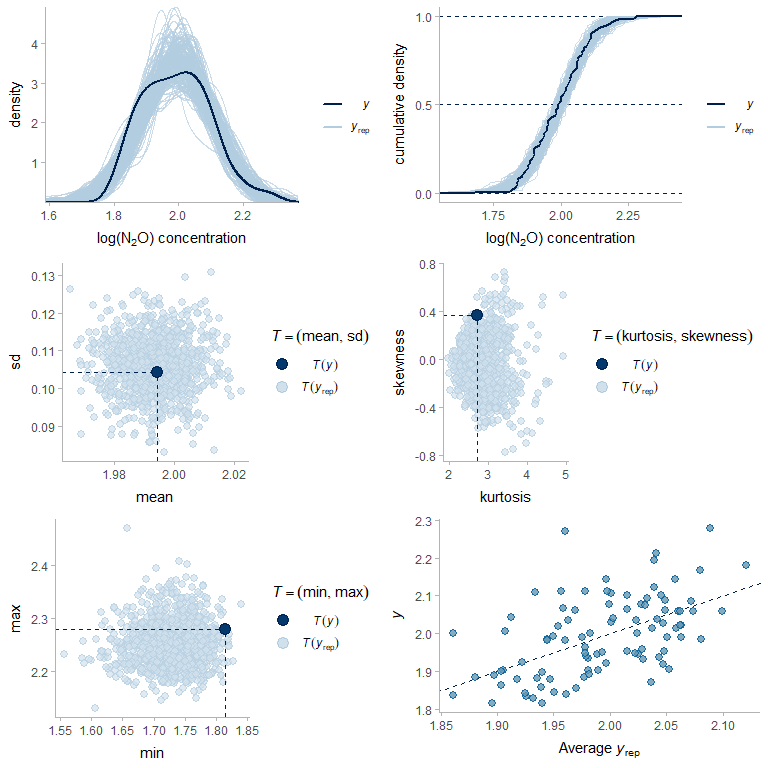

#### 3.1.2.3 Bivariate

The graphical check below compared bivariate density contours estimated
from the observed data (black lines) to density contours estimated for
each of 20 draws from the PPD. The model appeared to do a good job of
replicating the bivariate mean, but was poor at representing the overall
joint distribution.

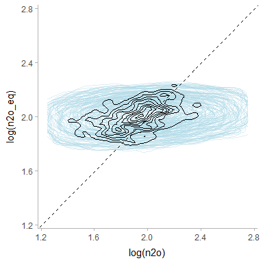

The same bivariate check is shown below for the re-visit data.

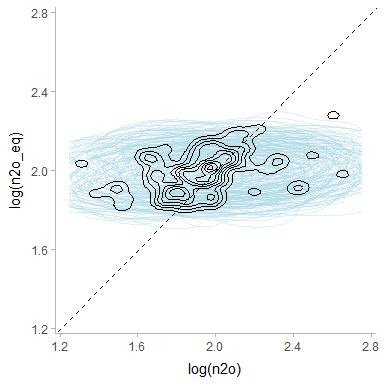

#### 3.1.2.4 Saturation

The graphical PPCs below were aimed at evaluating how well the
multivariate model did at representing the observed saturation ratio:


This quantity was estimated as a derived variable by dividing the
dissolved N2O PPD by the equilibrium N2O PPD. The proportion of
under-saturated lakes in the sample was estimated by summing the number
of lakes from each posterior predictive draw wherein the ratio was \< 1
and dividing that number by the total number of lakes in the sample,
which was 984. Overall, these checks indicated that properly
representing the tails of the dissolved N2O and N2O-eq observations
would likely be necessary in order to better replicate the observed
saturation metrics. The observed proportion of under-saturated lakes was
underestimated by more than 10 percentage points, on average.

The top left panel, below, is a density plot of the observed saturation
ratio (black line) compared to an estimate using 50 draws from the
derived PPD (blue lines). The top right panel shows the observed
proportion of under-saturated lakes compared to a model estimate based
on 1000 draws from the PPD. The left middle panel shows the mean *vs.*
standard deviation of the saturation ratio for the observed data
compared to the same estimates for 500 draws from the PPD. The right
middle panel shows the max *vs.* min for the sample compared to 500
draws from the PPD. Finally, the bottom left panel shows the observed
*vs.* average predicted saturation ratio for all 984 lakes sampled in
the dataset.

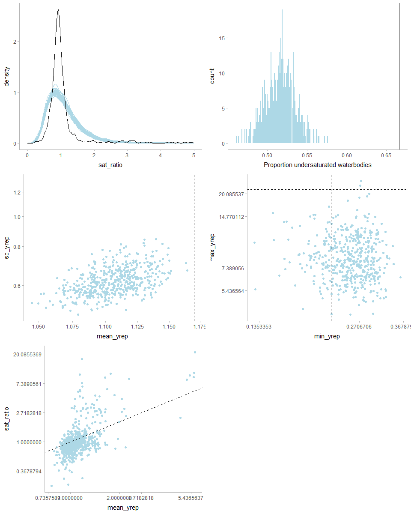

The same PPCs are shown below for the revisit data. These checks
indicated that the model did a similarly underwhelming job of
replicating the re-visit data.

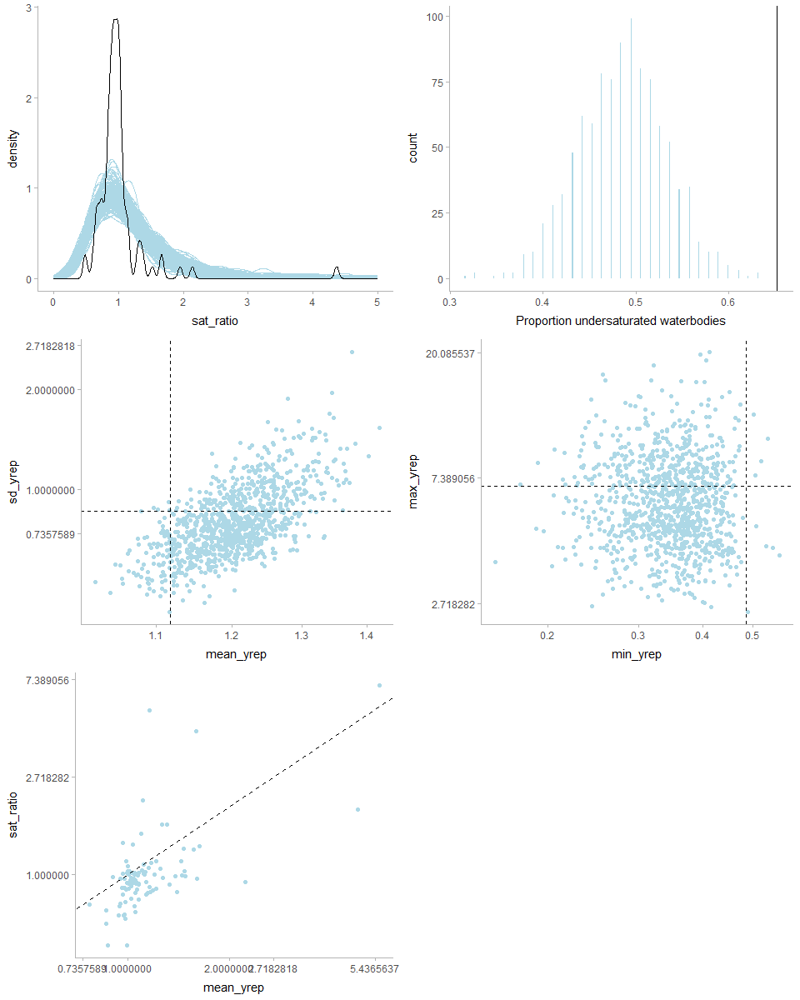

#### 3.1.2.5 R-square

Below, the Bayesian

values are reported for each response in the model.

    ##          Estimate Est.Error  Q2.5 Q97.5
    ## R2logn2o    0.247     0.031 0.187 0.309

    ##            Estimate Est.Error  Q2.5 Q97.5
    ## R2logn2oeq    0.377     0.025 0.328 0.425

The

were also estimated for the re-visit data.

    ##          Estimate Est.Error  Q2.5 Q97.5
    ## R2logn2o    0.413      0.04 0.331 0.489

    ##            Estimate Est.Error  Q2.5 Q97.5
    ## R2logn2oeq    0.322     0.026 0.271 0.374

## 3.2 Model 2

In an attempt to better fit the observed data, the next model included a
distributional sub-model that allowed for heterogeneous variances. The
distributional terms for both N2O responses were each fit as a function
of the survey design structure. The same structure as for the models for
the submodels for the mean component before.

``` r
bf_n2o <- bf(log(n2o) ~ 1 +
               (1 | a | WSA9) + 
               (1 | b | WSA9:state) + 
               (1 | c | WSA9:state:size_cat),
             sigma ~ 1 +
               (1 | WSA9) + 
               (1 | WSA9:state) + 
               (1 | WSA9:state:size_cat), 
             family = gaussian())

bf_n2oeq <- bf(log(n2o_eq) ~ 1 +
                 (1 | a | WSA9) + 
                 (1 | b | WSA9:state) +
                 (1 | c | WSA9:state:size_cat),
             sigma ~ 1 +
               (1 | WSA9) + 
               (1 | WSA9:state) + 
               (1 | WSA9:state:size_cat),
             family = gaussian())

priors <- c(
  prior(normal(2, 1), class = "Intercept", resp = "logn2o"),
  prior(exponential(2), class = "sd", resp = "logn2o"),
  prior(normal(-1, 2), class = "Intercept", dpar = "sigma", resp = "logn2o"),
  prior(exponential(2), class = "sd", dpar = "sigma", resp = "logn2o"),
  prior(normal(2, 1), class = "Intercept", resp = "logn2oeq"), 
  prior(exponential(2), class = "sd", resp = "logn2oeq"),
  prior(normal(-1, 2), class = "Intercept", dpar = "sigma", resp = "logn2oeq"),
  prior(exponential(2), class = "sd", dpar = "sigma", resp = "logn2oeq"),
  
  prior(lkj(2), class = "rescor"),
  prior(lkj(2), class = "cor")
  )

n2o_mod2 <- brm(bf_n2o + bf_n2oeq + set_rescor(rescor = TRUE),
                data = df_model, 
                prior = priors,
  control = list(adapt_delta = 0.975, max_treedepth = 12),
  #sample_prior = "only",
  save_pars = save_pars(all = TRUE),
  seed = 84512,
  chains=4, 
  iter=5000, 
  cores=4)

save(n2o_mod2, file = "C:/Users/rmartin/OneDrive - Environmental Protection Agency (EPA)/Documents/AE_Reservoirs/DissolvedGasNla/modelFiles/n2o_mod2.rda")
```

### 3.2.1 Summarize fit

The summaries of the estimated parameters and key HMC convergence
diagnostics for the fitted model are printed below.

    ##  Family: MV(gaussian, gaussian) 
    ##   Links: mu = identity; sigma = log
    ##          mu = identity; sigma = log 
    ## Formula: log(n2o) ~ 1 + (1 | a | WSA9) + (1 | b | WSA9:state) + (1 | c | WSA9:state:size_cat) 
    ##          sigma ~ 1 + (1 | WSA9) + (1 | WSA9:state) + (1 | WSA9:state:size_cat)
    ##          log(n2o_eq) ~ 1 + (1 | a | WSA9) + (1 | b | WSA9:state) + (1 | c | WSA9:state:size_cat) 
    ##          sigma ~ 1 + (1 | WSA9) + (1 | WSA9:state) + (1 | WSA9:state:size_cat)
    ##    Data: df_model (Number of observations: 984) 
    ##   Draws: 4 chains, each with iter = 5000; warmup = 2500; thin = 1;
    ##          total post-warmup draws = 10000
    ## 
    ## Priors: 
    ## Intercept_logn2o ~ normal(2, 1)
    ## Intercept_logn2o_sigma ~ normal(-1, 2)
    ## Intercept_logn2oeq ~ normal(2, 1)
    ## Intercept_logn2oeq_sigma ~ normal(-1, 2)
    ## L ~ lkj_corr_cholesky(2)
    ## Lrescor ~ lkj_corr_cholesky(2)
    ## <lower=0> sd_logn2o ~ exponential(2)
    ## <lower=0> sd_logn2o_sigma ~ exponential(2)
    ## <lower=0> sd_logn2oeq ~ exponential(2)
    ## <lower=0> sd_logn2oeq_sigma ~ exponential(2)
    ## 
    ## Group-Level Effects: 
    ## ~WSA9 (Number of levels: 9) 
    ##                                          Estimate Est.Error l-95% CI u-95% CI
    ## sd(logn2o_Intercept)                         0.06      0.03     0.02     0.12
    ## sd(logn2oeq_Intercept)                       0.05      0.02     0.03     0.09
    ## sd(sigma_logn2o_Intercept)                   0.22      0.12     0.02     0.50
    ## sd(sigma_logn2oeq_Intercept)                 0.16      0.08     0.04     0.34
    ## cor(logn2o_Intercept,logn2oeq_Intercept)     0.57      0.30    -0.18     0.95
    ##                                          Rhat Bulk_ESS Tail_ESS
    ## sd(logn2o_Intercept)                     1.00     2247     1772
    ## sd(logn2oeq_Intercept)                   1.00     3423     4761
    ## sd(sigma_logn2o_Intercept)               1.00     1892     3094
    ## sd(sigma_logn2oeq_Intercept)             1.00     2413     1991
    ## cor(logn2o_Intercept,logn2oeq_Intercept) 1.00     2696     3538
    ## 
    ## ~WSA9:state (Number of levels: 96) 
    ##                                          Estimate Est.Error l-95% CI u-95% CI
    ## sd(logn2o_Intercept)                         0.08      0.02     0.04     0.11
    ## sd(logn2oeq_Intercept)                       0.04      0.01     0.03     0.05
    ## sd(sigma_logn2o_Intercept)                   0.56      0.08     0.40     0.74
    ## sd(sigma_logn2oeq_Intercept)                 0.22      0.05     0.11     0.32
    ## cor(logn2o_Intercept,logn2oeq_Intercept)     0.42      0.19    -0.00     0.74
    ##                                          Rhat Bulk_ESS Tail_ESS
    ## sd(logn2o_Intercept)                     1.00     1276     1733
    ## sd(logn2oeq_Intercept)                   1.00     2695     5090
    ## sd(sigma_logn2o_Intercept)               1.00     2007     3462
    ## sd(sigma_logn2oeq_Intercept)             1.00     1851     1881
    ## cor(logn2o_Intercept,logn2oeq_Intercept) 1.00     1076     1960
    ## 
    ## ~WSA9:state:size_cat (Number of levels: 352) 
    ##                                          Estimate Est.Error l-95% CI u-95% CI
    ## sd(logn2o_Intercept)                         0.06      0.01     0.03     0.09
    ## sd(logn2oeq_Intercept)                       0.02      0.01     0.00     0.03
    ## sd(sigma_logn2o_Intercept)                   0.61      0.05     0.51     0.72
    ## sd(sigma_logn2oeq_Intercept)                 0.19      0.06     0.07     0.29
    ## cor(logn2o_Intercept,logn2oeq_Intercept)    -0.00      0.34    -0.70     0.62
    ##                                          Rhat Bulk_ESS Tail_ESS
    ## sd(logn2o_Intercept)                     1.00     1329     2182
    ## sd(logn2oeq_Intercept)                   1.00     1052     1452
    ## sd(sigma_logn2o_Intercept)               1.00     2622     4939
    ## sd(sigma_logn2oeq_Intercept)             1.00     1603     1725
    ## cor(logn2o_Intercept,logn2oeq_Intercept) 1.00      996     2063
    ## 
    ## Population-Level Effects: 
    ##                          Estimate Est.Error l-95% CI u-95% CI Rhat Bulk_ESS
    ## logn2o_Intercept             1.93      0.03     1.88     1.99 1.00     3338
    ## sigma_logn2o_Intercept      -1.40      0.12    -1.63    -1.17 1.00     3511
    ## logn2oeq_Intercept           2.00      0.02     1.96     2.03 1.00     3384
    ## sigma_logn2oeq_Intercept    -2.60      0.07    -2.75    -2.45 1.00     4004
    ##                          Tail_ESS
    ## logn2o_Intercept             4462
    ## sigma_logn2o_Intercept       5077
    ## logn2oeq_Intercept           4145
    ## sigma_logn2oeq_Intercept     4848
    ## 
    ## Residual Correlations: 
    ##                         Estimate Est.Error l-95% CI u-95% CI Rhat Bulk_ESS
    ## rescor(logn2o,logn2oeq)     0.36      0.03     0.29     0.43 1.00     6474
    ##                         Tail_ESS
    ## rescor(logn2o,logn2oeq)     7733
    ## 
    ## Draws were sampled using sampling(NUTS). For each parameter, Bulk_ESS
    ## and Tail_ESS are effective sample size measures, and Rhat is the potential
    ## scale reduction factor on split chains (at convergence, Rhat = 1).

### 3.2.2 Model checks

Below the same PPCs were performed as with the initial model (see above
for more details on each panel). Though the checks below suggested some
improvement in replicating the tails of the observed data, the overall
fit again suggested room for improvement.

##### 3.2.2.0.1 Dissolved N2O

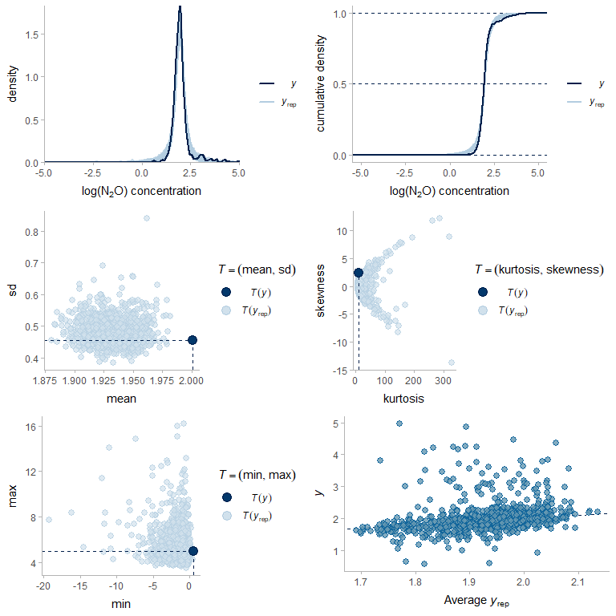

The same check is below for the 95 re-visit sites.

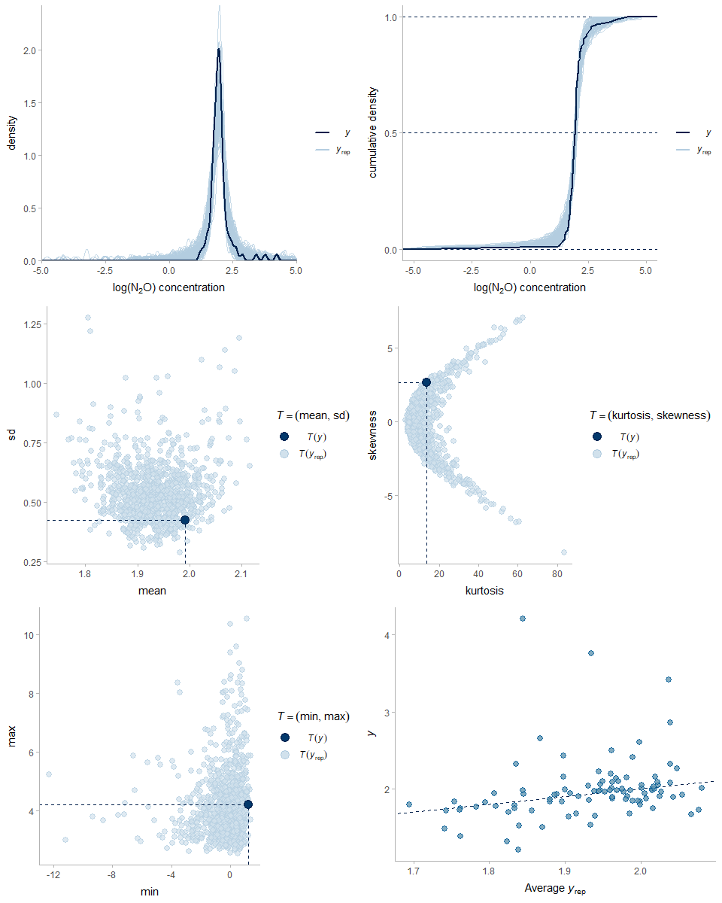

#### 3.2.2.1 Equilibrium N2O

The checks below suggested that this model offered little improvement
upon the initial model for equilibrium N2O.

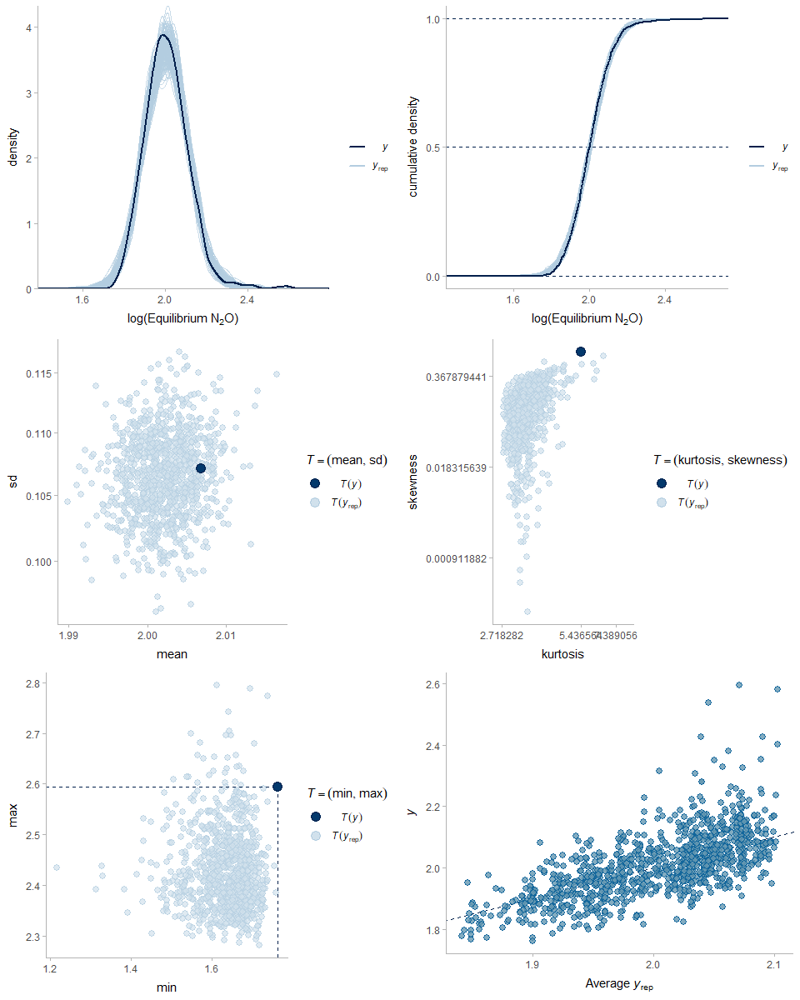

The same check with the re-visit data is below.

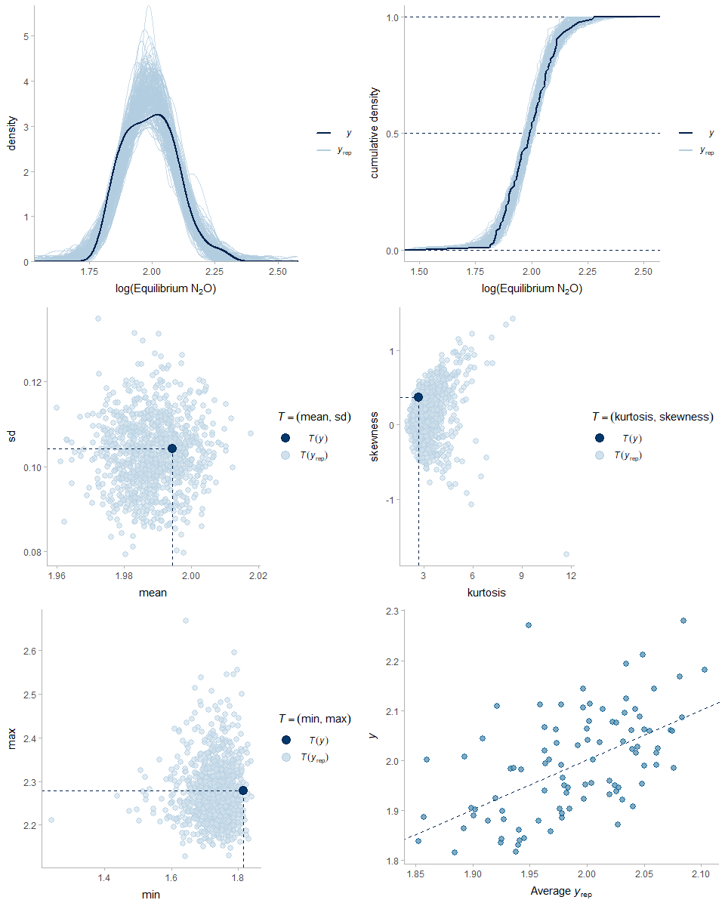

#### 3.2.2.2 Bivariate

This check perhaps suggested an improvement with regard to replicating
the joint density. However, the predictions were still clearly
over-dispersed relative to the observations.

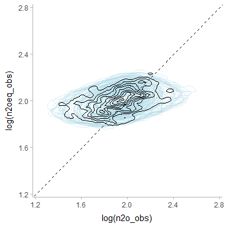

The same check with the re-visit data is below.

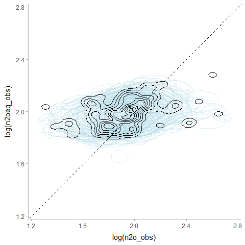

#### 3.2.2.3 Saturation

The PPCs for the saturation metrics below indicated that including the
distributional models was perhaps an improvement on the initial model in
some aspects; in particular, the bias in the predicted proportion of
under-saturated lakes was substantially decreased. However, there
appeared to still be issues in replicating the tails as well as issues
with central tendency.

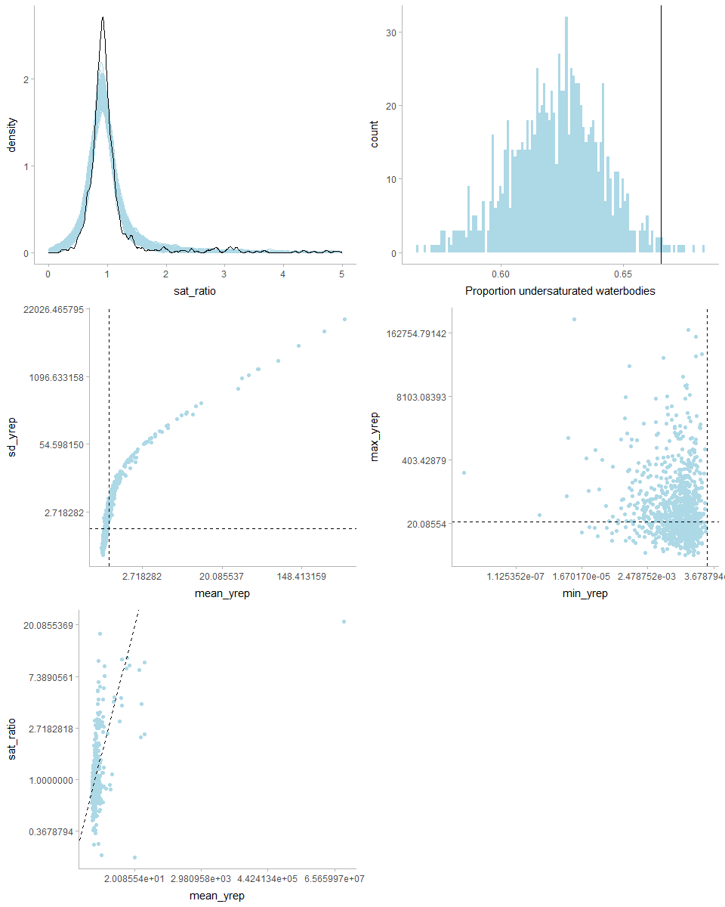

The check for the revisit data is below.

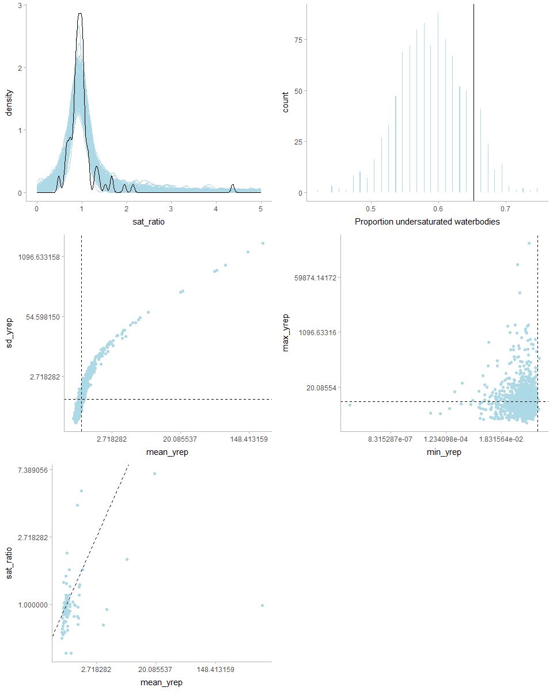

#### 3.2.2.4 R-square

Relative to model 1, there was a substantial decrease in the

estimate for the dissolved N2O component of this model. The estimate for
the equilibrium N2O-eq component was similar to model 1.

    ##          Estimate Est.Error  Q2.5 Q97.5
    ## R2logn2o    0.056     0.009 0.038 0.075

    ##            Estimate Est.Error  Q2.5 Q97.5
    ## R2logn2oeq    0.379     0.022 0.335 0.421

And for the re-visit data:

    ##          Estimate Est.Error  Q2.5 Q97.5
    ## R2logn2o    0.071     0.014 0.046   0.1

    ##            Estimate Est.Error  Q2.5 Q97.5
    ## R2logn2oeq    0.323     0.023 0.278 0.369

## 3.3 Model 3

In the next model, the categorical version of the NO3 covariate and a
surface temperature covariate were included to try to improve the fit.
The ordinal NO3 variable was used as a monotonic, ordinal effect and
only in the dissolved N2O component of the model. For the equlibrium N2O
component, surface temperature and log-transformed elevation were used,
along with their interaction. The model also retained the same
distributional specifications included in model 2 above.

``` r
bf_n2o <- bf(log(n2o) ~ mo(no3_cat) +
               surftemp +
               (mo(no3_cat) | a | WSA9) + 
               (mo(no3_cat) | b | WSA9:state) + 
               (1 | c | WSA9:state:size_cat),
             sigma ~ 1 +
               (1 | WSA9) + 
               (1 | WSA9:state) + 
               (1 | WSA9:state:size_cat), 
             family = gaussian())

bf_n2oeq <- bf(log(n2o_eq) ~ surftemp +
                 log_elev +
                 surftemp:log_elev +
                 (1 | a | WSA9) + 
                 (1 | b | WSA9:state) +
                 (1 | c | WSA9:state:size_cat),
             sigma ~ 1 +
               (1 | WSA9) + 
               (1 | WSA9:state) + 
               (1 | WSA9:state:size_cat),
             family = gaussian())

priors <- c(
  prior(normal(2, 1), class = "Intercept", resp = "logn2o"),
  prior(normal(0, 1), class = "b", resp = "logn2o"),
  prior(exponential(2), class = "sd", resp = "logn2o"),
  prior(normal(-1, 2), class = "Intercept", dpar = "sigma", resp = "logn2o"),
  prior(exponential(2), class = "sd", dpar = "sigma", resp = "logn2o"),
  prior(normal(2, 1), class = "Intercept", resp = "logn2oeq"), 
  prior(normal(0, 1), class = "b", resp = "logn2oeq"), 
  prior(exponential(2), class = "sd", resp = "logn2oeq"), 
  prior(normal(-1, 2), class = "Intercept", dpar = "sigma", resp = "logn2oeq"),
  prior(exponential(2), class = "sd", dpar = "sigma", resp = "logn2oeq"),
  
  prior(lkj(2), class = "rescor"),
  prior(lkj(2), class = "cor")
  )

n2o_mod3 <- brm(bf_n2o + bf_n2oeq + set_rescor(rescor = TRUE),
                data = df_model, 
                prior = priors,
  control = list(adapt_delta = 0.975, max_treedepth = 12),
  #sample_prior = "only",
  save_pars = save_pars(all = TRUE),
  seed = 98456,
  chains=4, 
  iter=5000, 
  cores=4)

save(n2o_mod3, file = "C:/Users/rmartin/OneDrive - Environmental Protection Agency (EPA)/Documents/AE_Reservoirs/DissolvedGasNla/modelFiles/n2o_mod3.rda")
```

### 3.3.1 Summarize fit

The fitted parameters and MCMC diagnostics are below.

    ##  Family: MV(gaussian, gaussian) 
    ##   Links: mu = identity; sigma = log
    ##          mu = identity; sigma = log 
    ## Formula: log(n2o) ~ mo(no3_cat) + surftemp + (mo(no3_cat) | a | WSA9) + (mo(no3_cat) | b | WSA9:state) + (1 | c | WSA9:state:size_cat) 
    ##          sigma ~ 1 + (1 | WSA9) + (1 | WSA9:state) + (1 | WSA9:state:size_cat)
    ##          log(n2o_eq) ~ surftemp + log_elev + surftemp:log_elev + (1 | a | WSA9) + (1 | b | WSA9:state) + (1 | c | WSA9:state:size_cat) 
    ##          sigma ~ 1 + (1 | WSA9) + (1 | WSA9:state) + (1 | WSA9:state:size_cat)
    ##    Data: df_model (Number of observations: 984) 
    ##   Draws: 4 chains, each with iter = 5000; warmup = 2500; thin = 1;
    ##          total post-warmup draws = 10000
    ## 
    ## Priors: 
    ## b_logn2o ~ normal(0, 1)
    ## b_logn2oeq ~ normal(0, 1)
    ## Intercept_logn2o ~ normal(2, 1)
    ## Intercept_logn2o_sigma ~ normal(-1, 2)
    ## Intercept_logn2oeq ~ normal(2, 1)
    ## Intercept_logn2oeq_sigma ~ normal(-1, 2)
    ## L ~ lkj_corr_cholesky(2)
    ## Lrescor ~ lkj_corr_cholesky(2)
    ## <lower=0> sd_logn2o ~ exponential(2)
    ## <lower=0> sd_logn2o_sigma ~ exponential(2)
    ## <lower=0> sd_logn2oeq ~ exponential(2)
    ## <lower=0> sd_logn2oeq_sigma ~ exponential(2)
    ## simo_logn2o_mono3_cat1 ~ dirichlet(1)
    ## 
    ## Group-Level Effects: 
    ## ~WSA9 (Number of levels: 9) 
    ##                                          Estimate Est.Error l-95% CI u-95% CI
    ## sd(logn2o_Intercept)                         0.05      0.02     0.02     0.10
    ## sd(logn2o_mono3_cat)                         0.14      0.05     0.06     0.26
    ## sd(logn2oeq_Intercept)                       0.04      0.01     0.02     0.07
    ## sd(sigma_logn2o_Intercept)                   0.12      0.08     0.01     0.31
    ## sd(sigma_logn2oeq_Intercept)                 0.36      0.11     0.19     0.64
    ## cor(logn2o_Intercept,logn2o_mono3_cat)      -0.14      0.33    -0.72     0.53
    ## cor(logn2o_Intercept,logn2oeq_Intercept)     0.36      0.29    -0.28     0.83
    ## cor(logn2o_mono3_cat,logn2oeq_Intercept)     0.37      0.29    -0.26     0.82
    ##                                          Rhat Bulk_ESS Tail_ESS
    ## sd(logn2o_Intercept)                     1.00     4265     3917
    ## sd(logn2o_mono3_cat)                     1.00     4747     5482
    ## sd(logn2oeq_Intercept)                   1.00     4798     5704
    ## sd(sigma_logn2o_Intercept)               1.00     3419     4599
    ## sd(sigma_logn2oeq_Intercept)             1.00     5027     6638
    ## cor(logn2o_Intercept,logn2o_mono3_cat)   1.00     4970     6018
    ## cor(logn2o_Intercept,logn2oeq_Intercept) 1.00     5073     6636
    ## cor(logn2o_mono3_cat,logn2oeq_Intercept) 1.00     7256     7538
    ## 
    ## ~WSA9:state (Number of levels: 96) 
    ##                                          Estimate Est.Error l-95% CI u-95% CI
    ## sd(logn2o_Intercept)                         0.03      0.02     0.00     0.07
    ## sd(logn2o_mono3_cat)                         0.14      0.02     0.10     0.18
    ## sd(logn2oeq_Intercept)                       0.03      0.00     0.03     0.04
    ## sd(sigma_logn2o_Intercept)                   0.30      0.09     0.09     0.47
    ## sd(sigma_logn2oeq_Intercept)                 0.28      0.06     0.17     0.40
    ## cor(logn2o_Intercept,logn2o_mono3_cat)      -0.30      0.32    -0.82     0.45
    ## cor(logn2o_Intercept,logn2oeq_Intercept)     0.00      0.27    -0.53     0.55
    ## cor(logn2o_mono3_cat,logn2oeq_Intercept)     0.45      0.13     0.16     0.69
    ##                                          Rhat Bulk_ESS Tail_ESS
    ## sd(logn2o_Intercept)                     1.00      894     2100
    ## sd(logn2o_mono3_cat)                     1.00     3795     5396
    ## sd(logn2oeq_Intercept)                   1.00     4164     5957
    ## sd(sigma_logn2o_Intercept)               1.00     1157     1279
    ## sd(sigma_logn2oeq_Intercept)             1.00     2747     4313
    ## cor(logn2o_Intercept,logn2o_mono3_cat)   1.00      550      693
    ## cor(logn2o_Intercept,logn2oeq_Intercept) 1.01      596      971
    ## cor(logn2o_mono3_cat,logn2oeq_Intercept) 1.00     2536     4431
    ## 
    ## ~WSA9:state:size_cat (Number of levels: 352) 
    ##                                          Estimate Est.Error l-95% CI u-95% CI
    ## sd(logn2o_Intercept)                         0.06      0.01     0.04     0.08
    ## sd(logn2oeq_Intercept)                       0.00      0.00     0.00     0.01
    ## sd(sigma_logn2o_Intercept)                   0.58      0.06     0.47     0.70
    ## sd(sigma_logn2oeq_Intercept)                 0.28      0.05     0.18     0.39
    ## cor(logn2o_Intercept,logn2oeq_Intercept)     0.26      0.39    -0.60     0.87
    ##                                          Rhat Bulk_ESS Tail_ESS
    ## sd(logn2o_Intercept)                     1.00     1429     2386
    ## sd(logn2oeq_Intercept)                   1.00     1779     3895
    ## sd(sigma_logn2o_Intercept)               1.00     2003     4421
    ## sd(sigma_logn2oeq_Intercept)             1.00     1812     3745
    ## cor(logn2o_Intercept,logn2oeq_Intercept) 1.00     4523     5554
    ## 
    ## Population-Level Effects: 
    ##                            Estimate Est.Error l-95% CI u-95% CI Rhat Bulk_ESS
    ## logn2o_Intercept               2.40      0.05     2.29     2.50 1.00     5046
    ## sigma_logn2o_Intercept        -1.70      0.08    -1.87    -1.55 1.00     5162
    ## logn2oeq_Intercept             3.10      0.05     3.01     3.19 1.00     8903
    ## sigma_logn2oeq_Intercept      -3.54      0.14    -3.81    -3.27 1.00     4065
    ## logn2o_surftemp               -0.02      0.00    -0.03    -0.02 1.00     5529
    ## logn2oeq_surftemp             -0.04      0.00    -0.04    -0.04 1.00     9722
    ## logn2oeq_log_elev             -0.07      0.01    -0.09    -0.06 1.00     9200
    ## logn2oeq_surftemp:log_elev     0.00      0.00     0.00     0.00 1.00     9527
    ## logn2o_mono3_cat               0.23      0.05     0.12     0.34 1.00     3948
    ##                            Tail_ESS
    ## logn2o_Intercept               6296
    ## sigma_logn2o_Intercept         5452
    ## logn2oeq_Intercept             7808
    ## sigma_logn2oeq_Intercept       5338
    ## logn2o_surftemp                6684
    ## logn2oeq_surftemp              7658
    ## logn2oeq_log_elev              7505
    ## logn2oeq_surftemp:log_elev     8028
    ## logn2o_mono3_cat               4777
    ## 
    ## Simplex Parameters: 
    ##                      Estimate Est.Error l-95% CI u-95% CI Rhat Bulk_ESS
    ## logn2o_mono3_cat1[1]     0.02      0.01     0.00     0.04 1.00     5535
    ## logn2o_mono3_cat1[2]     0.09      0.02     0.04     0.13 1.00     4281
    ## logn2o_mono3_cat1[3]     0.21      0.05     0.13     0.32 1.00     3683
    ## logn2o_mono3_cat1[4]     0.69      0.05     0.58     0.77 1.00     3498
    ##                      Tail_ESS
    ## logn2o_mono3_cat1[1]     5409
    ## logn2o_mono3_cat1[2]     5251
    ## logn2o_mono3_cat1[3]     4649
    ## logn2o_mono3_cat1[4]     4251
    ## 
    ## Residual Correlations: 
    ##                         Estimate Est.Error l-95% CI u-95% CI Rhat Bulk_ESS
    ## rescor(logn2o,logn2oeq)     0.15      0.04     0.07     0.23 1.00    11381
    ##                         Tail_ESS
    ## rescor(logn2o,logn2oeq)     7610
    ## 
    ## Draws were sampled using sampling(NUTS). For each parameter, Bulk_ESS
    ## and Tail_ESS are effective sample size measures, and Rhat is the potential
    ## scale reduction factor on split chains (at convergence, Rhat = 1).

### 3.3.2 Model checks

#### 3.3.2.1 Dissolved N2O

The PPCs below indicated a better fit compared to the previous models.
The central tendency and tail behavior looked to be reasonably
replicated by comparison. However, the observed *vs.* predicted plot
suggested that larger N2O observations were likely being systematically
underestimated.

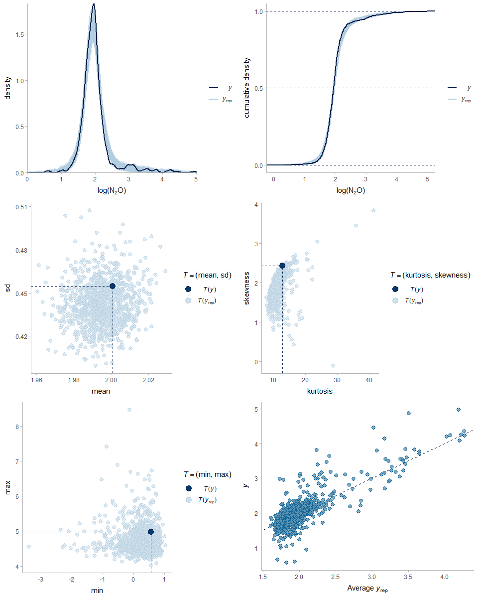

Below are the same PPCs for the second-visit data.

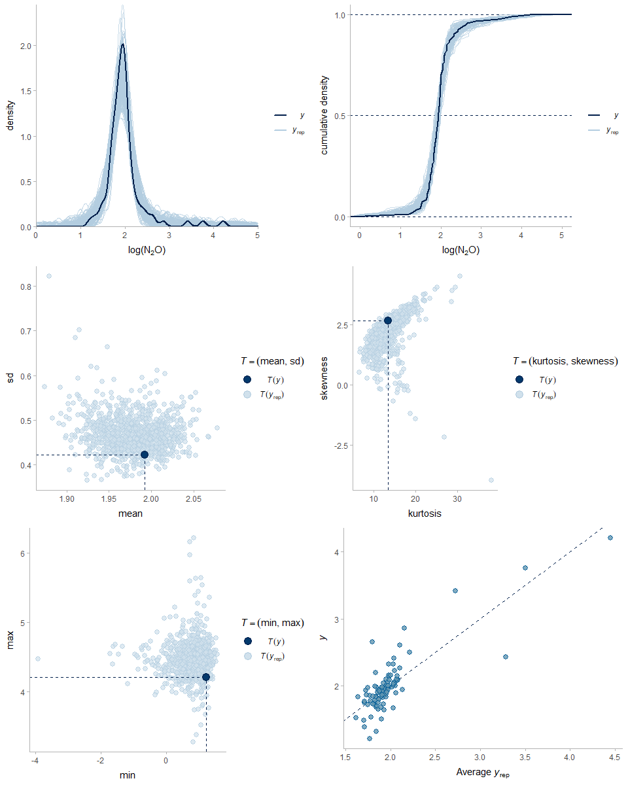

#### 3.3.2.2 Equilibrium N2O

The PPCs below indicated that this model appeared to be an improvement
for equilibrium N2O as well. However, some checks (e.g., skewness)
suggested some room for additional improvement.

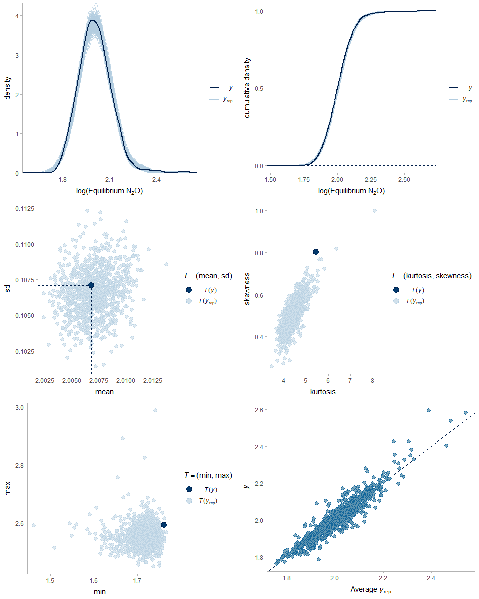

Checks for the 2nd visit data are below.

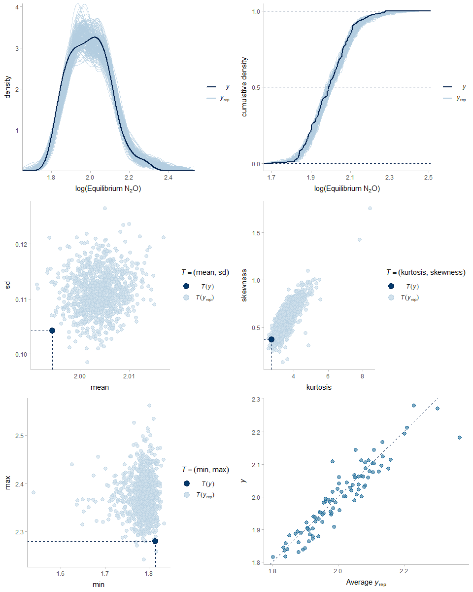

#### 3.3.2.3 Bivariate

The check for the joint distribution below also suggested an improvement
upon the previous models.

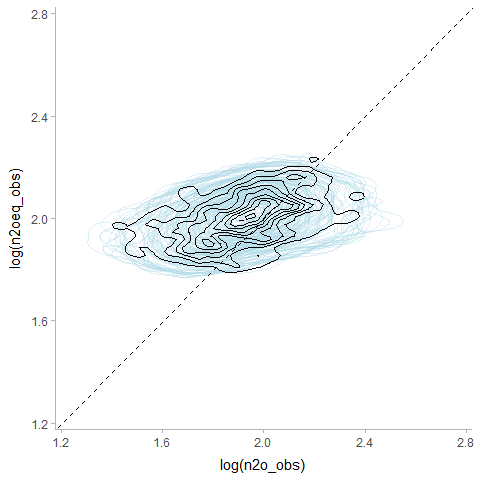

The same check below for the second-visit sites.

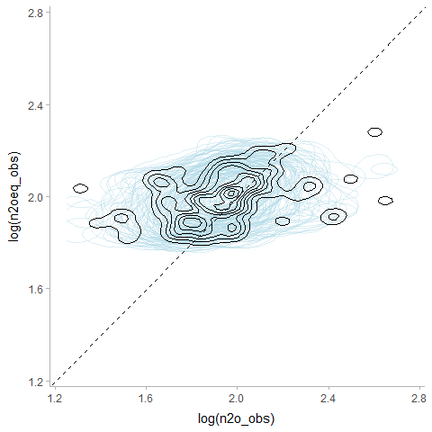

#### 3.3.2.4 Saturation

This model looked to be an improvement with regard to the PPCs for the
saturation metrics. However, the proportion of under-saturated lakes
remained biased low and other checks indicated that further improvements
would be ideal.

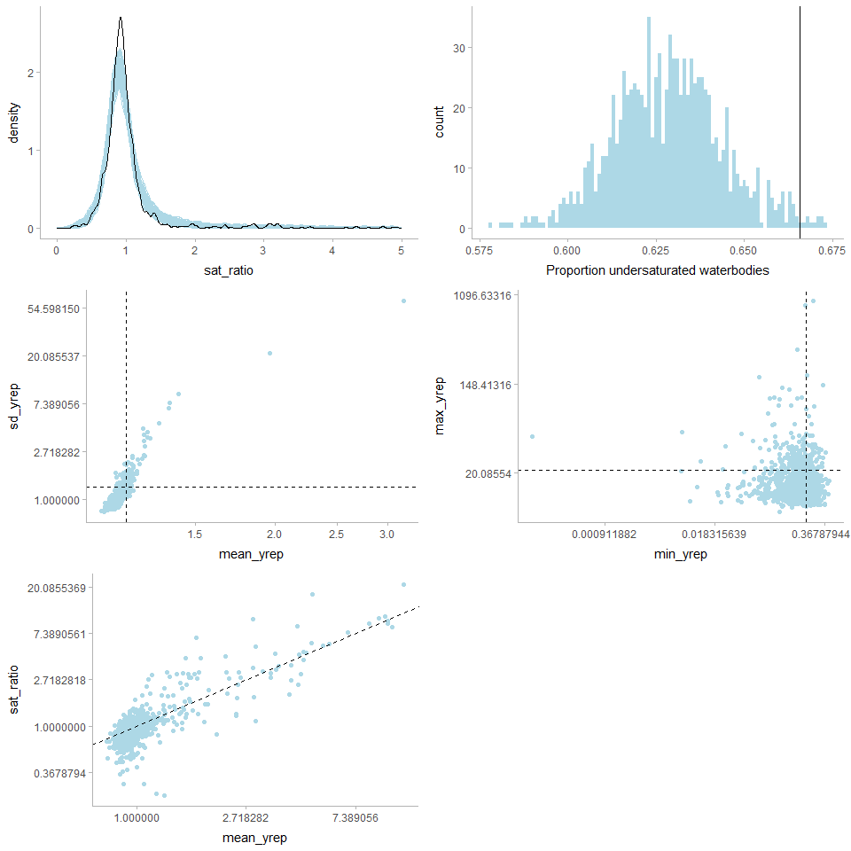

The same check for the second-visit sites are next.

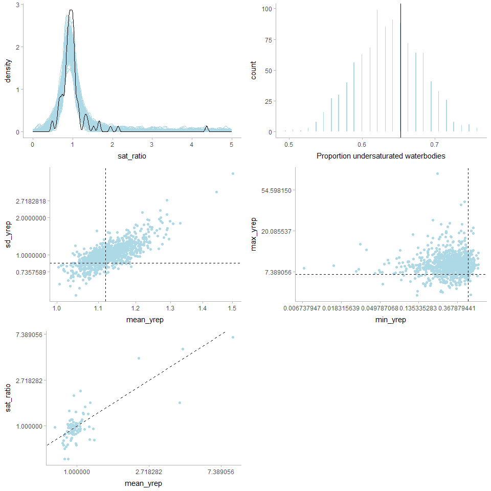

#### 3.3.2.5 R-square

The

estimates for this model are below and suggested substantial
improvements over the previous models.

    ##          Estimate Est.Error  Q2.5 Q97.5
    ## R2logn2o    0.626     0.017 0.591  0.66

    ##            Estimate Est.Error Q2.5 Q97.5
    ## R2logn2oeq    0.879     0.004 0.87 0.886

Next,

for the 2nd visit sites.

    ##          Estimate Est.Error  Q2.5 Q97.5
    ## R2logn2o    0.686     0.026 0.625 0.728

    ##            Estimate Est.Error  Q2.5 Q97.5
    ## R2logn2oeq    0.875     0.006 0.862 0.887

### 3.3.3 Covariate effects

Below are plots illustrating the modeled effects of covariates on both
N2O and equilibrium N2O.

#### 3.3.3.1 Dissolved N2O

The conditional effects plots below for dissolved N2O illustrated a
positive, monotonic, and non-linear relationship with NO3; and a
negative, linear relationship with surface temperature.

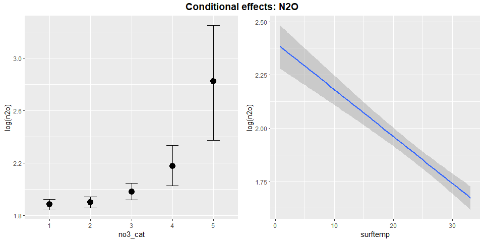

#### 3.3.3.2 Equilibrium N2O

The modeled effects for the equilibrium N2O component illustrated a
negative relationship with both predictors and an interaction such that
the surface temperature effect became slightly steeper at lower
elevations.

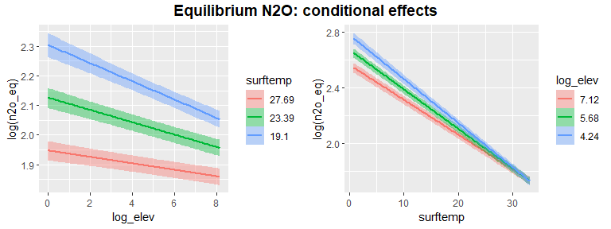

## 3.4 Model 4

In the next model, covariate terms were also included in the

components of both models in order to try to better capture remaining
heterogeneity in the variances of both N2O and N2O-eq.

``` r
bf_n2o <- bf(log(n2o) ~ mo(no3_cat) +
               surftemp +
               (mo(no3_cat) | a | WSA9) + 
               (mo(no3_cat) | b | WSA9:state) + 
               (1 | c | WSA9:state:size_cat),
             sigma ~ mo(no3_cat) +
               surftemp +
               (1 | WSA9) + 
               (1 | WSA9:state) + 
               (1 | WSA9:state:size_cat), 
             family = gaussian())

bf_n2oeq <- bf(log(n2o_eq) ~ surftemp +
                 log_elev +
                 surftemp:log_elev +
                 (1 | a | WSA9) + 
                 (1 | b | WSA9:state) +
                 (1 | c | WSA9:state:size_cat),
             sigma ~ surftemp +
               log_elev +
               (1 | WSA9) + 
               (1 | WSA9:state) + 
               (1 | WSA9:state:size_cat),
             family = gaussian())

priors <- c(
  prior(normal(2, 1), class = "Intercept", resp = "logn2o"),
  prior(normal(0, 1), class = "b", resp = "logn2o"),
  prior(exponential(2), class = "sd", resp = "logn2o"),
  prior(normal(-1, 2), class = "Intercept", dpar = "sigma", resp = "logn2o"),
  prior(normal(0, 1), class = "b", dpar = "sigma", resp = "logn2o"),
  prior(exponential(2), class = "sd", dpar = "sigma", resp = "logn2o"),
  prior(normal(2, 1), class = "Intercept", resp = "logn2oeq"), 
  prior(normal(0, 1), class = "b", resp = "logn2oeq"), 
  prior(exponential(2), class = "sd", resp = "logn2oeq"), 
  prior(normal(-1, 2), class = "Intercept", dpar = "sigma", resp = "logn2oeq"),
  prior(normal(0, 1), class = "b", dpar = "sigma", resp = "logn2oeq"),
  prior(exponential(2), class = "sd", dpar = "sigma", resp = "logn2oeq"),
  
  prior(lkj(2), class = "rescor"),
  prior(lkj(2), class = "cor")
  )

n2o_mod4 <- brm(bf_n2o + bf_n2oeq + set_rescor(rescor = TRUE),
                data = df_model, 
                prior = priors,
  control = list(adapt_delta = 0.975, max_treedepth = 12),
  #sample_prior = "only",
  save_pars = save_pars(all = TRUE),
  seed = 15851,
  chains=4, 
  iter=5000, 
  cores=4)

save(n2o_mod4, file = "C:/Users/rmartin/OneDrive - Environmental Protection Agency (EPA)/Documents/AE_Reservoirs/DissolvedGasNla/modelFiles/n2o_mod4.rda")
```

### 3.4.1 Summarize fit

Below is a summary of the fitted parameters along with some convergence
diagnostics.

    ##  Family: MV(gaussian, gaussian) 
    ##   Links: mu = identity; sigma = log
    ##          mu = identity; sigma = log 
    ## Formula: log(n2o) ~ mo(no3_cat) + surftemp + (mo(no3_cat) | a | WSA9) + (mo(no3_cat) | b | WSA9:state) + (1 | c | WSA9:state:size_cat) 
    ##          sigma ~ mo(no3_cat) + surftemp + (1 | WSA9) + (1 | WSA9:state) + (1 | WSA9:state:size_cat)
    ##          log(n2o_eq) ~ surftemp + log_elev + surftemp:log_elev + (1 | a | WSA9) + (1 | b | WSA9:state) + (1 | c | WSA9:state:size_cat) 
    ##          sigma ~ surftemp + log_elev + (1 | WSA9) + (1 | WSA9:state) + (1 | WSA9:state:size_cat)
    ##    Data: df_model (Number of observations: 984) 
    ##   Draws: 4 chains, each with iter = 5000; warmup = 2500; thin = 1;
    ##          total post-warmup draws = 10000
    ## 
    ## Priors: 
    ## b_logn2o ~ normal(0, 1)
    ## b_logn2o_sigma ~ normal(0, 1)
    ## b_logn2oeq ~ normal(0, 1)
    ## b_logn2oeq_sigma ~ normal(0, 1)
    ## Intercept_logn2o ~ normal(2, 1)
    ## Intercept_logn2o_sigma ~ normal(-1, 2)
    ## Intercept_logn2oeq ~ normal(2, 1)
    ## Intercept_logn2oeq_sigma ~ normal(-1, 2)
    ## L ~ lkj_corr_cholesky(2)
    ## Lrescor ~ lkj_corr_cholesky(2)
    ## <lower=0> sd_logn2o ~ exponential(2)
    ## <lower=0> sd_logn2o_sigma ~ exponential(2)
    ## <lower=0> sd_logn2oeq ~ exponential(2)
    ## <lower=0> sd_logn2oeq_sigma ~ exponential(2)
    ## simo_logn2o_mono3_cat1 ~ dirichlet(1)
    ## simo_logn2o_sigma_mono3_cat1 ~ dirichlet(1)
    ## 
    ## Group-Level Effects: 
    ## ~WSA9 (Number of levels: 9) 
    ##                                          Estimate Est.Error l-95% CI u-95% CI
    ## sd(logn2o_Intercept)                        0.050     0.020    0.020    0.100
    ## sd(logn2o_mono3_cat)                        0.145     0.054    0.065    0.272
    ## sd(logn2oeq_Intercept)                      0.036     0.012    0.019    0.065
    ## sd(sigma_logn2o_Intercept)                  0.113     0.080    0.005    0.303
    ## sd(sigma_logn2oeq_Intercept)                0.208     0.098    0.039    0.435
    ## cor(logn2o_Intercept,logn2o_mono3_cat)     -0.186     0.327   -0.755    0.489
    ## cor(logn2o_Intercept,logn2oeq_Intercept)    0.344     0.290   -0.277    0.817
    ## cor(logn2o_mono3_cat,logn2oeq_Intercept)    0.364     0.286   -0.269    0.819
    ##                                           Rhat Bulk_ESS Tail_ESS
    ## sd(logn2o_Intercept)                     1.000     4733     4348
    ## sd(logn2o_mono3_cat)                     1.000     4386     6208
    ## sd(logn2oeq_Intercept)                   1.001     3977     5215
    ## sd(sigma_logn2o_Intercept)               1.001     2543     4693
    ## sd(sigma_logn2oeq_Intercept)             1.001     2777     2177
    ## cor(logn2o_Intercept,logn2o_mono3_cat)   1.000     4616     6092
    ## cor(logn2o_Intercept,logn2oeq_Intercept) 1.000     5667     6074
    ## cor(logn2o_mono3_cat,logn2oeq_Intercept) 1.001     7634     7624
    ## 
    ## ~WSA9:state (Number of levels: 96) 
    ##                                          Estimate Est.Error l-95% CI u-95% CI
    ## sd(logn2o_Intercept)                        0.035     0.017    0.003    0.068
    ## sd(logn2o_mono3_cat)                        0.117     0.022    0.076    0.162
    ## sd(logn2oeq_Intercept)                      0.033     0.003    0.027    0.040
    ## sd(sigma_logn2o_Intercept)                  0.181     0.099    0.011    0.374
    ## sd(sigma_logn2oeq_Intercept)                0.287     0.057    0.177    0.403
    ## cor(logn2o_Intercept,logn2o_mono3_cat)     -0.317     0.311   -0.810    0.405
    ## cor(logn2o_Intercept,logn2oeq_Intercept)    0.025     0.265   -0.497    0.557
    ## cor(logn2o_mono3_cat,logn2oeq_Intercept)    0.448     0.165    0.098    0.738
    ##                                           Rhat Bulk_ESS Tail_ESS
    ## sd(logn2o_Intercept)                     1.001      981     2017
    ## sd(logn2o_mono3_cat)                     1.001     3149     4612
    ## sd(logn2oeq_Intercept)                   1.000     3457     6360
    ## sd(sigma_logn2o_Intercept)               1.004      858     2373
    ## sd(sigma_logn2oeq_Intercept)             1.001     2470     3862
    ## cor(logn2o_Intercept,logn2o_mono3_cat)   1.003      945     1286
    ## cor(logn2o_Intercept,logn2oeq_Intercept) 1.005      556      823
    ## cor(logn2o_mono3_cat,logn2oeq_Intercept) 1.001     1518     3021
    ## 
    ## ~WSA9:state:size_cat (Number of levels: 352) 
    ##                                          Estimate Est.Error l-95% CI u-95% CI
    ## sd(logn2o_Intercept)                        0.065     0.011    0.042    0.087
    ## sd(logn2oeq_Intercept)                      0.004     0.002    0.000    0.008
    ## sd(sigma_logn2o_Intercept)                  0.539     0.055    0.432    0.647
    ## sd(sigma_logn2oeq_Intercept)                0.263     0.051    0.162    0.363
    ## cor(logn2o_Intercept,logn2oeq_Intercept)    0.395     0.348   -0.479    0.904
    ##                                           Rhat Bulk_ESS Tail_ESS
    ## sd(logn2o_Intercept)                     1.003     1478     2832
    ## sd(logn2oeq_Intercept)                   1.001     1506     2453
    ## sd(sigma_logn2o_Intercept)               1.002     1443     3611
    ## sd(sigma_logn2oeq_Intercept)             1.001     2372     4366
    ## cor(logn2o_Intercept,logn2oeq_Intercept) 1.001     4231     4956
    ## 
    ## Population-Level Effects: 
    ##                            Estimate Est.Error l-95% CI u-95% CI  Rhat Bulk_ESS
    ## logn2o_Intercept              2.386     0.055    2.278    2.490 1.000     5971
    ## sigma_logn2o_Intercept       -1.855     0.281   -2.389   -1.294 1.000     5965
    ## logn2oeq_Intercept            3.115     0.051    3.016    3.217 1.001     7109
    ## sigma_logn2oeq_Intercept     -1.922     0.373   -2.634   -1.180 1.000     8445
    ## logn2o_surftemp              -0.021     0.002   -0.026   -0.017 1.000     5850
    ## sigma_logn2o_surftemp        -0.001     0.011   -0.023    0.021 1.001     6175
    ## logn2oeq_surftemp            -0.042     0.002   -0.046   -0.039 1.001     8285
    ## logn2oeq_log_elev            -0.080     0.008   -0.096   -0.065 1.001     7656
    ## logn2oeq_surftemp:log_elev    0.002     0.000    0.002    0.003 1.000     8407
    ## sigma_logn2oeq_surftemp      -0.065     0.010   -0.085   -0.046 1.000    10043
    ## sigma_logn2oeq_log_elev      -0.019     0.038   -0.095    0.054 1.000     6646
    ## logn2o_mono3_cat              0.225     0.058    0.108    0.340 1.000     4488
    ## sigma_logn2o_mono3_cat        0.256     0.037    0.187    0.331 1.000     6036
    ##                            Tail_ESS
    ## logn2o_Intercept               7057
    ## sigma_logn2o_Intercept         7704
    ## logn2oeq_Intercept             7366
    ## sigma_logn2oeq_Intercept       7581
    ## logn2o_surftemp                7677
    ## sigma_logn2o_surftemp          7768
    ## logn2oeq_surftemp              7516
    ## logn2oeq_log_elev              7564
    ## logn2oeq_surftemp:log_elev     7502
    ## sigma_logn2oeq_surftemp        8163
    ## sigma_logn2oeq_log_elev        7910
    ## logn2o_mono3_cat               5143
    ## sigma_logn2o_mono3_cat         7643
    ## 
    ## Simplex Parameters: 
    ##                            Estimate Est.Error l-95% CI u-95% CI  Rhat Bulk_ESS
    ## logn2o_mono3_cat1[1]          0.018     0.012    0.001    0.045 1.000     5709
    ## logn2o_mono3_cat1[2]          0.093     0.027    0.041    0.149 1.000     5034
    ## logn2o_mono3_cat1[3]          0.231     0.060    0.126    0.366 1.000     4974
    ## logn2o_mono3_cat1[4]          0.659     0.062    0.520    0.763 1.000     4446
    ## sigma_logn2o_mono3_cat1[1]    0.107     0.066    0.007    0.255 1.000     6168
    ## sigma_logn2o_mono3_cat1[2]    0.129     0.087    0.006    0.328 1.000     8105
    ## sigma_logn2o_mono3_cat1[3]    0.459     0.151    0.168    0.758 1.000     7272
    ## sigma_logn2o_mono3_cat1[4]    0.304     0.139    0.038    0.569 1.000     6289
    ##                            Tail_ESS
    ## logn2o_mono3_cat1[1]           4429
    ## logn2o_mono3_cat1[2]           5645
    ## logn2o_mono3_cat1[3]           5478
    ## logn2o_mono3_cat1[4]           5210
    ## sigma_logn2o_mono3_cat1[1]     4471
    ## sigma_logn2o_mono3_cat1[2]     5010
    ## sigma_logn2o_mono3_cat1[3]     5802
    ## sigma_logn2o_mono3_cat1[4]     4264
    ## 
    ## Residual Correlations: 
    ##                         Estimate Est.Error l-95% CI u-95% CI  Rhat Bulk_ESS
    ## rescor(logn2o,logn2oeq)    0.146     0.040    0.067    0.223 1.001     9839
    ##                         Tail_ESS
    ## rescor(logn2o,logn2oeq)     8508
    ## 
    ## Draws were sampled using sampling(NUTS). For each parameter, Bulk_ESS
    ## and Tail_ESS are effective sample size measures, and Rhat is the potential
    ## scale reduction factor on split chains (at convergence, Rhat = 1).

### 3.4.2 Model checks

The same PPCs were employed for this model as above.

#### 3.4.2.1 Dissolved N2O

This model appeared to be a moderate improvement on the previous models.

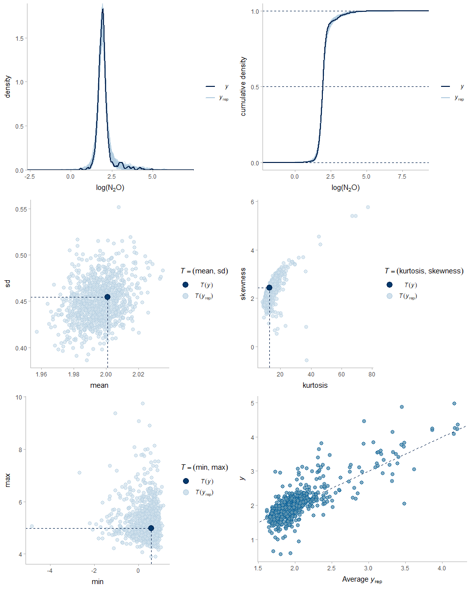

This same checks for the 2nd visit sites is below.

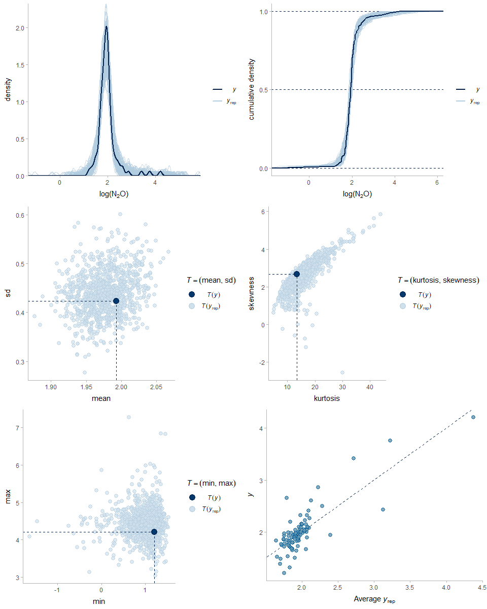

#### 3.4.2.2 Equilibrium N2O

This component of the model also seemed to be an improvement over model
3, with better representation in the tails as indicated in the skewness
*vs.* kurtosis PPC.

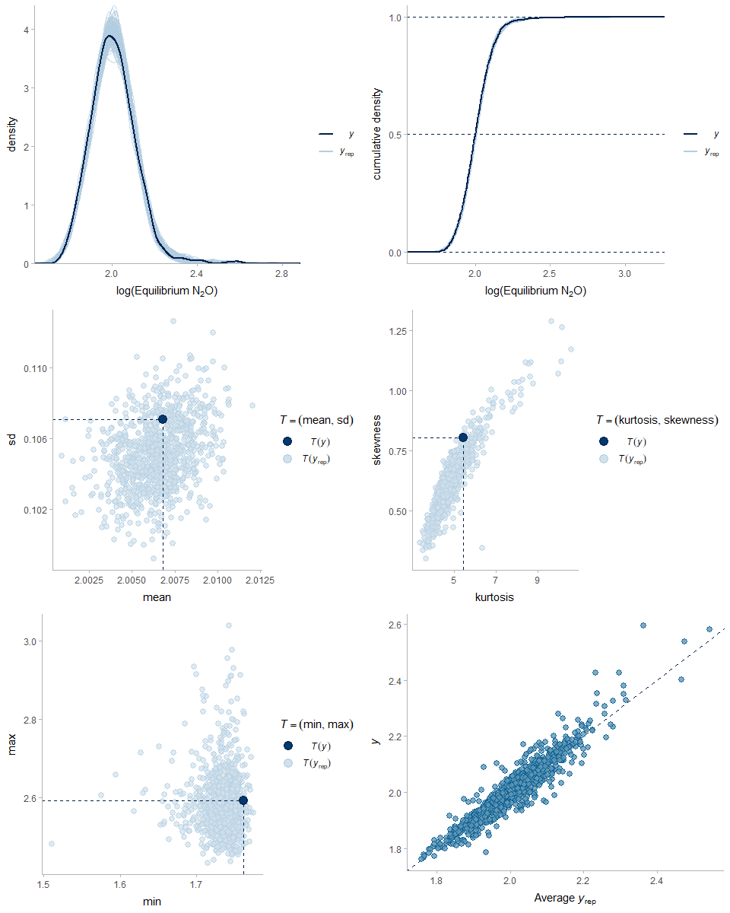

For the 2nd visit sites.

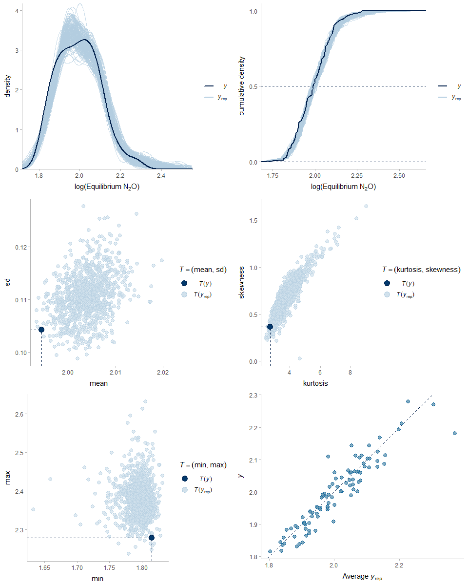

#### 3.4.2.3 Bivariate

Again, an improvement over the previous model with a tighter fit of the
PPC to the observed bivariate density.

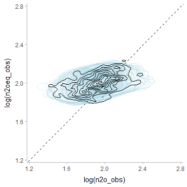

For the 2nd visit sites.

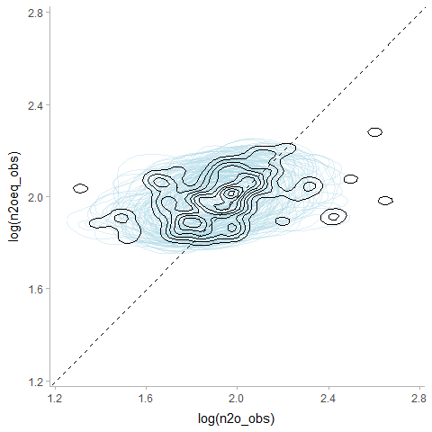

#### 3.4.2.4 Saturation

This check also suggested an improvement over the previous models, with
better tail behavior and less bias in the proportion under-saturated
measure.

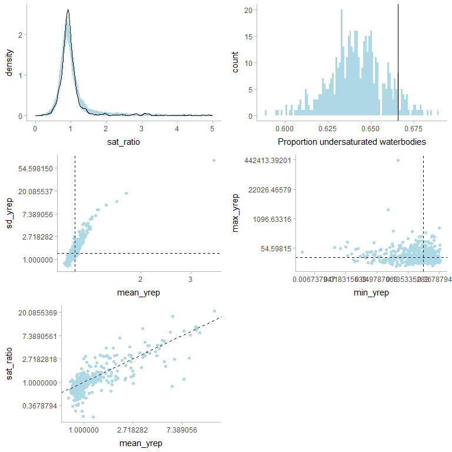

For the second visit sites:

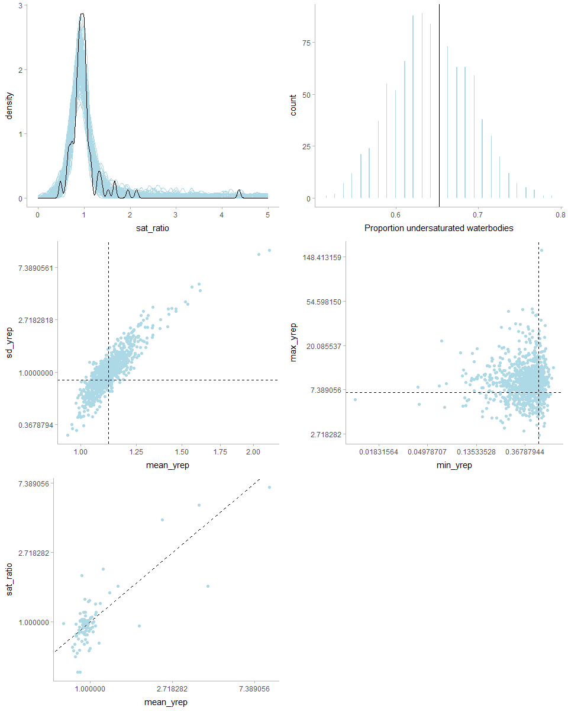

#### 3.4.2.5 R-square

The Bayesian

estimates below indicated an improvement from the previous models.

    ##          Estimate Est.Error  Q2.5 Q97.5
    ## R2logn2o    0.606     0.025 0.551 0.651

    ##            Estimate Est.Error  Q2.5 Q97.5
    ## R2logn2oeq    0.875     0.005 0.865 0.883

For the 2nd visit data.

    ##          Estimate Est.Error  Q2.5 Q97.5
    ## R2logn2o    0.661     0.043 0.564 0.731

    ##            Estimate Est.Error  Q2.5 Q97.5
    ## R2logn2oeq     0.87     0.007 0.855 0.883

### 3.4.3 Covariate effects

#### 3.4.3.1 Dissolved N2O

The conditional effects plots for the covariate effects on dissolved N2O
remained similar to the previous model.

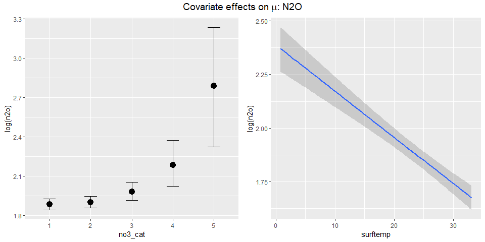

Below are estimates of the conditional effects of the covariates on

for N2O. These plots suggested a large effect of NO3 on the variance of
N2O, but little to no effect of surface temperature.

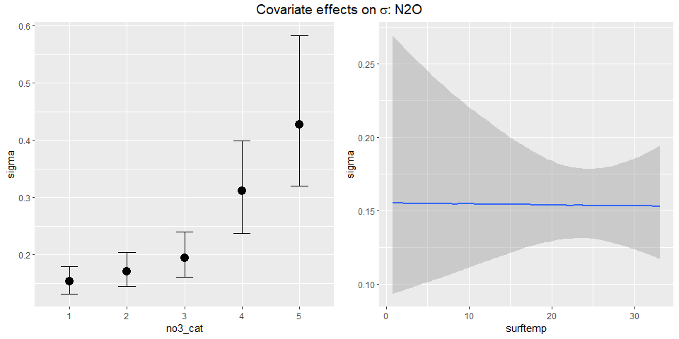

#### 3.4.3.2 Equilibrium N2O

The covariate effects on equilibrium N2O remained largely the same as
for the previous model.

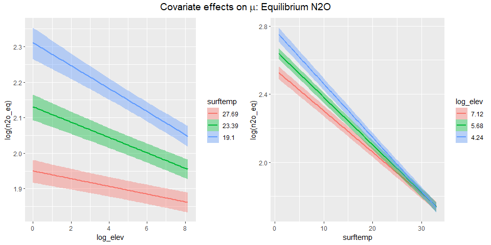

The covariate effects on

for N2O-eq suggested a negative effect of surface temperature and litte
to no effect of elevation.

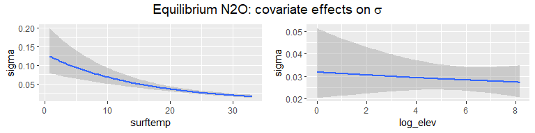

## 3.5 Model 5

In the next model, additional complexity is added to the dissolved N2O
component by including a covariate for continuous lake surface area (log
scale) as well as interactions between NO3 and log(surface area) and
surface temperature. Although some variation due to lake size was likely
captured by the categorical survey variable for size in the models
above, the categorical distinction may not well represent the true
continuous nature of waterbody size and its effects on the response. For
example, the largest size category represented all lakes \>50 hecatares,
which included an extremely wide range of waterbody sizes ranging from
50 to over 300,000 hectares at max. Including the continuous size
covariate at the observation level in this manner was expected to do a
better job of resolving trends with size. Colinearity between the
grouped and observation-level measures were not a major, concern, since
the observation-level measure would account for any variation first.
Though not presented in this document, violations of the Gauss-Markov
assumptions were checked by looking for potential correlations between
model errors and the covariates ([Bafumi and Gelman
2007](#ref-Bafumi_Gelman_2007)).

``` r
bf_n2o <- bf(log(n2o) ~ mo(no3_cat) +
               log_area +
               surftemp + 
               mo(no3_cat):log_area +
               mo(no3_cat):surftemp +
               (mo(no3_cat) | a | WSA9) + 
               (mo(no3_cat) | b | WSA9:state) + 
               (1 | c | WSA9:state:size_cat),
             sigma ~ log_area +
               mo(no3_cat) +
               (1 | WSA9) + 
               (1 | WSA9:state) + 
               (1 | WSA9:state:size_cat), 
             family = gaussian())

bf_n2oeq <- bf(log(n2o_eq) ~ surftemp +
                 log_elev +
                 surftemp:log_elev +
                 (1 | a | WSA9) + 
                 (1 | b | WSA9:state) +
                 (1 | c | WSA9:state:size_cat),
             sigma ~ surftemp +
               log_elev +
               (1 | WSA9) + 
               (1 | WSA9:state) + 
               (1 | WSA9:state:size_cat),
             family = gaussian())

priors <- c(
  prior(normal(2, 1), class = "Intercept", resp = "logn2o"),
  prior(normal(0, 1), class = "b", resp = "logn2o"),
  prior(exponential(2), class = "sd", resp = "logn2o"),
  prior(normal(-1, 2), class = "Intercept", dpar = "sigma", resp = "logn2o"),
  prior(normal(0, 1), class = "b", dpar = "sigma", resp = "logn2o"),
  prior(exponential(2), class = "sd", dpar = "sigma", resp = "logn2o"),
  
  prior(normal(2, 1), class = "Intercept", resp = "logn2oeq"), 
  prior(normal(0, 1), class = "b", resp = "logn2oeq"), 
  prior(exponential(2), class = "sd", resp = "logn2oeq"), 
  prior(normal(-1, 2), class = "Intercept", dpar = "sigma", resp = "logn2oeq"),
  prior(normal(0, 1), class = "b", dpar = "sigma", resp = "logn2oeq"),
  prior(exponential(2), class = "sd", dpar = "sigma", resp = "logn2oeq"),
  
  prior(lkj(2), class = "rescor"),
  prior(lkj(2), class = "cor")
  )

n2o_mod5 <- brm(bf_n2o + 
                  bf_n2oeq +
                  set_rescor(rescor = TRUE),
                data = df_model, 
                prior = priors,
  control = list(adapt_delta = 0.975, max_treedepth = 12),
  #sample_prior = "only",
  save_pars = save_pars(all = TRUE),
  seed = 54741,
  chains=4, 
  iter=5000, 
  cores=4)

save(n2o_mod5, file = "C:/Users/rmartin/OneDrive - Environmental Protection Agency (EPA)/Documents/AE_Reservoirs/DissolvedGasNla/modelFiles/n2o_mod5.rda")
```

### 3.5.1 Summarize fit

Below is a summary of the fitted parameters along with MCMC convergence
diagnostics.

    ##  Family: MV(gaussian, gaussian) 
    ##   Links: mu = identity; sigma = log
    ##          mu = identity; sigma = log 
    ## Formula: log(n2o) ~ mo(no3_cat) + log_area + surftemp + mo(no3_cat):log_area + mo(no3_cat):surftemp + (mo(no3_cat) | a | WSA9) + (mo(no3_cat) | b | WSA9:state) + (1 | c | WSA9:state:size_cat) 
    ##          sigma ~ log_area + mo(no3_cat) + (1 | WSA9) + (1 | WSA9:state) + (1 | WSA9:state:size_cat)
    ##          log(n2o_eq) ~ surftemp + log_elev + surftemp:log_elev + (1 | a | WSA9) + (1 | b | WSA9:state) + (1 | c | WSA9:state:size_cat) 
    ##          sigma ~ surftemp + log_elev + (1 | WSA9) + (1 | WSA9:state) + (1 | WSA9:state:size_cat)
    ##    Data: df_model (Number of observations: 984) 
    ##   Draws: 4 chains, each with iter = 5000; warmup = 2500; thin = 1;
    ##          total post-warmup draws = 10000
    ## 
    ## Priors: 
    ## b_logn2o ~ normal(0, 1)
    ## b_logn2o_sigma ~ normal(0, 1)
    ## b_logn2oeq ~ normal(0, 1)
    ## b_logn2oeq_sigma ~ normal(0, 1)
    ## Intercept_logn2o ~ normal(2, 1)
    ## Intercept_logn2o_sigma ~ normal(-1, 2)
    ## Intercept_logn2oeq ~ normal(2, 1)
    ## Intercept_logn2oeq_sigma ~ normal(-1, 2)
    ## L ~ lkj_corr_cholesky(2)
    ## Lrescor ~ lkj_corr_cholesky(2)
    ## <lower=0> sd_logn2o ~ exponential(2)
    ## <lower=0> sd_logn2o_sigma ~ exponential(2)
    ## <lower=0> sd_logn2oeq ~ exponential(2)
    ## <lower=0> sd_logn2oeq_sigma ~ exponential(2)
    ## simo_logn2o_mono3_cat:log_area1 ~ dirichlet(1)
    ## simo_logn2o_mono3_cat:surftemp1 ~ dirichlet(1)
    ## simo_logn2o_mono3_cat1 ~ dirichlet(1)
    ## simo_logn2o_sigma_mono3_cat1 ~ dirichlet(1)
    ## 
    ## Group-Level Effects: 
    ## ~WSA9 (Number of levels: 9) 
    ##                                          Estimate Est.Error l-95% CI u-95% CI
    ## sd(logn2o_Intercept)                        0.048     0.019    0.020    0.094
    ## sd(logn2o_mono3_cat)                        0.081     0.050    0.007    0.199
    ## sd(logn2oeq_Intercept)                      0.034     0.011    0.018    0.062
    ## sd(sigma_logn2o_Intercept)                  0.111     0.076    0.006    0.293
    ## sd(sigma_logn2oeq_Intercept)                0.209     0.102    0.036    0.445
    ## cor(logn2o_Intercept,logn2o_mono3_cat)     -0.056     0.360   -0.713    0.644
    ## cor(logn2o_Intercept,logn2oeq_Intercept)    0.464     0.284   -0.173    0.885
    ## cor(logn2o_mono3_cat,logn2oeq_Intercept)    0.259     0.341   -0.467    0.824
    ##                                           Rhat Bulk_ESS Tail_ESS
    ## sd(logn2o_Intercept)                     1.000     4413     4624
    ## sd(logn2o_mono3_cat)                     1.003     1412     2265
    ## sd(logn2oeq_Intercept)                   1.000     4061     6633
    ## sd(sigma_logn2o_Intercept)               1.000     2790     4064
    ## sd(sigma_logn2oeq_Intercept)             1.001     2176     1898
    ## cor(logn2o_Intercept,logn2o_mono3_cat)   1.000     5823     6525
    ## cor(logn2o_Intercept,logn2oeq_Intercept) 1.000     4935     6214
    ## cor(logn2o_mono3_cat,logn2oeq_Intercept) 1.000     4684     4770
    ## 
    ## ~WSA9:state (Number of levels: 96) 
    ##                                          Estimate Est.Error l-95% CI u-95% CI
    ## sd(logn2o_Intercept)                        0.046     0.014    0.016    0.072
    ## sd(logn2o_mono3_cat)                        0.097     0.024    0.053    0.146
    ## sd(logn2oeq_Intercept)                      0.033     0.003    0.027    0.040
    ## sd(sigma_logn2o_Intercept)                  0.207     0.088    0.024    0.369
    ## sd(sigma_logn2oeq_Intercept)                0.285     0.056    0.177    0.395
    ## cor(logn2o_Intercept,logn2o_mono3_cat)     -0.265     0.284   -0.762    0.336
    ## cor(logn2o_Intercept,logn2oeq_Intercept)    0.163     0.200   -0.232    0.559
    ## cor(logn2o_mono3_cat,logn2oeq_Intercept)    0.266     0.209   -0.155    0.649
    ##                                           Rhat Bulk_ESS Tail_ESS
    ## sd(logn2o_Intercept)                     1.001     1323     1765
    ## sd(logn2o_mono3_cat)                     1.001     2612     2569
    ## sd(logn2oeq_Intercept)                   1.001     3321     5286
    ## sd(sigma_logn2o_Intercept)               1.007      776     1082
    ## sd(sigma_logn2oeq_Intercept)             1.002     2464     3702
    ## cor(logn2o_Intercept,logn2o_mono3_cat)   1.001     1708     3060
    ## cor(logn2o_Intercept,logn2oeq_Intercept) 1.005      960     1715
    ## cor(logn2o_mono3_cat,logn2oeq_Intercept) 1.002      883     1843
    ## 
    ## ~WSA9:state:size_cat (Number of levels: 352) 
    ##                                          Estimate Est.Error l-95% CI u-95% CI
    ## sd(logn2o_Intercept)                        0.035     0.015    0.004    0.062
    ## sd(logn2oeq_Intercept)                      0.003     0.002    0.000    0.007
    ## sd(sigma_logn2o_Intercept)                  0.479     0.056    0.374    0.591
    ## sd(sigma_logn2oeq_Intercept)                0.260     0.052    0.160    0.360
    ## cor(logn2o_Intercept,logn2oeq_Intercept)    0.235     0.413   -0.658    0.872
    ##                                           Rhat Bulk_ESS Tail_ESS
    ## sd(logn2o_Intercept)                     1.004      819     1375
    ## sd(logn2oeq_Intercept)                   1.003     1569     3553
    ## sd(sigma_logn2o_Intercept)               1.006     1318     3346
    ## sd(sigma_logn2oeq_Intercept)             1.001     2326     3796
    ## cor(logn2o_Intercept,logn2oeq_Intercept) 1.002     2950     5425
    ## 
    ## Population-Level Effects: 
    ##                            Estimate Est.Error l-95% CI u-95% CI  Rhat Bulk_ESS
    ## logn2o_Intercept              2.380     0.055    2.273    2.487 1.001     4020
    ## sigma_logn2o_Intercept       -1.596     0.097   -1.789   -1.408 1.002     4961
    ## logn2oeq_Intercept            3.116     0.051    3.019    3.218 1.000     6860
    ## sigma_logn2oeq_Intercept     -1.922     0.374   -2.639   -1.179 1.000     7865
    ## logn2o_log_area               0.029     0.003    0.023    0.034 1.000     9054
    ## logn2o_surftemp              -0.025     0.002   -0.029   -0.021 1.000     3996
    ## sigma_logn2o_log_area        -0.095     0.020   -0.135   -0.055 1.001     6068
    ## logn2oeq_surftemp            -0.042     0.002   -0.046   -0.039 1.000     7418
    ## logn2oeq_log_elev            -0.080     0.008   -0.097   -0.065 1.000     6834
    ## logn2oeq_surftemp:log_elev    0.003     0.000    0.002    0.003 1.000     7339
    ## sigma_logn2oeq_surftemp      -0.065     0.010   -0.085   -0.046 1.000     9671
    ## sigma_logn2oeq_log_elev      -0.018     0.038   -0.096    0.054 1.000     6265
    ## logn2o_mono3_cat              0.026     0.127   -0.226    0.275 1.004     1971
    ## logn2o_mono3_cat:log_area    -0.036     0.010   -0.054   -0.016 1.001     2602
    ## logn2o_mono3_cat:surftemp     0.014     0.006    0.003    0.026 1.004     1478
    ## sigma_logn2o_mono3_cat        0.246     0.036    0.179    0.321 1.001     4246
    ##                            Tail_ESS
    ## logn2o_Intercept               6632
    ## sigma_logn2o_Intercept         6145
    ## logn2oeq_Intercept             7546
    ## sigma_logn2oeq_Intercept       7774
    ## logn2o_log_area                8090
    ## logn2o_surftemp                7106
    ## sigma_logn2o_log_area          7491
    ## logn2oeq_surftemp              8290
    ## logn2oeq_log_elev              7865
    ## logn2oeq_surftemp:log_elev     7992
    ## sigma_logn2oeq_surftemp        8132
    ## sigma_logn2oeq_log_elev        7038
    ## logn2o_mono3_cat               3252
    ## logn2o_mono3_cat:log_area      4549
    ## logn2o_mono3_cat:surftemp      2416
    ## sigma_logn2o_mono3_cat         6738
    ## 
    ## Simplex Parameters: 
    ##                               Estimate Est.Error l-95% CI u-95% CI  Rhat
    ## logn2o_mono3_cat1[1]             0.026     0.024    0.001    0.089 1.001
    ## logn2o_mono3_cat1[2]             0.091     0.066    0.005    0.252 1.001
    ## logn2o_mono3_cat1[3]             0.250     0.146    0.034    0.615 1.002
    ## logn2o_mono3_cat1[4]             0.633     0.166    0.206    0.867 1.003
    ## logn2o_mono3_cat:log_area1[1]    0.060     0.041    0.005    0.161 1.000
    ## logn2o_mono3_cat:log_area1[2]    0.042     0.039    0.001    0.142 1.000
    ## logn2o_mono3_cat:log_area1[3]    0.297     0.161    0.047    0.681 1.000
    ## logn2o_mono3_cat:log_area1[4]    0.602     0.176    0.166    0.865 1.000
    ## logn2o_mono3_cat:surftemp1[1]    0.043     0.040    0.006    0.144 1.002
    ## logn2o_mono3_cat:surftemp1[2]    0.080     0.056    0.015    0.222 1.001
    ## logn2o_mono3_cat:surftemp1[3]    0.276     0.111    0.105    0.573 1.001
    ## logn2o_mono3_cat:surftemp1[4]    0.601     0.142    0.168    0.785 1.002
    ## sigma_logn2o_mono3_cat1[1]       0.131     0.074    0.010    0.288 1.000
    ## sigma_logn2o_mono3_cat1[2]       0.151     0.096    0.010    0.367 1.000
    ## sigma_logn2o_mono3_cat1[3]       0.444     0.149    0.149    0.734 1.001
    ## sigma_logn2o_mono3_cat1[4]       0.275     0.138    0.026    0.544 1.001
    ##                               Bulk_ESS Tail_ESS
    ## logn2o_mono3_cat1[1]              4261     5305
    ## logn2o_mono3_cat1[2]              1875     3916
    ## logn2o_mono3_cat1[3]              2027     2856
    ## logn2o_mono3_cat1[4]              1411     2439
    ## logn2o_mono3_cat:log_area1[1]     4395     3509
    ## logn2o_mono3_cat:log_area1[2]     7129     6046
    ## logn2o_mono3_cat:log_area1[3]     5220     5683
    ## logn2o_mono3_cat:log_area1[4]     4431     4505
    ## logn2o_mono3_cat:surftemp1[1]     3541     3002
    ## logn2o_mono3_cat:surftemp1[2]     3667     2580
    ## logn2o_mono3_cat:surftemp1[3]     3634     3352
    ## logn2o_mono3_cat:surftemp1[4]     2731     2289
    ## sigma_logn2o_mono3_cat1[1]        6840     4269
    ## sigma_logn2o_mono3_cat1[2]        7630     5795
    ## sigma_logn2o_mono3_cat1[3]        6331     6964
    ## sigma_logn2o_mono3_cat1[4]        4902     5797
    ## 
    ## Residual Correlations: 
    ##                         Estimate Est.Error l-95% CI u-95% CI  Rhat Bulk_ESS
    ## rescor(logn2o,logn2oeq)    0.141     0.038    0.066    0.216 1.000    11829
    ##                         Tail_ESS
    ## rescor(logn2o,logn2oeq)     8204
    ## 
    ## Draws were sampled using sampling(NUTS). For each parameter, Bulk_ESS
    ## and Tail_ESS are effective sample size measures, and Rhat is the potential
    ## scale reduction factor on split chains (at convergence, Rhat = 1).

### 3.5.2 Model checks

Again, the same PPCs as above were performed for this model.

#### 3.5.2.1 Dissolved N2O

The PPC for dissolved N2O below suggested minimal improvements upon the
the previous model.

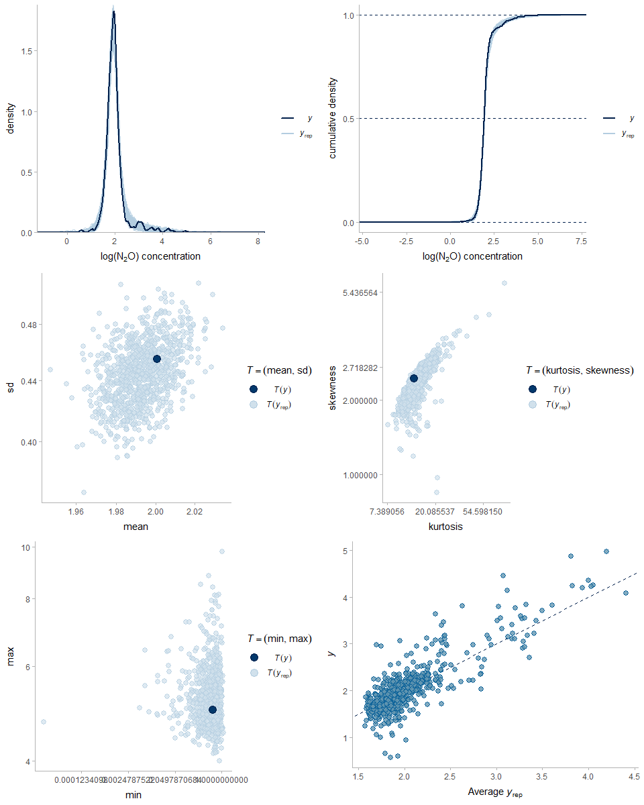

The same check for the 2nd visit data is below.

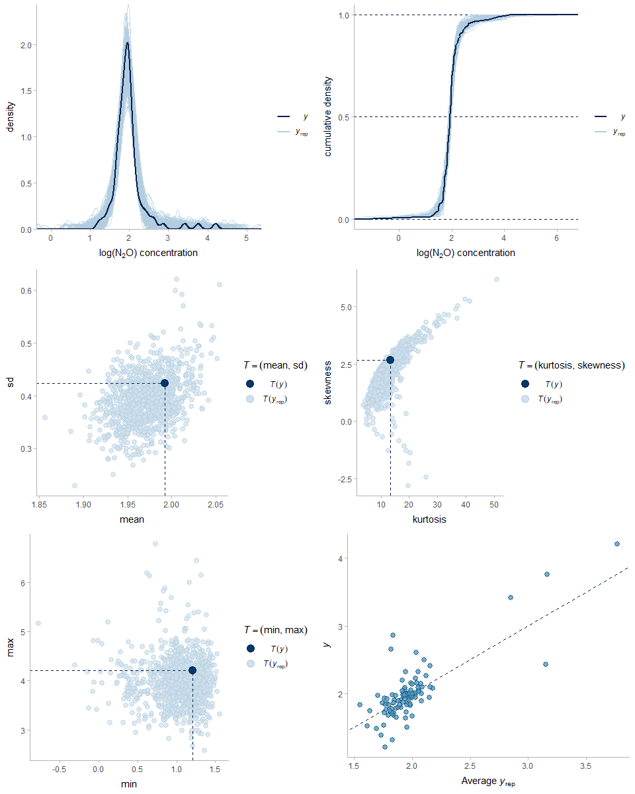

#### 3.5.2.2 Equilibrium N2O

The PPCs for this model were similar to the previous model, which was
unsurprising given that it was the same model for N2O-eq.

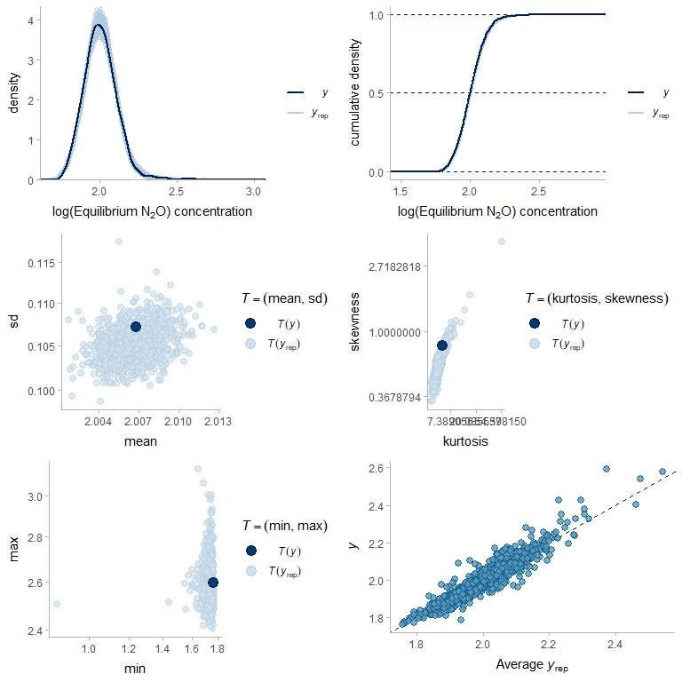

Below, is the same check using the 2nd visit data.

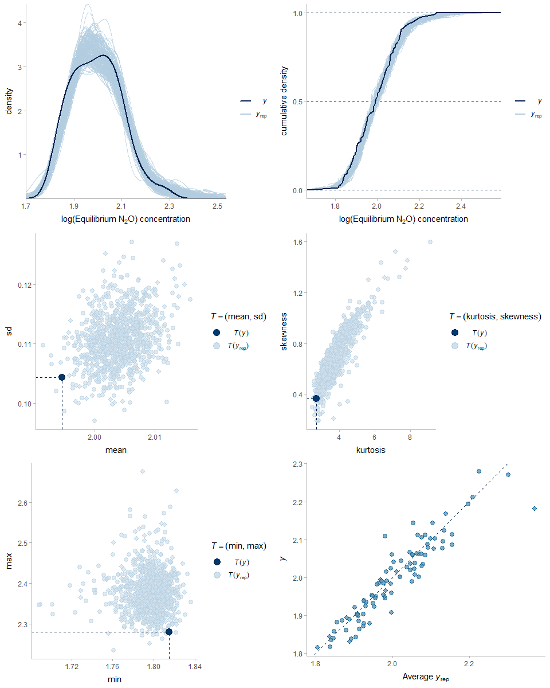

#### 3.5.2.3 Bivariate

This PPC was also similar to the previous model.

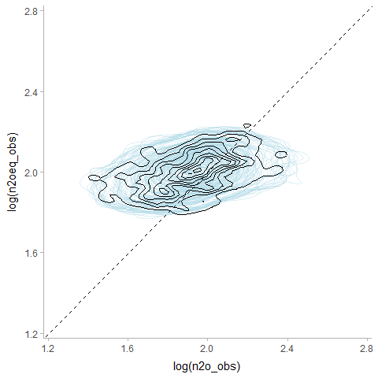

And the check with the 2nd visit data.

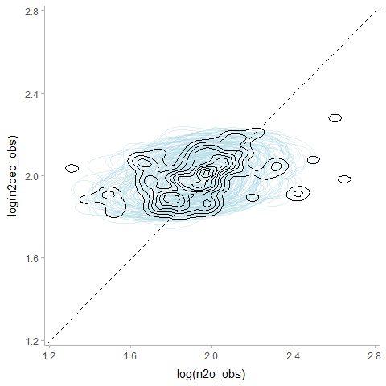

#### 3.5.2.4 Saturation

This check was also similar to the prevoius model, with perhaps slightly
less bias in the proportion unsaturated estimates. There was also a
potentially concerning extreme prediction in the observed *vs* predicted
PPC.

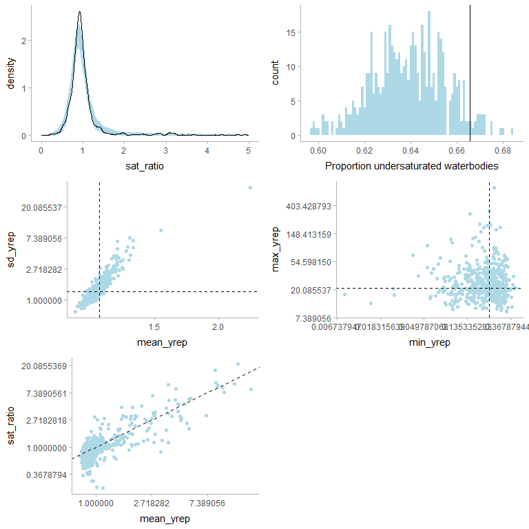

The same check for the revisit sites below:

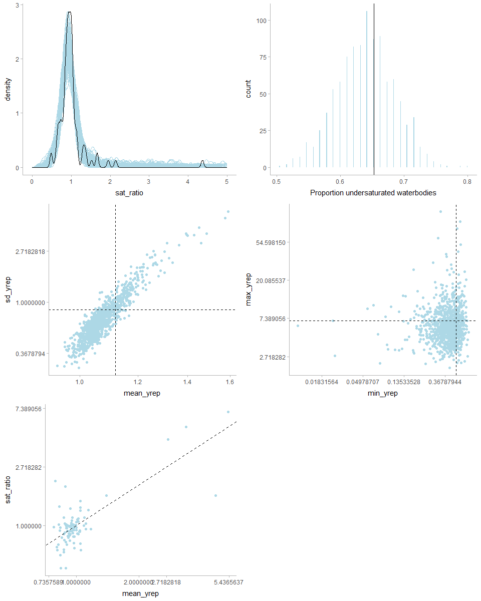

#### 3.5.2.5 R-square

    ##          Estimate Est.Error  Q2.5 Q97.5
    ## R2logn2o    0.629      0.03 0.563  0.68

    ##            Estimate Est.Error  Q2.5 Q97.5
    ## R2logn2oeq    0.874     0.005 0.864 0.882

For the revisit sites:

    ##          Estimate Est.Error Q2.5 Q97.5
    ## R2logn2o    0.573     0.065 0.43 0.684

    ##            Estimate Est.Error  Q2.5 Q97.5
    ## R2logn2oeq    0.869     0.007 0.853 0.882

### 3.5.3 Covariate effects

#### 3.5.3.1 Dissolved N2O

The conditional effects plots suggested a similar effect of NO3, but
interesting interactions between NO3 and lake area and NO3 and surface
temperature. For lake area, the effect was estimated to be larger and
more negative at the highest levels of NO3; and slightly negative at the
lowest level of NO3. For surface temperature, the effect was estimated
to be largest and positive at the highest level of NO3; and negative at
the lowest level of NO3.

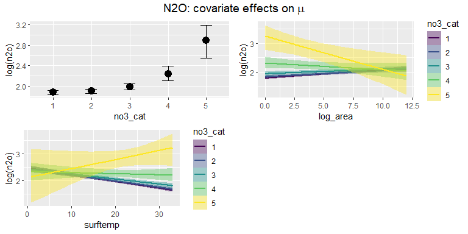

The estimated covariate effects on

suggested a negative relationship with log(area) and a positive
relationship, again, with NO3.

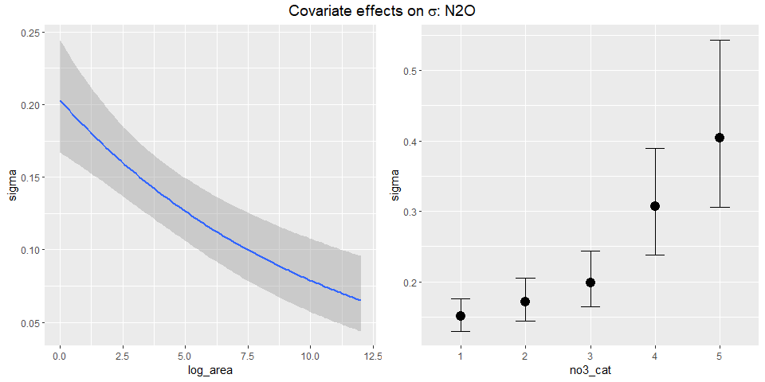

#### 3.5.3.2 Equilibrium N2O

The estimated covariate effects on equilibrium N2O remained largely the
same as estimated in the previous model.

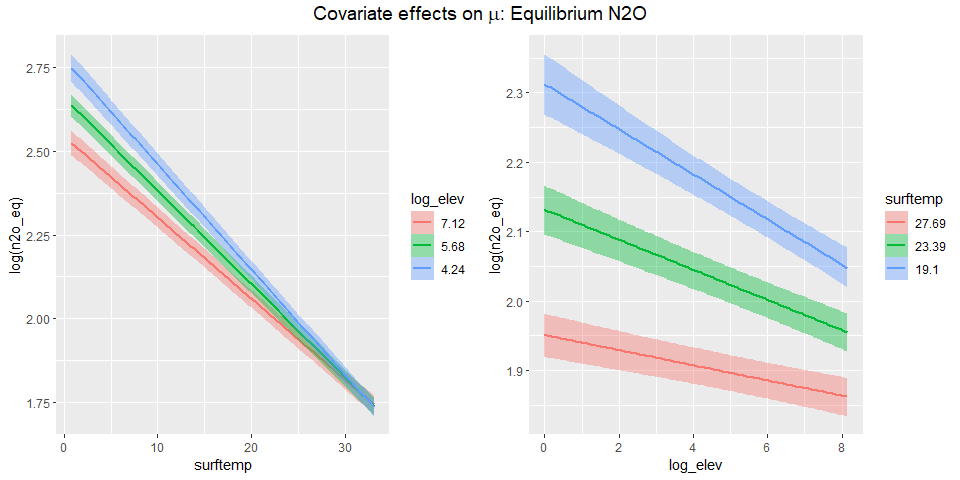

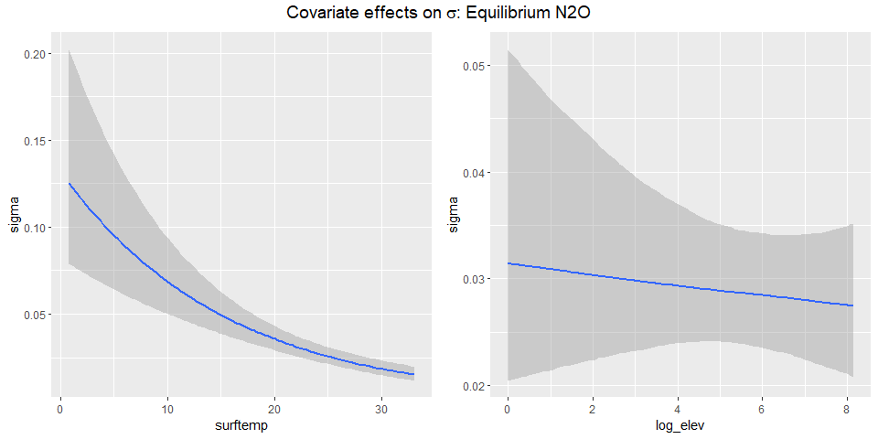

## 3.6 A Final Model

As demonstrated above, models excluding the NO3 covariate consistently
resulted in poorer fits to to the observed dissolved N2O data and
potentially biased estimates of the saturation ratio. Including surface
temperature and elevation in the equilibrium N2O part of the model also
resulted in substantially improved replication of key aspects of the
observed data. Added flexibility in the distributional terms for both
dissolved and equilibrium N2O also led to improvements. To make
inferences to the population of interest from a model including these
covariates, however, they needed to be (1) fully observed across that
population or (2) their missingness needed to be modeled. For the lake
area and elevation covariates, data *was* available for all lakes from
previously compiled geospatial databases. However, neither surface
temperature or NO3 were observed for lakes outside of the sample.
Therefore, the final model below included surface temperature and NO3 as
additional responses conditioned on the survey design variables and
fully observed covariates.

In the final model below, the sub-model for surface temperature assumed
a Gamma distributed error distribution and the linear predictor included
the survey design variables, latitude, elevation, and Julian date. The
shape parameter was also modeled as a function of latitude to address
increasing response variance along the latitudinal gradient. The NO3
response was modeled with a cumulative logit likelihood and the linear
predictor included all of the survey factors as well as surface
temperature and lake area. The dissolved and equilibrium N2O responses
were each modeled with Gamma distributed errors, but with the same
covariate structure as in model 5. The same structure was also employed
for the shape terms in these responses, corresponding to the

terms in the previous models. Note that there was no observation-level
residual correlation term for this model, since the residuals are
undefined for the Gamma and cumulative logit models. Dropping the
observation-level residual correlation term was deemed a reasonable
compromise that enabled the inclusion of NO3 and surface temperature in
the N2O model response. The random intercepts for the group terms,
however, still allowed for potential correlations between responses at
the group levels.

``` r
bf_n2o <- bf(n2o ~ mo(no3_cat) +
               log_area +
               surftemp + 
               mo(no3_cat):log_area +
               mo(no3_cat):surftemp +
               (mo(no3_cat) | a | WSA9) + 
               (mo(no3_cat) | b | WSA9:state) + 
               (1 | c | WSA9:state:size_cat),
             shape ~ log_area +
               mo(no3_cat) +
               (1 | WSA9) + 
               (1 | WSA9:state) + 
               (1 | WSA9:state:size_cat),
             family = Gamma(link = "log"))

bf_n2oeq <- bf(n2o_eq ~ surftemp +
                 log_elev +
                 surftemp:log_elev +
                 (1 | a | WSA9) + 
                 (1 | b | WSA9:state) +
                 (1 | c | WSA9:state:size_cat),
             shape ~ surftemp +
               log_elev +
               (1 | WSA9) + 
               (1 | WSA9:state) + 
               (1 | WSA9:state:size_cat),
             family = Gamma(link = "log"))

bf_temp <- bf(surftemp ~ lat +
                s(log_elev) +
                s(jdate) +
                (1 | a | WSA9) + 
                (1 | b | WSA9:state) +
                (1 | c | WSA9:state:size_cat),
              shape ~ lat,
              family = Gamma(link = "log"))

bf_no3 <- bf(no3_cat ~ surftemp +
               log_area +
               (1 | a | WSA9) +
               (1 | b | WSA9:state) +
               (1 | c | WSA9:state:size_cat),
             family = cumulative(link = "logit", threshold="flexible"))

priors <- c(
  prior(normal(2, 1), class = "Intercept", resp = "n2o"),
  prior(normal(0, 1), class = "b", resp = "n2o"),
  prior(exponential(2), class = "sd", resp = "n2o"),
  prior(normal(5, 4), class = "Intercept", dpar = "shape", resp = "n2o"),
  prior(normal(0, 1), class = "b", dpar = "shape", resp = "n2o"),
  prior(exponential(2), class = "sd", dpar = "shape", resp = "n2o"),
  
  prior(normal(2, 1), class = "Intercept", resp = "n2oeq"), 
  prior(normal(0, 1), class = "b", resp = "n2oeq"),  
  prior(exponential(2), class = "sd", resp = "n2oeq"),
  prior(normal(5, 4), class = "Intercept", dpar = "shape", resp = "n2oeq"),
  prior(normal(0, 1), class = "b", dpar = "shape", resp = "n2oeq"),
  prior(exponential(2), class = "sd", dpar = "shape", resp = "n2oeq"),
  
  prior(normal(3, 1), class = "Intercept", resp = "surftemp"), 
  prior(normal(0, 1), class = "b", resp = "surftemp"), 
  prior(exponential(0.5), class = "sds", resp = "surftemp"),
  prior(exponential(2), class = "sd", resp = "surftemp"),
  prior(normal(5, 4), class = "Intercept", dpar = "shape", resp = "surftemp"),
  prior(normal(0, 1), class = "b", dpar = "shape", resp = "surftemp"),
  
  prior(normal(0, 3), class = "Intercept", resp = "no3cat"),
  prior(normal(0, 1), class = "b", resp = "no3cat"),
  prior(exponential(1), class = "sd", resp = "no3cat"),
  
  prior(lkj(2), class = "cor")
  )

n2o_mod6 <- brm(bf_n2o + 
                  bf_n2oeq + 
                  bf_temp + 
                  bf_no3 + 
                  set_rescor(rescor = FALSE),
                data = df_model, 
                prior = priors,
  control = list(adapt_delta = 0.975, max_treedepth = 14),
  #sample_prior = "only",
  save_pars = save_pars(all = TRUE),
  seed = 85132,#14548,
  #init = my_inits,
  init_r = 0.5,
  chains=4, 
  iter=5000, 
  cores=4)

save(n2o_mod6, file = "C:/Users/rmartin/OneDrive - Environmental Protection Agency (EPA)/Documents/AE_Reservoirs/DissolvedGasNla/modelFiles/n2o_mod6.rda")
```

### 3.6.1 Summarize fit

Below is a summary of the fitted parameters and MCMC diagnostics.

    ##  Family: MV(gamma, gamma, gamma, cumulative) 
    ##   Links: mu = log; shape = log
    ##          mu = log; shape = log
    ##          mu = log; shape = log
    ##          mu = logit; disc = identity 
    ## Formula: n2o ~ mo(no3_cat) + log_area + surftemp + mo(no3_cat):log_area + mo(no3_cat):surftemp + (mo(no3_cat) | a | WSA9) + (mo(no3_cat) | b | WSA9:state) + (1 | c | WSA9:state:size_cat) 
    ##          shape ~ log_area + mo(no3_cat) + (1 | WSA9) + (1 | WSA9:state) + (1 | WSA9:state:size_cat)
    ##          n2o_eq ~ surftemp + log_elev + surftemp:log_elev + (1 | a | WSA9) + (1 | b | WSA9:state) + (1 | c | WSA9:state:size_cat) 
    ##          shape ~ surftemp + log_elev + (1 | WSA9) + (1 | WSA9:state) + (1 | WSA9:state:size_cat)
    ##          surftemp ~ lat + s(log_elev) + s(jdate) + (1 | a | WSA9) + (1 | b | WSA9:state) + (1 | c | WSA9:state:size_cat) 
    ##          shape ~ lat
    ##          no3_cat ~ surftemp + log_area + (1 | a | WSA9) + (1 | b | WSA9:state) + (1 | c | WSA9:state:size_cat) 
    ##    Data: df_model (Number of observations: 984) 
    ##   Draws: 4 chains, each with iter = 5000; warmup = 2500; thin = 1;
    ##          total post-warmup draws = 10000
    ## 
    ## Priors: 
    ## b_n2o ~ normal(0, 1)
    ## b_n2o_shape ~ normal(0, 1)
    ## b_n2oeq ~ normal(0, 1)
    ## b_n2oeq_shape ~ normal(0, 1)
    ## b_no3cat ~ normal(0, 1)
    ## b_surftemp ~ normal(0, 1)
    ## b_surftemp_shape ~ normal(0, 1)
    ## Intercept_n2o ~ normal(2, 1)
    ## Intercept_n2o_shape ~ normal(5, 4)
    ## Intercept_n2oeq ~ normal(2, 1)
    ## Intercept_n2oeq_shape ~ normal(5, 4)
    ## Intercept_no3cat ~ normal(0, 3)
    ## Intercept_surftemp ~ normal(3, 1)
    ## Intercept_surftemp_shape ~ normal(5, 4)
    ## L ~ lkj_corr_cholesky(2)
    ## <lower=0> sd_n2o ~ exponential(2)
    ## <lower=0> sd_n2o_shape ~ exponential(2)
    ## <lower=0> sd_n2oeq ~ exponential(2)
    ## <lower=0> sd_n2oeq_shape ~ exponential(2)
    ## <lower=0> sd_no3cat ~ exponential(1)
    ## <lower=0> sd_surftemp ~ exponential(2)
    ## <lower=0> sds_surftemp ~ exponential(0.5)
    ## simo_n2o_mono3_cat:log_area1 ~ dirichlet(1)
    ## simo_n2o_mono3_cat:surftemp1 ~ dirichlet(1)
    ## simo_n2o_mono3_cat1 ~ dirichlet(1)
    ## simo_n2o_shape_mono3_cat1 ~ dirichlet(1)
    ## 
    ## Smooth Terms: 
    ##                           Estimate Est.Error l-95% CI u-95% CI  Rhat Bulk_ESS
    ## sds(surftemp_slog_elev_1)    1.161     0.370    0.638    2.079 1.001     2264
    ## sds(surftemp_sjdate_1)       0.571     0.277    0.226    1.273 1.000     2679
    ##                           Tail_ESS
    ## sds(surftemp_slog_elev_1)     4174
    ## sds(surftemp_sjdate_1)        4853
    ## 
    ## Group-Level Effects: 
    ## ~WSA9 (Number of levels: 9) 
    ##                                          Estimate Est.Error l-95% CI u-95% CI
    ## sd(n2o_Intercept)                           0.048     0.018    0.020    0.091
    ## sd(n2o_mono3_cat)                           0.045     0.035    0.002    0.129
    ## sd(n2oeq_Intercept)                         0.033     0.011    0.018    0.061
    ## sd(surftemp_Intercept)                      0.031     0.014    0.011    0.064
    ## sd(no3cat_Intercept)                        0.690     0.256    0.296    1.308
    ## sd(shape_n2o_Intercept)                     0.211     0.141    0.011    0.535
    ## sd(shape_n2oeq_Intercept)                   0.402     0.183    0.075    0.814
    ## cor(n2o_Intercept,n2o_mono3_cat)           -0.049     0.336   -0.667    0.614
    ## cor(n2o_Intercept,n2oeq_Intercept)          0.393     0.268   -0.202    0.824
    ## cor(n2o_mono3_cat,n2oeq_Intercept)          0.102     0.328   -0.559    0.686
    ## cor(n2o_Intercept,surftemp_Intercept)      -0.350     0.296   -0.839    0.285
    ## cor(n2o_mono3_cat,surftemp_Intercept)       0.089     0.333   -0.564    0.703
    ## cor(n2oeq_Intercept,surftemp_Intercept)    -0.167     0.299   -0.705    0.437
    ## cor(n2o_Intercept,no3cat_Intercept)        -0.057     0.295   -0.605    0.522
    ## cor(n2o_mono3_cat,no3cat_Intercept)         0.141     0.333   -0.539    0.724
    ## cor(n2oeq_Intercept,no3cat_Intercept)       0.272     0.274   -0.305    0.740
    ## cor(surftemp_Intercept,no3cat_Intercept)    0.185     0.300   -0.436    0.718
    ##                                           Rhat Bulk_ESS Tail_ESS
    ## sd(n2o_Intercept)                        1.000     3011     2931
    ## sd(n2o_mono3_cat)                        1.003     1540     3502
    ## sd(n2oeq_Intercept)                      1.000     3147     4572
    ## sd(surftemp_Intercept)                   1.001     3705     4498
    ## sd(no3cat_Intercept)                     1.000     4184     5618
    ## sd(shape_n2o_Intercept)                  1.000     2379     3641
    ## sd(shape_n2oeq_Intercept)                1.001     2208     1617
    ## cor(n2o_Intercept,n2o_mono3_cat)         1.000     6558     6134
    ## cor(n2o_Intercept,n2oeq_Intercept)       1.000     4604     6010
    ## cor(n2o_mono3_cat,n2oeq_Intercept)       1.000     3241     5029
    ## cor(n2o_Intercept,surftemp_Intercept)    1.000     4744     5916
    ## cor(n2o_mono3_cat,surftemp_Intercept)    1.000     5246     6447
    ## cor(n2oeq_Intercept,surftemp_Intercept)  1.000     7342     7508
    ## cor(n2o_Intercept,no3cat_Intercept)      1.000     5152     6479
    ## cor(n2o_mono3_cat,no3cat_Intercept)      1.002     3435     5897
    ## cor(n2oeq_Intercept,no3cat_Intercept)    1.001     6449     7400
    ## cor(surftemp_Intercept,no3cat_Intercept) 1.000     6490     7928
    ## 
    ## ~WSA9:state (Number of levels: 96) 
    ##                                          Estimate Est.Error l-95% CI u-95% CI
    ## sd(n2o_Intercept)                           0.047     0.013    0.021    0.072
    ## sd(n2o_mono3_cat)                           0.101     0.019    0.068    0.142
    ## sd(n2oeq_Intercept)                         0.033     0.003    0.026    0.040
    ## sd(surftemp_Intercept)                      0.035     0.006    0.023    0.047
    ## sd(no3cat_Intercept)                        0.878     0.128    0.649    1.147
    ## sd(shape_n2o_Intercept)                     0.383     0.178    0.032    0.707
    ## sd(shape_n2oeq_Intercept)                   0.561     0.114    0.336    0.781
    ## cor(n2o_Intercept,n2o_mono3_cat)           -0.145     0.254   -0.602    0.376
    ## cor(n2o_Intercept,n2oeq_Intercept)          0.183     0.189   -0.180    0.549
    ## cor(n2o_mono3_cat,n2oeq_Intercept)          0.201     0.164   -0.122    0.519
    ## cor(n2o_Intercept,surftemp_Intercept)      -0.023     0.237   -0.476    0.438
    ## cor(n2o_mono3_cat,surftemp_Intercept)      -0.232     0.215   -0.644    0.194
    ## cor(n2oeq_Intercept,surftemp_Intercept)    -0.134     0.190   -0.494    0.246
    ## cor(n2o_Intercept,no3cat_Intercept)         0.462     0.211    0.018    0.822
    ## cor(n2o_mono3_cat,no3cat_Intercept)         0.145     0.200   -0.251    0.531
    ## cor(n2oeq_Intercept,no3cat_Intercept)       0.054     0.140   -0.220    0.329
    ## cor(surftemp_Intercept,no3cat_Intercept)   -0.231     0.189   -0.586    0.154
    ##                                           Rhat Bulk_ESS Tail_ESS
    ## sd(n2o_Intercept)                        1.004     1025     1337
    ## sd(n2o_mono3_cat)                        1.001     3366     4975
    ## sd(n2oeq_Intercept)                      1.001     2809     4611
    ## sd(surftemp_Intercept)                   1.000     4124     5116
    ## sd(no3cat_Intercept)                     1.000     4389     6247
    ## sd(shape_n2o_Intercept)                  1.004      649     1304
    ## sd(shape_n2oeq_Intercept)                1.002     1908     1810
    ## cor(n2o_Intercept,n2o_mono3_cat)         1.002     1069     1955
    ## cor(n2o_Intercept,n2oeq_Intercept)       1.003      794     1260
    ## cor(n2o_mono3_cat,n2oeq_Intercept)       1.002      833     1873
    ## cor(n2o_Intercept,surftemp_Intercept)    1.004     1849     3618
    ## cor(n2o_mono3_cat,surftemp_Intercept)    1.001     2626     4267
    ## cor(n2oeq_Intercept,surftemp_Intercept)  1.000     6340     6860
    ## cor(n2o_Intercept,no3cat_Intercept)      1.004      893     1944
    ## cor(n2o_mono3_cat,no3cat_Intercept)      1.000     1746     3085
    ## cor(n2oeq_Intercept,no3cat_Intercept)    1.000     6378     7983
    ## cor(surftemp_Intercept,no3cat_Intercept) 1.001     3573     5949
    ## 
    ## ~WSA9:state:size_cat (Number of levels: 352) 
    ##                                          Estimate Est.Error l-95% CI u-95% CI
    ## sd(n2o_Intercept)                           0.038     0.014    0.006    0.064
    ## sd(n2oeq_Intercept)                         0.004     0.002    0.000    0.008
    ## sd(surftemp_Intercept)                      0.010     0.007    0.000    0.024
    ## sd(no3cat_Intercept)                        0.308     0.182    0.016    0.673
    ## sd(shape_n2o_Intercept)                     0.895     0.110    0.684    1.114
    ## sd(shape_n2oeq_Intercept)                   0.511     0.104    0.309    0.715
    ## cor(n2o_Intercept,n2oeq_Intercept)          0.310     0.349   -0.486    0.841
    ## cor(n2o_Intercept,surftemp_Intercept)       0.015     0.365   -0.677    0.705
    ## cor(n2oeq_Intercept,surftemp_Intercept)    -0.102     0.381   -0.761    0.659
    ## cor(n2o_Intercept,no3cat_Intercept)        -0.090     0.342   -0.716    0.601
    ## cor(n2oeq_Intercept,no3cat_Intercept)      -0.143     0.359   -0.757    0.611
    ## cor(surftemp_Intercept,no3cat_Intercept)    0.173     0.378   -0.599    0.807
    ##                                           Rhat Bulk_ESS Tail_ESS
    ## sd(n2o_Intercept)                        1.011      580     1036
    ## sd(n2oeq_Intercept)                      1.009     1062     3160
    ## sd(surftemp_Intercept)                   1.003     1917     3889
    ## sd(no3cat_Intercept)                     1.002     1078     2386
    ## sd(shape_n2o_Intercept)                  1.002     1068     2786
    ## sd(shape_n2oeq_Intercept)                1.002     1397     2071
    ## cor(n2o_Intercept,n2oeq_Intercept)       1.004     2099     4705
    ## cor(n2o_Intercept,surftemp_Intercept)    1.000     4876     6414
    ## cor(n2oeq_Intercept,surftemp_Intercept)  1.001     4195     5741
    ## cor(n2o_Intercept,no3cat_Intercept)      1.001     3188     5334
    ## cor(n2oeq_Intercept,no3cat_Intercept)    1.001     2749     4946
    ## cor(surftemp_Intercept,no3cat_Intercept) 1.001     2607     5750
    ## 
    ## Population-Level Effects: 
    ##                          Estimate Est.Error l-95% CI u-95% CI  Rhat Bulk_ESS
    ## n2o_Intercept               2.392     0.056    2.285    2.500 1.000     3063
    ## shape_n2o_Intercept         3.215     0.189    2.849    3.589 1.001     3997
    ## n2oeq_Intercept             3.111     0.053    3.011    3.218 1.000     5146
    ## shape_n2oeq_Intercept       3.873     0.751    2.385    5.326 1.001     5619
    ## surftemp_Intercept          3.791     0.060    3.672    3.906 1.000     7414
    ## shape_surftemp_Intercept    8.637     0.460    7.721    9.522 1.001    10817
    ## no3cat_Intercept[1]        -3.025     0.615   -4.258   -1.864 1.000     5932
    ## no3cat_Intercept[2]        -2.059     0.605   -3.274   -0.903 1.000     6278
    ## no3cat_Intercept[3]        -1.027     0.600   -2.235    0.115 1.000     6689
    ## no3cat_Intercept[4]        -0.028     0.602   -1.247    1.113 1.000     7002
    ## n2o_log_area                0.028     0.003    0.022    0.034 1.000     6958
    ## n2o_surftemp               -0.025     0.002   -0.029   -0.021 1.000     3145
    ## shape_n2o_log_area          0.190     0.041    0.110    0.271 1.000     4322
    ## n2oeq_surftemp             -0.042     0.002   -0.045   -0.038 1.000     5836
    ## n2oeq_log_elev             -0.080     0.008   -0.097   -0.064 1.000     5425
    ## n2oeq_surftemp:log_elev     0.002     0.000    0.002    0.003 1.000     5857
    ## shape_n2oeq_surftemp        0.131     0.020    0.092    0.171 1.001     6725
    ## shape_n2oeq_log_elev        0.030     0.077   -0.117    0.186 1.001     4914
    ## surftemp_lat               -0.016     0.001   -0.019   -0.013 1.000     7349
    ## shape_surftemp_lat         -0.105     0.011   -0.127   -0.083 1.000    11330
    ## no3cat_surftemp            -0.141     0.023   -0.187   -0.096 1.001     6713
    ## no3cat_log_area             0.068     0.035   -0.001    0.137 1.000    11692
    ## surftemp_slog_elev_1       -3.477     0.479   -4.414   -2.557 1.000     5891
    ## surftemp_sjdate_1          -0.008     0.528   -1.074    1.017 1.000     4010
    ## n2o_mono3_cat               0.007     0.087   -0.172    0.175 1.004     1650
    ## n2o_mono3_cat:log_area     -0.046     0.009   -0.063   -0.027 1.001     2079
    ## n2o_mono3_cat:surftemp      0.018     0.004    0.009    0.026 1.004     1417
    ## shape_n2o_mono3_cat        -0.510     0.070   -0.649   -0.375 1.001     4691
    ##                          Tail_ESS
    ## n2o_Intercept                5517
    ## shape_n2o_Intercept          6108
    ## n2oeq_Intercept              6075
    ## shape_n2oeq_Intercept        6535
    ## surftemp_Intercept           7632
    ## shape_surftemp_Intercept     7718
    ## no3cat_Intercept[1]          6622
    ## no3cat_Intercept[2]          6695
    ## no3cat_Intercept[3]          6957
    ## no3cat_Intercept[4]          6940
    ## n2o_log_area                 7668
    ## n2o_surftemp                 6260
    ## shape_n2o_log_area           5605
    ## n2oeq_surftemp               6494
    ## n2oeq_log_elev               6234
    ## n2oeq_surftemp:log_elev      6696
    ## shape_n2oeq_surftemp         7112
    ## shape_n2oeq_log_elev         6636
    ## surftemp_lat                 7598
    ## shape_surftemp_lat           7919
    ## no3cat_surftemp              7328
    ## no3cat_log_area              8177
    ## surftemp_slog_elev_1         6330
    ## surftemp_sjdate_1            5523
    ## n2o_mono3_cat                1855
    ## n2o_mono3_cat:log_area       2821
    ## n2o_mono3_cat:surftemp       1621
    ## shape_n2o_mono3_cat          6283
    ## 
    ## Simplex Parameters: 
    ##                            Estimate Est.Error l-95% CI u-95% CI  Rhat Bulk_ESS
    ## n2o_mono3_cat1[1]             0.025     0.023    0.001    0.083 1.000     4899
    ## n2o_mono3_cat1[2]             0.183     0.111    0.014    0.425 1.002     1056
    ## n2o_mono3_cat1[3]             0.408     0.158    0.103    0.725 1.002     2167
    ## n2o_mono3_cat1[4]             0.384     0.169    0.058    0.713 1.003     1608
    ## n2o_mono3_cat:log_area1[1]    0.046     0.029    0.003    0.112 1.000     4018
    ## n2o_mono3_cat:log_area1[2]    0.033     0.028    0.001    0.104 1.001     6173
    ## n2o_mono3_cat:log_area1[3]    0.289     0.134    0.057    0.598 1.000     3286
    ## n2o_mono3_cat:log_area1[4]    0.631     0.140    0.301    0.864 1.000     3186
    ## n2o_mono3_cat:surftemp1[1]    0.028     0.019    0.003    0.060 1.001     3744
    ## n2o_mono3_cat:surftemp1[2]    0.066     0.033    0.011    0.128 1.001     3821
    ## n2o_mono3_cat:surftemp1[3]    0.281     0.079    0.122    0.431 1.003     2897
    ## n2o_mono3_cat:surftemp1[4]    0.625     0.088    0.461    0.798 1.003     2740
    ## shape_n2o_mono3_cat1[1]       0.116     0.067    0.009    0.263 1.001     5363
    ## shape_n2o_mono3_cat1[2]       0.149     0.096    0.008    0.365 1.001     3469
    ## shape_n2o_mono3_cat1[3]       0.401     0.151    0.116    0.703 1.001     4122
    ## shape_n2o_mono3_cat1[4]       0.334     0.143    0.051    0.604 1.001     3853
    ##                            Tail_ESS
    ## n2o_mono3_cat1[1]              5237
    ## n2o_mono3_cat1[2]              3343
    ## n2o_mono3_cat1[3]              4583
    ## n2o_mono3_cat1[4]              3021
    ## n2o_mono3_cat:log_area1[1]     3309
    ## n2o_mono3_cat:log_area1[2]     4948
    ## n2o_mono3_cat:log_area1[3]     4461
    ## n2o_mono3_cat:log_area1[4]     4184
    ## n2o_mono3_cat:surftemp1[1]     3410
    ## n2o_mono3_cat:surftemp1[2]     3213
    ## n2o_mono3_cat:surftemp1[3]     2971
    ## n2o_mono3_cat:surftemp1[4]     3106
    ## shape_n2o_mono3_cat1[1]        4297
    ## shape_n2o_mono3_cat1[2]        3637
    ## shape_n2o_mono3_cat1[3]        5848
    ## shape_n2o_mono3_cat1[4]        4561
    ## 
    ## Family Specific Parameters: 
    ##             Estimate Est.Error l-95% CI u-95% CI Rhat Bulk_ESS Tail_ESS
    ## disc_no3cat    1.000     0.000    1.000    1.000   NA       NA       NA
    ## 
    ## Draws were sampled using sampling(NUTS). For each parameter, Bulk_ESS
    ## and Tail_ESS are effective sample size measures, and Rhat is the potential
    ## scale reduction factor on split chains (at convergence, Rhat = 1).

### 3.6.2 Model checks

Below, the same PPCs for dissolved and equilibrium N2O were used as
before.

#### 3.6.2.1 Dissolved N2O

The PPCs for dissolved N2O were similar to those for models 4 and 5
above.

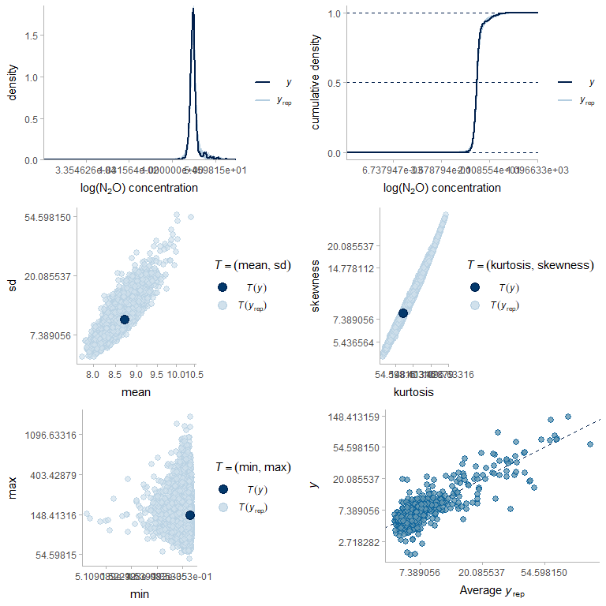

The same check for the re-visit data:

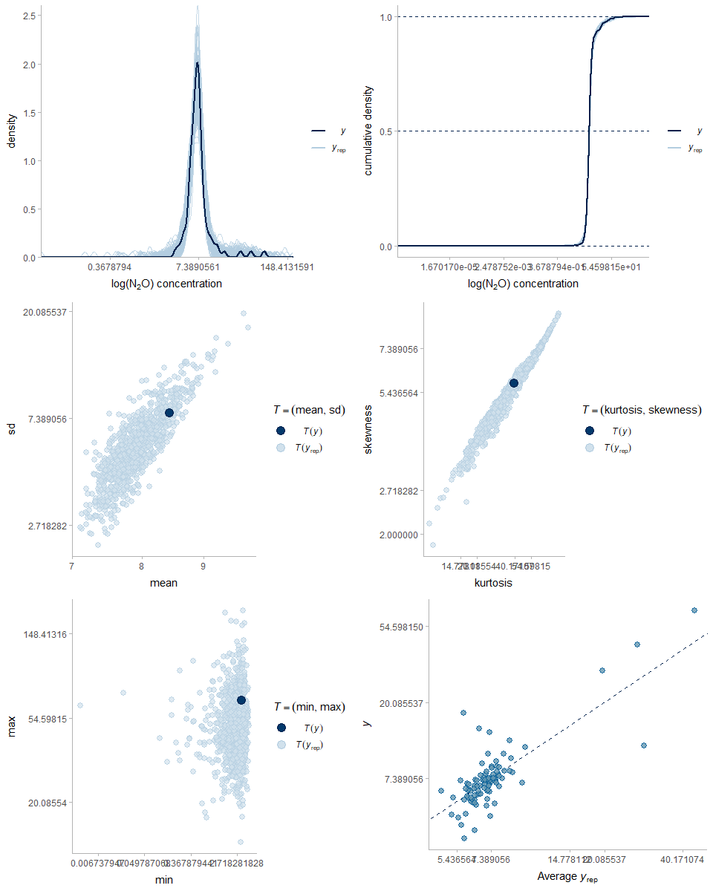

#### 3.6.2.2 Equilibrium N2O

The PPCs for eqilibrium N2O were also similar to the same checks in
models 4 and 5.

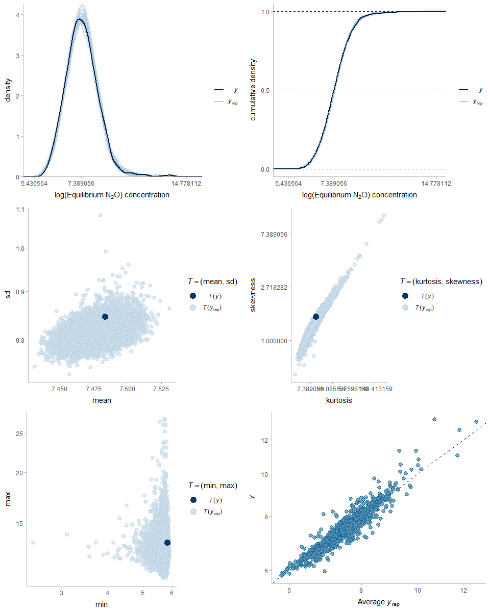

The same check with the re-visit data:

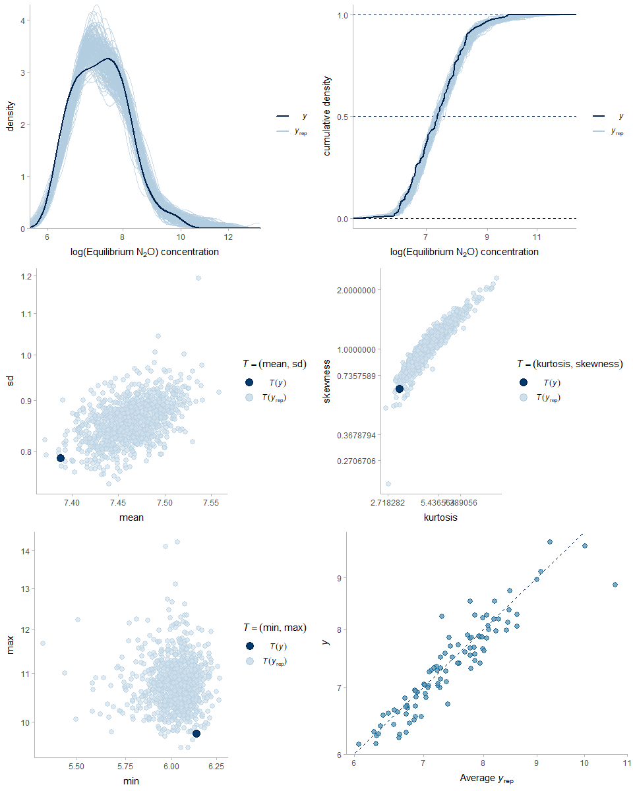

#### 3.6.2.3 Bivariate

This final model provided a reasonable representation of the bivariate
relationship between the two N2O responses.

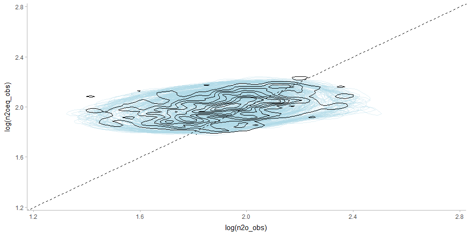

The check with the re-visit data:

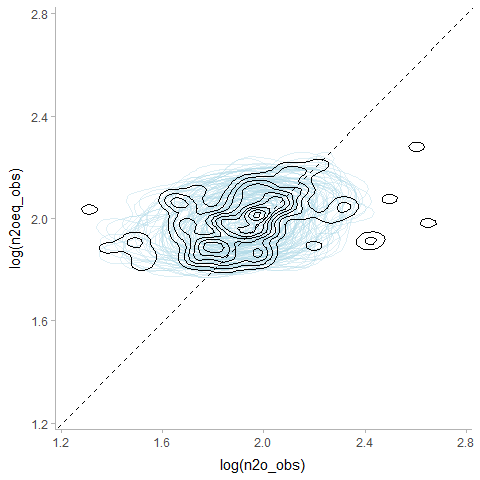

#### 3.6.2.4 Saturation

The saturation ratio PPCs below suggested similar behavior as with
models 4 and 5 above, but with perhaps slightly less bias in the
predictions for the proportion of undersaturated waterbodies and fewer
extreme predictions for the means and standard deviations. The observed
*vs.* predicted PPC also appears to have a better behaved variance and
no extreme predictions, compared to models 4 and 5.

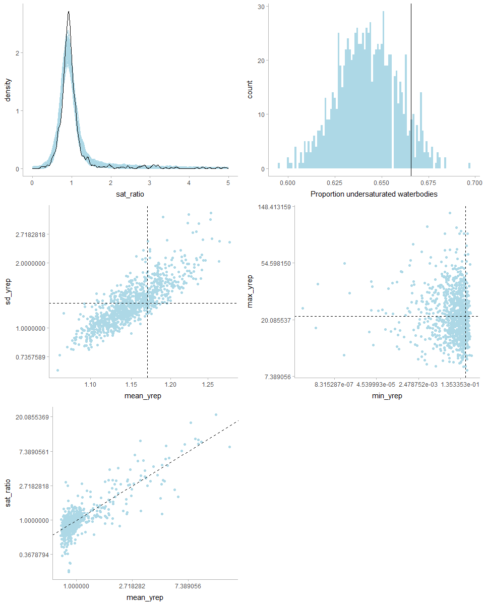

The check for the second-vist data:

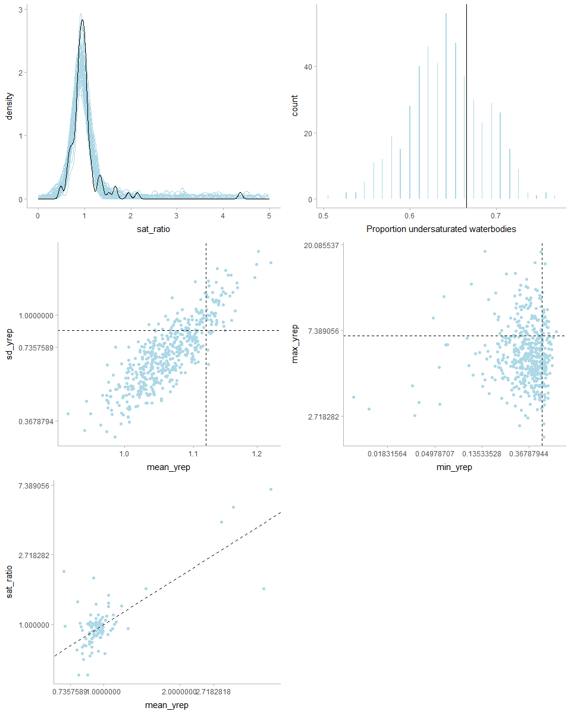

#### 3.6.2.5 R-square

Below are estimates for the Bayesian
,
which were largely similar for the N2O responses as with models 4 and 5
above. The

for the surface temperature response also suggested a good fit.

    ##       Estimate Est.Error  Q2.5 Q97.5
    ## R2n2o    0.646     0.059 0.503 0.731

    ##         Estimate Est.Error  Q2.5 Q97.5
    ## R2n2oeq    0.863     0.006 0.851 0.874

    ##            Estimate Est.Error  Q2.5 Q97.5
    ## R2surftemp    0.652     0.036 0.574 0.718

Below are the

estimates for the second-visit data. That these estimates were similar
to those for the data used to fit the model was encouraging and
suggested that the model may perform reasonably well out-of-sample.

    ##       Estimate Est.Error  Q2.5 Q97.5
    ## R2n2o    0.607     0.137 0.325  0.85

    ##         Estimate Est.Error Q2.5 Q97.5
    ## R2n2oeq    0.857     0.008 0.84 0.872

    ##            Estimate Est.Error  Q2.5 Q97.5
    ## R2surftemp    0.621     0.042 0.535 0.707

### 3.6.3 Covariate effects

#### 3.6.3.1 Dissolved N2O

The conditional effects plot for the covariate effects on dissolved N2O
suggested a similar effect of NO3 as in previous models, but with
interesting potential interactions between NO3 and lake area and NO3 and
surface temperature. The lake area effect was estimated to be larger and
more negative at the highest levels of NO3 and slightly negative at the
lowest level of NO3. The surface temperature effect was estimated to be
largest and positive at the highest level of NO3 and negative at the
lowest level of NO3.

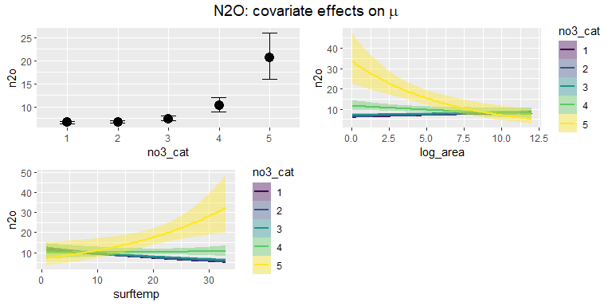

The estimated covariate effects on

for dissolved N2O suggested a negative relationship with log(area) and a
positive relationship with NO3.

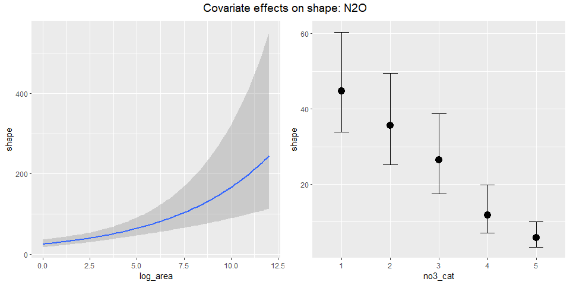

#### 3.6.3.2 Equilibrium N2O

The estimated covariate effects on equilibrium N2O remained largely the
same as estimated in the previous model.

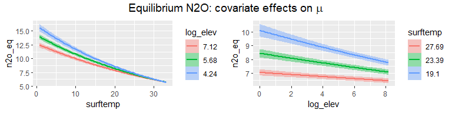

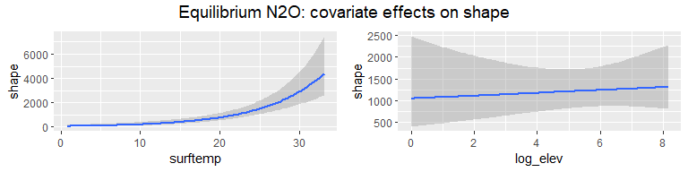

#### 3.6.3.3 Saturation ratio

Below are the estimated conditional effects of the covariates on means
for both n2o responses as well as the implied effects on the mean
saturation ratio.

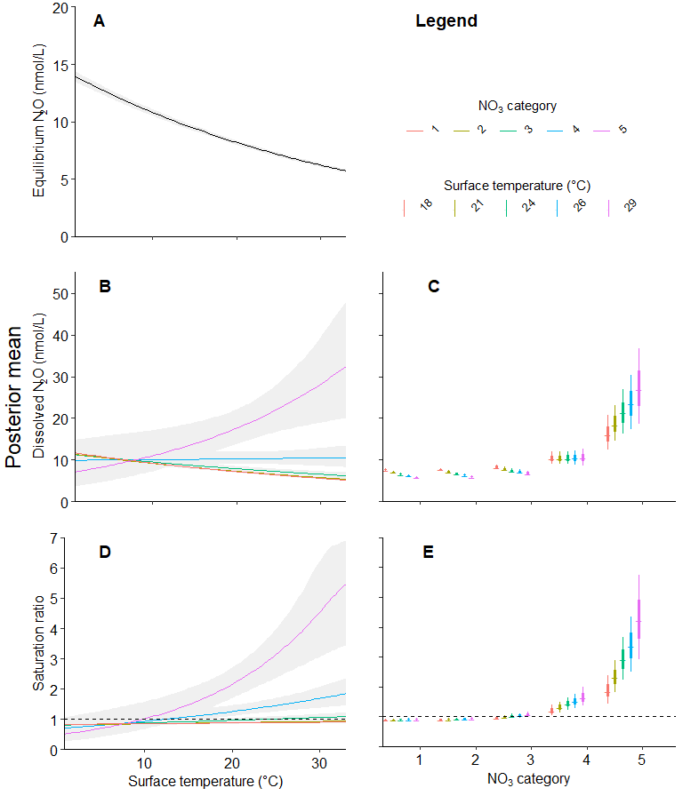

``` r
plt_area_effects
```

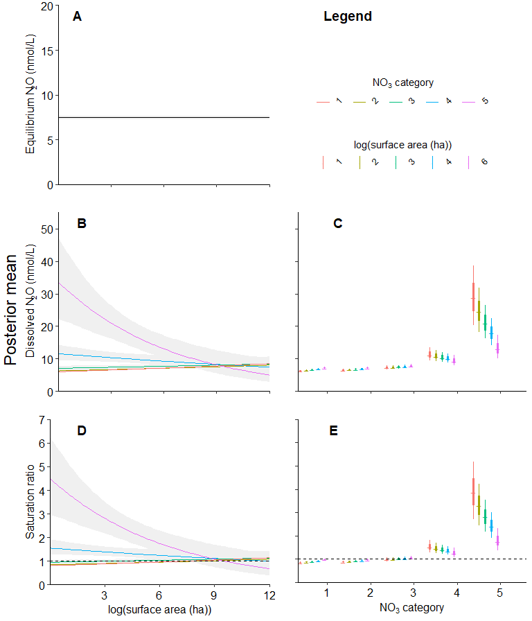

``` r
plt_temp_area_effects
```

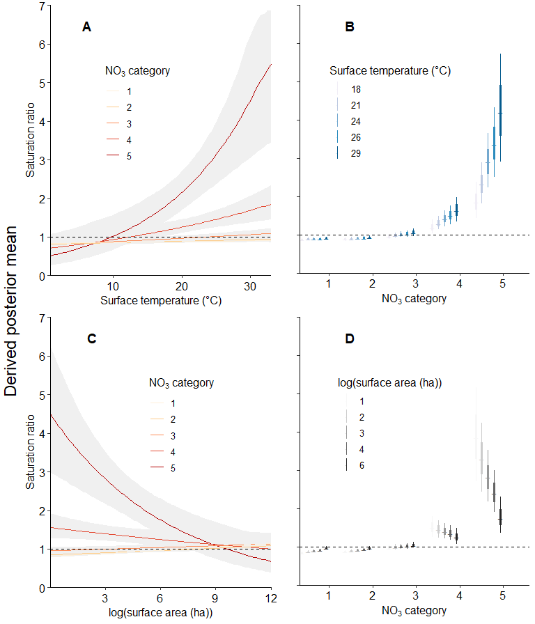

# 4 Predict to population

As mentioned above, in order to make inferences to the population of
interest, the final model above was used to, first, predict surface
temperature in the target population, since it depended only on the
fully observed covariates. Next, the predictive distribution for surface
temperature was used, along with the relevant fully observed covariates,
to predict NO3 in the target population. Finally, the predictive
distributions for temperature and NO3 were used to predict the N2O
responses. The code for these steps is outlined in the following.

The first step used the final model to predict surface temperature to
the population:

``` r
load("C:/Users/rmartin/OneDrive - Environmental Protection Agency (EPA)/Documents/AE_Reservoirs/DissolvedGasNla/modelFiles/sframe.rda")
load("C:/Users/rmartin/OneDrive - Environmental Protection Agency (EPA)/Documents/AE_Reservoirs/DissolvedGasNla/modelFiles/n2o_mod6.rda")

predict_temp <- sframe %>%
  mutate(jdate = 205) %>%
  add_predicted_draws(n2o_mod6, resp=c("surftemp"), 
                      allow_new_levels = TRUE, 
                      cores =1, 
                      ndraws = 2000) %>%
  mutate(surftemp = .prediction)

save(predict_temp, file = "C:/Users/rmartin/OneDrive - Environmental Protection Agency (EPA)/Documents/AE_Reservoirs/DissolvedGasNla/modelFiles/predict_temp_b.rda")
```

NO3 was next predicted using the posterior predictions for surface
temperature and the other fully observed covariates. Note that only one
posterior draw per posterior predictive draw for surface temperature was
used in order to reduce excess simulations.

``` r
temp_X <- predict_temp %>% # select relevant columns as predictors
  ungroup() %>%
  arrange(.draw) %>%
  select(.row, .draw, WSA9, state, size_cat, log_area, log_elev, surftemp)


rm(predict_temp) # reduce memory
gc()

# set number of cores to use for parallel predictions
# and register the workers
cl <- parallel::makeCluster(25)
doSNOW::registerDoSNOW(cl) 

# make a progress bar
pb <- txtProgressBar(max = 2000, 
                     style = 3)
progress <- function(n) setTxtProgressBar(pb, n)
opts <- list(progress = progress)

system.time( # approx x hrs with 25 workers & 1 draw from PPD
predict_no3 <- foreach(sub_X = isplitRows(temp_X, chunkSize = 465897), 
                       .combine = 'c',
                       .packages = c("brms"),
                       .options.snow = opts
                       ) %dopar% {
                         brms::posterior_predict(n2o_mod6,
                                                 newdata = sub_X,
                                                 resp = "no3cat",
                                                 allow_new_levels = T,
                                                 ndraws = 1,
                                                 cores = 1)
                         }
)

close(pb)
parallel::stopCluster(cl)

save(predict_no3, file = "C:/Users/rmartin/OneDrive - Environmental Protection Agency (EPA)/Documents/AE_Reservoirs/DissolvedGasNla/modelFiles/predict_no3_b.rda")
```

Finally, dissolved and equilibrium N2O were predicted using the surface
temperature and NO3 predictions, along with the survey variables and
other fully observed covariates.

``` r
# re-load the temp predictions into memory
load("C:/Users/rmartin/OneDrive - Environmental Protection Agency (EPA)/Documents/AE_Reservoirs/DissolvedGasNla/modelFiles/predict_temp_b.rda")

# Assemble dataframe containing relevant covariates (known and predicted) for predicting N2O responses.
n2o_X <- predict_temp %>%
  ungroup() %>%
  mutate(no3_cat = predict_no3) %>%
  select(WSA9,
         state,
         size_cat,
         log_area,
         surftemp,
         log_elev,
         no3_cat)

rm(predict_temp, predict_no3) # reduce memory

# set number of cores to use for parallel predictions
# and register the workers
cl <- parallel::makeCluster(25) 
doSNOW::registerDoSNOW(cl) 

# make a progress bar
pb <- txtProgressBar(max = 2000, style = 3)
progress <- function(n) setTxtProgressBar(pb, n)
opts <- list(progress = progress)

# make predictions in parallel
system.time(
predict_n2o <- foreach(sub_X = isplitRows(n2o_X, chunkSize = 465897),
                 .combine = rbind,
                 .options.snow = opts,
                 .packages = c("brms")) %dopar% {
  apply(posterior_predict(n2o_mod6,
                          newdata = sub_X,
                          resp = c("n2o", "n2oeq"),
                          allow_new_levels = T,
                          ndraws = 1,
                          cores = 1), 3, t)
                   }
)

close(pb)
parallel::stopCluster(cl)

colnames(predict_n2o) <- c("n2o", "n2oeq")

save(predict_n2o, file = "C:/Users/rmartin/OneDrive - Environmental Protection Agency (EPA)/Documents/AE_Reservoirs/DissolvedGasNla/modelFiles/predict_n2o_b.rda")
```

Finally, the predictions for all four partially observed responses were
assembled into a new dataframe for use in inference:

``` r
load("C:/Users/rmartin/OneDrive - Environmental Protection Agency (EPA)/Documents/AE_Reservoirs/DissolvedGasNla/modelFiles/predict_temp_b.rda")
load("C:/Users/rmartin/OneDrive - Environmental Protection Agency (EPA)/Documents/AE_Reservoirs/DissolvedGasNla/modelFiles/predict_no3_b.rda")
load("C:/Users/rmartin/OneDrive - Environmental Protection Agency (EPA)/Documents/AE_Reservoirs/DissolvedGasNla/modelFiles/predict_n2o_b.rda")

all_predictions <- predict_temp %>%
  ungroup() %>%
  mutate(no3cat = predict_no3) %>%
  bind_cols(predict_n2o) %>%
  mutate(n2osat = n2o / n2oeq, # calculate saturation ratio
         .row = rep(1:465897, each = 500),
         .draw = rep(seq(1,500, 1), 465897)) %>%
  mutate(area_ha = exp(log_area)) %>% # include area on ha scale
  select(WSA9,
         state,
         size_cat,
         area_ha,
         lat,
         lon,
         .row,
         .draw,
         surftemp,
         no3cat,
         n2o,
         n2oeq,
         n2osat)

save(all_predictions, file = "C:/Users/rmartin/OneDrive - Environmental Protection Agency (EPA)/Documents/AE_Reservoirs/DissolvedGasNla/modelFiles/all_predictions_b.rda")
```

# 5 Population estimates

A number of estimates for the target population were assembled and
presented below. First, the full posterior predictive distributions for
dissolved N2O, equilibrium N2O, and the saturation ratio were assessed.
These distributions summarized the predicted distribution of
concentrations or ratios for all lakes in the population of interest and
included parameter uncertainty propagated through the model. Next,
population means were assessed, followed by comparisons of some
model-based estimates to previously calculated design-based estimates.

## 5.1 Posterior predictive distributions

Below, a density plot summarized the posterior predictive distributions
across the target population of lakes. The summaries of the PPDs were
based on 2000 draws. Note that the x-axis was truncated at 50 nmol/L for
a clearer visualization of the bulk of the predictive distribution. For
reference, the max predicted value was 4403.2 nmol/L for dissolved N2O,
20.4 nmol/L for dissolved N2O, and 793.5 for the saturation ratio.

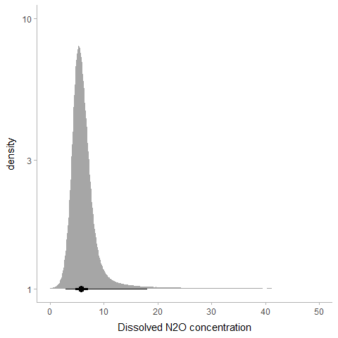

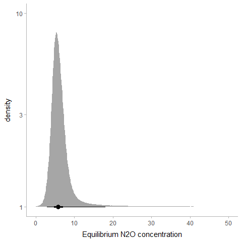

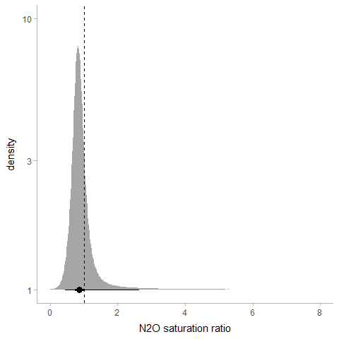

## 5.2 Estimated means

### 5.2.1 National

Below are density plots summarizing the posterior distribution of
*means* for N2O concentrations and the saturation ratio for all US lakes
and reservoirs \> 4ha in the lower 48 states).

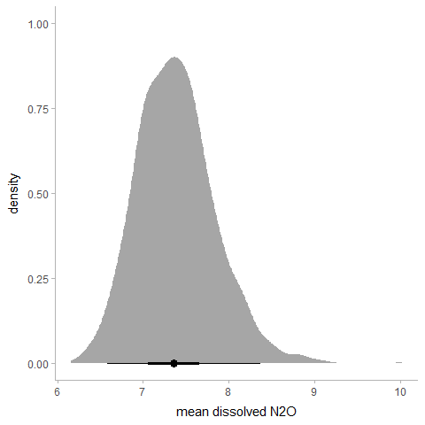

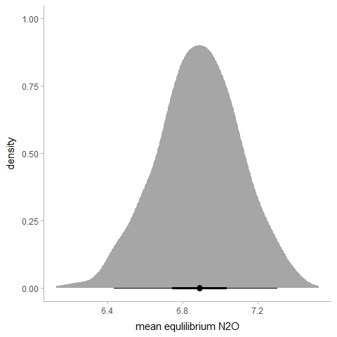

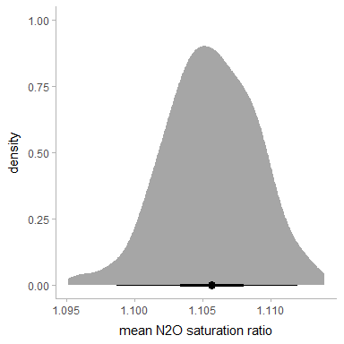

To illustrate the skewness in the predictive distribution for the
saturation ratio, an estimate for the median ratio is shown below. The
entire posterior distribution of the mean above was larger than 1, which
represents the boundary of under- *vs.* oversaturation. By comparison,
the posterior estimate of the median below only included values less
than one, suggesting that though the mean saturation ratio was likely
greater than 1, most lakes in the national population were
undersaturated (i.e., ratio less than 1). In distributions with strong
right-skew, the mean can often be considerably larger than the median.

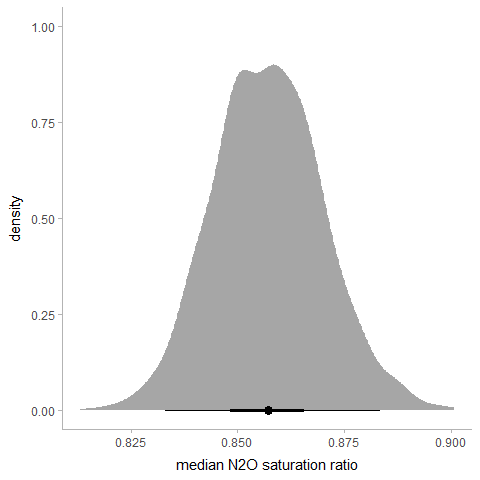

Below is a plot of the posterior mean estimate for the proportion of
unsaturated lakes at the national scale.


### 5.2.2 Ecoregion

Below are posterior estimates of the means for dissolved and equilibrium
N2O and the saturation ratio by WSA9 ecoregion.

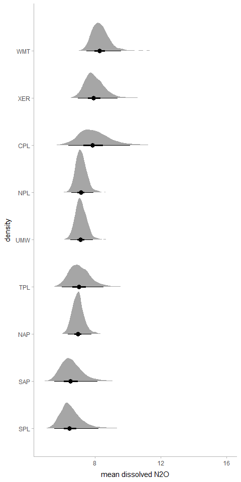

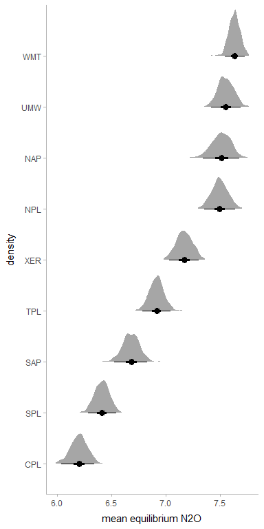

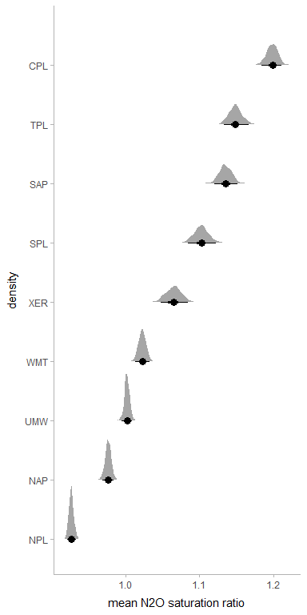

A plot of the posterior estimates for the median saturation ratio below
indicated that most lakes in each ecoregion were undersaturated (i.e.,
median \< 1).

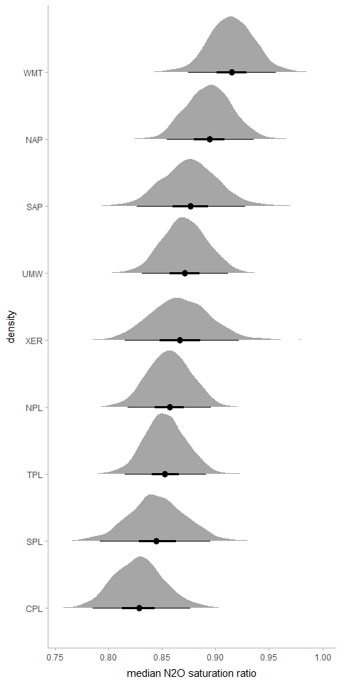

A plot of the estimates of the proportion of under-saturated lakes by
ecoregion is below. These summaries again suggested that most lakes in
each ecoregion were likely undersaturated (i.e., median \<\< 1).

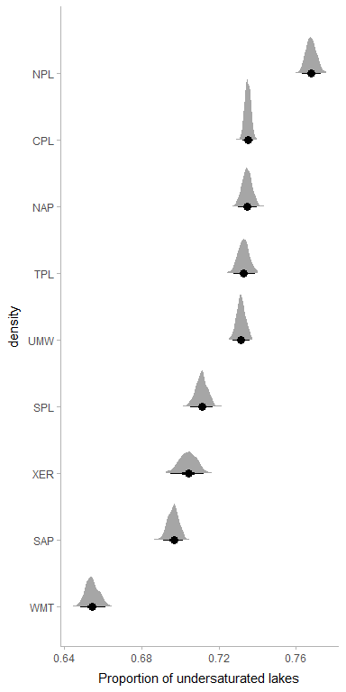

### 5.2.3 State

Comparisons of mean estimates by state are below. Density polygons were
not included to minimize the vertical plot space.

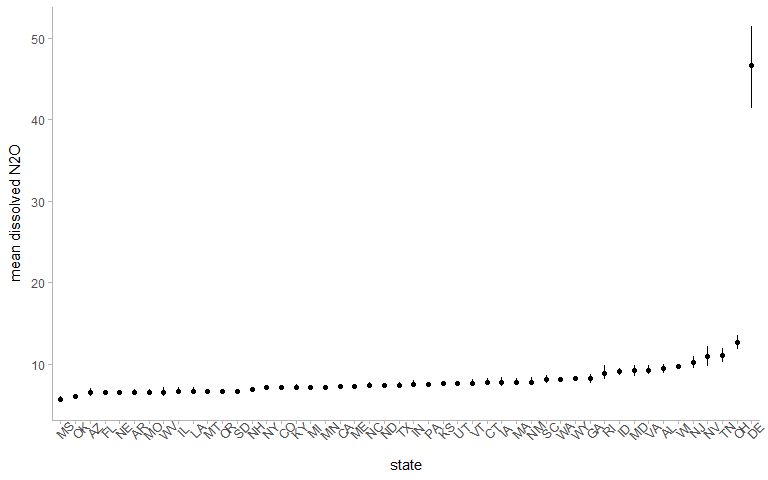

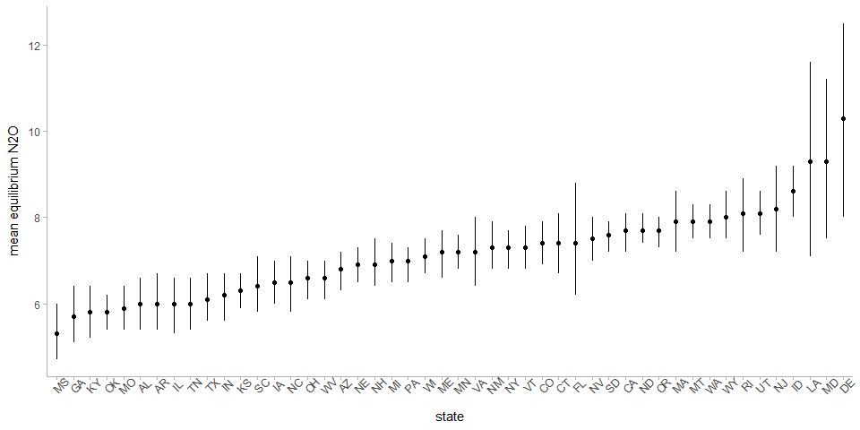

Below is a plot of estimates for the mean (black circles) and median
(grey circles) saturation ratio by state. A horizontal, dashed, black
line is shown at ratio = 1, indicating the boundary for under- *vs.*
oversaturation. Only a few states (e.g., NV, DE) had median estimates
that were 1 or greater, suggesting that, for most states, most lakes
were estimated to be undersaturated.

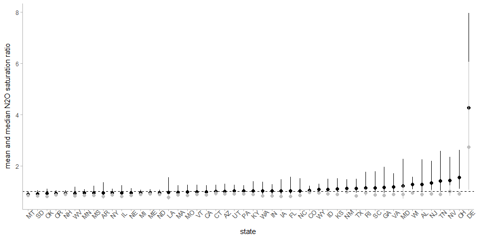

Finally, a plot of the estimated proportion of undersaturated lakes for
each state in the target population. Point estimates are the posterior
median of the proportion and bars are the upper and lower boundaries of
the central 95th percentile of the posterior distributions of
proportions.

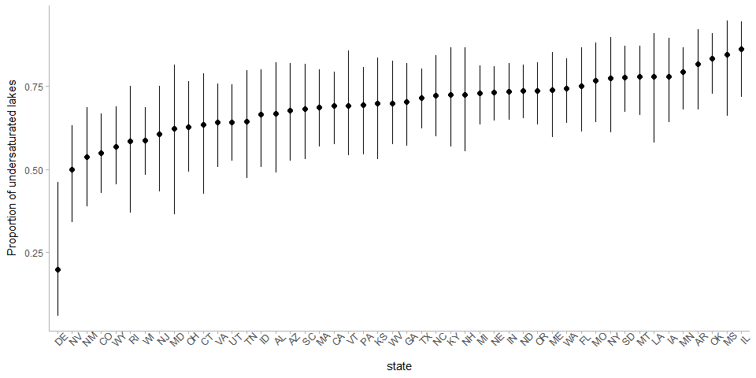

### 5.2.4 Size category

The estimated means and medians by size category are below for dissolved
and equilibrium N2O and the saturation ratio.

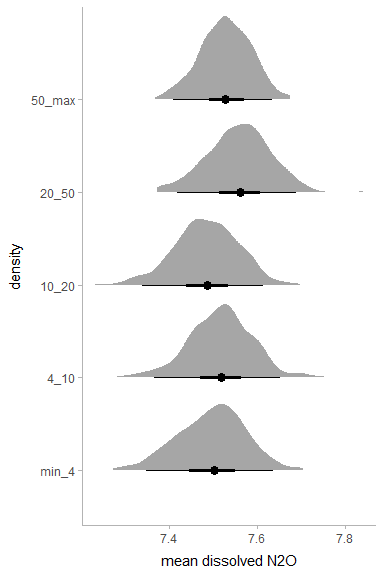

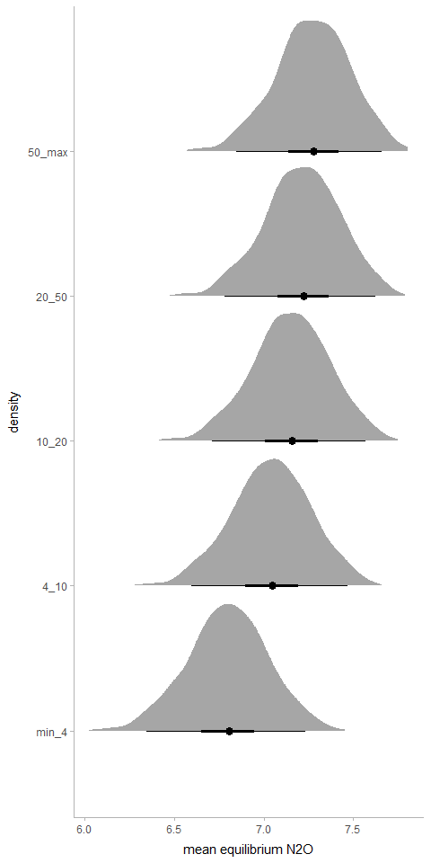

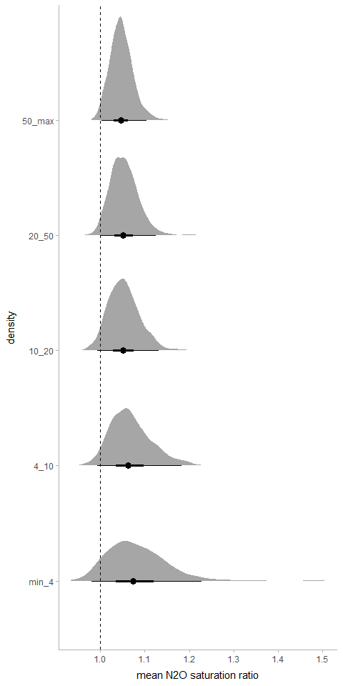

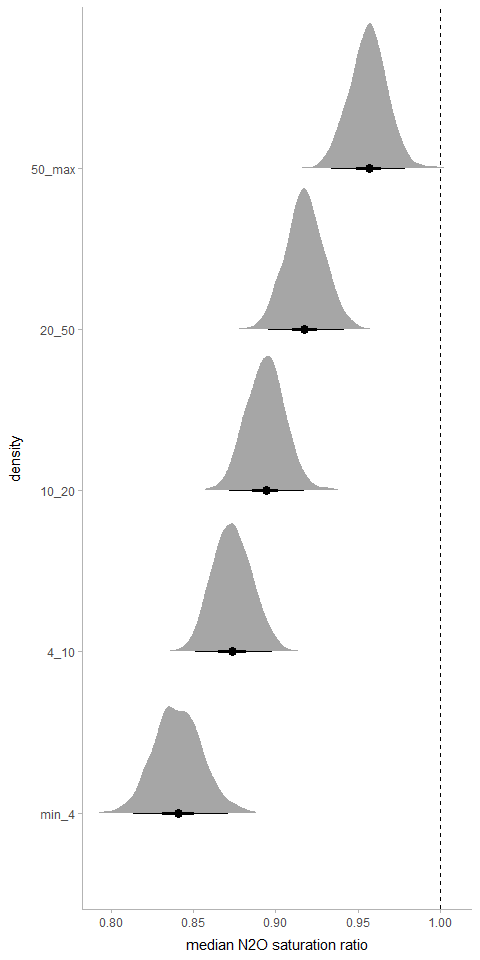

Mean *vs.* median below.

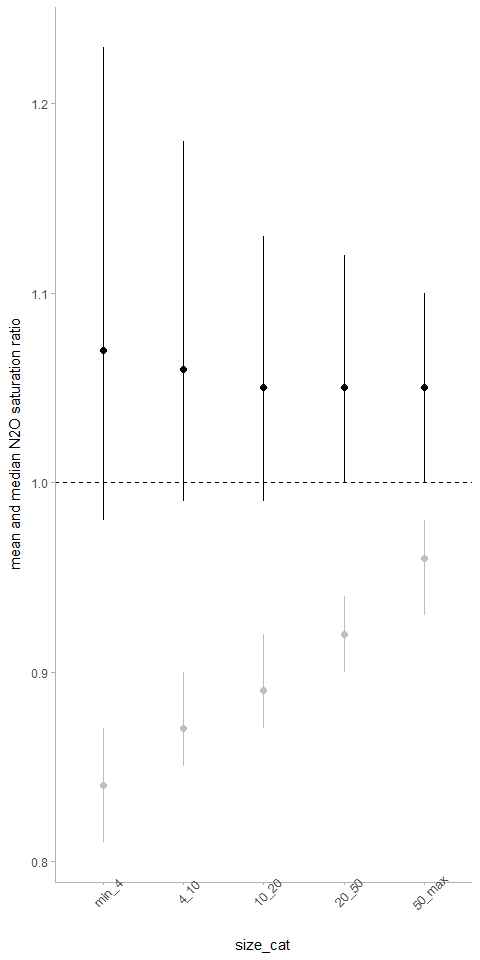

And, finally, the estimated proportion of undersaturated lakes in the
target population by size category.

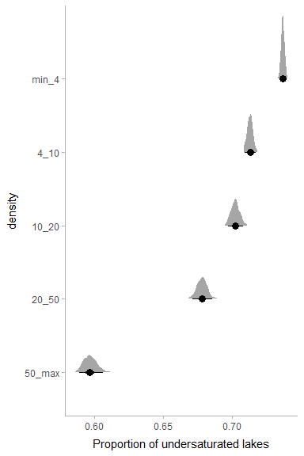

## 5.3 Model- *vs.* design-based

Below, estimates from the model-based approach are compared to
previously calculated, design-based estimates. In general, the
model-based estimates were similar to the design-based estimates. The
model-based estimates were typically within the confidence bounds of the
design-based estimates, but with much greater precision. Improved
precision was expected due to the “shrinkage” induced by the multilevel
parameterization, which affords some “borrowing” of information across
the various levels of the survey factors.

### 5.3.1 Dissolved N2O

Below, National mean estimates for dissolved N2O from the model and
design-based approaches were compared. The sample-based estimate was
also included as a reference. The black, vertical, dashed line indicates
the mean of the sample.

``` r
all_predictions %>%
  group_by(.draw) %>%
  summarise(mean_n2o = mean(n2o)) %>%
  summarise(estimate = round(median(mean_n2o), 2), # posterior median
    LCL = round(quantile(mean_n2o, probs = 0.025), 2),
    UCL = round(quantile(mean_n2o, probs = 0.975), 2)) %>% 
  mutate(type = "model") %>%
  bind_rows(cbind(n2o_survey_ests[10, 2:4], type = rep("survey", 1))) %>%
  add_row(estimate = round(mean(df_model$n2o), 2),
          type = "sample") %>%
  print()
```

    ## # A tibble: 3 x 4
    ##   estimate   LCL   UCL type  
    ##      <dbl> <dbl> <dbl> <chr> 
    ## 1     7.51  7.36  7.63 model 
    ## 2     8.1   7     9.1  survey
    ## 3     8.72 NA    NA    sample

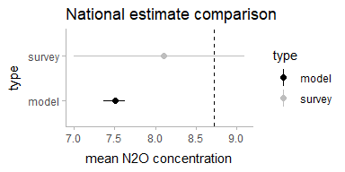

Below, estimates were compared by ecoregion.

``` r
all_predictions %>%
  group_by(WSA9, .draw) %>%
  summarise(mean_n2o = mean(n2o)) %>%
  group_by(WSA9, .groups = "drop") %>%
  summarise(estimate = round(median(mean_n2o), 2),
    LCL = round(quantile(mean_n2o, probs = 0.025), 2),
    UCL = round(quantile(mean_n2o, probs = 0.975), 2),
    .groups = "drop") %>% 
  mutate(ecoregion = factor(WSA9)) %>%
  mutate(type = "model") %>%
  select(ecoregion, estimate, LCL, UCL, type) %>%
  mutate(ecoregion = forcats::fct_reorder(ecoregion, estimate)) %>%
  bind_rows(cbind(n2o_survey_ests[-10,], type = rep("survey", 9))) %>%
  arrange(ecoregion) %>%
  print()
```

    ## # A tibble: 18 x 5
    ##    ecoregion estimate   LCL   UCL type  
    ##    <fct>        <dbl> <dbl> <dbl> <chr> 
    ##  1 NPL           6.95  6.8   7.1  model 
    ##  2 NPL           6.9   6.4   7.4  survey
    ##  3 SPL           7.07  6.84  7.31 model 
    ##  4 SPL           6.5   4.9   8.1  survey
    ##  5 NAP           7.33  7.15  7.5  model 
    ##  6 NAP           7.7   7.2   8.1  survey
    ##  7 CPL           7.49  7.23  7.7  model 
    ##  8 CPL           8.4   5.1  11.7  survey
    ##  9 UMW           7.57  7.43  7.72 model 
    ## 10 UMW          10.8   6.4  15.2  survey
    ## 11 SAP           7.62  7.37  7.85 model 
    ## 12 SAP           7.1   5.9   8.2  survey
    ## 13 XER           7.65  7.41  7.85 model 
    ## 14 XER          10.6   7.5  13.7  survey
    ## 15 WMT           7.8   7.66  7.93 model 
    ## 16 WMT           7.8   7.1   8.4  survey
    ## 17 TPL           7.96  7.76  8.18 model 
    ## 18 TPL           7.8   5.9   9.6  survey

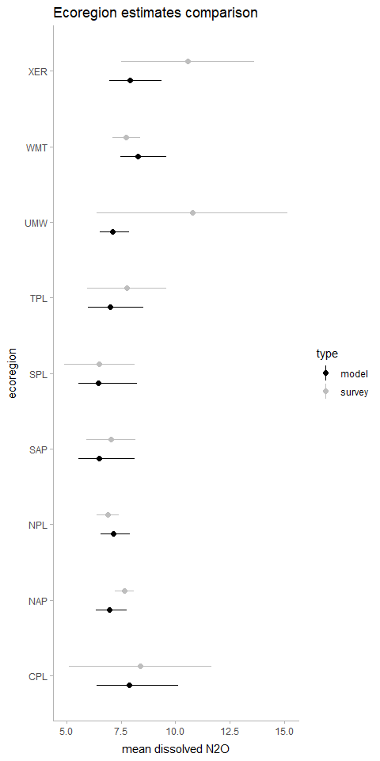

Means were compared according to size categories below.

    ## # A tibble: 10 × 5
    ##    size   estimate   LCL   UCL type  
    ##    <ord>     <dbl> <dbl> <dbl> <chr> 
    ##  1 4_10        7.5   6.8   8.4 model 
    ##  2 4_10        7.6   6.5   8.8 survey
    ##  3 10_20       7.5   6.9   8.2 model 
    ##  4 10_20       7.6   7.1   8.1 survey
    ##  5 min_4       7.3   6.5   8.4 model 
    ##  6 min_4       8.2   6.4   9.9 survey
    ##  7 50_max      7.5   7     8.1 model 
    ##  8 50_max      8     7.4   8.5 survey
    ##  9 20_50       7.5   7     8.2 model 
    ## 10 20_50       8.6   7.7   9.5 survey

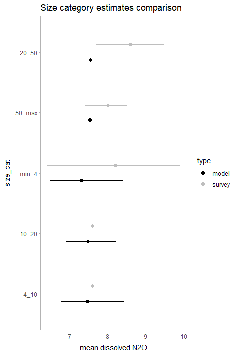

### 5.3.2 Saturation

Below, the same comparisons were made for the saturation estimates.

``` r
all_predictions %>%
  group_by(.draw) %>%
  summarise(mean_sat = mean(n2osat), .groups = "drop") %>%
  summarise(estimate = round(median(mean_sat), 3),
    LCL = round(quantile(mean_sat, probs = 0.025), 3),
    UCL = round(quantile(mean_sat, probs = 0.975), 3),
    .groups = "drop") %>% 
  mutate(type = "model") %>%
  bind_rows(cbind(sat_survey_ests[10, 2:4], type = rep("survey", 1))) %>%
  add_row(estimate = round(mean(df_model$n2o / df_model$n2o_eq), 3),
          type = "sample") %>%
  print()
```

    ## # A tibble: 3 × 4
    ##   estimate    LCL   UCL type  
    ##      <dbl>  <dbl> <dbl> <chr> 
    ## 1     1.07  0.988  1.20 model 
    ## 2     1.10  0.952  1.24 survey
    ## 3     1.17 NA     NA    sample

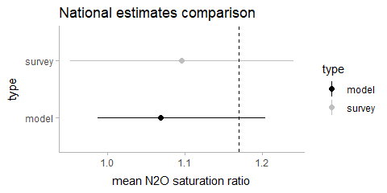

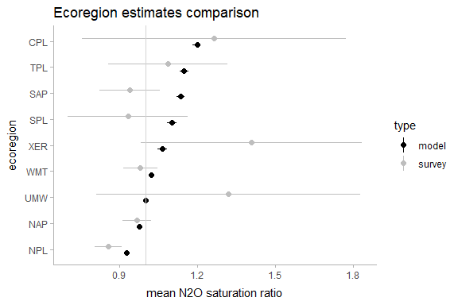

    ## # A tibble: 10 × 5
    ##    size   estimate   LCL   UCL type  
    ##    <ord>     <dbl> <dbl> <dbl> <chr> 
    ##  1 min_4      1.07 0.98   1.23 model 
    ##  2 min_4      1.12 0.874  1.37 survey
    ##  3 4_10       1.06 0.993  1.18 model 
    ##  4 4_10       1.02 0.889  1.15 survey
    ##  5 10_20      1.05 0.993  1.13 model 
    ##  6 10_20      1.02 0.956  1.08 survey
    ##  7 20_50      1.05 1.00   1.12 model 
    ##  8 20_50      1.14 1.02   1.27 survey
    ##  9 50_max     1.05 1.00   1.10 model 
    ## 10 50_max     1.06 0.987  1.12 survey

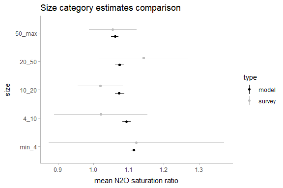

# 6 Session Info

``` r
sessionInfo()
```

    ## R version 4.3.0 (2023-04-21 ucrt)
    ## Platform: x86_64-w64-mingw32/x64 (64-bit)
    ## Running under: Windows 11 x64 (build 22621)
    ## 
    ## Matrix products: default
    ## 
    ## 
    ## locale:
    ## [1] LC_COLLATE=English_United States.utf8 
    ## [2] LC_CTYPE=English_United States.utf8   
    ## [3] LC_MONETARY=English_United States.utf8
    ## [4] LC_NUMERIC=C                          
    ## [5] LC_TIME=English_United States.utf8    
    ## 
    ## time zone: America/New_York
    ## tzcode source: internal
    ## 
    ## attached base packages:
    ## [1] stats     graphics  grDevices utils     datasets  methods   base     
    ## 
    ## other attached packages:
    ##  [1] arrow_12.0.1.1   tictoc_1.2       brms_2.19.0      Rcpp_1.0.10     
    ##  [5] tidybayes_3.0.4  bayesplot_1.10.0 itertools_0.1-3  iterators_1.0.14
    ##  [9] foreach_1.5.2    future_1.32.0    lubridate_1.9.2  forcats_1.0.0   
    ## [13] stringr_1.5.0    purrr_1.0.1      readr_2.1.4      tidyr_1.3.0     
    ## [17] tibble_3.2.1     tidyverse_2.0.0  dplyr_1.1.2      ggrepel_0.9.3   
    ## [21] kableExtra_1.3.4 gridExtra_2.3    ggExtra_0.10.0   moments_0.14.1  
    ## [25] ggpubr_0.6.0     ggplot2_3.4.2   
    ## 
    ## loaded via a namespace (and not attached):
    ##   [1] jsonlite_1.8.8       tensorA_0.36.2       rstudioapi_0.14     
    ##   [4] magrittr_2.0.3       farver_2.1.1         rmarkdown_2.21      
    ##   [7] vctrs_0.6.2          base64enc_0.1-3      rstatix_0.7.2       
    ##  [10] webshot_0.5.4        htmltools_0.5.5      distributional_0.3.2
    ##  [13] broom_1.0.4          StanHeaders_2.32.5   parallelly_1.36.0   
    ##  [16] htmlwidgets_1.6.2    plyr_1.8.8           zoo_1.8-12          
    ##  [19] igraph_1.5.0         mime_0.12            lifecycle_1.0.3     
    ##  [22] pkgconfig_2.0.3      colourpicker_1.2.0   Matrix_1.5-4        
    ##  [25] R6_2.5.1             fastmap_1.1.1        shiny_1.7.4         
    ##  [28] digest_0.6.31        colorspace_2.1-0     ps_1.7.5            
    ##  [31] crosstalk_1.2.0      labeling_0.4.2       fansi_1.0.4         
    ##  [34] timechange_0.2.0     mgcv_1.8-42          httr_1.4.6          
    ##  [37] abind_1.4-5          compiler_4.3.0       bit64_4.0.5         
    ##  [40] withr_2.5.0          backports_1.4.1      inline_0.3.19       
    ##  [43] shinystan_2.6.0      carData_3.0-5        highr_0.10          
    ##  [46] QuickJSR_1.1.0       pkgbuild_1.4.0       ggsignif_0.6.4      
    ##  [49] gtools_3.9.4         loo_2.6.0            tools_4.3.0         
    ##  [52] httpuv_1.6.10        threejs_0.3.3        glue_1.6.2          
    ##  [55] callr_3.7.3          nlme_3.1-162         promises_1.2.0.1    
    ##  [58] grid_4.3.0           checkmate_2.2.0      reshape2_1.4.4      
    ##  [61] generics_0.1.3       diffobj_0.3.5        gtable_0.3.3        
    ##  [64] tzdb_0.3.0           hms_1.1.3            xml2_1.3.4          
    ##  [67] car_3.1-2            utf8_1.2.3           pillar_1.9.0        
    ##  [70] ggdist_3.3.0         markdown_1.6         posterior_1.4.1     
    ##  [73] later_1.3.1          splines_4.3.0        lattice_0.21-8      
    ##  [76] bit_4.0.5            tidyselect_1.2.0     miniUI_0.1.1.1      
    ##  [79] knitr_1.42           arrayhelpers_1.1-0   svglite_2.1.1       
    ##  [82] stats4_4.3.0         xfun_0.39            bridgesampling_1.1-2
    ##  [85] matrixStats_1.0.0    DT_0.28              rstan_2.32.5        
    ##  [88] stringi_1.7.12       yaml_2.3.7           evaluate_0.21       
    ##  [91] codetools_0.2-19     cli_3.6.1            RcppParallel_5.1.7  
    ##  [94] shinythemes_1.2.0    xtable_1.8-4         systemfonts_1.0.4   
    ##  [97] munsell_0.5.0        processx_3.8.1       globals_0.16.2      
    ## [100] coda_0.19-4          svUnit_1.0.6         parallel_4.3.0      
    ## [103] rstantools_2.3.1     ellipsis_0.3.2       assertthat_0.2.1    
    ## [106] prettyunits_1.1.1    dygraphs_1.1.1.6     Brobdingnag_1.2-9   
    ## [109] listenv_0.9.0        viridisLite_0.4.2    mvtnorm_1.2-2       
    ## [112] scales_1.2.1         xts_0.13.1           crayon_1.5.2        
    ## [115] rlang_1.1.1          cowplot_1.1.1        rvest_1.0.3         
    ## [118] shinyjs_2.1.0

# 7 References

<div id="refs" class="references csl-bib-body hanging-indent">

<div id="ref-Bafumi_Gelman_2007" class="csl-entry">

Bafumi, Joseph, and Andrew Gelman. 2007. “Fitting Multilevel Models When
Predictors and Group Effects Correlate.” Journal Article. *Social
Science Research Network*, 1–14. <https://ssrn.com/abstract=1010095>.

</div>

<div id="ref-Burkner_2017" class="csl-entry">

Bürkner, Paul-Christian. 2017. “Brms: An r Package for Bayesian
Multilevel Models Using Stan.” Journal Article. *2017* 80 (1): 28.
<https://doi.org/10.18637/jss.v080.i01>.

</div>

<div id="ref-Gelman_etal_2014" class="csl-entry">

Gelman, Andrew, John B. Carlin, Hal S. Stern, David B. Dunson, Aki
Vehtari, and Donald B. Rubin. 2014. *Bayesian Data Analysis*. Book. 4th
ed. New York: CRC Press.

</div>

<div id="ref-Gelman_etal_2020" class="csl-entry">

Gelman, Andrew, Jennifer Hill, and Aki. Vehtari. 2020. *Regression and
Other Stories: Analytical Methods for Social Research*. Book. 1st ed.
Cambridge: CRC Press.

</div>

<div id="ref-Gelman_Little_1997" class="csl-entry">

Gelman, Andrew, and Thomas Little. 1997. “Postratification into Many
Categories Using Hierarchical Logistic Regression.” Journal Article.
*Survey Methodology* 23 (2): 127–35.

</div>

<div id="ref-Kastellec_etal_2015" class="csl-entry">

Kennedy, Lauren, and Andrew Gelman. 2015. “Polarizing the Electoral
Connection: Partisan Representation in Supreme Court Confirmation
Politics.” Journal Article. *The Journal of Politics* 77 (3): 787–804.
<https://psycnet.apa.org/doi/10.1037/met0000362>.

</div>

<div id="ref-Kennedy_Gelman_2021" class="csl-entry">

———. 2021. “Know Your Population and Know Your Model: Using Model-Based
Regression and Poststratification to Generalize Findings Beyond the
Observed Sample.” Journal Article. *Psychological Methods* 26 (5):
547–58. <https://psycnet.apa.org/doi/10.1037/met0000362>.

</div>

<div id="ref-McElreath_2020" class="csl-entry">

McElreath, Richard. 2020. *Statistical Rethinking: A Bayesian Course
with Examples in r and Stan*. Book. 2nd ed. Boca Raton: CRC Press.

</div>

<div id="ref-Merkle_etal_2021" class="csl-entry">

Merkle, Edgar C., Ellen Fitzsimmons, James Uanhoro, and Ben Goodrich.
2021. “Efficient Bayesian Structural Equation Modeling in Stan.” Journal
Article. *Journal of Statistical Software* 100 (6): 1–22.
https://doi.org/<https://doi.org/10.18637/jss.v100.i06>.

</div>

<div id="ref-Merkle_Rosseel_2018" class="csl-entry">

Merkle, Edgar C., and Yves Rosseel. 2018. “Blavaan: Bayesian Structural
Equation Models via Parameter Expansion.” Journal Article. *Journal of
Statistical Software* 85 (4): 1–30.
https://doi.org/<https://doi.org/10.18637/jss.v085.i04>.

</div>

<div id="ref-Park_etal_2004" class="csl-entry">

Park, David K., Andrew Gelman, and Joseph Bafumi. 2004. “Bayesian
Multilevel Estimation with Poststratification: State-Level Estimates
from National Polls.” Journal Article. *Political Analysis* 12 (4):
375–85. <https://doi.org/10.1093/pan/mph024>.

</div>

<div id="ref-Poggiato_etal_2021" class="csl-entry">

Poggiato, Giovanni, Tamara Munkemuller, Daria Bystrova, Julyan Arbel,
James S. Clark, and Wilfried Thuiller. 2021. “On the Interpretations of
Joint Modeling in Community Ecology.” Journal Article. *Trends in
Ecology & Evolution* 36 (5): 391–401.
https://doi.org/<https://doi.org/10.1016/j.tree.2021.01.002>.

</div>

<div id="ref-R_Core_Team_2021" class="csl-entry">

R Core Team. 2021. *R: A Language and Environment for Statistical
Computing*. Vienna, Austria: R Foundation for Statistical Computing.
<https://www.R-project.org/>.

</div>

<div id="ref-Stan_Development_Team_2018_c" class="csl-entry">

Stan Development Team. 2018a. “RStan: The r Interface to Stan.” Journal
Article. <http://mc-stan.org>.

</div>

<div id="ref-Stan_Development_Team_2018_a" class="csl-entry">

———. 2018b. “Stan Modeling Language Users Guide and Reference Manual,
Version 2.18.0.” Journal Article. <http://mc-stan.org>.

</div>

<div id="ref-Stan_Development_Team_2018_b" class="csl-entry">

———. 2018c. “The Stan Core Library, Version 2.18.0.” Journal Article.
<http://mc-stan.org>.

</div>

<div id="ref-USEPA_NLA_DESIGN_2017" class="csl-entry">

U.S. EPA. 2015. “National Lakes Assessment 2017 Survey Design.” Report.
<https://www.epa.gov/sites/default/files/2020-08/documents/nla2017_design_documentation_20150928.pdf>.

</div>

<div id="ref-Warton_etal_2015" class="csl-entry">

Warton, David I., Guillame F. Blanchet, Robert B. O’Hara, Otso
Ovaskainen, Sara Taskinen, Steven C. Walker, and Francis K. C. Hui.
2015. “So Many Variables: Joint Modeling in Community Ecology.” Journal
Article. *Trends in Ecology & Evolution* 30 (12): 766–79.
https://doi.org/<https://doi.org/10.1016/j.tree.2015.09.007.>

</div>

<div id="ref-Webb_etal_2019" class="csl-entry">

Webb, Jackie R., Nicole M. Hayes, Gavin L. Simpson, Peter R. Leavitt,
Helen M. Baulch, and Kerri Finlay. 2019. “Widespread Nitrous Oxide
Undersaturation in Farm Waterbodies Creates an Unexpected Greenhouse Gas
Sink.” Journal Article. *Proceedings of the National Academy of
Sciences* 116 (20): 9814–19. <https://doi.org/10.1073/pnas.1820389116>.

</div>

<div id="ref-Zachmann_etal_2022" class="csl-entry">

Zachmann, Luke J., Erin M. Borgman, Dana L. Witwicki, Megan C. Swan,
Cheryl McIntyre, and N. Thompson Hobbs. 2022. “Bayesian Models for
Analysis of Inventory and Monitoring Data with Non-Ignorable
Missingness.” Journal Article. *Journal of Agricultural, Biological and
Environmental Statistics* 27: 125–48.
https://doi.org/<https://doi.org/10.1007/s13253-021-00473-z>.

</div>

</div>
