Modeling workflow: Lake
 survey data
================
Roy Martin, Jake Beaulieu, Michael McManus
2023-03-08

-   [1 Background and Objectives](#1-background-and-objectives)
-   [2 Data](#2-data)
    -   [2.1 Import](#21-import)
    -   [2.2 Target population](#22-target-population)
    -   [2.3 Sample vs. population](#23-sample-vs-population)
    -   [2.4 Sample-based estimates](#24-sample-based-estimates)
    -   [2.5 Sample data exploration](#25-sample-data-exploration)
-   [3 Model fitting](#3-model-fitting)
    -   [3.1 Model 1](#31-model-1)
        -   [3.1.1 Summarize fit](#311-summarize-fit)
        -   [3.1.2 Model checks](#312-model-checks)
            -   [3.1.2.1 Dissolved N2O](#3121-dissolved-n2o)
            -   [3.1.2.2 Equilibrium N2O](#3122-equilibrium-n2o)
            -   [3.1.2.3 Bivariate](#3123-bivariate)
            -   [3.1.2.4 Saturation](#3124-saturation)
            -   [3.1.2.5 R-square](#3125-r-square)
    -   [3.2 Model 2](#32-model-2)
        -   [3.2.1 Summarize fit](#321-summarize-fit)
        -   [3.2.2 Model checks](#322-model-checks)
            -   [3.2.2.1 Equilibrium N2O](#3221-equilibrium-n2o)
            -   [3.2.2.2 Bivariate](#3222-bivariate)
            -   [3.2.2.3 Saturation](#3223-saturation)
            -   [3.2.2.4 R-square](#3224-r-square)
    -   [3.3 Model 3](#33-model-3)
        -   [3.3.1 Summarize fit](#331-summarize-fit)
        -   [3.3.2 Model checks](#332-model-checks)
            -   [3.3.2.1 Dissolved N2O](#3321-dissolved-n2o)
            -   [3.3.2.2 Equilibrium N2O](#3322-equilibrium-n2o)
            -   [3.3.2.3 Bivariate](#3323-bivariate)
            -   [3.3.2.4 Saturation](#3324-saturation)
            -   [3.3.2.5 R-square](#3325-r-square)
        -   [3.3.3 Covariate effects](#333-covariate-effects)
            -   [3.3.3.1 Equilibrium N2O](#3331-equilibrium-n2o)
    -   [3.4 Model 4](#34-model-4)
        -   [3.4.1 Summarize fit](#341-summarize-fit)
        -   [3.4.2 Model checks](#342-model-checks)
            -   [3.4.2.1 Equilibrium N2O](#3421-equilibrium-n2o)
            -   [3.4.2.2 Bivariate](#3422-bivariate)
            -   [3.4.2.3 Saturation](#3423-saturation)
            -   [3.4.2.4 R-square](#3424-r-square)
        -   [3.4.3 Covariate effects](#343-covariate-effects)
            -   [3.4.3.1 Dissolved N2O](#3431-dissolved-n2o)
            -   [3.4.3.2 Equilibrium N2O](#3432-equilibrium-n2o)
    -   [3.5 Model 5](#35-model-5)
        -   [3.5.1 Summarize fit](#351-summarize-fit)
        -   [3.5.2 Model checks](#352-model-checks)
            -   [3.5.2.1 Equilibrium N2O](#3521-equilibrium-n2o)
            -   [3.5.2.2 Bivariate](#3522-bivariate)
            -   [3.5.2.3 Saturation](#3523-saturation)
            -   [3.5.2.4 R-square](#3524-r-square)
        -   [3.5.3 Covariate effects](#353-covariate-effects)
            -   [3.5.3.1 Dissolved N2O](#3531-dissolved-n2o)
            -   [3.5.3.2 Equilibrium N2O](#3532-equilibrium-n2o)
    -   [3.6 A Final Model](#36-a-final-model)
        -   [3.6.1 Summarize fit](#361-summarize-fit)
        -   [3.6.2 Model checks](#362-model-checks)
            -   [3.6.2.1 Equilibrium N2O](#3621-equilibrium-n2o)
            -   [3.6.2.2 Bivariate](#3622-bivariate)
            -   [3.6.2.3 Saturation](#3623-saturation)
            -   [3.6.2.4 R-square](#3624-r-square)
        -   [3.6.3 Covariate effects](#363-covariate-effects)
            -   [3.6.3.1 Dissolved N2O](#3631-dissolved-n2o)
            -   [3.6.3.2 Equilibrium N2O](#3632-equilibrium-n2o)
-   [4 Predict to population](#4-predict-to-population)
-   [5 Population estimates](#5-population-estimates)
    -   [5.1 Posterior predictive
        distributions](#51-posterior-predictive-distributions)
    -   [5.2 Estimated means](#52-estimated-means)
        -   [5.2.1 National](#521-national)
        -   [5.2.2 Ecoregion](#522-ecoregion)
        -   [5.2.3 State](#523-state)
        -   [5.2.4 Size category](#524-size-category)
    -   [5.3 Model- *vs.* design-based](#53-model--vs-design-based)
        -   [5.3.1 Dissolved N2O](#531-dissolved-n2o)
        -   [5.3.2 Saturation](#532-saturation)
-   [6 Session Info](#6-session-info)
-   [7 References](#7-references)

# 1 Background and Objectives

This document details the modeling workflow implemented for estimating
dissolved and equilibrium N2O gas concentrations and saturation ratios
for a targeted population of US lakes, which included all freshwater
lakes and reservoirs in the lower 48 US states larger than 4 ha. Data
for these estimates came from the 2017 Nation Lakes Assessment (NLA)
survey, wherein waterbodies were sampled according to a stratified,
unequal probability design. Sampling was random within categories of
lake size (surface area in hectares), WSA9 ecoregion, and US state
(excluding AK and HI). In addition, larger lakes were intentionally
over-sampled in proportion to smaller lakes. In order to make inferences
from this sample to the population of interest, the estimates needed to
be adjusted according to these factors.

The “Complete Data Likelihood” is a useful conceptualization for
describing how biases arise in sampling ([Link and Barker
2010](#ref-Link_Barker_2010); [Zachmann et al.
2022](#ref-Zachmann_etal_2022)). For the 2017 NLA survey, the complete
data, or population of interest, was all US lakes and reservoirs in the
lower 48 states larger than 4 hectares. In this context, the survey
samples were considered a subset of the complete data. Due to the
pattern of selection assigned by the survey, some lakes of certain
categories (e.g., small lakes) in the target population were missing
from the sample not at random, but conditional on the unequal
probability design. This type of non-random “missingness” is not
ignorable when making inferences from a sample to a population of
interest, as it can lead to biased estimates ([Gelman et al.
2014](#ref-Gelman_etal_2014), Ch. 8).

A relatively simple, model-based strategy to account for this type of
selection bias is to include the survey design variables as predictors
in a regression model and then poststratify the estimates based on a
known target population distribution; an adjustment procedure often
referred to as multilevel regression and poststratification (MRP, [Park,
Gelman, and Bafumi 2004](#ref-Park_etal_2004); [Gelman and Little
1997](#ref-Gelman_Little_1997); [Gelman, Hill, and Vehtari
2020](#ref-Gelman_etal_2020), Ch. 17). With a stratified design, such as
the one used for the 2017 NLA, the selection scheme results in
pre-specified groupings within which samples may be drawn at random.
Within a particular grouping or stratification, the selected
observations would be considered a simple random sample (SRS) from that
group’s population. A regression model conditioning the responses on
that grouping structure would then result in group-specific estimates
that are unbiased with respect to the groups. To make make unbiased
inferences to a broader population of interest, those regression
estimates may be re-weighted by the known distribution of units from
those same groups in a broader target population. That distribution may
be summarized in a poststratification table, which, for the 2017 NLA
survey, could be a cross-tabulation of lakes in the target population
along the design variables: ecoregion, state, and size category. Thus, a
regression model conditioning on this design would provide estimates for
groups of lakes described by a size classification within a particular
state and ecoregion. To adjust the regression estimates to an estimate
for the population of interest (e.g., all US lakes larger than 4 ha),
those group-specific regression estimates from the sample would be
re-weighted based on the proportional distribution of lakes in those
groups in the target population. For a recent applied example and
tutorial, see Kennedy and Gelman ([2021](#ref-Kennedy_Gelman_2021)). For
an example of a recent application in the context of national surveys of
environmental resources, see Zachmann et al.
([2022](#ref-Zachmann_etal_2022)).

To make population-level estimates from the 2017 NLA dissolved gas data,
a model-based approach, similar to those referenced above, was followed.
The specific workflow, data, models, and code used to make these
estimates are documented in the remainder of this document. First,
Bayesian multilevel regression models were used to fit the sample data
to the design variable structure. Multilevel models are often
recommended in this type of survey estimation because they provide
regularized estimates along the design groupings, which can improve
out-of-sample inferences (e.g., [Gelman and Little
1997](#ref-Gelman_Little_1997); [Kennedy and Gelman
2021](#ref-Kennedy_Gelman_2021)). Inferences for group levels that may
be missing from the sample, but are part of the population of interest
are also straightforward using this approach ([Gelman, Hill, and Vehtari
2020](#ref-Gelman_etal_2020) Ch. 17; [McElreath
2020](#ref-McElreath_2020)). The second step is typically a simple
poststratification of the sample-based estimates over a table of target
population weights. However, the estimates ultimately needed to be
useful for estimating the total gas flux at the population level, which
required lake level estimates. That is, flux estimates were dependent on
lake-level measures of surface area. Therefore, instead of predicting to
a postratification table, predictions were made to each individual lake
in the population of interest. This meant predicting to 465,897
individual natural and man made US lakes larger than 4 hectares in the
lower 48 states. These predictions were assumed relevant to average
conditions during the biological index period for each lake in 2017.

The specific objectives of the modeling effort were to provide
population level estimates for (1) dissolved and equilibrium N2O
concentrations; (2) the N2O saturation ratio (i.e., dissolved
N2O/equilibrium N2O); and (3) the proportion of under-saturated water
bodies (i.e., saturation ratio \< 1). The gas estimates would also be
subsequently used to estimate the total flux of N2O gas attributable to
the target population of lakes over the index period. The saturation
ratio estimates were modeled as a derived quantity from the joint model
of dissolved and equilibrium N2O and were calculated as the ratio of
modeled dissolved to equilibrium N2O. Because dissolved and equilibrium
N2O were observed on the same sample units (lake sites), models for
estimating their joint distribution were used. That is, the response
variable was multivariate to account for any potential statistical
dependencies between dissolved and equilibrium N2O due to, for example,
common dependencies on geography. Although point predictions of the mean
marginal probabilities from separate models could provide comparable
estimates, a joint model allowing correlated errors was expected to
better capture uncertainty and potentially improve out-of-sample
predictions, should the variables be conditionally correlated ([Warton
et al. 2015](#ref-Warton_etal_2015); [Poggiato et al.
2021](#ref-Poggiato_etal_2021)). All of the models fit were constructed
using the `brms` package ([Bürkner 2017](#ref-Burkner_2017)) in `R` ([R
Core Team 2021](#ref-R_Core_Team_2021)) as an interface to Stan, a
software package for fitting fully Bayesian models via Hamiltonian Monte
Carlo (HMC, [Stan Development Team
2018b](#ref-Stan_Development_Team_2018_a),
[2018c](#ref-Stan_Development_Team_2018_b),
[2018a](#ref-Stan_Development_Team_2018_c)). More specific details on
these models is provided in the “Model fitting” section below.

# 2 Data

As explained in a previous data munging document document
(<https://github.com/USEPA/DissolvedGasNla/blob/master/scripts/dgIndicatorAnalysis.html>),
duplicate dissolved gas samples were collected at a depth of \~0.1m at
designated index sites distributed across 1091 lakes nationwide, of
which 95 were sampled twice as repeat visits. This randomly selected
subset of revisit sites was used as a test set for assessing model fit
and out-of-sample performance.

Gas samples were analyzed via gas chromotography and concentrations were
recorded to the nearest 0.001 nmol/L. The samples were collected under a
stratified, unequal probability design and each gas observation was
indexed to an individual lake selected with unequal probability from 5
different lake size categories,
,
according to surface area (ha), and from within a state,
,
situated within an aggregated, WSA9 or Omernik ecoregion,
.
All 9 WSA9 ecoregions were represented in the sample, including Xeric
(XER), Western Mountain (WMT), Northern Plains (NPL), Southern Plains
(SPL), Temperate Plains (TPL), Coastal Plains (CPL), Upper Midwest
(UMW), Northern Appalachian (NAP), and Southern Appalachian (SAP)
regions. As shown below, the data from the initial and revisit samples
were separately compiled into data frame objects in
,
with  and
 rows,
respectively, of gas observations indexed to the survey design variables
and several potentially relevant covariates.

## 2.1 Import

The gas data and covariates were previously described and munged at
<https://github.com/USEPA/DissolvedGasNla/blob/master/scripts/dataMunge.html>.
That dataset was imported below.

``` r
load( file = paste0( localPath,
              "/Environmental Protection Agency (EPA)/",
              "ORD NLA17 Dissolved Gas - Documents/",
              "inputData/dg.2021-02-01.RData")
      )

save(dg, file = "C:/Users/rmartin/OneDrive - Environmental Protection Agency (EPA)/Documents/AE_Reservoirs/DissolvedGasNla/modelFiles/dg.rda") 
```

From the imported dataset, a new data frame for modeling was constructed
from the original file including only the variables of interest: (1) the
N2O gas observations; (2) the survey design variables indexed to those
observations; and (3) additional covariates considered potentially
useful for improving the fit of the model. The data frame below excluded
the second-visit observations, which would later be used for model
checking. Some variables from the imported data were renamed for
convenience. In addition, the NO3 covariate was rounded according to the
documented measurement precision. An alternative version of the NO3
covariate was also created in this step by log-transforming and
re-coding it as an ordered factor with five levels at hand-drawn cut
points. The left-most cut point separated observations below the
detection limit from the completely observed samples. The remaining cut
points in the positive direction were drawn at approximately equal
distances along the log scale. Finally, it should be noted that one lake
that was sampled was missing information on the N2O gas measurements and
it was removed from the data frame.

``` r
load("C:/Users/rmartin/OneDrive - Environmental Protection Agency (EPA)/Documents/AE_Reservoirs/DissolvedGasNla/modelFiles/dg.rda")

dg %>%
  filter(!is.na(dissolved.n2o.nmol)) %>% # 1 obs with missing measurement
  nrow() # number of observations before filtering
```

    ## [1] 1185

``` r
df_model <- dg %>%
  filter(!is.na(dissolved.n2o.nmol)) %>%
  filter(sitetype == "PROB") %>% # probability samples only
  filter(visit.no == 1) %>%
  mutate(n2o = round(dissolved.n2o.nmol, 2),
         n2o_eq = round(sat.n2o.nmol, 2),
         n2o_sat = n2o.sat.ratio,
         n2o_em = e.n2o.nmol.d,
         n2o_flux = f.n2o.m.d,
         WSA9 = factor(ag.eco9),
         state = factor(state.abb[match(state.nm, state.name)]),
         area_ha = area.ha,
         log_area = log(area_ha),
         chla = chla.result,
         log_chla = log(chla),
         elev = elevation,
         log_elev = log(elev + 1),
         do_surf = o2.surf,
         log_do = log(do_surf),
         bf_max = max.bf,
         sqrt_bf = sqrt(bf_max),
         size_cat = recode(area.cat6, 
                           "(1,4]" = "min_4" ,
                           "(10,20]" = "10_20",
                           "(20,50]" = "20_50",
                           "(4,10]" = "4_10",
                           ">50" = "50_max")) %>%
  mutate(size_cat = factor(size_cat,
                           levels = c("min_4", "4_10", "10_20", "20_50", "50_max"),
                           ordered = TRUE)) %>%
  mutate(no3 = ifelse(nitrate.n.result <= 0.0005, 0.0005, round(nitrate.n.result, 4))) %>%# 1/2 mdl 0.01
  mutate(no3_cat = cut(log(no3), # convert no3 to ordered factor with 5 levels
                       breaks = c(-Inf, -7.5, -5.5, -3.5, -1.5, Inf),
                       labels =seq(1, 5, 1))) %>%
  mutate(no3_cat = factor(no3_cat,
                          levels = seq(1, 5, 1),
                          ordered = TRUE)) %>%
  mutate(date = as.Date(date.col)) %>%
  mutate(jdate = as.numeric(format(date, "%j"))) %>% 
  mutate(lat = map.lat.dd,
         lon = map.lon.dd) %>% # longitude
  mutate(surftemp = surftemp,
         log_surftemp = log(surftemp)) %>% 
  select(WSA9,
         state,
         size_cat,
         site.id,
         lat,
         lon,
         date,
         jdate,
         surftemp,
         log_surftemp,
         area_ha,
         log_area,
         elev,
         log_elev,
         chla,
         log_chla,
         do_surf,
         log_do,
         bf_max,
         sqrt_bf,
         n2o,
         n2o_eq,
         no3,
         no3_cat
         )

save(df_model, file = "C:/Users/rmartin/OneDrive - Environmental Protection Agency (EPA)/Documents/AE_Reservoirs/DissolvedGasNla/modelFiles/df_model.rda") 

nrow(df_model) # number of obs after filtering
```

    ## [1] 984

``` r
df_model %>%
  print()
```

    ##    WSA9 state size_cat        site.id      lat        lon       date jdate
    ## 1   SAP    AL   50_max NLA17_AL-10001 33.29204  -87.39138 2017-07-10   191
    ## 2   SAP    AL   50_max NLA17_AL-10002 33.67333  -86.16453 2017-08-14   226
    ## 3   CPL    AL   50_max NLA17_AL-10003 32.51724  -87.78700 2017-07-12   193
    ## 4   CPL    AL    20_50 NLA17_AL-10004 31.62067  -88.35121 2017-07-14   195
    ## 5   CPL    AL     4_10 NLA17_AL-10005 33.36723  -88.16835 2017-07-11   192
    ## 6   CPL    AL    10_20 NLA17_AL-10008 32.21074  -87.75033 2017-07-13   194
    ## 7   SAP    AL    10_20 NLA17_AL-10018 33.22774  -87.15637 2017-08-15   227
    ## 8   CPL    AL    min_4 NLA17_AL-10020 31.22256  -85.64838 2017-08-17   229
    ## 9   CPL    AR   50_max NLA17_AR-10001 34.53937  -92.27375 2017-06-07   158
    ## 10  SAP    AR   50_max NLA17_AR-10002 34.41755  -93.07012 2017-06-12   163
    ## 11  CPL    AR     4_10 NLA17_AR-10003 33.07556  -92.66060 2017-08-03   215
    ## 12  CPL    AR    min_4 NLA17_AR-10004 34.60056  -92.50011 2017-09-14   257
    ## 13  CPL    AR    10_20 NLA17_AR-10014 36.35088  -90.80319 2017-09-19   262
    ## 14  CPL    AR    20_50 NLA17_AR-10016 34.76559  -92.11244 2017-06-29   180
    ## 15  CPL    AR    10_20 NLA17_AR-10021 33.63998  -94.14226 2017-08-10   222
    ## 16  CPL    AR    10_20 NLA17_AR-10022 33.34490  -92.52257 2017-08-24   236
    ## 17  XER    AZ   50_max NLA17_AZ-10001 33.56930 -111.52410 2017-05-25   145
    ## 18  WMT    AZ   50_max NLA17_AZ-10002 35.01973 -111.40320 2017-09-13   256
    ## 19  XER    AZ   50_max NLA17_AZ-10003 33.39494 -114.72060 2017-05-16   136
    ## 20  WMT    AZ   50_max NLA17_AZ-10004 34.60431 -112.43860 2017-06-01   152
    ## 21  XER    AZ   50_max NLA17_AZ-10005 34.36068 -109.36310 2017-07-10   191
    ## 22  WMT    AZ    20_50 NLA17_AZ-10006 33.83060 -109.08510 2017-07-13   194
    ## 23  XER    AZ   50_max NLA17_AZ-10012 31.42463 -110.45220 2017-06-28   179
    ## 24  WMT    AZ    10_20 NLA17_AZ-10021 34.51849 -112.38540 2017-06-21   172
    ## 25  XER    AZ     4_10 NLA17_AZ-10035 33.51150 -111.90760 2017-05-11   131
    ## 26  XER    AZ   50_max NLA17_AZ-10041 32.81830 -114.46320 2017-05-02   122
    ## 27  WMT    AZ    20_50 NLA17_AZ-10090 34.40442 -111.00250 2017-09-26   269
    ## 28  XER    AZ    20_50 NLA17_AZ-10100 33.84514 -112.26570 2017-07-26   207
    ## 29  XER    CA   50_max NLA17_CA-10001 38.07833 -122.74340 2017-06-06   157
    ## 30  WMT    CA   50_max NLA17_CA-10002 39.11326 -120.43890 2017-07-18   199
    ## 31  XER    CA    20_50 NLA17_CA-10003 38.50847 -121.53540 2017-06-12   163
    ## 32  WMT    CA   50_max NLA17_CA-10004 37.78874 -119.07390 2017-09-05   248
    ## 33  XER    CA   50_max NLA17_CA-10005 33.80119 -117.81020 2017-07-10   191
    ## 34  WMT    CA    min_4 NLA17_CA-10006 39.72616 -122.84170 2017-06-21   172
    ## 35  XER    CA    min_4 NLA17_CA-10007 39.09599 -122.93200 2017-06-19   170
    ## 36  XER    CA   50_max NLA17_CA-10008 38.72818 -121.13120 2017-07-05   186
    ## 37  XER    CA   50_max NLA17_CA-10009 37.95384 -120.49680 2017-07-19   200
    ## 38  WMT    CA    20_50 NLA17_CA-10010 40.50758 -122.69430 2017-06-20   171
    ## 39  XER    CA   50_max NLA17_CA-10011 37.77693 -122.11870 2017-06-13   164
    ## 40  XER    CA   50_max NLA17_CA-10012 39.01358 -121.04110 2017-07-05   186
    ## 41  XER    CA    10_20 NLA17_CA-10020 41.90946 -120.10670 2017-08-15   227
    ##    surftemp log_surftemp      area_ha   log_area elev log_elev   chla
    ## 1     23.90     3.173878  1301.872000 7.17155851   57 4.060443  13.36
    ## 2     28.10     3.335770 10363.260000 9.24602214  141 4.955827  31.04
    ## 3     27.20     3.303217  4731.474000 8.46199206   22 3.135494  11.95
    ## 4     29.00     3.367296    32.561460 3.48312938   52 3.970292  13.36
    ## 5     28.00     3.332205     5.555443 1.71477817   76 4.343805  32.32
    ## 6     29.00     3.367296    18.175830 2.90009269   66 4.204693  47.28
    ## 7     27.10     3.299534    11.170810 2.41330413  166 5.117994   9.20
    ## 8     29.50     3.384390     1.402464 0.33823069   89 4.499810  13.01
    ## 9     28.00     3.332205   105.785000 4.66140873   73 4.304065  23.89
    ## 10    25.20     3.226844  2428.921000 7.79520240  121 4.804021   6.67
    ## 11    29.75     3.392829     7.295003 1.98718959   55 4.025352   9.90
    ## 12    21.04     3.046425     2.061803 0.72358084  120 4.795791  15.90
    ## 13    23.57     3.159975    10.705240 2.37073334   78 4.369448  54.67
    ## 14    25.20     3.226844    42.096090 3.73995486   73 4.304065  26.40
    ## 15    25.42     3.235536    18.190360 2.90089178   88 4.488636  96.40
    ## 16    26.70     3.284664    14.605790 2.68141803   24 3.218876  54.93
    ## 17    23.70     3.165475   373.488400 5.92288695  459 6.131226   9.06
    ## 18    19.60     2.975530    81.452530 4.40002040 2171 7.683404 121.09
    ## 19    22.80     3.126761    55.006420 4.00744991   69 4.248495   1.28
    ## 20    19.90     2.990720   119.179800 4.78063328 1567 7.357556   2.64
    ## 21    23.40     3.152736   529.233100 6.27142898 1822 7.508239   7.86
    ## 22    19.75     2.983153    48.448530 3.88050200 2403 7.784889  24.80
    ## 23    23.30     3.148453    52.093820 3.95304632 1631 7.397562   3.73
    ## 24    21.70     3.077312    19.913720 2.99140894 1686 7.430707   1.30
    ## 25    23.30     3.148453     5.071316 1.62360035  383 5.950643  10.56
    ## 26    23.10     3.139833   155.176400 5.04456253   47 3.871201   7.86
    ## 27    14.00     2.639057    22.149930 3.09783434 2304 7.742836   4.78
    ## 28    29.40     3.380995    31.656030 3.45492865  437 6.082219   3.79
    ## 29    19.46     2.968361   335.341700 5.81515001   51 3.951244  21.12
    ## 30    21.20     3.054001   574.725400 6.35389236 1592 7.373374   0.77
    ## 31    21.34     3.060583    21.369250 3.06195297    2 1.098612  13.30
    ## 32    19.04     2.946542   118.816900 4.77758365 2323 7.751045   1.08
    ## 33    28.40     3.346389    70.103020 4.24996587   95 4.564348   9.78
    ## 34    18.50     2.917771     1.033385 0.03283982 1811 7.502186   4.61
    ## 35    24.75     3.208825     1.613422 0.47835739  458 6.129050   4.71
    ## 36    24.53     3.199897  4477.606000 8.40684381  142 4.962845   2.05
    ## 37    26.50     3.277145  4470.735000 8.40530810  332 5.808142   3.00
    ## 38    25.03     3.220075    36.172180 3.58829032  614 6.421622   1.31
    ## 39    20.50     3.020425   309.725200 5.73568545  141 4.955827  17.60
    ## 40    19.63     2.977059   146.549400 4.98736257  488 6.192362   0.82
    ## 41    21.32     3.059646    14.596600 2.68078862 1534 7.336286   8.72
    ##       log_chla do_surf   log_do       bf_max    sqrt_bf   n2o n2o_eq    no3
    ## 1   2.59226517   9.400 2.240710 0.0028656203 0.05353149 11.40   8.17 0.5034
    ## 2   3.43527670   9.550 2.256541 0.0047467490 0.06889665  9.40   6.81 0.0005
    ## 3   2.48073128   5.400 1.686399 0.0010681737 0.03268293  9.42   7.17 0.1692
    ## 4   2.59226517   7.300 1.987874 0.0089078247 0.09438127  7.52   6.89 0.0005
    ## 5   3.47568623   8.600 2.151762 0.0031559473 0.05617782  5.07   7.03 0.0031
    ## 6   3.85608737   9.300 2.230014 0.0090399538 0.09507867  5.34   6.77 0.0005
    ## 7   2.21920348   8.050 2.085672 0.0111627844 0.10565408  5.94   6.87 0.0027
    ## 8   2.56571829   8.150 2.098018 0.0008723977 0.02953638 66.65   6.47 0.3535
    ## 9   3.17345996   7.400 2.001480 0.0055195678 0.07429379  5.73   6.88 0.0009
    ## 10  1.89761986   8.785 2.173046 0.0068268133 0.08262453  7.44   7.44 0.0005
    ## 11  2.29253476      NA       NA           NA         NA  4.53   6.42 0.0005
    ## 12  2.76631911   5.625 1.727221 0.0033558275 0.05792950  5.47   8.58 0.0015
    ## 13  4.00131511   6.035 1.797576 0.0051229376 0.07157470  4.99   7.88 0.0023
    ## 14  3.27336401   3.900 1.360977 0.0015073787 0.03882498  3.62   7.98 0.0005
    ## 15  4.56850620   7.420 2.004179 0.0027477932 0.05241940  5.69   7.92 0.0005
    ## 16  4.00605965   3.050 1.115142 0.0006664374 0.02581545  5.14   7.10 0.0005
    ## 17  2.20386912   8.350 2.122262 0.0040514876 0.06365130  7.92   7.42 0.3168
    ## 18  4.79653407  10.550 2.356126 0.0005814624 0.02411353  5.87   6.89 0.0018
    ## 19  0.24686008  12.700 2.541602 0.0002305005 0.01518224  7.31   7.60 0.2115
    ## 20  0.97077892   7.300 1.987874 0.0056392904 0.07509521  6.74   7.37 0.0005
    ## 21  2.06178661   9.500 2.251292 0.0040718883 0.06381135  7.63   6.40 0.0429
    ## 22  3.21084365      NA       NA           NA         NA  4.53   6.75 0.0013
    ## 23  1.31640823  11.350 2.429218 0.0070321893 0.08385815  6.00   6.66 0.0015
    ## 24  0.26236426   8.000 2.079442 0.0075566462 0.08692897  6.60   6.95 0.0005
    ## 25  2.35707328  11.200 2.415914 0.0009279206 0.03046179  6.28   7.48 0.0036
    ## 26  2.06178661  10.500 2.351375 0.0005836036 0.02415789  6.27   7.54 0.0005
    ## 27  1.56444055   6.850 1.924249 0.0027420934 0.05236500  7.09   8.03 0.0015
    ## 28  1.33236602   8.700 2.163323 0.0052539165 0.07248391  6.56   6.28 0.0005
    ## 29  3.05022046   9.820 2.284421 0.0007515725 0.02741482  9.77   8.92 0.0045
    ## 30 -0.26136476   7.300 1.987874 0.0053135181 0.07289388  6.15   7.17 0.0008
    ## 31  2.58776404   7.850 2.060514 0.0002638675 0.01624400  7.21   8.43 0.0005
    ## 32  0.07696104   6.850 1.924249 0.0026062332 0.05105128  5.79   7.16 0.0005
    ## 33  2.28033948  12.500 2.525729 0.0049074994 0.07005355  8.46   6.83 0.0005
    ## 34  1.52822786   8.120 2.094330 0.0042453141 0.06515607  8.78   8.76 0.0005
    ## 35  1.54968791   7.190 1.972691 0.0134992450 0.11618625  7.04   7.36 0.0005
    ## 36  0.71783979   8.890 2.184927 0.0056155029 0.07493666  7.61   7.69 0.0005
    ## 37  1.09861229   7.800 2.054124 0.0081018291 0.09001016  5.65   6.92 0.0005
    ## 38  0.27002714  10.890 2.387845 0.0102945615 0.10146212  7.14   6.89 0.0039
    ## 39  2.86789890  10.440 2.345645 0.0046867228 0.06845964  8.41   8.45 0.1259
    ## 40 -0.19845094   9.380 2.238580 0.0031306748 0.05595243  8.98   8.49 0.0005
    ## 41  2.16561924   7.530 2.018895 0.0051222702 0.07157004  6.10   7.08 0.0033
    ##    no3_cat
    ## 1        5
    ## 2        1
    ## 3        4
    ## 4        1
    ## 5        2
    ## 6        1
    ## 7        2
    ## 8        5
    ## 9        2
    ## 10       1
    ## 11       1
    ## 12       2
    ## 13       2
    ## 14       1
    ## 15       1
    ## 16       1
    ## 17       5
    ## 18       2
    ## 19       4
    ## 20       1
    ## 21       4
    ## 22       2
    ## 23       2
    ## 24       1
    ## 25       2
    ## 26       1
    ## 27       2
    ## 28       1
    ## 29       3
    ## 30       2
    ## 31       1
    ## 32       1
    ## 33       1
    ## 34       1
    ## 35       1
    ## 36       1
    ## 37       1
    ## 38       2
    ## 39       4
    ## 40       1
    ## 41       2
    ##  [ reached 'max' / getOption("max.print") -- omitted 943 rows ]

A second dataframe, including only the second visit observations, was
constructed below. These data were later used as a “test set” to assess
the out-of-sample fit of the model developed on the first-visit or
training data.

``` r
load("C:/Users/rmartin/OneDrive - Environmental Protection Agency (EPA)/Documents/AE_Reservoirs/DissolvedGasNla/modelFiles/dg.rda")

# number of observations before filtering probability samples
dg %>%
  filter(!is.na(dissolved.n2o.nmol)) %>% # remove obs with missing response measurements
  nrow()
```

    ## [1] 1185

``` r
df_test <- dg %>%
  filter(!is.na(dissolved.n2o.nmol)) %>%
  filter(sitetype == "PROB") %>% # probability samples only
  filter(visit.no == 2) %>%
  mutate(n2o = round(dissolved.n2o.nmol, 2),
         n2o_eq = round(sat.n2o.nmol, 2),
         n2o_sat = n2o.sat.ratio,
         n2o_em = e.n2o.nmol.d,
         n2o_flux = f.n2o.m.d,
         WSA9 = factor(ag.eco9),
         state = factor(state.abb[match(state.nm, state.name)]),
         area_ha = area.ha,
         log_area = log(area_ha),
         chla = chla.result,
         log_chla = log(chla),
         elev = elevation,
         log_elev = log(elev + 1),
         do_surf = o2.surf,
         log_do = log(do_surf),
         bf_max = max.bf,
         sqrt_bf = sqrt(bf_max),
         size_cat = recode(area.cat6, 
                           "(1,4]" = "min_4" ,
                           "(10,20]" = "10_20",
                           "(20,50]" = "20_50",
                           "(4,10]" = "4_10",
                           ">50" = "50_max")) %>%
  mutate(size_cat = factor(size_cat,
                           levels = c("min_4", "4_10", "10_20", "20_50", "50_max"),
                           ordered = TRUE)) %>%
  mutate(no3 = ifelse(nitrate.n.result <= 0.0005, 0.0005, round(nitrate.n.result, 4))) %>%# 1/2 mdl 0.01
  mutate(no3_cat = cut(log(no3), # convert no3 to ordered factor with 5 levels
                       breaks = c(-Inf, -7.5, -5.5, -3.5, -1.5, Inf),
                       labels =seq(1, 5, 1))) %>%
  mutate(no3_cat = factor(no3_cat,
                          levels = seq(1, 5, 1),
                          ordered = TRUE)) %>%
  mutate(date = as.Date(date.col)) %>%
  mutate(jdate = as.numeric(format(date, "%j"))) %>% 
  mutate(lat = map.lat.dd,
         lon = map.lon.dd) %>% # longitude
  mutate(surftemp = surftemp,
         log_surftemp = log(surftemp)) %>% 
  select(WSA9,
         state,
         size_cat,
         site.id,
         lat,
         lon,
         date,
         jdate,
         surftemp,
         log_surftemp,
         area_ha,
         log_area,
         elev,
         log_elev,
         chla,
         log_chla,
         do_surf,
         log_do,
         bf_max,
         sqrt_bf,
         n2o,
         n2o_eq,
         no3,
         no3_cat
         )

save(df_test, file = "C:/Users/rmartin/OneDrive - Environmental Protection Agency (EPA)/Documents/AE_Reservoirs/DissolvedGasNla/modelFiles/df_test.rda") 

nrow(df_test) # number of obs after filtering for probability samples, first visits, and removing one site missing ecoregion (WSA9) info.
```

    ## [1] 95

``` r
df_test %>%
  print()
```

    ##    WSA9 state size_cat        site.id      lat        lon       date jdate
    ## 1   SAP    AL   50_max NLA17_AL-10001 33.29204  -87.39138 2017-08-14   226
    ## 2   CPL    AL    20_50 NLA17_AL-10004 31.62067  -88.35121 2017-08-16   228
    ## 3   CPL    AR   50_max NLA17_AR-10001 34.53937  -92.27375 2017-07-20   201
    ## 4   CPL    AR     4_10 NLA17_AR-10003 33.07556  -92.66060 2017-09-06   249
    ## 5   XER    AZ   50_max NLA17_AZ-10001 33.56930 -111.52410 2017-08-30   242
    ## 6   WMT    AZ    20_50 NLA17_AZ-10006 33.83060 -109.08510 2017-08-08   220
    ## 7   XER    CA   50_max NLA17_CA-10001 38.07833 -122.74340 2017-08-07   219
    ## 8   XER    CA   50_max NLA17_CA-10005 33.80119 -117.81020 2017-08-23   235
    ## 9   WMT    CO     4_10 NLA17_CO-10009 39.03670 -107.91110 2017-07-31   212
    ## 10  SPL    CO   50_max NLA17_CO-10024 40.33708 -105.12670 2017-07-25   206
    ## 11  NAP    CT    10_20 NLA17_CT-10001 41.92421  -72.21896 2017-09-14   257
    ## 12  NAP    CT    20_50 NLA17_CT-10005 41.84052  -72.10979 2017-08-31   243
    ## 13  CPL    DE   50_max NLA17_DE-10001 39.42401  -75.68735 2017-08-14   226
    ## 14  CPL    DE    20_50 NLA17_DE-10004 38.51997  -75.51112 2017-09-11   254
    ## 15  CPL    FL   50_max NLA17_FL-10001 26.94453  -80.83291 2017-08-22   234
    ## 16  CPL    FL    min_4 NLA17_FL-10007 27.84219  -81.50928 2017-08-18   230
    ## 17  CPL    GA     4_10 NLA17_GA-10001 31.05991  -81.41324 2017-07-11   192
    ## 18  CPL    GA    min_4 NLA17_GA-10005 32.63901  -83.96636 2017-07-25   206
    ## 19  TPL    IA   50_max NLA17_IA-10001 43.15574  -94.65035 2017-09-12   255
    ## 20  TPL    IA   50_max NLA17_IA-10005 43.17179  -94.90500 2017-09-11   254
    ## 21  WMT    ID   50_max NLA17_ID-10001 44.96412 -116.46300 2017-07-13   194
    ## 22  WMT    ID    20_50 NLA17_ID-10006 48.75668 -116.09270 2017-08-29   241
    ## 23  TPL    IL     4_10 NLA17_IL-10003 38.75119  -89.99254 2017-08-23   235
    ## 24  TPL    IL   50_max NLA17_IL-10004 40.51208  -90.14863 2017-08-09   221
    ## 25  UMW    IN   50_max NLA17_IN-10010 41.48876  -85.35247 2017-07-21   202
    ## 26  UMW    IN   50_max NLA17_IN-10028 41.28699  -85.78291 2017-07-20   201
    ## 27  SPL    KS    10_20 NLA17_KS-10001 39.33210  -97.37486 2017-06-21   172
    ## 28  TPL    KS     4_10 NLA17_KS-10005 39.34876  -95.04207 2017-06-22   173
    ## 29  SAP    KY   50_max NLA17_KY-10001 36.68168  -83.70503 2017-09-12   255
    ## 30  CPL    KY     4_10 NLA17_KY-10003 36.50433  -89.33693 2017-09-21   264
    ## 31  CPL    LA   50_max NLA17_LA-10001 31.66740  -91.50773 2017-09-21   264
    ## 32  CPL    LA   50_max NLA17_LA-10004 29.89163  -92.75451 2017-09-14   257
    ## 33  CPL    MA    10_20 NLA17_MA-10001 41.76019  -70.65755 2017-08-15   227
    ## 34  NAP    MA   50_max NLA17_MA-10004 42.64691  -72.21850 2017-08-14   226
    ## 35  SAP    MD   50_max NLA17_MD-10001 39.70337  -78.65291 2017-08-29   241
    ## 36  SAP    MD   50_max NLA17_MD-10003 39.12696  -77.13091 2017-08-23   235
    ## 37  NAP    ME   50_max NLA17_ME-10001 44.87848  -68.22616 2017-08-08   220
    ## 38  NAP    ME    min_4 NLA17_ME-10007 45.77843  -69.12447 2017-08-24   236
    ## 39  UMW    MI    20_50 NLA17_MI-10001 43.21885  -85.46762 2017-06-20   171
    ## 40  UMW    MI    20_50 NLA17_MI-10011 43.37318  -86.14407 2017-06-20   171
    ## 41  UMW    MN   50_max NLA17_MN-10001 47.59802  -93.40415 2017-08-08   220
    ##    surftemp log_surftemp      area_ha   log_area elev  log_elev   chla
    ## 1     28.20     3.339322 1.301872e+03  7.1715585   57 4.0604430  37.92
    ## 2     29.00     3.367296 3.256146e+01  3.4831294   52 3.9702919  28.24
    ## 3     28.80     3.360375 1.057850e+02  4.6614087   73 4.3040651  43.00
    ## 4     24.06     3.180551 7.295003e+00  1.9871896   55 4.0253517  20.08
    ## 5     28.00     3.332205 3.734884e+02  5.9228869  459 6.1312265  25.92
    ## 6     20.20     3.005683 4.844853e+01  3.8805020 2403 7.7848893  38.08
    ## 7     21.28     3.057768 3.353417e+02  5.8151500   51 3.9512437   7.28
    ## 8     26.70     3.284664 7.010302e+01  4.2499659   95 4.5643482  17.92
    ## 9     17.60     2.867899 5.726833e+00  1.7451627 3098 8.0388348   4.84
    ## 10    23.60     3.161247 1.898165e+02  5.2460578 1565 7.3562799   5.49
    ## 11    20.80     3.034953 1.946022e+01  2.9683724  205 5.3278762   8.64
    ## 12    22.10     3.095578 3.391858e+01  3.5239629  156 5.0562458   2.78
    ## 13    26.70     3.284664 6.547475e+01  4.1816646    1 0.6931472 100.80
    ## 14    17.80     2.879198 2.380020e+01  3.1696940    7 2.0794415  13.80
    ## 15    29.60     3.387774 1.674896e+05 12.0286765    2 1.0986123  37.28
    ## 16    31.70     3.456317 1.870655e+00  0.6262886   29 3.4011974   7.95
    ## 17    31.23     3.441379 9.741401e+00  2.2763849    1 0.6931472  34.44
    ## 18    30.98     3.433342 2.444591e+00  0.8938778  129 4.8675345  15.81
    ## 19    21.60     3.072693 3.626214e+02  5.8933593  372 5.9215784  93.56
    ## 20    20.50     3.020425 4.277011e+02  6.0584246  410 6.0185932  14.53
    ## 21    23.39     3.152309 2.114298e+02  5.3538930 1453 7.2820737   2.80
    ## 22    20.30     3.010621 2.150993e+01  3.0685147  803 6.6895993   7.78
    ## 23    27.50     3.314186 6.987920e+00  1.9441829  152 5.0304379  26.56
    ## 24    25.70     3.246491 7.290325e+01  4.2891332  196 5.2832037   2.79
    ## 25    28.10     3.335770 2.547477e+02  5.5402736  279 5.6347896  12.67
    ## 26    26.20     3.265759 1.940342e+02  5.2680344  250 5.5254529   6.46
    ## 27    26.10     3.261935 1.023476e+01  2.3257898  415 6.0306853   7.46
    ## 28    29.60     3.387774 4.302133e+00  1.4591109  288 5.6664267  11.73
    ## 29    22.40     3.109061 9.055715e+01  4.5059811  390 5.9687076   2.10
    ## 30    23.00     3.135494 7.434820e+00  2.0061744   86 4.4659081  30.88
    ## 31    28.91     3.364188 4.602092e+02  6.1316812   14 2.7080502  58.13
    ## 32    25.96     3.256557 1.623621e+04  9.6949992    0 0.0000000   3.05
    ## 33    24.70     3.206803 1.524574e+01  2.7243001    1 0.6931472   4.36
    ## 34    26.20     3.265759 1.384086e+02  4.9302102  194 5.2729996   5.58
    ## 35    23.80     3.169686 8.566903e+01  4.4504914  355 5.8749307   1.66
    ## 36    27.80     3.325036 7.727868e+01  4.3474181  100 4.6151205  20.48
    ## 37    22.70     3.122365 1.039488e+02  4.6438985   98 4.5951199   2.17
    ## 38    21.70     3.077312 3.390103e+00  1.2208603  338 5.8260001   2.79
    ## 39    24.40     3.194583 2.059036e+01  3.0248230  269 5.5984220   4.98
    ## 40    25.50     3.238678 2.079842e+01  3.0348770  198 5.2933048   3.12
    ## 41    23.04     3.137232 1.457553e+02  4.9819292  412 6.0234476   6.26
    ##     log_chla do_surf     log_do       bf_max     sqrt_bf   n2o n2o_eq    no3
    ## 1  3.6354787  15.050  2.7113780 1.948738e-03 0.044144513 11.15   6.70 0.1576
    ## 2  3.3407394   7.900  2.0668628 5.815016e-03 0.076256253  6.92   6.67 0.0005
    ## 3  3.7612001  11.125  2.4091948 1.308266e-02 0.114379450  3.98   6.58 0.0005
    ## 4  2.9997243   7.430  2.0055259 2.870967e-03 0.053581404  5.70   8.26 0.0014
    ## 5  3.2550149   8.550  2.1459313 5.482705e-03 0.074045290  6.37   6.40 0.0005
    ## 6  3.6396892   7.100  1.9600948 2.042771e-03 0.045197026  4.48   6.84 0.0087
    ## 7  1.9851309   6.120  1.8115621 2.157882e-05 0.004645301 12.15   7.98 0.0830
    ## 8  2.8859174   5.700  1.7404662 5.338790e-03 0.073067027  5.33   6.90 0.0018
    ## 9  1.5769147   6.700  1.9021075 7.894251e-03 0.088849599  7.26   6.54 0.0005
    ## 10 1.7029283   7.800  2.0541237 5.318006e-03 0.072924657  5.95   6.59 0.0005
    ## 11 2.1564026   8.350  2.1222615 5.145954e-03 0.071735305  7.36   8.36 0.0016
    ## 12 1.0224509   7.650  2.0347056 2.484135e-04 0.015761140  6.60   7.96 0.0019
    ## 13 4.6131384  15.450  2.7376090 5.285942e-03 0.072704487 14.15   7.26 0.0005
    ## 14 2.6246686   9.600  2.2617631 5.407741e-03 0.073537341 67.15   9.68 3.3264
    ## 15 3.6184570   5.940  1.7817091 0.000000e+00 0.000000000  6.21   6.61 0.0193
    ## 16 2.0731719   5.810  1.7595806 3.131393e-04 0.017695744  6.24   6.14 0.0005
    ## 17 3.5392187   4.120  1.4158532 9.221439e-04 0.030366822  4.56   6.15 0.0005
    ## 18 2.7606427   8.040  2.0844291 5.818936e-03 0.076281953  5.72   6.26 0.0005
    ## 19 4.5386029  10.050  2.3075726 1.278052e-03 0.035749846  6.88   8.21 0.0005
    ## 20 2.6762155   8.500  2.1400662 0.000000e+00 0.000000000  6.93   8.53 0.0005
    ## 21 1.0296194   7.480  2.0122328 3.443046e-03 0.058677478  6.24   6.73 0.0005
    ## 22 2.0515563   6.250  1.8325815 6.409820e-03 0.080061352  5.14   8.06 0.0005
    ## 23 3.2794063   4.600  1.5260563 1.127404e-02 0.106179268  3.35   6.92 0.0018
    ## 24 1.0260416   7.800  2.0541237 1.167063e-02 0.108030699  5.54   7.13 0.0005
    ## 25 2.5392370   9.500  2.2512918 7.542787e-03 0.086849219  5.62   6.49 0.0010
    ## 26 1.8656293  10.150  2.3174737 5.982681e-03 0.077347792  7.43   6.99 0.0005
    ## 27 2.0095554   6.200  1.8245493 5.239357e-04 0.022889641 11.40   6.85 1.0946
    ## 28 2.4621497   7.450  2.0082140 4.641017e-03 0.068125010  7.18   6.29 0.0005
    ## 29 0.7419373   8.150  2.0980179 9.654130e-03 0.098255433  7.27   7.89 0.0005
    ## 30 3.4301087   0.650 -0.4307829 3.420710e-03 0.058486839  3.71   7.65 0.0005
    ## 31 4.0626819  11.220  2.4176979 3.405098e-03 0.058353221  5.88   6.44 0.0005
    ## 32 1.1151416   8.250  2.1102132 2.438986e-03 0.049386088  6.98   7.44 0.0884
    ## 33 1.4724721   9.000  2.1972246 5.459273e-03 0.073886892  7.26   7.53 0.0005
    ## 34 1.7191888   8.400  2.1282317 6.782421e-03 0.082355457  7.10   7.05 0.0005
    ## 35 0.5068176   8.300  2.1162555 8.361704e-03 0.091442351  7.07   7.39 0.0021
    ## 36 3.0194488   8.100  2.0918641 1.136100e-02 0.106588003 30.35   6.95 0.4369
    ## 37 0.7747272   8.300  2.1162555 0.000000e+00 0.000000000  8.63   7.55 0.0005
    ## 38 1.0260416   8.300  2.1162555 6.811849e-03 0.082533924  7.82   7.67 0.0005
    ## 39 1.6054299   7.515  2.0169010 9.900874e-03 0.099503133  7.42   7.50 0.0005
    ## 40 1.1378330   9.150  2.2137539 0.000000e+00 0.000000000  6.68   7.32 0.0005
    ## 41 1.8341802   8.170  2.1004689 7.555342e-03 0.086921470  6.48   7.59 0.0005
    ##    no3_cat
    ## 1        4
    ## 2        1
    ## 3        1
    ## 4        2
    ## 5        1
    ## 6        3
    ## 7        4
    ## 8        2
    ## 9        1
    ## 10       1
    ## 11       2
    ## 12       2
    ## 13       1
    ## 14       5
    ## 15       3
    ## 16       1
    ## 17       1
    ## 18       1
    ## 19       1
    ## 20       1
    ## 21       1
    ## 22       1
    ## 23       2
    ## 24       1
    ## 25       2
    ## 26       1
    ## 27       5
    ## 28       1
    ## 29       1
    ## 30       1
    ## 31       1
    ## 32       4
    ## 33       1
    ## 34       1
    ## 35       2
    ## 36       5
    ## 37       1
    ## 38       1
    ## 39       1
    ## 40       1
    ## 41       1
    ##  [ reached 'max' / getOption("max.print") -- omitted 54 rows ]

## 2.2 Target population

Below. the NLA sampling frame was imported and then filtered to include
only the target population or sampling frame for this project.

``` r
df_pop <- read.csv(file = paste0(localPath,
              "/Environmental Protection Agency (EPA)/",
              "ORD NLA17 Dissolved Gas - Documents/",
              "inputData/NLA_Sample_Frame.csv"), header = T)

sframe <- df_pop %>%
  filter(nla17_sf != "Exclude2017") %>%
  filter(nla17_sf != "Exclude2017_Include2017NH") %>%
  filter(state != "DC") %>%
  filter(state != "HI") %>%
  droplevels() %>%
  mutate(WSA9 = factor(ag_eco9),
         WSA9 = forcats::fct_drop(WSA9), # remove NA level
         state = factor(state),
         size_cat = factor(area_cat6),
         lat = lat_dd83,
         lon = lon_dd83,
         log_area = log(area_ha),
         elev = elevation,
         log_elev = ifelse(elev <= 0, 0, elev), # assumed elev < 0 to be elev = 0
         log_elev = log(log_elev + 1)
         ) %>% 
  mutate(size_cat = recode(size_cat, 
                           "(1,4]" = "min_4" ,
                           "(10,20]" = "10_20",
                           "(20,50]" = "20_50",
                           "(4,10]" = "4_10",
                           ">50" = "50_max")) %>%
  mutate(size_cat = factor(size_cat, 
                           levels = c("min_4", "4_10", "10_20", "20_50", "50_max"),
                           ordered = TRUE)) %>%
  select(WSA9, state, size_cat, lat, lon, area_ha, log_area, elev, log_elev)

rm(df_pop)

save(sframe, file = "C:/Users/rmartin/OneDrive - Environmental Protection Agency (EPA)/Documents/AE_Reservoirs/DissolvedGasNla/modelFiles/sframe.rda") 

sframe %>%
  print()
```

    ##     WSA9 state size_cat      lat        lon     area_ha  log_area elev log_elev
    ## 1    NAP    MA   50_max 42.39404  -72.30685  9544.28851  9.163698  159 5.075174
    ## 2    NAP    VT   50_max 42.83336  -72.87979   812.41980  6.700017  454 6.120297
    ## 3    NAP    ME   50_max 44.85917  -69.24212  1887.92100  7.543232   60 4.110874
    ## 4    NAP    NY   50_max 44.27932  -74.12935   525.28660  6.263944  465 6.144186
    ## 5    NAP    NY   50_max 43.15278  -74.13745  9492.88100  9.158297  234 5.459586
    ## 6    CPL    VA   50_max 37.35637  -76.84204   360.84960  5.888461   17 2.890372
    ## 7    SAP    VA   50_max 37.27707  -77.66214  1316.77800  7.182943   45 3.828641
    ## 8    CPL    VA   50_max 36.75507  -76.64268   338.87220  5.825623    8 2.197225
    ## 9    SAP    NC   50_max 36.45640  -78.87462  1102.43800  7.005279  131 4.882802
    ## 10   CPL    NC   50_max 35.86861  -77.89652   286.97120  5.659382   36 3.610918
    ## 11   SAP    NC   50_max 36.03274  -78.71812  5345.57200  8.584024   74 4.317488
    ## 12   CPL    VA   50_max 36.84154  -76.64966   259.12190  5.557299    9 2.302585
    ## 13   SAP    NC   50_max 36.20388  -79.41915   295.53630  5.688792  176 5.176150
    ## 14   SAP    NC   50_max 35.03163  -79.88189   696.97920  6.546756   52 3.970292
    ## 15   SAP    SC   50_max 34.60944  -80.88647  1231.07400  7.115642  126 4.844187
    ## 16   SAP    NC   50_max 35.28170  -81.45584   550.79290  6.311359  223 5.411646
    ## 17   SAP    NC   50_max 35.34796  -80.93210   808.43790  6.695104  196 5.283204
    ## 18   CPL    FL   50_max 29.45531  -81.49558  7044.94200  8.860065    0 0.000000
    ## 19   CPL    FL   50_max 28.23096  -81.12068  2064.41000  7.632600   20 3.044522
    ## 20   CPL    FL   50_max 28.32864  -81.11666  1606.63800  7.381899   21 3.091042
    ## 21   CPL    FL   50_max 29.03454  -82.55500  1495.01200  7.309890    7 2.079442
    ## 22   CPL    FL   50_max 28.84154  -82.30706  1071.56200  6.976873   11 2.484907
    ## 23   CPL    FL   50_max 30.53568  -84.34056  1582.11800  7.366520   26 3.295837
    ## 24   CPL    FL   50_max 28.48319  -81.84879   518.94350  6.251795   32 3.496508
    ## 25   CPL    SC   50_max 33.45839  -80.37319 35614.05000 10.480496   23 3.178054
    ## 26   CPL    AL   50_max 31.03533  -87.90294   397.15270  5.984321    0 0.000000
    ## 27   SAP    AL   50_max 33.96519  -87.13241  8658.45100  9.066291  155 5.049856
    ## 28   UMW    MN   50_max 47.46605  -92.65498   425.91600  6.054242  425 6.054439
    ## 29   UMW    MI   50_max 46.60271  -87.71821  1141.75800  7.040324  410 6.018593
    ## 30   UMW    MI   50_max 46.45758  -87.83996   399.37560  5.989902  461 6.135565
    ## 31   UMW    MI   50_max 46.02214  -88.17904   982.41110  6.890010  391 5.971262
    ## 32   TPL    WI   50_max 44.06995  -88.63849  3481.93900  8.155345  225 5.420535
    ## 33   UMW    MI   50_max 44.37058  -85.79459   755.19390  6.626975  246 5.509388
    ## 34   UMW    MI   50_max 44.44441  -83.47349   684.57420  6.528797  194 5.273000
    ## 35   CPL    AL   50_max 33.34576  -87.58331  2043.91500  7.622622   68 4.234107
    ## 36   CPL    AL   50_max 30.72077  -88.32503  1355.74000  7.212103   33 3.526361
    ## 37   NAP    NY   50_max 42.87868  -76.39203  3490.15700  8.157702  262 5.572154
    ## 38   NAP    NY   50_max 42.77866  -76.94950 17417.63000  9.765238  135 4.912655
    ## 39   NAP    NY   50_max 44.45872  -75.61188  1898.52300  7.548831   82 4.418841
    ## 40   NAP    NY   50_max 44.16562  -74.80997  2800.51400  7.937558  452 6.115892
    ## 41   NAP    NY   50_max 43.76063  -74.83673  1314.17200  7.180962  520 6.255750
    ## 42   NAP    PA   50_max 41.41791  -80.14163   643.43250  6.466817  363 5.897154
    ## 43   NAP    NY   50_max 42.16967  -79.40432  5256.95600  8.567307  398 5.988961
    ## 44   NAP    OH   50_max 41.14349  -80.78856   771.61030  6.648480  275 5.620401
    ## 45   TPL    OH   50_max 39.92667  -82.47060  1105.42900  7.007989  269 5.598422
    ## 46   TPL    KY   50_max 37.04089  -87.04404   322.81790  5.777088  137 4.927254
    ## 47   SAP    KY   50_max 37.58497  -86.45060  1123.56000  7.024257  149 5.010635
    ## 48   TPL    IN   50_max 40.83910  -85.42901   415.00980  6.028302  228 5.433722
    ## 49   TPL    IN   50_max 40.03168  -85.30348   364.78750  5.899315  325 5.786897
    ## 50   TPL    IN   50_max 39.95131  -85.92056   682.83420  6.526252  238 5.476464
    ## 51   TPL    IL   50_max 39.35613  -88.46932   363.27190  5.895152  192 5.262690
    ## 52   TPL    IL   50_max 39.41056  -87.80325   296.19960  5.691034  184 5.220356
    ## 53   TPL    IL   50_max 39.13624  -88.63905   210.24270  5.348263  177 5.181784
    ## 54   SAP    TN   50_max 36.05257  -86.52822  5760.36300  8.658756  149 5.010635
    ## 55   SAP    IL   50_max 37.59459  -88.91934   857.29870  6.753786  152 5.030438
    ## 56   SAP    AL   50_max 34.82810  -87.18231  1951.12300  7.576160  169 5.135798
    ## 57   CPL    AL   50_max 34.37583  -87.97317   224.77070  5.415081  168 5.129899
    ## 58   SAP    AL   50_max 34.61812  -86.83777   996.26010  6.904008  169 5.135798
    ## 59   UMW    MN   50_max 47.19198  -93.59361  2232.80700  7.711015  388 5.963579
    ## 60   UMW    MN   50_max 44.97215  -94.47859   749.90890  6.619952  327 5.793014
    ## 61   UMW    MN   50_max 45.21815  -93.74262   938.69750  6.844493  289 5.669881
    ## 62   UMW    MN   50_max 46.38850  -93.84225   978.10380  6.885616  384 5.953243
    ## 63   UMW    MN   50_max 44.93938  -93.55637  2883.94500  7.966914  285 5.655992
    ## 64   UMW    WI   50_max 44.95352  -91.32446  1946.53100  7.573804  273 5.613128
    ## 65   UMW    WI   50_max 45.23738  -91.14538  1248.56500  7.129750  318 5.765191
    ## 66   UMW    WI   50_max 45.60256  -91.58256   916.66020  6.820737  360 5.888878
    ## 67   UMW    IA   50_max 43.40920  -91.24321   988.07160  6.895755  189 5.247024
    ## 68   UMW    IL   50_max 42.13593  -90.17845   402.96320  5.998845  178 5.187386
    ## 69   UMW    WI   50_max 44.75066  -89.70853   614.60010  6.420972  340 5.831882
    ## 70   TPL    WI   50_max 43.10533  -89.41990  3980.40000  8.289138  255 5.545177
    ## 71   TPL    IL   50_max 42.41308  -88.14495  2313.11400  7.746350  223 5.411646
    ## 72   TPL    IL   50_max 40.63045  -88.93401   233.57330  5.453496  219 5.393628
    ## 73   CPL    MS   50_max 33.18184  -90.24509   164.72170  5.104257   29 3.401197
    ## 74   CPL    MS    10_20 33.39114  -89.87315    17.56295  2.865792   97 4.584967
    ## 75   CPL    AR   50_max 33.10192  -92.13045  4617.13200  8.437529   19 2.995732
    ## 76   SAP    AR   50_max 34.23757  -93.16873  4673.74700  8.449716  121 4.804021
    ## 77   CPL    LA   50_max 31.37802  -91.92988  1398.19800  7.242940   10 2.397895
    ## 78   SAP    AR   50_max 34.45198  -92.93825   500.11380  6.214836   92 4.532599
    ## 79   CPL    LA   50_max 32.45466  -92.24724  1266.59000  7.144084   20 3.044522
    ## 80   CPL    LA   50_max 30.33895  -91.75586  2188.21300  7.690841    2 1.098612
    ## 81   CPL    LA   50_max 30.80108  -92.27328   631.07030  6.447417   13 2.639057
    ## 82   CPL    LA   50_max 30.97962  -92.42465  2531.43100  7.836540   16 2.833213
    ## 83   CPL    LA   50_max 29.31319  -90.35614   406.14270  6.006705    0 0.000000
    ## 84   CPL    LA   50_max 29.30827  -90.25398   377.62790  5.933909    0 0.000000
    ## 85   CPL    LA   50_max 29.44402  -89.90666   661.18780  6.494038    0 0.000000
    ## 86   UMW    MN   50_max 47.90004  -92.54621 15758.34000  9.665125  414 6.028279
    ## 87   UMW    MN   50_max 48.33611  -92.61587   713.55000  6.570253  354 5.872118
    ## 88   UMW    MN   50_max 47.79858  -91.13772   664.13840  6.498491  492 6.200509
    ## 89   WMT    MT   50_max 46.68006 -111.81602  1296.58500  7.167489 1113 7.015712
    ## 90   CPL    LA   50_max 29.76241  -89.50324   580.69470  6.364225    0 0.000000
    ## 91   CPL    LA   50_max 29.89163  -92.75451 16236.21000  9.694999    0 0.000000
    ## 92   WMT    SD   50_max 44.07905 -103.52052   332.71040  5.807272 1396 7.242082
    ## 93   NPL    SD   50_max 45.75403 -102.22713  2051.73500  7.626441  691 6.539586
    ## 94   TPL    ND   50_max 46.96935  -98.77979   782.74730  6.662810  439 6.086775
    ## 95   TPL    ND   50_max 47.15050  -98.78172  1814.00200  7.503291  438 6.084499
    ## 96   XER    WY   50_max 44.47526 -109.19889  2704.10900  7.902528 1637 7.401231
    ## 97   NPL    SD   50_max 43.44549  -99.26591 34308.26000 10.443141  413 6.025866
    ## 98   SPL    NE   50_max 40.44436 -100.25724   709.97780  6.565234  721 6.582025
    ## 99   SPL    KS   50_max 39.79348  -99.96485   837.63000  6.730576  702 6.555357
    ## 100  TPL    KS   50_max 39.08788  -96.95871  6676.37800  8.806331  348 5.855072
    ## 101  TPL    IA   50_max 40.85740  -92.97655  4876.36700  8.492156  275 5.620401
    ## 102  TPL    KS   50_max 38.49415  -95.81577  2837.65500  7.950733  315 5.755742
    ## 103  TPL    KS   50_max 38.64741  -94.93046  1974.99200  7.588320  279 5.634790
    ## 104  SAP    AR   50_max 36.34233  -93.94056  9988.81900  9.209222  341 5.834811
    ## 105  TPL    KS   50_max 37.86016  -96.80368  3078.11300  8.032072  398 5.988961
    ## 106  TPL    KS   50_max 37.75561  -95.92941  1095.94800  6.999375  275 5.620401
    ## 107  TPL    KS   50_max 38.21055  -95.68903   559.96540  6.327875  331 5.805135
    ## 108  SPL    TX   50_max 35.63882 -101.66010  6559.39400  8.788653  895 6.797940
    ## 109  SAP    AR   50_max 34.95523  -93.18633   939.00650  6.844822  104 4.653960
    ## 110  NAP    NY   50_max 44.04385  -76.24089  5906.21000  8.683760  -99 0.000000
    ## 111  SPL    TX   50_max 33.75552  -99.22251  6140.97800  8.722739  348 5.855072
    ##  [ reached 'max' / getOption("max.print") -- omitted 465786 rows ]

The resulting target population above included a total of 465,897
waterbodies.

Cross tabulations below describe the structure of the target population
with respect to the design variables. The cross-tabulation makes it
clear that each ecoregion does not contain each state. Therefore, in the
statistical sense, states were nested in ecoregions.

``` r
load("C:/Users/rmartin/OneDrive - Environmental Protection Agency (EPA)/Documents/AE_Reservoirs/DissolvedGasNla/modelFiles/sframe.rda")

sframe %>%
  group_by(WSA9, state) %>%
  summarise(n = n(), .groups = "drop") %>%
  spread(state, n) %>%
  print()
```

    ## # A tibble: 9 x 49
    ##   WSA9     AL    AR    AZ    CA    CO    CT    DE    FL    GA    IA    ID    IL
    ##   <fct> <int> <int> <int> <int> <int> <int> <int> <int> <int> <int> <int> <int>
    ## 1 CPL    7326  6395    NA    NA    NA    NA   529 37888 23761    NA    NA    44
    ## 2 NAP      NA    NA    NA    NA    NA  2143    NA    NA    NA    NA    NA    NA
    ## 3 NPL      NA    NA    NA    NA    NA    NA    NA    NA    NA    NA    NA    NA
    ## 4 SAP    3877  2362    NA    NA    NA    NA    10    NA  9014    NA    NA   275
    ## 5 SPL      NA    NA    NA    NA  2006    NA    NA    NA    NA    NA    NA    NA
    ## 6 TPL      NA    NA    NA    NA    NA    NA    NA    NA    NA  5015    NA 10308
    ## 7 UMW      NA    NA    NA    NA    NA    NA    NA    NA    NA   205    NA    68
    ## 8 WMT      NA    NA   332  4261  2958    NA    NA    NA    NA    NA  1998    NA
    ## 9 XER      NA    NA   578  5043   606    NA    NA    NA    NA    NA   923    NA
    ## # ... with 36 more variables: IN <int>, KS <int>, KY <int>, LA <int>, MA <int>,
    ## #   MD <int>, ME <int>, MI <int>, MN <int>, MO <int>, MS <int>, MT <int>,
    ## #   NC <int>, ND <int>, NE <int>, NH <int>, NJ <int>, NM <int>, NV <int>,
    ## #   NY <int>, OH <int>, OK <int>, OR <int>, PA <int>, RI <int>, SC <int>,
    ## #   SD <int>, TN <int>, TX <int>, UT <int>, VA <int>, VT <int>, WA <int>,
    ## #   WI <int>, WV <int>, WY <int>

Likewise, lake size category was nested in state (which was nested in
ecoregion). That is, not every ecoregion:state in the population of
interest contained every size category (below).

``` r
load("C:/Users/rmartin/OneDrive - Environmental Protection Agency (EPA)/Documents/AE_Reservoirs/DissolvedGasNla/modelFiles/sframe.rda")

sframe %>%
  group_by(WSA9, state, size_cat) %>%
  summarise(n = n(), .groups = "drop") %>%
  spread(size_cat, n) %>%
  print()
```

    ## # A tibble: 110 x 7
    ##    WSA9  state min_4 `4_10` `10_20` `20_50` `50_max`
    ##    <fct> <fct> <int>  <int>   <int>   <int>    <int>
    ##  1 CPL   AL     5812   1078     253     119       64
    ##  2 CPL   AR     4178   1246     473     314      184
    ##  3 CPL   DE      380     72      42      28        7
    ##  4 CPL   FL    27613   6138    1918    1294      925
    ##  5 CPL   GA    20135   2814     481     238       93
    ##  6 CPL   IL       25     14      NA       2        3
    ##  7 CPL   KY      398     45      20       9       NA
    ##  8 CPL   LA    14429   3670    1163     699      636
    ##  9 CPL   MA      422    155      87      44       44
    ## 10 CPL   MD     1111    234      75      41       11
    ## # ... with 100 more rows

Below, the sampling frame was selected down to create a
post-stratification table. Some of the variables were renamed to match
the naming conventions used in the observational data above. There were
536 types of lakes in the population of interest with respect to the
sampling design. The counts of those lake types (n_lakes) and their
proportions relative to the total population of lakes in the sampling
frame (prop_cell) are indicated below.

``` r
load("C:/Users/rmartin/OneDrive - Environmental Protection Agency (EPA)/Documents/AE_Reservoirs/DissolvedGasNla/modelFiles/sframe.rda")

pframe <- sframe %>%
  mutate(obs = 1) %>%
  group_by(WSA9, state, size_cat) %>%
  summarise(n_lakes = sum(obs), .groups = "drop") %>%
  ungroup() %>%
  mutate(prop_cell = n_lakes/sum(n_lakes)) %>%
  mutate(type = "population") 

save(pframe, file = "C:/Users/rmartin/OneDrive - Environmental Protection Agency (EPA)/Documents/AE_Reservoirs/DissolvedGasNla/modelFiles/pframe.rda")

pframe %>%
  print()
```

    ## # A tibble: 536 x 6
    ##    WSA9  state size_cat n_lakes prop_cell type      
    ##    <fct> <fct> <ord>      <dbl>     <dbl> <chr>     
    ##  1 CPL   AL    min_4       5812  0.0125   population
    ##  2 CPL   AL    4_10        1078  0.00231  population
    ##  3 CPL   AL    10_20        253  0.000543 population
    ##  4 CPL   AL    20_50        119  0.000255 population
    ##  5 CPL   AL    50_max        64  0.000137 population
    ##  6 CPL   AR    min_4       4178  0.00897  population
    ##  7 CPL   AR    4_10        1246  0.00267  population
    ##  8 CPL   AR    10_20        473  0.00102  population
    ##  9 CPL   AR    20_50        314  0.000674 population
    ## 10 CPL   AR    50_max       184  0.000395 population
    ## # ... with 526 more rows

## 2.3 Sample vs. population

Below, the lake distributions in the population of interest were
compared to the proportions in the observed sample. There were 352 lake
types in the sample compared to the 536 in the population of of
interest. In total, there were 984 observations distributed across these
352 lake types in the sample; and the number of samples was not
distributed evenly across the types. Some cells were represented by as
few as 1 lake. In total, 536-352 = 184 lake types in the population of
interest were not represented in the sample.

``` r
load("C:/Users/rmartin/OneDrive - Environmental Protection Agency (EPA)/Documents/AE_Reservoirs/DissolvedGasNla/modelFiles/df_model.rda")

samp_props <- df_model %>%
  mutate(obs = 1) %>%
  group_by(WSA9, state, size_cat) %>%
  summarize(n_lakes = sum(obs), .groups = "drop") %>%
  ungroup() %>%
  mutate(prop_cell = round(n_lakes / sum(n_lakes), 7)) %>%
  mutate(type = "sample") 

save(samp_props, file = "C:/Users/rmartin/OneDrive - Environmental Protection Agency (EPA)/Documents/AE_Reservoirs/DissolvedGasNla/modelFiles/samp_props.rda")

samp_props %>%
  print()
```

    ## # A tibble: 352 x 6
    ##    WSA9  state size_cat n_lakes prop_cell type  
    ##    <fct> <fct> <ord>      <dbl>     <dbl> <chr> 
    ##  1 CPL   AL    min_4          1   0.00102 sample
    ##  2 CPL   AL    4_10           1   0.00102 sample
    ##  3 CPL   AL    10_20          1   0.00102 sample
    ##  4 CPL   AL    20_50          1   0.00102 sample
    ##  5 CPL   AL    50_max         1   0.00102 sample
    ##  6 CPL   AR    min_4          1   0.00102 sample
    ##  7 CPL   AR    4_10           1   0.00102 sample
    ##  8 CPL   AR    10_20          3   0.00305 sample
    ##  9 CPL   AR    20_50          1   0.00102 sample
    ## 10 CPL   AR    50_max         1   0.00102 sample
    ## # ... with 342 more rows

Below, a graphical comparison was constructed to depict the distribution
of cells in the population of interest *versus* those in the sample.
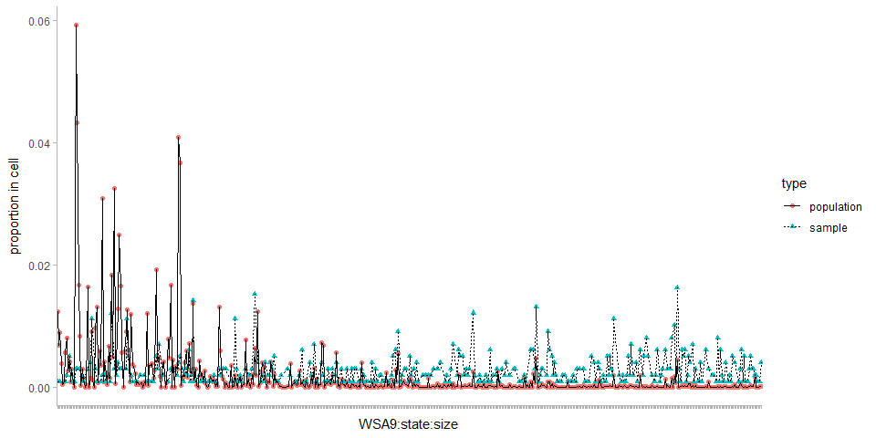

Another comparison between population and sample was constructed below
by ecoregion. The samples were not balanced across ecoregions. Lakes in
the Coastal Plains (CPL) ecoregion, for example, were clearly
undersampled relative to their proportion of the population.

``` r
load("C:/Users/rmartin/OneDrive - Environmental Protection Agency (EPA)/Documents/AE_Reservoirs/DissolvedGasNla/modelFiles/pframe.rda")

pframe_eco <- pframe %>%
  group_by(WSA9) %>%
  summarise(n_lakes = sum(n_lakes)) %>%
  ungroup() %>%
  mutate(prop_cell = round(n_lakes/sum(n_lakes), 7)) %>%
  ungroup() %>%
  mutate(type = 'population') 

save(pframe_eco, file = "C:/Users/rmartin/OneDrive - Environmental Protection Agency (EPA)/Documents/AE_Reservoirs/DissolvedGasNla/modelFiles/pframe_eco.rda")
```

``` r
load("C:/Users/rmartin/OneDrive - Environmental Protection Agency (EPA)/Documents/AE_Reservoirs/DissolvedGasNla/modelFiles/samp_props.rda")

samp_props_eco <- samp_props %>%
  group_by(WSA9) %>%
  summarise(n_lakes = sum(n_lakes)) %>%
  ungroup() %>%
  mutate(prop_cell = round(n_lakes/sum(n_lakes), 7)) %>%
  ungroup() %>%
  mutate(type = 'sample')

save(samp_props_eco, file = "C:/Users/rmartin/OneDrive - Environmental Protection Agency (EPA)/Documents/AE_Reservoirs/DissolvedGasNla/modelFiles/samp_props_eco.rda")
```

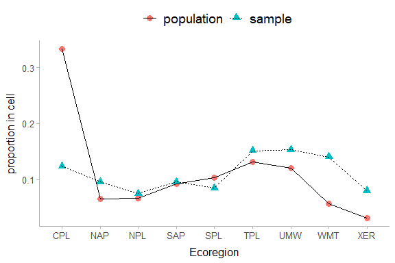

A similar comparison by state was constructed below.

``` r
load("C:/Users/rmartin/OneDrive - Environmental Protection Agency (EPA)/Documents/AE_Reservoirs/DissolvedGasNla/modelFiles/pframe.rda")

pframe_state <- pframe %>%
  group_by(state) %>%
  summarise(n_lakes = sum(n_lakes)) %>%
  ungroup() %>%
  mutate(prop_cell = round(n_lakes/sum(n_lakes), 7)) %>%
  ungroup() %>%
  mutate(type = 'population')

save(pframe_state, file = "C:/Users/rmartin/OneDrive - Environmental Protection Agency (EPA)/Documents/AE_Reservoirs/DissolvedGasNla/modelFiles/pframe_state.rda")
```

``` r
load("C:/Users/rmartin/OneDrive - Environmental Protection Agency (EPA)/Documents/AE_Reservoirs/DissolvedGasNla/modelFiles/samp_props.rda")
load("C:/Users/rmartin/OneDrive - Environmental Protection Agency (EPA)/Documents/AE_Reservoirs/DissolvedGasNla/modelFiles/samp_props.rda")

samp_props_state <- samp_props %>%
  group_by(state) %>%
  summarise(n_lakes = sum(n_lakes)) %>%
  ungroup() %>%
  mutate(prop_cell = round(n_lakes/sum(n_lakes), 7)) %>%
  ungroup() %>%
  mutate(type = 'sample')

save(samp_props_state, file = "C:/Users/rmartin/OneDrive - Environmental Protection Agency (EPA)/Documents/AE_Reservoirs/DissolvedGasNla/modelFiles/samp_props_state.rda")
```

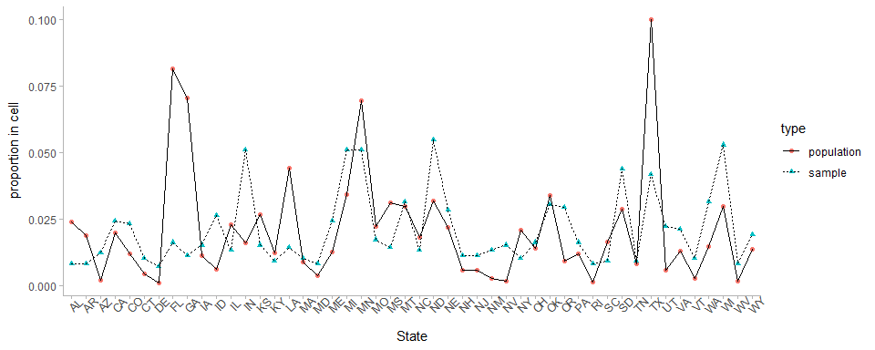

Finally, a comparison by lake size category is shown below. Note that
small lakes were under-sampled relative to larger lakes by design.

``` r
load("C:/Users/rmartin/OneDrive - Environmental Protection Agency (EPA)/Documents/AE_Reservoirs/DissolvedGasNla/modelFiles/pframe.rda")

pframe_size <- pframe %>%
  group_by(size_cat) %>%
  summarise(n_lakes = sum(n_lakes)) %>%
  ungroup() %>%
  mutate(prop_cell = round(n_lakes/sum(n_lakes), 7)) %>%
  ungroup() %>%
  mutate(type = 'population')

save(pframe_size, file = "C:/Users/rmartin/OneDrive - Environmental Protection Agency (EPA)/Documents/AE_Reservoirs/DissolvedGasNla/modelFiles/pframe_size.rda")
```

``` r
load("C:/Users/rmartin/OneDrive - Environmental Protection Agency (EPA)/Documents/AE_Reservoirs/DissolvedGasNla/modelFiles/samp_props.rda")

samp_props_size <- samp_props %>%
  group_by(size_cat) %>%
  summarise(n_lakes = sum(n_lakes)) %>%
  ungroup() %>%
  mutate(prop_cell = round(n_lakes/sum(n_lakes), 7)) %>%
  ungroup() %>%
  mutate(type = 'sample')

save(samp_props_size, file = "C:/Users/rmartin/OneDrive - Environmental Protection Agency (EPA)/Documents/AE_Reservoirs/DissolvedGasNla/modelFiles/samp_props_size.rda")
```

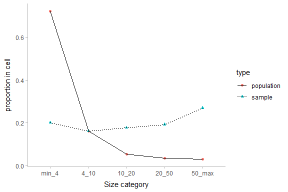

## 2.4 Sample-based estimates

The overall mean and standard deviation for N2O in the sample:

``` r
load("C:/Users/rmartin/OneDrive - Environmental Protection Agency (EPA)/Documents/AE_Reservoirs/DissolvedGasNla/modelFiles/df_model.rda")

df_model %>%
  summarise(mean = mean(n2o),
             sd = sd(n2o)) %>%
  print()
```

    ##       mean      sd
    ## 1 8.720661 9.52093

The same summary for equilibrium N2O:

``` r
load("C:/Users/rmartin/OneDrive - Environmental Protection Agency (EPA)/Documents/AE_Reservoirs/DissolvedGasNla/modelFiles/df_model.rda")

df_model %>%
  summarise(mean = mean(n2o_eq),
             sd = sd(n2o_eq)) %>%
  print()
```

    ##       mean        sd
    ## 1 7.483567 0.8453779

The saturation ratio (i.e., N2O / N2O-eq):

``` r
load("C:/Users/rmartin/OneDrive - Environmental Protection Agency (EPA)/Documents/AE_Reservoirs/DissolvedGasNla/modelFiles/df_model.rda")

df_model %>%
  summarise(mean = mean(n2o / n2o_eq),
             sd = sd(n2o / n2o_eq)) %>%
  print()
```

    ##       mean       sd
    ## 1 1.170095 1.302608

Finally, roughly 67% of lakes in the sample were undersaturated (i.e.,
saturation ratio \< 1):

``` r
load("C:/Users/rmartin/OneDrive - Environmental Protection Agency (EPA)/Documents/AE_Reservoirs/DissolvedGasNla/modelFiles/df_model.rda")

df_model %>%
  summarise(prop_undersat = sum((n2o / n2o_eq) < 1) / 984) %>%
  print()
```

    ##   prop_undersat
    ## 1     0.6656504

Using only the sample observations, a plot was constructed below of the
overall mean (dashed line) along with the ecoregion-specific means
(black circles). The shaded areas indicate +/- 1 standard deviation.
Neither dissolved N2O nor the saturation ratio were clearly structured
by ecoregion in the sample, but there did appear to be some structure in
the equilibrium N2O observations.
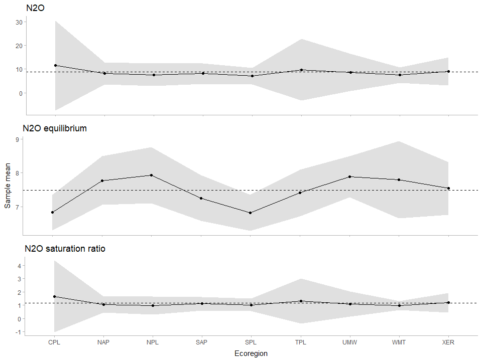

The same summary by state is below.


Finally, the same summary by size category:


## 2.5 Sample data exploration

Below, the empirical distribution of N2O observations in the sample was
summarized using a density and rug plot below. Note the natural log
scale of the x axis. Both the N2O and equilibrium N2O data had
considerable right skew even after the log transformation, which was not
unexpected and has been noted in other studies ([Webb et al.
2019](#ref-Webb_etal_2019)). The saturation ratio was also skewed since
it was derived from the other two observed variables (i.e., sat_ratio =
n2o / n2o_eq).


Below are plots of N2O vs. NO3. The first plot shows log(N2O)
vs. log(NO3), as well as the ordinal categories assigned to NO3
(vertical lines). The leftmost vertical line is dashed and separates the
NO3 observations below the detection limit.


In the plot above, the trend is increasing and nonlinear on the log
scale. The increasing variance in N2O along the NO3 gradeient suggested
a potential mediator of the relationship between NO3 on N2O. Below are
plots of N2O vs. NO3 for 6 quantiles of the surface temperature
measurements (quantiles increasing from 1 to 6). This plot below
suggested that the NO3 effect on N2O may have been stronger in lakes
with higher observed temperatures.


The next plot below shows the relationship between N2O and NO3 at 6
different quantiles (increasing 1 to 6) of the log-scaled lake surface
area estimates.


Similar plots are below, but with NO3 expressed as an ordered
categorical variable with 5 levels. The positive and monotonic trends
area similar to the previous plots where NO3 was treated as continuous.
Note the large number of observations in the first NO3 category (no3_cat
= 1). This category represented all of the censored observations for
NO3, which was most of the data.


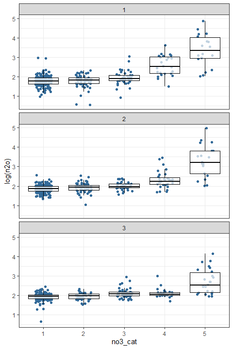

Below is a plot of log(N2O) vs. log(NO3) by ecoregion, which suggested
that the NO3 effect on N2O may have varied by ecoregion.


Below is the same plot as above but for the ordered categorical version
of NO3.


A plot below shows trends by state within just the Temperate Plains
(TPL) ecoregion. Within states, the number of observations were
relatively small, but the trends appeared closer to linear.


# 3 Model fitting

The first regression model was constructed to estimate the joint
distribution of log-transformed N2O and equilibrium N2O conditional on
the the design factors. Each log-transformed observation,
,
for each response,
,
was assumed to be drawn from a multivariate normal distribution with the
parameters  and
,
where  is the
multivariate mean estimated conditional on the design effects and
 is a
covariance matrix containing the observation-level variances and
residual correlation:

")

The multivariate mean is a vector of mean parameters,
![\\nu:\[\\mu\_{p=1}, \\mu\_{p=2}\]](https://latex.codecogs.com/svg.image?%5Cnu%3A%5B%5Cmu_%7Bp%3D1%7D%2C%20%5Cmu_%7Bp%3D2%7D%5D "\nu:[\mu_{p=1}, \mu_{p=2}]"),
for each response. Each mean is further defined by a linear combination
of parameters where, for each response
 and observation
:

} + \alpha_{1(pij)} + \alpha_{2(pijk)} + \alpha_{3(pijkl)} \\
\alpha_1 \sim MVN(0, \Lambda_1) \\
\alpha_2 \sim MVN(0, \Lambda_2) \\
\alpha_3 \sim MVN(0, \Lambda_3)")

The linear combination of parameters defining
 above include
a fixed global intercept,
, that is
estimated directly from the data, and three separate, latent group-level
effects matrices,
.
The group effects were assumed to be multivariate normal and are
centered on zero in multivariate space. The spread of the effects around
zero are determined by a covariance matrix,
,
which are estimated directly from the data. These covariance terms are
further defined where:


The 
parameters are the group-level scale parameters, which constrain the
spread of effects for each response, and
 comprises
the group-level residual correlation matrix:


wherein
 is
the group-level residual correlation between responses.

The explicit indexing in the notation above conveys the relationship
between the parameters and each observation,
, and emphasizes the
nested structure of the observations within the group effects.
Specifically, every observation,
, was nested in a lake
size category, , which
was nested in a state, ,
and ecoregion, . The
parameter
,
therefore, accounted for ecoregion-scale group effects or deviations
from the global mean;

accounted for state-level group effects nested in ecoregions; and

accounted for lake size group effects within states and ecoregions.

Finally, the observation-level covariance term,
, was
parameterized as:


wherein the

parameters are the observation-level standard deviations for each
response and

comprises the observation-level residual correlation matrix:


wherein  is
the residual correlation between responses.

For model fitting, priors were needed for all parameters conditioned
directly on the data, which included the global intercept, the scale
parameters, and the correlation matrices. A normal or Gaussian prior,
")
centered near the (log-scale) data means, was used for the global
intercept parameter for each response. This prior was considered
minimally informative as it placed most (\~80%) of the prior mass over
values between approximately 2 and 27 ng/L for median N2O or N2O
equilibrium concentration and included support in the tails for values
approaching 0 ng/L on the lower end and 80 ng/L on the high end. We
placed
")
priors over all scale parameters, which placed most of the support
between values very close to 0 and values near 1 (central 80% density
interval from approximately 0.005 to 1.15). Finally, for the correlation
matrices, an
")
prior was used, which, for a 2-dimensional response, placed most support
for correlations between approximately -0.9 and 0.9. This prior seemed
reasonable as there was no clear causal mechanisms that were thought to
ensure a strong direct correlation between the N2O measures. Any
potential residual dependence was expected to be indirect due to, for
example, a common causal factor (e.g., elevation, temperature). For more
information on prior choice recommendations in Stan, see:
<https://github.com/stan-dev/stan/wiki/Prior-Choice-Recommendations>

The

package ([Bürkner 2017](#ref-Burkner_2017)) for

([R Core Team 2021](#ref-R_Core_Team_2021)) was used to fit all of the
models in a fully Bayesian setting. The formula syntax of the

package is similar to the syntax used in the

package that is widely used to fit mixed effects models in frequentist
settings In either package, the linear predictor for
 described
above could be expressed as:

 + (1|WSA9:state) + (1|WSA9:state:size)")

In the

package, there is additionaly functionality and syntax for multivariate
responses and for allowing the varying intercepts in a multivariate
model to be correlated, e.g.,:

 + (1|b|WSA9:state) + (1|c|WSA9:state:size) \\ 
N_2O_{equi}\sim 1 + (1|a|WSA9) + (1|b|WSA9:state) + (1|c|WSA9:state:size)")

The above syntax would indicate that the linear predictor for both
responses in the multivariate model have the same group-level varying
effects, and that each of those effects are allowed to be correlated
between responses.

For the remainder of this document, only this simplified syntax is
presented to describe the model parameterizations. For more information
on

functionality and syntax with multivariate response models, the package
vignette may be helpful, and can be found at:
<https://cran.r-project.org/web/packages/brms/vignettes/brms_multivariate.html>.

## 3.1 Model 1

The first model fit was the one described above.

``` r
load("C:/Users/rmartin/OneDrive - Environmental Protection Agency (EPA)/Documents/AE_Reservoirs/DissolvedGasNla/modelFiles/df_model.rda")

bf_n2o <- bf(log(n2o) ~ 1 + 
               (1 | a | WSA9) + 
               (1 | b | WSA9:state) + 
               (1 | c | WSA9:state:size_cat),
             family = gaussian())

bf_n2oeq <- bf(log(n2o_eq) ~ 1 + 
               (1 | a | WSA9) + 
               (1 | b | WSA9:state) +
               (1 | c | WSA9:state:size_cat),
             family = gaussian())

priors <- c(
  prior(normal(2, 1), class = "Intercept", resp = "logn2o"), # centered near data mean
  prior(exponential(2), class = "sd", resp = "logn2o"),
  prior(exponential(2), class = "sigma", resp = "logn2o"),
  prior(normal(2, 1), class = "Intercept", resp = "logn2oeq"), # centered near data mean
  prior(exponential(2), class = "sd", resp = "logn2oeq"),
  prior(exponential(2), class = "sigma", resp = "logn2oeq"),
  prior(lkj(2), class = "rescor"),
  prior(lkj(2), class = "cor")
  )

n2o_mod1 <- brm(bf_n2o + bf_n2oeq + set_rescor(rescor = TRUE),
                data = df_model,
                prior = priors,
                control = list(adapt_delta = 0.99, max_treedepth = 14),
                #sample_prior = "only",
                save_pars = save_pars(all = TRUE),
                seed = 145,
                chains=4, 
                iter=5000, 
                cores=4)

save(n2o_mod1, file = "C:/Users/rmartin/OneDrive - Environmental Protection Agency (EPA)/Documents/AE_Reservoirs/DissolvedGasNla/modelFiles/n2o_mod1.rda")
```

### 3.1.1 Summarize fit

The summaries of the estimated parameters and key HMC convergence
diagnostics for the fitted model are printed below. There were no
obvious issues with the HMC sampling. All

values were less than 1.01 and effective sample size
() calculations
suggested that the posterior contained a sufficient number of effective
samples for conducting inference.

    ##  Family: MV(gaussian, gaussian) 
    ##   Links: mu = identity; sigma = identity
    ##          mu = identity; sigma = identity 
    ## Formula: log(n2o) ~ 1 + (1 | a | WSA9) + (1 | b | WSA9:state) + (1 | c | WSA9:state:size_cat) 
    ##          log(n2o_eq) ~ 1 + (1 | a | WSA9) + (1 | b | WSA9:state) + (1 | c | WSA9:state:size_cat) 
    ##    Data: df_model (Number of observations: 984) 
    ##   Draws: 4 chains, each with iter = 5000; warmup = 2500; thin = 1;
    ##          total post-warmup draws = 10000
    ## 
    ## Priors: 
    ## Intercept_logn2o ~ normal(2, 1)
    ## Intercept_logn2oeq ~ normal(2, 1)
    ## L ~ lkj_corr_cholesky(2)
    ## Lrescor ~ lkj_corr_cholesky(2)
    ## <lower=0> sd_logn2o ~ exponential(2)
    ## <lower=0> sd_logn2oeq ~ exponential(2)
    ## <lower=0> sigma_logn2o ~ exponential(2)
    ## <lower=0> sigma_logn2oeq ~ exponential(2)
    ## 
    ## Group-Level Effects: 
    ## ~WSA9 (Number of levels: 9) 
    ##                                          Estimate Est.Error l-95% CI u-95% CI
    ## sd(logn2o_Intercept)                         0.04      0.03     0.00     0.13
    ## sd(logn2oeq_Intercept)                       0.06      0.02     0.03     0.11
    ## cor(logn2o_Intercept,logn2oeq_Intercept)     0.05      0.44    -0.80     0.83
    ##                                          Rhat Bulk_ESS Tail_ESS
    ## sd(logn2o_Intercept)                     1.00     2475     4230
    ## sd(logn2oeq_Intercept)                   1.00     3326     5332
    ## cor(logn2o_Intercept,logn2oeq_Intercept) 1.01     1141     3129
    ## 
    ## ~WSA9:state (Number of levels: 96) 
    ##                                          Estimate Est.Error l-95% CI u-95% CI
    ## sd(logn2o_Intercept)                         0.26      0.03     0.21     0.32
    ## sd(logn2oeq_Intercept)                       0.04      0.01     0.03     0.05
    ## cor(logn2o_Intercept,logn2oeq_Intercept)     0.24      0.15    -0.07     0.52
    ##                                          Rhat Bulk_ESS Tail_ESS
    ## sd(logn2o_Intercept)                     1.00     3199     4775
    ## sd(logn2oeq_Intercept)                   1.00     3549     5476
    ## cor(logn2o_Intercept,logn2oeq_Intercept) 1.00     3332     5553
    ## 
    ## ~WSA9:state:size_cat (Number of levels: 352) 
    ##                                          Estimate Est.Error l-95% CI u-95% CI
    ## sd(logn2o_Intercept)                         0.09      0.04     0.01     0.16
    ## sd(logn2oeq_Intercept)                       0.02      0.01     0.00     0.03
    ## cor(logn2o_Intercept,logn2oeq_Intercept)    -0.22      0.37    -0.85     0.58
    ##                                          Rhat Bulk_ESS Tail_ESS
    ## sd(logn2o_Intercept)                     1.00      863     1397
    ## sd(logn2oeq_Intercept)                   1.00      928     1365
    ## cor(logn2o_Intercept,logn2oeq_Intercept) 1.00     1661     2807
    ## 
    ## Population-Level Effects: 
    ##                    Estimate Est.Error l-95% CI u-95% CI Rhat Bulk_ESS Tail_ESS
    ## logn2o_Intercept       2.02      0.04     1.95     2.09 1.00     2641     3963
    ## logn2oeq_Intercept     2.00      0.02     1.96     2.04 1.00     3446     4550
    ## 
    ## Family Specific Parameters: 
    ##                Estimate Est.Error l-95% CI u-95% CI Rhat Bulk_ESS Tail_ESS
    ## sigma_logn2o       0.40      0.01     0.37     0.42 1.00     2749     5523
    ## sigma_logn2oeq     0.08      0.00     0.08     0.09 1.00     4790     6698
    ## 
    ## Residual Correlations: 
    ##                         Estimate Est.Error l-95% CI u-95% CI Rhat Bulk_ESS
    ## rescor(logn2o,logn2oeq)     0.21      0.04     0.14     0.27 1.00     6172
    ##                         Tail_ESS
    ## rescor(logn2o,logn2oeq)     7243
    ## 
    ## Draws were sampled using sampling(NUTS). For each parameter, Bulk_ESS
    ## and Tail_ESS are effective sample size measures, and Rhat is the potential
    ## scale reduction factor on split chains (at convergence, Rhat = 1).

In the summary above, the estimated standard deviations for the varying
group effects on the mean behavior of the dissolved N2O response
suggested fairly low, but non-zero variability across each of the three
levels. The standard deviations estimated for the same varying effects
for equilibrium N2O were also relatively small. Finally, note the
relatively small, but positive residual correlation between the two N2O
responses.

Before investing too much into the interpretation of this model,
however, the model fit was evaluated below using a series of graphical
posterior predictive checks (PPC, [Gelman et al.
2014](#ref-Gelman_etal_2014); [Gelman, Hill, and Vehtari
2020](#ref-Gelman_etal_2020), Ch. 11).

### 3.1.2 Model checks

#### 3.1.2.1 Dissolved N2O

Below are a series of panels illustrating graphical PPCs for the
log(N2O) component of the model. The top left panel compares a density
plot of the observed data (black line) to density lines drawn for 200
samples from the posterior predictive distribution (PPD; blue lines) of
the fitted model. The top right panel similarly compares the cumulative
density distributions. The left middle panel simulataneously compares
means *vs.* standard deviations for 1000 draws from the PPD (blue dots)
to the sample mean and standard deviation (black dot). The right middle
panel compares skewness *vs.* kurtosis for 1000 draws from the PPD to
the skewness and kurtosis values calculated for the observed data. The
bottom left panel compares max *vs.* min values for 1000 draws from the
PPD to the max and min values of the sample data. Finally, the bottom
right panel shows the observed *vs.* average predicted values for each
observation in the sample. The average predicted values were calculated
as the mean prediction for each observation in the PPD based on 1000
draws.

The general takeaway from the PPCs above was that the model replicated
the central tendency of the observed data fairly well, but failed to
sufficiently replicate other important aspects of the distribution, such
as skewness and kurtosis. The observed *vs.* average predictions
scatterplot suggested substantial heteroscedasticity in the errors.

The same checks were run below, but for the test set of 95 held-out,
second-visit data points.

The patterns in misfit indicated above for the re-visit data were
similar to the patterns indicated in the PPCs with the training data.

#### 3.1.2.2 Equilibrium N2O

Below are PPCs for the equilibrium N2O component of the model. As with
the dissolved N2O response above, the model did an OK job at replicating
the central tendency, but performed less well at replicating some
important aspects of the overall distribution.


Below are the same PPCs for equilibrium N2O in the re-visit sites.


#### 3.1.2.3 Bivariate

The graphical check below compares bivariate density contours estimated
from the observed data (black lines) to density contours estimated for
each of 20 draws from the PPD. The model appeared to do a good job of
replicating the bivariate mean, but was poor at representing the overall
joint distribution.


The same bivariate check is shown below for the re-visit data.
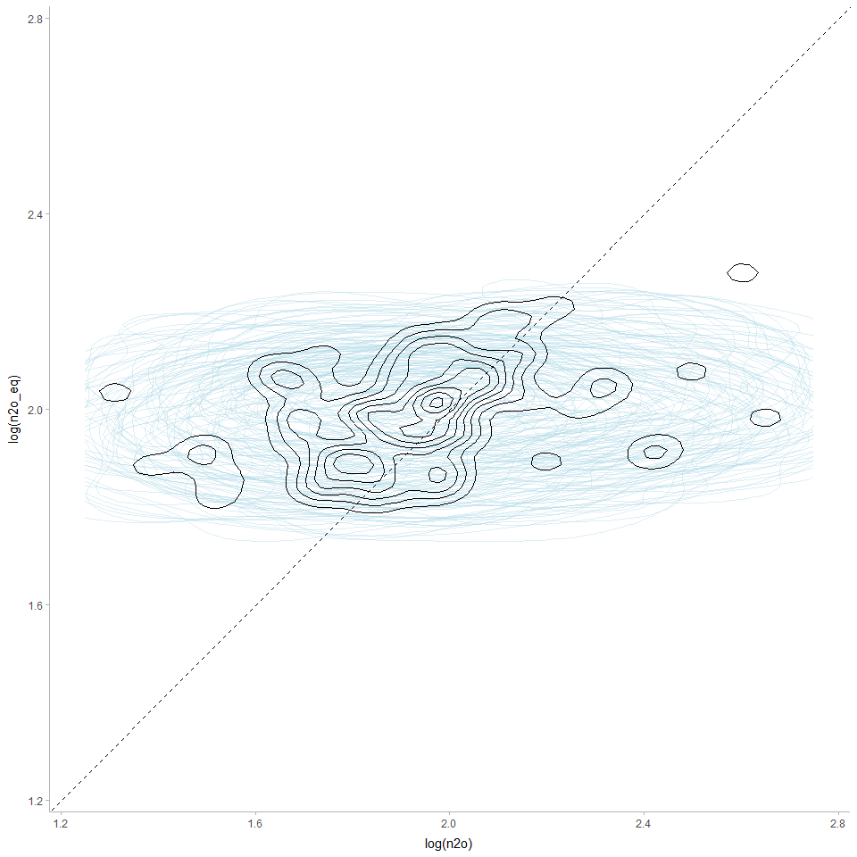

#### 3.1.2.4 Saturation

The graphical PPCs below were aimed at evaluating how well the
multivariate model did at representing the observed saturation ratio:


This quantity was estimated as a derived variable by simply dividing the
N2O PPD by the equilibrium N2O PPD. Likewise, the proportion of
under-saturated lakes in the sample was estimated by summing the number
of lakes from each posterior predictive draw wherein the ratio was \< 1
and dividing that number by the total number of lakes in the sample,
which was 984. Overall, these checks indicated that properly
representing the tails of the N2O and N2O-eq observations would likely
be necessary in order to better replicate the observed saturation
metrics. For example, the model did a poor job replicating the observed
proportion of under-saturated lakes, underestimating it by more than 10
percentage points, on average.
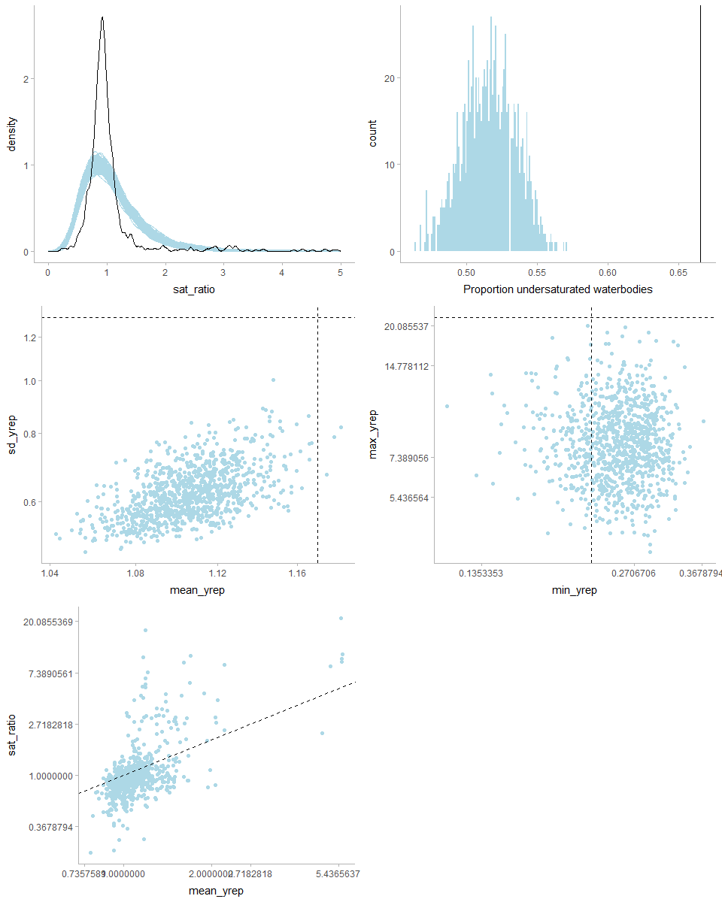

The top left panel, above, is a density plot of the observed saturation
ratio (black line) compared to an estimate using 50 draws from the model
(blue lines). The top right panel shows the observed proportion of
under-saturated lakes compared to a model estimate based on 1000 draws
from the PPD. The left middle panel shows the mean *vs.* standard
deviation of the saturation ratio for the observed data compared to the
same estimates for 500 posterior draws from the model’s PPD. The right
middle panel shows the max *vs.* min for the sample compared to 500
draws from the model’s PPD. Finally, the bottom left panel shows the
observed *vs.* average predicted saturation ratio for all 984 lakes
sampled in the dataset.

The same PPCs are show below for the revisit data.
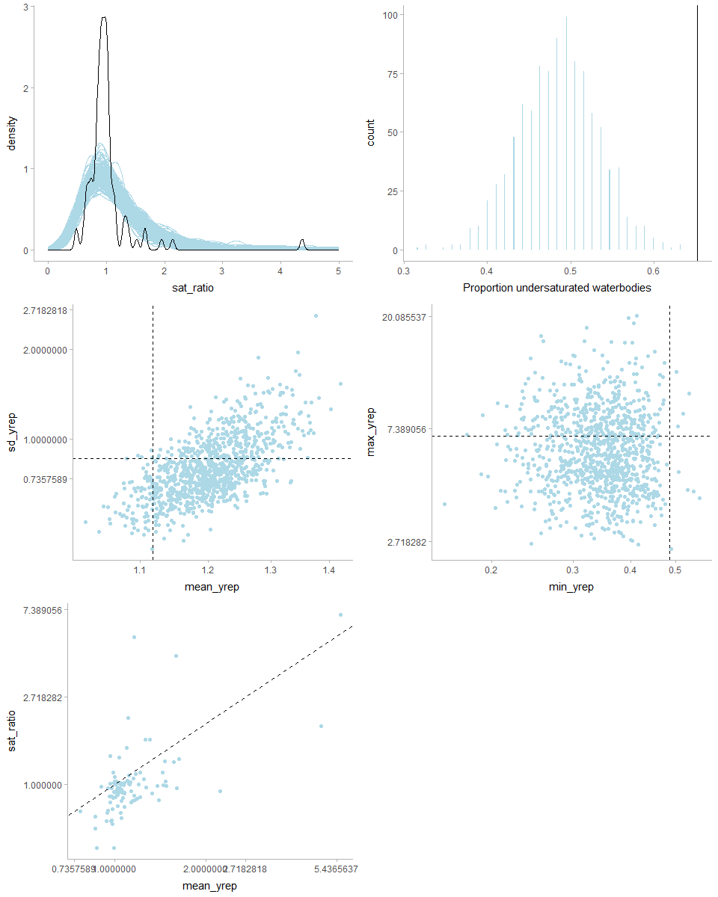
The checks above indicated that the model did a similarly underwhelming
job of replicating some key properties of the saturation metrics
calculated from the re-visit data.

#### 3.1.2.5 R-square

Below, the Bayesian
 values are
reported for each reasponse in the model.

    ##          Estimate Est.Error  Q2.5 Q97.5
    ## R2logn2o    0.247     0.031 0.187 0.309

    ##            Estimate Est.Error  Q2.5 Q97.5
    ## R2logn2oeq    0.377     0.025 0.328 0.425

The  were also
estimated for the re-visit data.

    ##          Estimate Est.Error  Q2.5 Q97.5
    ## R2logn2o    0.413      0.04 0.331 0.489

    ##            Estimate Est.Error  Q2.5 Q97.5
    ## R2logn2oeq    0.322     0.026 0.271 0.374

## 3.2 Model 2

In an attempt to better fit the observed data, the next model included
distributional sub-models to allow for heterogeneous variances for each
response conditional on the survey design structure.

``` r
load("C:/Users/rmartin/OneDrive - Environmental Protection Agency (EPA)/Documents/AE_Reservoirs/DissolvedGasNla/modelFiles/df_model.rda")

bf_n2o <- bf(log(n2o) ~ 1 +
               (1 | a | WSA9) + 
               (1 | b | WSA9:state) + 
               (1 | c | WSA9:state:size_cat),
             sigma ~ 1 +
               (1 | WSA9) + 
               (1 | WSA9:state) + 
               (1 | WSA9:state:size_cat), 
             family = gaussian())

bf_n2oeq <- bf(log(n2o_eq) ~ 1 +
                 (1 | a | WSA9) + 
                 (1 | b | WSA9:state) +
                 (1 | c | WSA9:state:size_cat),
             sigma ~ 1 +
               (1 | WSA9) + 
               (1 | WSA9:state) + 
               (1 | WSA9:state:size_cat),
             family = gaussian())

priors <- c(
  prior(normal(2, 1), class = "Intercept", resp = "logn2o"),
  prior(exponential(2), class = "sd", resp = "logn2o"),
  prior(normal(-1, 2), class = "Intercept", dpar = "sigma", resp = "logn2o"),
  prior(exponential(2), class = "sd", dpar = "sigma", resp = "logn2o"),
  prior(normal(2, 1), class = "Intercept", resp = "logn2oeq"), 
  prior(exponential(2), class = "sd", resp = "logn2oeq"),
  prior(normal(-1, 2), class = "Intercept", dpar = "sigma", resp = "logn2oeq"),
  prior(exponential(2), class = "sd", dpar = "sigma", resp = "logn2oeq"),
  
  prior(lkj(2), class = "rescor"),
  prior(lkj(2), class = "cor")
  )

n2o_mod2 <- brm(bf_n2o + bf_n2oeq + set_rescor(rescor = TRUE),
                data = df_model, 
                prior = priors,
  control = list(adapt_delta = 0.975, max_treedepth = 12),
  #sample_prior = "only",
  save_pars = save_pars(all = TRUE),
  seed = 84512,
  chains=4, 
  iter=5000, 
  cores=4)

save(n2o_mod2, file = "C:/Users/rmartin/OneDrive - Environmental Protection Agency (EPA)/Documents/AE_Reservoirs/DissolvedGasNla/modelFiles/n2o_mod2.rda")
```

### 3.2.1 Summarize fit

The summaries of the estimated parameters and key HMC convergence
diagnostics for the fitted model are printed below.

    ##  Family: MV(gaussian, gaussian) 
    ##   Links: mu = identity; sigma = log
    ##          mu = identity; sigma = log 
    ## Formula: log(n2o) ~ 1 + (1 | a | WSA9) + (1 | b | WSA9:state) + (1 | c | WSA9:state:size_cat) 
    ##          sigma ~ 1 + (1 | WSA9) + (1 | WSA9:state) + (1 | WSA9:state:size_cat)
    ##          log(n2o_eq) ~ 1 + (1 | a | WSA9) + (1 | b | WSA9:state) + (1 | c | WSA9:state:size_cat) 
    ##          sigma ~ 1 + (1 | WSA9) + (1 | WSA9:state) + (1 | WSA9:state:size_cat)
    ##    Data: df_model (Number of observations: 984) 
    ##   Draws: 4 chains, each with iter = 5000; warmup = 2500; thin = 1;
    ##          total post-warmup draws = 10000
    ## 
    ## Priors: 
    ## Intercept_logn2o ~ normal(2, 1)
    ## Intercept_logn2o_sigma ~ normal(-1, 2)
    ## Intercept_logn2oeq ~ normal(2, 1)
    ## Intercept_logn2oeq_sigma ~ normal(-1, 2)
    ## L ~ lkj_corr_cholesky(2)
    ## Lrescor ~ lkj_corr_cholesky(2)
    ## <lower=0> sd_logn2o ~ exponential(2)
    ## <lower=0> sd_logn2o_sigma ~ exponential(2)
    ## <lower=0> sd_logn2oeq ~ exponential(2)
    ## <lower=0> sd_logn2oeq_sigma ~ exponential(2)
    ## 
    ## Group-Level Effects: 
    ## ~WSA9 (Number of levels: 9) 
    ##                                          Estimate Est.Error l-95% CI u-95% CI
    ## sd(logn2o_Intercept)                         0.06      0.03     0.02     0.12
    ## sd(logn2oeq_Intercept)                       0.05      0.02     0.03     0.09
    ## sd(sigma_logn2o_Intercept)                   0.22      0.12     0.02     0.50
    ## sd(sigma_logn2oeq_Intercept)                 0.16      0.08     0.04     0.34
    ## cor(logn2o_Intercept,logn2oeq_Intercept)     0.57      0.30    -0.18     0.95
    ##                                          Rhat Bulk_ESS Tail_ESS
    ## sd(logn2o_Intercept)                     1.00     2247     1772
    ## sd(logn2oeq_Intercept)                   1.00     3423     4761
    ## sd(sigma_logn2o_Intercept)               1.00     1892     3094
    ## sd(sigma_logn2oeq_Intercept)             1.00     2413     1991
    ## cor(logn2o_Intercept,logn2oeq_Intercept) 1.00     2696     3538
    ## 
    ## ~WSA9:state (Number of levels: 96) 
    ##                                          Estimate Est.Error l-95% CI u-95% CI
    ## sd(logn2o_Intercept)                         0.08      0.02     0.04     0.11
    ## sd(logn2oeq_Intercept)                       0.04      0.01     0.03     0.05
    ## sd(sigma_logn2o_Intercept)                   0.56      0.08     0.40     0.74
    ## sd(sigma_logn2oeq_Intercept)                 0.22      0.05     0.11     0.32
    ## cor(logn2o_Intercept,logn2oeq_Intercept)     0.42      0.19    -0.00     0.74
    ##                                          Rhat Bulk_ESS Tail_ESS
    ## sd(logn2o_Intercept)                     1.00     1276     1733
    ## sd(logn2oeq_Intercept)                   1.00     2695     5090
    ## sd(sigma_logn2o_Intercept)               1.00     2007     3462
    ## sd(sigma_logn2oeq_Intercept)             1.00     1851     1881
    ## cor(logn2o_Intercept,logn2oeq_Intercept) 1.00     1076     1960
    ## 
    ## ~WSA9:state:size_cat (Number of levels: 352) 
    ##                                          Estimate Est.Error l-95% CI u-95% CI
    ## sd(logn2o_Intercept)                         0.06      0.01     0.03     0.09
    ## sd(logn2oeq_Intercept)                       0.02      0.01     0.00     0.03
    ## sd(sigma_logn2o_Intercept)                   0.61      0.05     0.51     0.72
    ## sd(sigma_logn2oeq_Intercept)                 0.19      0.06     0.07     0.29
    ## cor(logn2o_Intercept,logn2oeq_Intercept)    -0.00      0.34    -0.70     0.62
    ##                                          Rhat Bulk_ESS Tail_ESS
    ## sd(logn2o_Intercept)                     1.00     1329     2182
    ## sd(logn2oeq_Intercept)                   1.00     1052     1452
    ## sd(sigma_logn2o_Intercept)               1.00     2622     4939
    ## sd(sigma_logn2oeq_Intercept)             1.00     1603     1725
    ## cor(logn2o_Intercept,logn2oeq_Intercept) 1.00      996     2063
    ## 
    ## Population-Level Effects: 
    ##                          Estimate Est.Error l-95% CI u-95% CI Rhat Bulk_ESS
    ## logn2o_Intercept             1.93      0.03     1.88     1.99 1.00     3338
    ## sigma_logn2o_Intercept      -1.40      0.12    -1.63    -1.17 1.00     3511
    ## logn2oeq_Intercept           2.00      0.02     1.96     2.03 1.00     3384
    ## sigma_logn2oeq_Intercept    -2.60      0.07    -2.75    -2.45 1.00     4004
    ##                          Tail_ESS
    ## logn2o_Intercept             4462
    ## sigma_logn2o_Intercept       5077
    ## logn2oeq_Intercept           4145
    ## sigma_logn2oeq_Intercept     4848
    ## 
    ## Residual Correlations: 
    ##                         Estimate Est.Error l-95% CI u-95% CI Rhat Bulk_ESS
    ## rescor(logn2o,logn2oeq)     0.36      0.03     0.29     0.43 1.00     6474
    ##                         Tail_ESS
    ## rescor(logn2o,logn2oeq)     7733
    ## 
    ## Draws were sampled using sampling(NUTS). For each parameter, Bulk_ESS
    ## and Tail_ESS are effective sample size measures, and Rhat is the potential
    ## scale reduction factor on split chains (at convergence, Rhat = 1).

From the summary above, note the moderate and positive residual
correlation between the two N2O responses. The estimated standard
deviations for the varying group effects on the mean behavior of the
dissolved N2O response suggested fairly low, but non-zero variability
across each of the three levels. The standard deviations estimated for
the same varying effects for equilibrium N2O were also relatively small.
However, before investing too much into the interpretation of these
results, the model fit was further evaluated below using a series of
graphical posterior predictive checks (PPCs).

### 3.2.2 Model checks

Below the same PPCs were performed as with the initial model (see above
for more details on each panel). \##### Dissolved N2O Though the checks
below suggest some improvement in replicating the tails of the observed
data, this model did a poorer job at replicating central tendency.
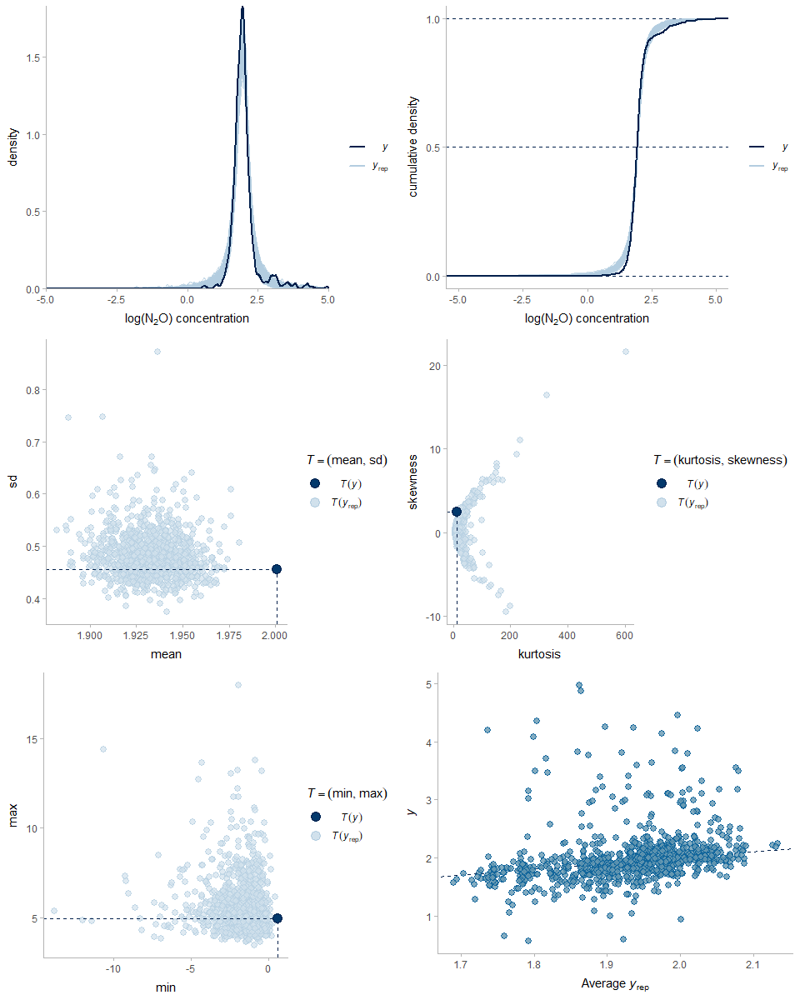

#### 3.2.2.1 Equilibrium N2O

The checks below suggest this model offered no improvement upon the
initial model for equilibrium N2O. This model also appeared to do a
poorer job of replicating the mean and overall standard deviation
compared to the initial model.
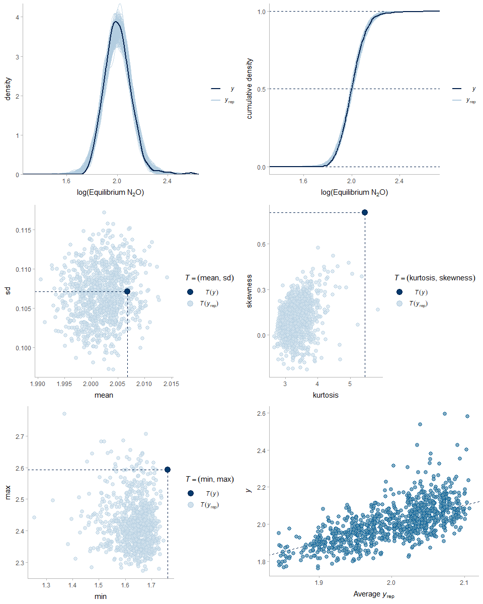

#### 3.2.2.2 Bivariate

This check perhaps suggested an improvement with regard to replicating
the joint density. However, the predictions were still clearly
over-dispersed relative to the observations.


#### 3.2.2.3 Saturation

The PPCs for the saturation metrics below indicated that including the
distributional models was perhaps an improvement on the initial model in
some aspects; in particular, the bias in the predicted proportion of
under-saturated lakes was substantially decreased. However, there
appeared to still be issues in replicating the tails as well as issues
with central tendency.


#### 3.2.2.4 R-square

Relative to model 1, there was a substantial decrease in the
 estimate for
the dissolved N2O component of this model. The estimate for the
equilibrium N2O-eq component was similar to the model 1.

    ##          Estimate Est.Error  Q2.5 Q97.5
    ## R2logn2o    0.056     0.009 0.038 0.075

    ##            Estimate Est.Error  Q2.5 Q97.5
    ## R2logn2oeq    0.379     0.022 0.335 0.421

## 3.3 Model 3

In the next model, we used covariates to try to improve the fit. The
categorical version of the NO3 covariate was used as a monotonic ordinal
predictor in the dissolved N2O component of the modl. For the equlibrium
N2O component, we included surface temperature and log-transformed
elevation, along with their interaction. The models also retained the
distributional specifications included in model 2 above.

``` r
load("C:/Users/rmartin/OneDrive - Environmental Protection Agency (EPA)/Documents/AE_Reservoirs/DissolvedGasNla/modelFiles/df_model.rda")

bf_n2o <- bf(log(n2o) ~ mo(no3_cat) +
               surftemp +
               (mo(no3_cat) | a | WSA9) + 
               (mo(no3_cat) | b | WSA9:state) + 
               (1 | c | WSA9:state:size_cat),
             sigma ~ 1 +
               (1 | WSA9) + 
               (1 | WSA9:state) + 
               (1 | WSA9:state:size_cat), 
             family = gaussian())

bf_n2oeq <- bf(log(n2o_eq) ~ surftemp +
                 log_elev +
                 surftemp:log_elev +
                 (1 | a | WSA9) + 
                 (1 | b | WSA9:state) +
                 (1 | c | WSA9:state:size_cat),
             sigma ~ 1 +
               (1 | WSA9) + 
               (1 | WSA9:state) + 
               (1 | WSA9:state:size_cat),
             family = gaussian())

priors <- c(
  prior(normal(2, 1), class = "Intercept", resp = "logn2o"),
  prior(normal(0, 1), class = "b", resp = "logn2o"),
  prior(exponential(2), class = "sd", resp = "logn2o"),
  prior(normal(-1, 2), class = "Intercept", dpar = "sigma", resp = "logn2o"),
  prior(exponential(2), class = "sd", dpar = "sigma", resp = "logn2o"),
  prior(normal(2, 1), class = "Intercept", resp = "logn2oeq"), 
  prior(normal(0, 1), class = "b", resp = "logn2oeq"), 
  prior(exponential(2), class = "sd", resp = "logn2oeq"), 
  prior(normal(-1, 2), class = "Intercept", dpar = "sigma", resp = "logn2oeq"),
  prior(exponential(2), class = "sd", dpar = "sigma", resp = "logn2oeq"),
  
  prior(lkj(2), class = "rescor"),
  prior(lkj(2), class = "cor")
  )

n2o_mod3 <- brm(bf_n2o + bf_n2oeq + set_rescor(rescor = TRUE),
                data = df_model, 
                prior = priors,
  control = list(adapt_delta = 0.975, max_treedepth = 12),
  #sample_prior = "only",
  save_pars = save_pars(all = TRUE),
  seed = 98456,
  chains=4, 
  iter=5000, 
  cores=4)

save(n2o_mod3, file = "C:/Users/rmartin/OneDrive - Environmental Protection Agency (EPA)/Documents/AE_Reservoirs/DissolvedGasNla/modelFiles/n2o_mod3.rda")
```

### 3.3.1 Summarize fit

The fitted parameters and MCMC diagnostics are below.

    ##  Family: MV(gaussian, gaussian) 
    ##   Links: mu = identity; sigma = log
    ##          mu = identity; sigma = log 
    ## Formula: log(n2o) ~ mo(no3_cat) + surftemp + (mo(no3_cat) | a | WSA9) + (mo(no3_cat) | b | WSA9:state) + (1 | c | WSA9:state:size_cat) 
    ##          sigma ~ 1 + (1 | WSA9) + (1 | WSA9:state) + (1 | WSA9:state:size_cat)
    ##          log(n2o_eq) ~ surftemp + log_elev + surftemp:log_elev + (1 | a | WSA9) + (1 | b | WSA9:state) + (1 | c | WSA9:state:size_cat) 
    ##          sigma ~ 1 + (1 | WSA9) + (1 | WSA9:state) + (1 | WSA9:state:size_cat)
    ##    Data: df_model (Number of observations: 984) 
    ##   Draws: 4 chains, each with iter = 5000; warmup = 2500; thin = 1;
    ##          total post-warmup draws = 10000
    ## 
    ## Priors: 
    ## b_logn2o ~ normal(0, 1)
    ## b_logn2oeq ~ normal(0, 1)
    ## Intercept_logn2o ~ normal(2, 1)
    ## Intercept_logn2o_sigma ~ normal(-1, 2)
    ## Intercept_logn2oeq ~ normal(2, 1)
    ## Intercept_logn2oeq_sigma ~ normal(-1, 2)
    ## L ~ lkj_corr_cholesky(2)
    ## Lrescor ~ lkj_corr_cholesky(2)
    ## <lower=0> sd_logn2o ~ exponential(2)
    ## <lower=0> sd_logn2o_sigma ~ exponential(2)
    ## <lower=0> sd_logn2oeq ~ exponential(2)
    ## <lower=0> sd_logn2oeq_sigma ~ exponential(2)
    ## simo_logn2o_mono3_cat1 ~ dirichlet(1)
    ## 
    ## Group-Level Effects: 
    ## ~WSA9 (Number of levels: 9) 
    ##                                          Estimate Est.Error l-95% CI u-95% CI
    ## sd(logn2o_Intercept)                         0.05      0.02     0.02     0.10
    ## sd(logn2o_mono3_cat)                         0.14      0.05     0.06     0.26
    ## sd(logn2oeq_Intercept)                       0.04      0.01     0.02     0.07
    ## sd(sigma_logn2o_Intercept)                   0.12      0.08     0.01     0.31
    ## sd(sigma_logn2oeq_Intercept)                 0.36      0.11     0.19     0.64
    ## cor(logn2o_Intercept,logn2o_mono3_cat)      -0.14      0.33    -0.72     0.53
    ## cor(logn2o_Intercept,logn2oeq_Intercept)     0.36      0.29    -0.28     0.83
    ## cor(logn2o_mono3_cat,logn2oeq_Intercept)     0.37      0.29    -0.26     0.82
    ##                                          Rhat Bulk_ESS Tail_ESS
    ## sd(logn2o_Intercept)                     1.00     4265     3917
    ## sd(logn2o_mono3_cat)                     1.00     4747     5482
    ## sd(logn2oeq_Intercept)                   1.00     4798     5704
    ## sd(sigma_logn2o_Intercept)               1.00     3419     4599
    ## sd(sigma_logn2oeq_Intercept)             1.00     5027     6638
    ## cor(logn2o_Intercept,logn2o_mono3_cat)   1.00     4970     6018
    ## cor(logn2o_Intercept,logn2oeq_Intercept) 1.00     5073     6636
    ## cor(logn2o_mono3_cat,logn2oeq_Intercept) 1.00     7256     7538
    ## 
    ## ~WSA9:state (Number of levels: 96) 
    ##                                          Estimate Est.Error l-95% CI u-95% CI
    ## sd(logn2o_Intercept)                         0.03      0.02     0.00     0.07
    ## sd(logn2o_mono3_cat)                         0.14      0.02     0.10     0.18
    ## sd(logn2oeq_Intercept)                       0.03      0.00     0.03     0.04
    ## sd(sigma_logn2o_Intercept)                   0.30      0.09     0.09     0.47
    ## sd(sigma_logn2oeq_Intercept)                 0.28      0.06     0.17     0.40
    ## cor(logn2o_Intercept,logn2o_mono3_cat)      -0.30      0.32    -0.82     0.45
    ## cor(logn2o_Intercept,logn2oeq_Intercept)     0.00      0.27    -0.53     0.55
    ## cor(logn2o_mono3_cat,logn2oeq_Intercept)     0.45      0.13     0.16     0.69
    ##                                          Rhat Bulk_ESS Tail_ESS
    ## sd(logn2o_Intercept)                     1.00      894     2100
    ## sd(logn2o_mono3_cat)                     1.00     3795     5396
    ## sd(logn2oeq_Intercept)                   1.00     4164     5957
    ## sd(sigma_logn2o_Intercept)               1.00     1157     1279
    ## sd(sigma_logn2oeq_Intercept)             1.00     2747     4313
    ## cor(logn2o_Intercept,logn2o_mono3_cat)   1.00      550      693
    ## cor(logn2o_Intercept,logn2oeq_Intercept) 1.01      596      971
    ## cor(logn2o_mono3_cat,logn2oeq_Intercept) 1.00     2536     4431
    ## 
    ## ~WSA9:state:size_cat (Number of levels: 352) 
    ##                                          Estimate Est.Error l-95% CI u-95% CI
    ## sd(logn2o_Intercept)                         0.06      0.01     0.04     0.08
    ## sd(logn2oeq_Intercept)                       0.00      0.00     0.00     0.01
    ## sd(sigma_logn2o_Intercept)                   0.58      0.06     0.47     0.70
    ## sd(sigma_logn2oeq_Intercept)                 0.28      0.05     0.18     0.39
    ## cor(logn2o_Intercept,logn2oeq_Intercept)     0.26      0.39    -0.60     0.87
    ##                                          Rhat Bulk_ESS Tail_ESS
    ## sd(logn2o_Intercept)                     1.00     1429     2386
    ## sd(logn2oeq_Intercept)                   1.00     1779     3895
    ## sd(sigma_logn2o_Intercept)               1.00     2003     4421
    ## sd(sigma_logn2oeq_Intercept)             1.00     1812     3745
    ## cor(logn2o_Intercept,logn2oeq_Intercept) 1.00     4523     5554
    ## 
    ## Population-Level Effects: 
    ##                            Estimate Est.Error l-95% CI u-95% CI Rhat Bulk_ESS
    ## logn2o_Intercept               2.40      0.05     2.29     2.50 1.00     5046
    ## sigma_logn2o_Intercept        -1.70      0.08    -1.87    -1.55 1.00     5162
    ## logn2oeq_Intercept             3.10      0.05     3.01     3.19 1.00     8903
    ## sigma_logn2oeq_Intercept      -3.54      0.14    -3.81    -3.27 1.00     4065
    ## logn2o_surftemp               -0.02      0.00    -0.03    -0.02 1.00     5529
    ## logn2oeq_surftemp             -0.04      0.00    -0.04    -0.04 1.00     9722
    ## logn2oeq_log_elev             -0.07      0.01    -0.09    -0.06 1.00     9200
    ## logn2oeq_surftemp:log_elev     0.00      0.00     0.00     0.00 1.00     9527
    ## logn2o_mono3_cat               0.23      0.05     0.12     0.34 1.00     3948
    ##                            Tail_ESS
    ## logn2o_Intercept               6296
    ## sigma_logn2o_Intercept         5452
    ## logn2oeq_Intercept             7808
    ## sigma_logn2oeq_Intercept       5338
    ## logn2o_surftemp                6684
    ## logn2oeq_surftemp              7658
    ## logn2oeq_log_elev              7505
    ## logn2oeq_surftemp:log_elev     8028
    ## logn2o_mono3_cat               4777
    ## 
    ## Simplex Parameters: 
    ##                      Estimate Est.Error l-95% CI u-95% CI Rhat Bulk_ESS
    ## logn2o_mono3_cat1[1]     0.02      0.01     0.00     0.04 1.00     5535
    ## logn2o_mono3_cat1[2]     0.09      0.02     0.04     0.13 1.00     4281
    ## logn2o_mono3_cat1[3]     0.21      0.05     0.13     0.32 1.00     3683
    ## logn2o_mono3_cat1[4]     0.69      0.05     0.58     0.77 1.00     3498
    ##                      Tail_ESS
    ## logn2o_mono3_cat1[1]     5409
    ## logn2o_mono3_cat1[2]     5251
    ## logn2o_mono3_cat1[3]     4649
    ## logn2o_mono3_cat1[4]     4251
    ## 
    ## Residual Correlations: 
    ##                         Estimate Est.Error l-95% CI u-95% CI Rhat Bulk_ESS
    ## rescor(logn2o,logn2oeq)     0.15      0.04     0.07     0.23 1.00    11381
    ##                         Tail_ESS
    ## rescor(logn2o,logn2oeq)     7610
    ## 
    ## Draws were sampled using sampling(NUTS). For each parameter, Bulk_ESS
    ## and Tail_ESS are effective sample size measures, and Rhat is the potential
    ## scale reduction factor on split chains (at convergence, Rhat = 1).

### 3.3.2 Model checks

#### 3.3.2.1 Dissolved N2O

The PPCs below indicated a better fit compared to the previous models.
The central tendency and tail behavior looked to be reasonably
replicated by comparison. However, the observed *vs.* predicted plot
suggested that larger overserved values were being systematically
underestimated.


#### 3.3.2.2 Equilibrium N2O

The PPCs below indicated that this model appeared to be an improvement
for equilibrium N2O as well. However, some checks (e.g., skewness)
suggested some room for additional improvement.


#### 3.3.2.3 Bivariate

The check for the joint distribution below also suggested an improvement
up the previous models.


#### 3.3.2.4 Saturation

This model looked to be an improvement with regard to the PPCs for the
saturation metrics. However, the proportion of under-saturated lakes
remained biased low and other checks indicated that further improvements
would be ideal.
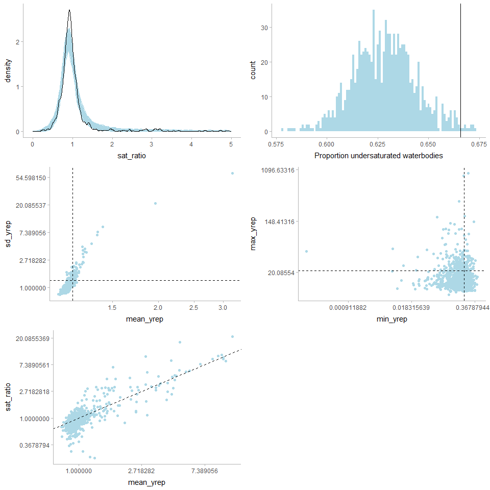

#### 3.3.2.5 R-square

The  estimates
for this model are below and suggested substantial improvements on the
previous models.

    ##          Estimate Est.Error  Q2.5 Q97.5
    ## R2logn2o    0.626     0.017 0.591  0.66

    ##            Estimate Est.Error Q2.5 Q97.5
    ## R2logn2oeq    0.879     0.004 0.87 0.886

### 3.3.3 Covariate effects

Below are plots illustrating the modeled effects of covariates on both
N2O and equilibrium N2O. \#### Dissolved N2O The conditional effects
plots below for N2O illustrate a positive, monotonic, and non-linear
relationship between NO3 and N2O; and a negative, linear relationship
between surface temperature and N2O.


#### 3.3.3.1 Equilibrium N2O

The modeled effects below for the equilibrium N2O component of the model
illustrated a negative relationship between equilibrium N2O and both
predictors and an interaction such that the surface temperature effect
became slightly steeper at lower elevations.
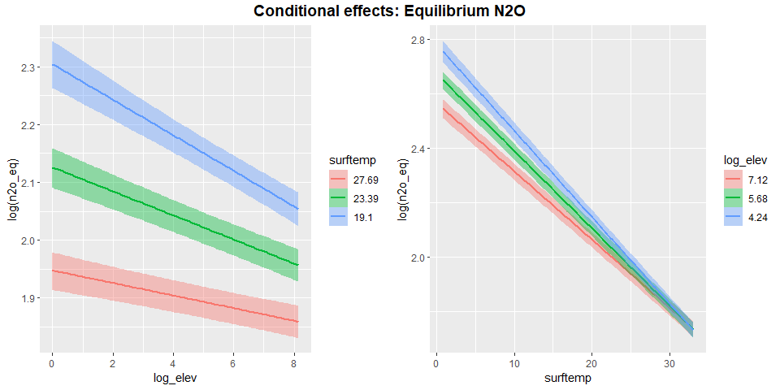

## 3.4 Model 4

In the next model, covariate terms were also included in the

components of both models in order to try to better capture remaining
heterogeneity in the variances of both N2O and N2O-eq.

``` r
load("C:/Users/rmartin/OneDrive - Environmental Protection Agency (EPA)/Documents/AE_Reservoirs/DissolvedGasNla/modelFiles/df_model.rda")

bf_n2o <- bf(log(n2o) ~ mo(no3_cat) +
               surftemp +
               (mo(no3_cat) | a | WSA9) + 
               (mo(no3_cat) | b | WSA9:state) + 
               (1 | c | WSA9:state:size_cat),
             sigma ~ mo(no3_cat) +
               surftemp +
               (1 | WSA9) + 
               (1 | WSA9:state) + 
               (1 | WSA9:state:size_cat), 
             family = gaussian())

bf_n2oeq <- bf(log(n2o_eq) ~ surftemp +
                 log_elev +
                 surftemp:log_elev +
                 (1 | a | WSA9) + 
                 (1 | b | WSA9:state) +
                 (1 | c | WSA9:state:size_cat),
             sigma ~ surftemp +
               log_elev +
               (1 | WSA9) + 
               (1 | WSA9:state) + 
               (1 | WSA9:state:size_cat),
             family = gaussian())

priors <- c(
  prior(normal(2, 1), class = "Intercept", resp = "logn2o"),
  prior(normal(0, 1), class = "b", resp = "logn2o"),
  prior(exponential(2), class = "sd", resp = "logn2o"),
  prior(normal(-1, 2), class = "Intercept", dpar = "sigma", resp = "logn2o"),
  prior(normal(0, 1), class = "b", dpar = "sigma", resp = "logn2o"),
  prior(exponential(2), class = "sd", dpar = "sigma", resp = "logn2o"),
  prior(normal(2, 1), class = "Intercept", resp = "logn2oeq"), 
  prior(normal(0, 1), class = "b", resp = "logn2oeq"), 
  prior(exponential(2), class = "sd", resp = "logn2oeq"), 
  prior(normal(-1, 2), class = "Intercept", dpar = "sigma", resp = "logn2oeq"),
  prior(normal(0, 1), class = "b", dpar = "sigma", resp = "logn2oeq"),
  prior(exponential(2), class = "sd", dpar = "sigma", resp = "logn2oeq"),
  
  prior(lkj(2), class = "rescor"),
  prior(lkj(2), class = "cor")
  )

n2o_mod4 <- brm(bf_n2o + bf_n2oeq + set_rescor(rescor = TRUE),
                data = df_model, 
                prior = priors,
  control = list(adapt_delta = 0.975, max_treedepth = 12),
  #sample_prior = "only",
  save_pars = save_pars(all = TRUE),
  seed = 15851,
  chains=4, 
  iter=5000, 
  cores=4)

save(n2o_mod4, file = "C:/Users/rmartin/OneDrive - Environmental Protection Agency (EPA)/Documents/AE_Reservoirs/DissolvedGasNla/modelFiles/n2o_mod4.rda")
```

### 3.4.1 Summarize fit

Below is a summary of the fitted parameters along with some convergence
diagnostics.

    ##  Family: MV(gaussian, gaussian) 
    ##   Links: mu = identity; sigma = log
    ##          mu = identity; sigma = log 
    ## Formula: log(n2o) ~ mo(no3_cat) + surftemp + (mo(no3_cat) | a | WSA9) + (mo(no3_cat) | b | WSA9:state) + (1 | c | WSA9:state:size_cat) 
    ##          sigma ~ mo(no3_cat) + surftemp + (1 | WSA9) + (1 | WSA9:state) + (1 | WSA9:state:size_cat)
    ##          log(n2o_eq) ~ surftemp + log_elev + surftemp:log_elev + (1 | a | WSA9) + (1 | b | WSA9:state) + (1 | c | WSA9:state:size_cat) 
    ##          sigma ~ surftemp + log_elev + (1 | WSA9) + (1 | WSA9:state) + (1 | WSA9:state:size_cat)
    ##    Data: df_model (Number of observations: 984) 
    ##   Draws: 4 chains, each with iter = 5000; warmup = 2500; thin = 1;
    ##          total post-warmup draws = 10000
    ## 
    ## Priors: 
    ## b_logn2o ~ normal(0, 1)
    ## b_logn2o_sigma ~ normal(0, 1)
    ## b_logn2oeq ~ normal(0, 1)
    ## b_logn2oeq_sigma ~ normal(0, 1)
    ## Intercept_logn2o ~ normal(2, 1)
    ## Intercept_logn2o_sigma ~ normal(-1, 2)
    ## Intercept_logn2oeq ~ normal(2, 1)
    ## Intercept_logn2oeq_sigma ~ normal(-1, 2)
    ## L ~ lkj_corr_cholesky(2)
    ## Lrescor ~ lkj_corr_cholesky(2)
    ## <lower=0> sd_logn2o ~ exponential(2)
    ## <lower=0> sd_logn2o_sigma ~ exponential(2)
    ## <lower=0> sd_logn2oeq ~ exponential(2)
    ## <lower=0> sd_logn2oeq_sigma ~ exponential(2)
    ## simo_logn2o_mono3_cat1 ~ dirichlet(1)
    ## simo_logn2o_sigma_mono3_cat1 ~ dirichlet(1)
    ## 
    ## Group-Level Effects: 
    ## ~WSA9 (Number of levels: 9) 
    ##                                          Estimate Est.Error l-95% CI u-95% CI
    ## sd(logn2o_Intercept)                        0.050     0.020    0.020    0.100
    ## sd(logn2o_mono3_cat)                        0.145     0.054    0.065    0.272
    ## sd(logn2oeq_Intercept)                      0.036     0.012    0.019    0.065
    ## sd(sigma_logn2o_Intercept)                  0.113     0.080    0.005    0.303
    ## sd(sigma_logn2oeq_Intercept)                0.208     0.098    0.039    0.435
    ## cor(logn2o_Intercept,logn2o_mono3_cat)     -0.186     0.327   -0.755    0.489
    ## cor(logn2o_Intercept,logn2oeq_Intercept)    0.344     0.290   -0.277    0.817
    ## cor(logn2o_mono3_cat,logn2oeq_Intercept)    0.364     0.286   -0.269    0.819
    ##                                           Rhat Bulk_ESS Tail_ESS
    ## sd(logn2o_Intercept)                     1.000     4733     4348
    ## sd(logn2o_mono3_cat)                     1.000     4386     6208
    ## sd(logn2oeq_Intercept)                   1.001     3977     5215
    ## sd(sigma_logn2o_Intercept)               1.001     2543     4693
    ## sd(sigma_logn2oeq_Intercept)             1.001     2777     2177
    ## cor(logn2o_Intercept,logn2o_mono3_cat)   1.000     4616     6092
    ## cor(logn2o_Intercept,logn2oeq_Intercept) 1.000     5667     6074
    ## cor(logn2o_mono3_cat,logn2oeq_Intercept) 1.001     7634     7624
    ## 
    ## ~WSA9:state (Number of levels: 96) 
    ##                                          Estimate Est.Error l-95% CI u-95% CI
    ## sd(logn2o_Intercept)                        0.035     0.017    0.003    0.068
    ## sd(logn2o_mono3_cat)                        0.117     0.022    0.076    0.162
    ## sd(logn2oeq_Intercept)                      0.033     0.003    0.027    0.040
    ## sd(sigma_logn2o_Intercept)                  0.181     0.099    0.011    0.374
    ## sd(sigma_logn2oeq_Intercept)                0.287     0.057    0.177    0.403
    ## cor(logn2o_Intercept,logn2o_mono3_cat)     -0.317     0.311   -0.810    0.405
    ## cor(logn2o_Intercept,logn2oeq_Intercept)    0.025     0.265   -0.497    0.557
    ## cor(logn2o_mono3_cat,logn2oeq_Intercept)    0.448     0.165    0.098    0.738
    ##                                           Rhat Bulk_ESS Tail_ESS
    ## sd(logn2o_Intercept)                     1.001      981     2017
    ## sd(logn2o_mono3_cat)                     1.001     3149     4612
    ## sd(logn2oeq_Intercept)                   1.000     3457     6360
    ## sd(sigma_logn2o_Intercept)               1.004      858     2373
    ## sd(sigma_logn2oeq_Intercept)             1.001     2470     3862
    ## cor(logn2o_Intercept,logn2o_mono3_cat)   1.003      945     1286
    ## cor(logn2o_Intercept,logn2oeq_Intercept) 1.005      556      823
    ## cor(logn2o_mono3_cat,logn2oeq_Intercept) 1.001     1518     3021
    ## 
    ## ~WSA9:state:size_cat (Number of levels: 352) 
    ##                                          Estimate Est.Error l-95% CI u-95% CI
    ## sd(logn2o_Intercept)                        0.065     0.011    0.042    0.087
    ## sd(logn2oeq_Intercept)                      0.004     0.002    0.000    0.008
    ## sd(sigma_logn2o_Intercept)                  0.539     0.055    0.432    0.647
    ## sd(sigma_logn2oeq_Intercept)                0.263     0.051    0.162    0.363
    ## cor(logn2o_Intercept,logn2oeq_Intercept)    0.395     0.348   -0.479    0.904
    ##                                           Rhat Bulk_ESS Tail_ESS
    ## sd(logn2o_Intercept)                     1.003     1478     2832
    ## sd(logn2oeq_Intercept)                   1.001     1506     2453
    ## sd(sigma_logn2o_Intercept)               1.002     1443     3611
    ## sd(sigma_logn2oeq_Intercept)             1.001     2372     4366
    ## cor(logn2o_Intercept,logn2oeq_Intercept) 1.001     4231     4956
    ## 
    ## Population-Level Effects: 
    ##                            Estimate Est.Error l-95% CI u-95% CI  Rhat Bulk_ESS
    ## logn2o_Intercept              2.386     0.055    2.278    2.490 1.000     5971
    ## sigma_logn2o_Intercept       -1.855     0.281   -2.389   -1.294 1.000     5965
    ## logn2oeq_Intercept            3.115     0.051    3.016    3.217 1.001     7109
    ## sigma_logn2oeq_Intercept     -1.922     0.373   -2.634   -1.180 1.000     8445
    ## logn2o_surftemp              -0.021     0.002   -0.026   -0.017 1.000     5850
    ## sigma_logn2o_surftemp        -0.001     0.011   -0.023    0.021 1.001     6175
    ## logn2oeq_surftemp            -0.042     0.002   -0.046   -0.039 1.001     8285
    ## logn2oeq_log_elev            -0.080     0.008   -0.096   -0.065 1.001     7656
    ## logn2oeq_surftemp:log_elev    0.002     0.000    0.002    0.003 1.000     8407
    ## sigma_logn2oeq_surftemp      -0.065     0.010   -0.085   -0.046 1.000    10043
    ## sigma_logn2oeq_log_elev      -0.019     0.038   -0.095    0.054 1.000     6646
    ## logn2o_mono3_cat              0.225     0.058    0.108    0.340 1.000     4488
    ## sigma_logn2o_mono3_cat        0.256     0.037    0.187    0.331 1.000     6036
    ##                            Tail_ESS
    ## logn2o_Intercept               7057
    ## sigma_logn2o_Intercept         7704
    ## logn2oeq_Intercept             7366
    ## sigma_logn2oeq_Intercept       7581
    ## logn2o_surftemp                7677
    ## sigma_logn2o_surftemp          7768
    ## logn2oeq_surftemp              7516
    ## logn2oeq_log_elev              7564
    ## logn2oeq_surftemp:log_elev     7502
    ## sigma_logn2oeq_surftemp        8163
    ## sigma_logn2oeq_log_elev        7910
    ## logn2o_mono3_cat               5143
    ## sigma_logn2o_mono3_cat         7643
    ## 
    ## Simplex Parameters: 
    ##                            Estimate Est.Error l-95% CI u-95% CI  Rhat Bulk_ESS
    ## logn2o_mono3_cat1[1]          0.018     0.012    0.001    0.045 1.000     5709
    ## logn2o_mono3_cat1[2]          0.093     0.027    0.041    0.149 1.000     5034
    ## logn2o_mono3_cat1[3]          0.231     0.060    0.126    0.366 1.000     4974
    ## logn2o_mono3_cat1[4]          0.659     0.062    0.520    0.763 1.000     4446
    ## sigma_logn2o_mono3_cat1[1]    0.107     0.066    0.007    0.255 1.000     6168
    ## sigma_logn2o_mono3_cat1[2]    0.129     0.087    0.006    0.328 1.000     8105
    ## sigma_logn2o_mono3_cat1[3]    0.459     0.151    0.168    0.758 1.000     7272
    ## sigma_logn2o_mono3_cat1[4]    0.304     0.139    0.038    0.569 1.000     6289
    ##                            Tail_ESS
    ## logn2o_mono3_cat1[1]           4429
    ## logn2o_mono3_cat1[2]           5645
    ## logn2o_mono3_cat1[3]           5478
    ## logn2o_mono3_cat1[4]           5210
    ## sigma_logn2o_mono3_cat1[1]     4471
    ## sigma_logn2o_mono3_cat1[2]     5010
    ## sigma_logn2o_mono3_cat1[3]     5802
    ## sigma_logn2o_mono3_cat1[4]     4264
    ## 
    ## Residual Correlations: 
    ##                         Estimate Est.Error l-95% CI u-95% CI  Rhat Bulk_ESS
    ## rescor(logn2o,logn2oeq)    0.146     0.040    0.067    0.223 1.001     9839
    ##                         Tail_ESS
    ## rescor(logn2o,logn2oeq)     8508
    ## 
    ## Draws were sampled using sampling(NUTS). For each parameter, Bulk_ESS
    ## and Tail_ESS are effective sample size measures, and Rhat is the potential
    ## scale reduction factor on split chains (at convergence, Rhat = 1).

### 3.4.2 Model checks

Again, the same PPCs were employed for this model as above. \####
Dissolved N2O Again, this model appeared to be an improvement on the
previous model, particularly with regard to the more constant variance
indicated in the observed *vs.* predicted plot (bottom, right panel).
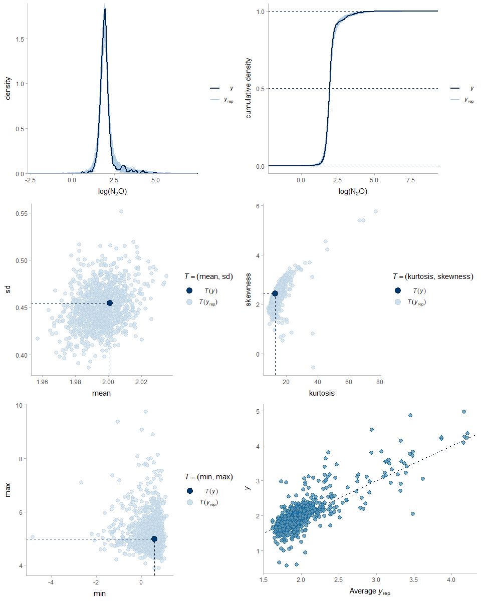

#### 3.4.2.1 Equilibrium N2O

This component of the model also seemed to be an improvement over model
3, with better representation in the tails as indicated in the skewness
*vs.* kurtosis PPC.
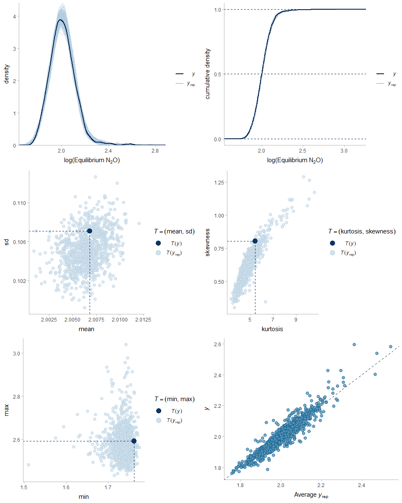

#### 3.4.2.2 Bivariate

Again, an improvement over the previous model with a tighter fit of the
PPC to the observed bivariate density.


#### 3.4.2.3 Saturation

This check also suggested an improvement over the previous models, with
better tail behavior and less bias in the proportion under-saturated
measure.


#### 3.4.2.4 R-square

The Bayesian 
estimates below indicated an improvement from the previous models.

    ##          Estimate Est.Error  Q2.5 Q97.5
    ## R2logn2o    0.606     0.025 0.551 0.651

    ##            Estimate Est.Error  Q2.5 Q97.5
    ## R2logn2oeq    0.875     0.005 0.865 0.883

### 3.4.3 Covariate effects

#### 3.4.3.1 Dissolved N2O

The conditional effects plots for the covariate effects on N2O remained
largely unchanged from the previous model.


Below are estimates of the conditional effects of the covariates on
 for
N2O. These plots suggested a large effect of NO3 on the variance of N2O,
but little to no effect of surface temperature.


#### 3.4.3.2 Equilibrium N2O

The covariate effects on N2O remained largely the same as for the
previous model.
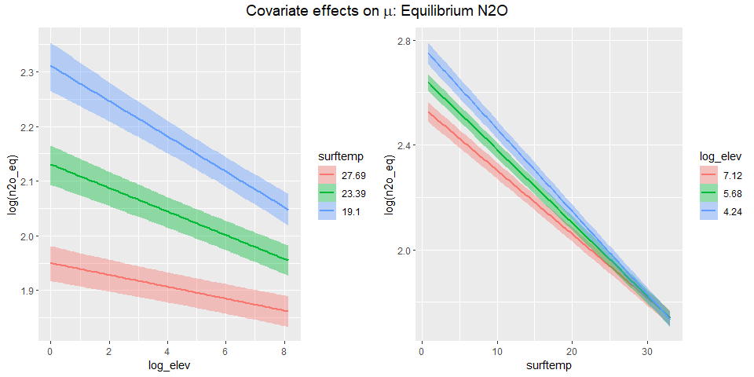

The covariate effects on
 for
N2O-eq suggested an negative effect of surface temperature and litte to
no effect of elevation.


## 3.5 Model 5

In the next model, more complexity is added to the N2O component by
including a covariate for lake surface area (log scale) as well as
interactions between NO3 and log(area) and surface temperature.

``` r
load("C:/Users/rmartin/OneDrive - Environmental Protection Agency (EPA)/Documents/AE_Reservoirs/DissolvedGasNla/modelFiles/df_model.rda")

bf_n2o <- bf(log(n2o) ~ mo(no3_cat) +
               log_area +
               surftemp + 
               mo(no3_cat):log_area +
               mo(no3_cat):surftemp +
               (mo(no3_cat) | a | WSA9) + 
               (mo(no3_cat) | b | WSA9:state) + 
               (1 | c | WSA9:state:size_cat),
             sigma ~ log_area +
               mo(no3_cat) +
               (1 | WSA9) + 
               (1 | WSA9:state) + 
               (1 | WSA9:state:size_cat), 
             family = gaussian())

bf_n2oeq <- bf(log(n2o_eq) ~ surftemp +
                 log_elev +
                 surftemp:log_elev +
                 (1 | a | WSA9) + 
                 (1 | b | WSA9:state) +
                 (1 | c | WSA9:state:size_cat),
             sigma ~ surftemp +
               log_elev +
               (1 | WSA9) + 
               (1 | WSA9:state) + 
               (1 | WSA9:state:size_cat),
             family = gaussian())

priors <- c(
  prior(normal(2, 1), class = "Intercept", resp = "logn2o"),
  prior(normal(0, 1), class = "b", resp = "logn2o"),
  prior(exponential(2), class = "sd", resp = "logn2o"),
  prior(normal(-1, 2), class = "Intercept", dpar = "sigma", resp = "logn2o"),
  prior(normal(0, 1), class = "b", dpar = "sigma", resp = "logn2o"),
  prior(exponential(2), class = "sd", dpar = "sigma", resp = "logn2o"),
  
  prior(normal(2, 1), class = "Intercept", resp = "logn2oeq"), 
  prior(normal(0, 1), class = "b", resp = "logn2oeq"), 
  prior(exponential(2), class = "sd", resp = "logn2oeq"), 
  prior(normal(-1, 2), class = "Intercept", dpar = "sigma", resp = "logn2oeq"),
  prior(normal(0, 1), class = "b", dpar = "sigma", resp = "logn2oeq"),
  prior(exponential(2), class = "sd", dpar = "sigma", resp = "logn2oeq"),
  
  prior(lkj(2), class = "rescor"),
  prior(lkj(2), class = "cor")
  )

n2o_mod5 <- brm(bf_n2o + 
                  bf_n2oeq +
                  set_rescor(rescor = TRUE),
                data = df_model, 
                prior = priors,
  control = list(adapt_delta = 0.975, max_treedepth = 12),
  #sample_prior = "only",
  save_pars = save_pars(all = TRUE),
  seed = 54741,
  chains=4, 
  iter=5000, 
  cores=4)

save(n2o_mod5, file = "C:/Users/rmartin/OneDrive - Environmental Protection Agency (EPA)/Documents/AE_Reservoirs/DissolvedGasNla/modelFiles/n2o_mod5.rda")
```

### 3.5.1 Summarize fit

Below is a summary of the fitted parameters along with MCMC convergence
diagnostics.

    ##  Family: MV(gaussian, gaussian) 
    ##   Links: mu = identity; sigma = log
    ##          mu = identity; sigma = log 
    ## Formula: log(n2o) ~ mo(no3_cat) + log_area + surftemp + mo(no3_cat):log_area + mo(no3_cat):surftemp + (mo(no3_cat) | a | WSA9) + (mo(no3_cat) | b | WSA9:state) + (1 | c | WSA9:state:size_cat) 
    ##          sigma ~ log_area + mo(no3_cat) + (1 | WSA9) + (1 | WSA9:state) + (1 | WSA9:state:size_cat)
    ##          log(n2o_eq) ~ surftemp + log_elev + surftemp:log_elev + (1 | a | WSA9) + (1 | b | WSA9:state) + (1 | c | WSA9:state:size_cat) 
    ##          sigma ~ surftemp + log_elev + (1 | WSA9) + (1 | WSA9:state) + (1 | WSA9:state:size_cat)
    ##    Data: df_model (Number of observations: 984) 
    ##   Draws: 4 chains, each with iter = 5000; warmup = 2500; thin = 1;
    ##          total post-warmup draws = 10000
    ## 
    ## Priors: 
    ## b_logn2o ~ normal(0, 1)
    ## b_logn2o_sigma ~ normal(0, 1)
    ## b_logn2oeq ~ normal(0, 1)
    ## b_logn2oeq_sigma ~ normal(0, 1)
    ## Intercept_logn2o ~ normal(2, 1)
    ## Intercept_logn2o_sigma ~ normal(-1, 2)
    ## Intercept_logn2oeq ~ normal(2, 1)
    ## Intercept_logn2oeq_sigma ~ normal(-1, 2)
    ## L ~ lkj_corr_cholesky(2)
    ## Lrescor ~ lkj_corr_cholesky(2)
    ## <lower=0> sd_logn2o ~ exponential(2)
    ## <lower=0> sd_logn2o_sigma ~ exponential(2)
    ## <lower=0> sd_logn2oeq ~ exponential(2)
    ## <lower=0> sd_logn2oeq_sigma ~ exponential(2)
    ## simo_logn2o_mono3_cat:log_area1 ~ dirichlet(1)
    ## simo_logn2o_mono3_cat:surftemp1 ~ dirichlet(1)
    ## simo_logn2o_mono3_cat1 ~ dirichlet(1)
    ## simo_logn2o_sigma_mono3_cat1 ~ dirichlet(1)
    ## 
    ## Group-Level Effects: 
    ## ~WSA9 (Number of levels: 9) 
    ##                                          Estimate Est.Error l-95% CI u-95% CI
    ## sd(logn2o_Intercept)                        0.048     0.019    0.020    0.094
    ## sd(logn2o_mono3_cat)                        0.081     0.050    0.007    0.199
    ## sd(logn2oeq_Intercept)                      0.034     0.011    0.018    0.062
    ## sd(sigma_logn2o_Intercept)                  0.111     0.076    0.006    0.293
    ## sd(sigma_logn2oeq_Intercept)                0.209     0.102    0.036    0.445
    ## cor(logn2o_Intercept,logn2o_mono3_cat)     -0.056     0.360   -0.713    0.644
    ## cor(logn2o_Intercept,logn2oeq_Intercept)    0.464     0.284   -0.173    0.885
    ## cor(logn2o_mono3_cat,logn2oeq_Intercept)    0.259     0.341   -0.467    0.824
    ##                                           Rhat Bulk_ESS Tail_ESS
    ## sd(logn2o_Intercept)                     1.000     4413     4624
    ## sd(logn2o_mono3_cat)                     1.003     1412     2265
    ## sd(logn2oeq_Intercept)                   1.000     4061     6633
    ## sd(sigma_logn2o_Intercept)               1.000     2790     4064
    ## sd(sigma_logn2oeq_Intercept)             1.001     2176     1898
    ## cor(logn2o_Intercept,logn2o_mono3_cat)   1.000     5823     6525
    ## cor(logn2o_Intercept,logn2oeq_Intercept) 1.000     4935     6214
    ## cor(logn2o_mono3_cat,logn2oeq_Intercept) 1.000     4684     4770
    ## 
    ## ~WSA9:state (Number of levels: 96) 
    ##                                          Estimate Est.Error l-95% CI u-95% CI
    ## sd(logn2o_Intercept)                        0.046     0.014    0.016    0.072
    ## sd(logn2o_mono3_cat)                        0.097     0.024    0.053    0.146
    ## sd(logn2oeq_Intercept)                      0.033     0.003    0.027    0.040
    ## sd(sigma_logn2o_Intercept)                  0.207     0.088    0.024    0.369
    ## sd(sigma_logn2oeq_Intercept)                0.285     0.056    0.177    0.395
    ## cor(logn2o_Intercept,logn2o_mono3_cat)     -0.265     0.284   -0.762    0.336
    ## cor(logn2o_Intercept,logn2oeq_Intercept)    0.163     0.200   -0.232    0.559
    ## cor(logn2o_mono3_cat,logn2oeq_Intercept)    0.266     0.209   -0.155    0.649
    ##                                           Rhat Bulk_ESS Tail_ESS
    ## sd(logn2o_Intercept)                     1.001     1323     1765
    ## sd(logn2o_mono3_cat)                     1.001     2612     2569
    ## sd(logn2oeq_Intercept)                   1.001     3321     5286
    ## sd(sigma_logn2o_Intercept)               1.007      776     1082
    ## sd(sigma_logn2oeq_Intercept)             1.002     2464     3702
    ## cor(logn2o_Intercept,logn2o_mono3_cat)   1.001     1708     3060
    ## cor(logn2o_Intercept,logn2oeq_Intercept) 1.005      960     1715
    ## cor(logn2o_mono3_cat,logn2oeq_Intercept) 1.002      883     1843
    ## 
    ## ~WSA9:state:size_cat (Number of levels: 352) 
    ##                                          Estimate Est.Error l-95% CI u-95% CI
    ## sd(logn2o_Intercept)                        0.035     0.015    0.004    0.062
    ## sd(logn2oeq_Intercept)                      0.003     0.002    0.000    0.007
    ## sd(sigma_logn2o_Intercept)                  0.479     0.056    0.374    0.591
    ## sd(sigma_logn2oeq_Intercept)                0.260     0.052    0.160    0.360
    ## cor(logn2o_Intercept,logn2oeq_Intercept)    0.235     0.413   -0.658    0.872
    ##                                           Rhat Bulk_ESS Tail_ESS
    ## sd(logn2o_Intercept)                     1.004      819     1375
    ## sd(logn2oeq_Intercept)                   1.003     1569     3553
    ## sd(sigma_logn2o_Intercept)               1.006     1318     3346
    ## sd(sigma_logn2oeq_Intercept)             1.001     2326     3796
    ## cor(logn2o_Intercept,logn2oeq_Intercept) 1.002     2950     5425
    ## 
    ## Population-Level Effects: 
    ##                            Estimate Est.Error l-95% CI u-95% CI  Rhat Bulk_ESS
    ## logn2o_Intercept              2.380     0.055    2.273    2.487 1.001     4020
    ## sigma_logn2o_Intercept       -1.596     0.097   -1.789   -1.408 1.002     4961
    ## logn2oeq_Intercept            3.116     0.051    3.019    3.218 1.000     6860
    ## sigma_logn2oeq_Intercept     -1.922     0.374   -2.639   -1.179 1.000     7865
    ## logn2o_log_area               0.029     0.003    0.023    0.034 1.000     9054
    ## logn2o_surftemp              -0.025     0.002   -0.029   -0.021 1.000     3996
    ## sigma_logn2o_log_area        -0.095     0.020   -0.135   -0.055 1.001     6068
    ## logn2oeq_surftemp            -0.042     0.002   -0.046   -0.039 1.000     7418
    ## logn2oeq_log_elev            -0.080     0.008   -0.097   -0.065 1.000     6834
    ## logn2oeq_surftemp:log_elev    0.003     0.000    0.002    0.003 1.000     7339
    ## sigma_logn2oeq_surftemp      -0.065     0.010   -0.085   -0.046 1.000     9671
    ## sigma_logn2oeq_log_elev      -0.018     0.038   -0.096    0.054 1.000     6265
    ## logn2o_mono3_cat              0.026     0.127   -0.226    0.275 1.004     1971
    ## logn2o_mono3_cat:log_area    -0.036     0.010   -0.054   -0.016 1.001     2602
    ## logn2o_mono3_cat:surftemp     0.014     0.006    0.003    0.026 1.004     1478
    ## sigma_logn2o_mono3_cat        0.246     0.036    0.179    0.321 1.001     4246
    ##                            Tail_ESS
    ## logn2o_Intercept               6632
    ## sigma_logn2o_Intercept         6145
    ## logn2oeq_Intercept             7546
    ## sigma_logn2oeq_Intercept       7774
    ## logn2o_log_area                8090
    ## logn2o_surftemp                7106
    ## sigma_logn2o_log_area          7491
    ## logn2oeq_surftemp              8290
    ## logn2oeq_log_elev              7865
    ## logn2oeq_surftemp:log_elev     7992
    ## sigma_logn2oeq_surftemp        8132
    ## sigma_logn2oeq_log_elev        7038
    ## logn2o_mono3_cat               3252
    ## logn2o_mono3_cat:log_area      4549
    ## logn2o_mono3_cat:surftemp      2416
    ## sigma_logn2o_mono3_cat         6738
    ## 
    ## Simplex Parameters: 
    ##                               Estimate Est.Error l-95% CI u-95% CI  Rhat
    ## logn2o_mono3_cat1[1]             0.026     0.024    0.001    0.089 1.001
    ## logn2o_mono3_cat1[2]             0.091     0.066    0.005    0.252 1.001
    ## logn2o_mono3_cat1[3]             0.250     0.146    0.034    0.615 1.002
    ## logn2o_mono3_cat1[4]             0.633     0.166    0.206    0.867 1.003
    ## logn2o_mono3_cat:log_area1[1]    0.060     0.041    0.005    0.161 1.000
    ## logn2o_mono3_cat:log_area1[2]    0.042     0.039    0.001    0.142 1.000
    ## logn2o_mono3_cat:log_area1[3]    0.297     0.161    0.047    0.681 1.000
    ## logn2o_mono3_cat:log_area1[4]    0.602     0.176    0.166    0.865 1.000
    ## logn2o_mono3_cat:surftemp1[1]    0.043     0.040    0.006    0.144 1.002
    ## logn2o_mono3_cat:surftemp1[2]    0.080     0.056    0.015    0.222 1.001
    ## logn2o_mono3_cat:surftemp1[3]    0.276     0.111    0.105    0.573 1.001
    ## logn2o_mono3_cat:surftemp1[4]    0.601     0.142    0.168    0.785 1.002
    ## sigma_logn2o_mono3_cat1[1]       0.131     0.074    0.010    0.288 1.000
    ## sigma_logn2o_mono3_cat1[2]       0.151     0.096    0.010    0.367 1.000
    ## sigma_logn2o_mono3_cat1[3]       0.444     0.149    0.149    0.734 1.001
    ## sigma_logn2o_mono3_cat1[4]       0.275     0.138    0.026    0.544 1.001
    ##                               Bulk_ESS Tail_ESS
    ## logn2o_mono3_cat1[1]              4261     5305
    ## logn2o_mono3_cat1[2]              1875     3916
    ## logn2o_mono3_cat1[3]              2027     2856
    ## logn2o_mono3_cat1[4]              1411     2439
    ## logn2o_mono3_cat:log_area1[1]     4395     3509
    ## logn2o_mono3_cat:log_area1[2]     7129     6046
    ## logn2o_mono3_cat:log_area1[3]     5220     5683
    ## logn2o_mono3_cat:log_area1[4]     4431     4505
    ## logn2o_mono3_cat:surftemp1[1]     3541     3002
    ## logn2o_mono3_cat:surftemp1[2]     3667     2580
    ## logn2o_mono3_cat:surftemp1[3]     3634     3352
    ## logn2o_mono3_cat:surftemp1[4]     2731     2289
    ## sigma_logn2o_mono3_cat1[1]        6840     4269
    ## sigma_logn2o_mono3_cat1[2]        7630     5795
    ## sigma_logn2o_mono3_cat1[3]        6331     6964
    ## sigma_logn2o_mono3_cat1[4]        4902     5797
    ## 
    ## Residual Correlations: 
    ##                         Estimate Est.Error l-95% CI u-95% CI  Rhat Bulk_ESS
    ## rescor(logn2o,logn2oeq)    0.141     0.038    0.066    0.216 1.000    11829
    ##                         Tail_ESS
    ## rescor(logn2o,logn2oeq)     8204
    ## 
    ## Draws were sampled using sampling(NUTS). For each parameter, Bulk_ESS
    ## and Tail_ESS are effective sample size measures, and Rhat is the potential
    ## scale reduction factor on split chains (at convergence, Rhat = 1).

### 3.5.2 Model checks

Again, the same PPCs as above were performed for this model. \####
Dissolved N2O This PPC for N2O looked similar to the previous model.


#### 3.5.2.1 Equilibrium N2O

Again, the PPCs for this model were similar to the previous model, which
was unsurprising given that it was the same model for N2O-eq.


#### 3.5.2.2 Bivariate

This PPC was also similar to the previous model.
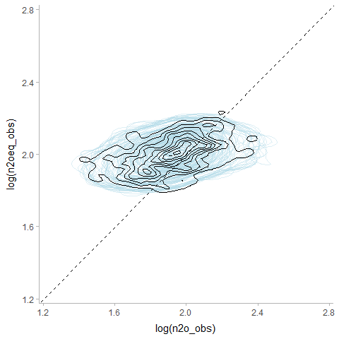

#### 3.5.2.3 Saturation

This check was also similar to the prevoius model, with perhaps slightly
less bias in the proportion unsaturated estimates. There is also a
potentially concerning extreme prediction in the observed *vs* predicted
PPC.
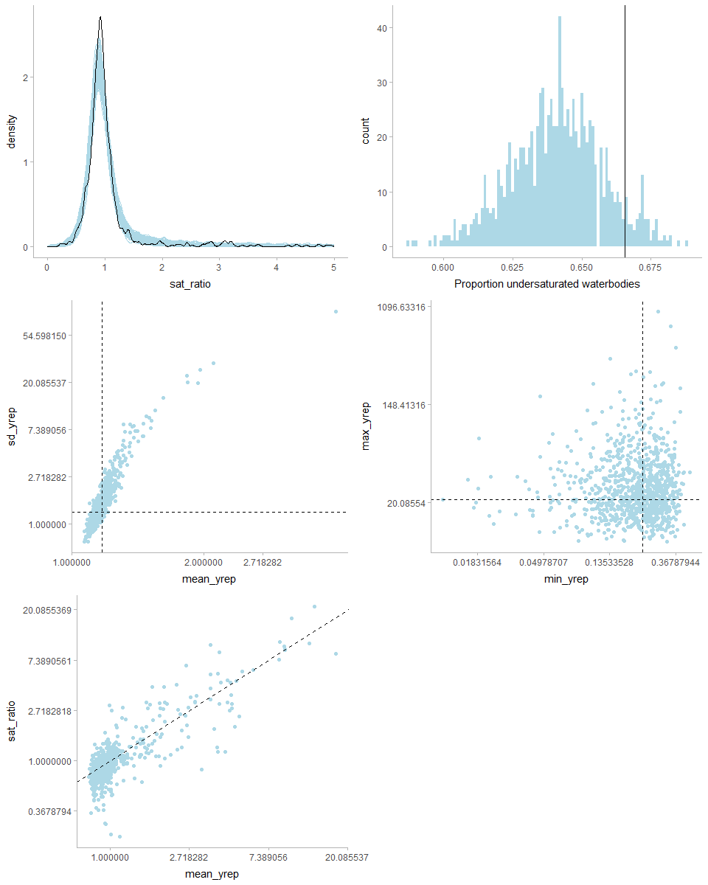

#### 3.5.2.4 R-square

    ##          Estimate Est.Error  Q2.5 Q97.5
    ## R2logn2o    0.629      0.03 0.563  0.68

    ##            Estimate Est.Error  Q2.5 Q97.5
    ## R2logn2oeq    0.874     0.005 0.864 0.882

### 3.5.3 Covariate effects

#### 3.5.3.1 Dissolved N2O

The conditional effects plot for the covariate effects N2O suggested a
similar effect of NO3, but interesting interactions between NO3 and lake
area and NO3 and surface temperature. For lake area, the effect was
estimated to be larger and more negative at the highest levels of NO3;
and slightly negative at the lowest level of NO3. For surface
temperature, the effect was estimated to be largest and positive at the
highest level of NO3; and negative at the lowest level of NO3.
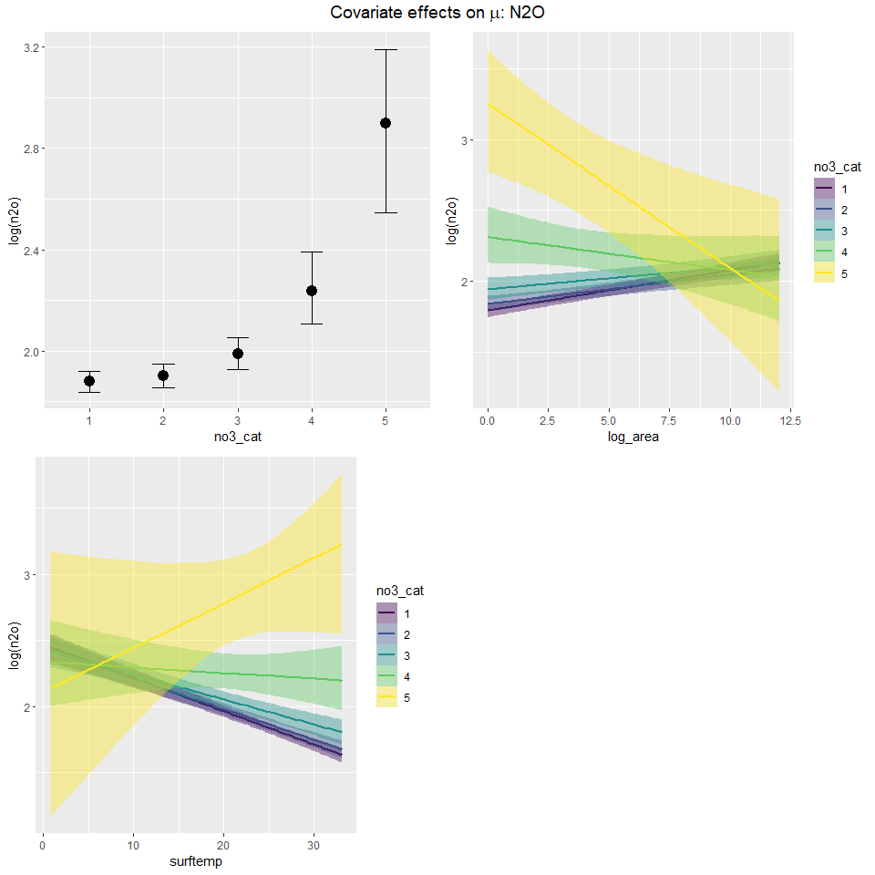

The estimated covariate effects on

suggested a negative relationship with log(area) and a positive
relationship, again, with NO3.
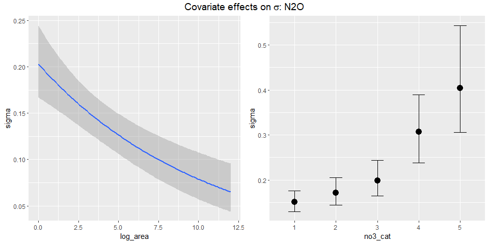

#### 3.5.3.2 Equilibrium N2O

The estimated covariate effect on N2O remained largely the same as
estimated in the previous model.


## 3.6 A Final Model

As demonstrated above, models excluding the NO3 covariate consistently
resulted in poorer fits to to the observed dissolved N2O data. Including
surface temperature and elevation in the equilibrium N2O part of the
model resulted in substantially improved replication of key aspects of
the observed data. Likewise, added flexibility in the distributional
terms for both dissolved and equilibrium N2O led to improvements.

To make inferences from this model for N2O in the population of
interest, however, the included covariates needed to be (1) fully
observed across that population or (2) their missingness needed to be
modeled. For the lake area and elevation covariates, data *was*
available for all lakes from previously compiled geospatial databases.
However, neither surface temperature or NO3 were observed for lakes
outside of the sample. They were partially observed with respect to the
target population. Their missingness needed to be accounted for in a
model. Therefore, a more complex model was constructed below that
included surface temperature and NO3 as additional responses conditioned
on the survey design variables and fully observed covariates. This
approach to inference for N2O was similar to a Bayesian structural
equation model ([Merkle et al. 2021](#ref-Merkle_etal_2021); [Merkle and
Rosseel 2018](#ref-Merkle_Rosseel_2018)). The main details of the
logical dependence structure could be characterized as:

![\\begin{align} 
\\color{#1F449C}{\\boldsymbol{N_2O\_{diss}}} \\sim Survey + Area + \\color{#F05039}{\\boldsymbol{NO_3}} + \\color{#EEBAB4}{\\boldsymbol{Temp}} \\\\ 
\\color{#A8B6CC}{\\boldsymbol{N_2O\_{equil}}} \\sim Survey + Elev  + \\color{#EEBAB4}{\\boldsymbol{Temp}}\\\\
\\color{#F05039}{\\boldsymbol{NO_3}} \\sim Survey + Area + \\color{#EEBAB4}{\\boldsymbol{Temp}} \\\\ 
\\color{#EEBAB4}{\\boldsymbol{Temp}} \\sim Survey + Lat + Elev + Day
\\end{align}](https://latex.codecogs.com/svg.image?%5Cbegin%7Balign%7D%20%0A%5Ccolor%7B%231F449C%7D%7B%5Cboldsymbol%7BN_2O_%7Bdiss%7D%7D%7D%20%5Csim%20Survey%20%2B%20Area%20%2B%20%5Ccolor%7B%23F05039%7D%7B%5Cboldsymbol%7BNO_3%7D%7D%20%2B%20%5Ccolor%7B%23EEBAB4%7D%7B%5Cboldsymbol%7BTemp%7D%7D%20%5C%5C%20%0A%5Ccolor%7B%23A8B6CC%7D%7B%5Cboldsymbol%7BN_2O_%7Bequil%7D%7D%7D%20%5Csim%20Survey%20%2B%20Elev%20%20%2B%20%5Ccolor%7B%23EEBAB4%7D%7B%5Cboldsymbol%7BTemp%7D%7D%5C%5C%0A%5Ccolor%7B%23F05039%7D%7B%5Cboldsymbol%7BNO_3%7D%7D%20%5Csim%20Survey%20%2B%20Area%20%2B%20%5Ccolor%7B%23EEBAB4%7D%7B%5Cboldsymbol%7BTemp%7D%7D%20%5C%5C%20%0A%5Ccolor%7B%23EEBAB4%7D%7B%5Cboldsymbol%7BTemp%7D%7D%20%5Csim%20Survey%20%2B%20Lat%20%2B%20Elev%20%2B%20Day%0A%5Cend%7Balign%7D "\begin{align} 
\color{#1F449C}{\boldsymbol{N_2O_{diss}}} \sim Survey + Area + \color{#F05039}{\boldsymbol{NO_3}} + \color{#EEBAB4}{\boldsymbol{Temp}} \\ 
\color{#A8B6CC}{\boldsymbol{N_2O_{equil}}} \sim Survey + Elev  + \color{#EEBAB4}{\boldsymbol{Temp}}\\
\color{#F05039}{\boldsymbol{NO_3}} \sim Survey + Area + \color{#EEBAB4}{\boldsymbol{Temp}} \\ 
\color{#EEBAB4}{\boldsymbol{Temp}} \sim Survey + Lat + Elev + Day
\end{align}")

Variables in color text above were treated as partially observed with
respect to the population of interest (i.e., observed only in the
sample), whereas variables in black text were considered fully observed.
The partially observed variables, being dissolved and equilibrium N2O,
NO3, and surface temperature, were each modeled conditional on the
survey design variables and other partially and/or fully observed
covariates. This structural equation approach requires a more complex
set of post-processing steps compared to a typical MRP analysis. In
order to propagate estimates and uncertainty through the dependency
structure and make inferences, the fitted model was used to first
predict surface temperature in the target population, since it depended
only on the fully observed covariates. That predictive distribution was
then used alongside the relevant fully observed covariates to predict
NO3 in the target population. Finally, the predictive distributions for
termperature and NO3 were used to predict the N2O responses. These steps
were carried out in the “Predict to population” section to follow.

In the final model below, the submodel for surface temperature assumed a
Gamma distributed error distribution and the linear predictor included
the survey design variables, latitude, elevation, and julian date. The
shape parameter was also modeled as a function of latitude to address
increasing response variance along the latitudinal gradient. The NO3
submodel was a cumulative logit formulation and the linear predictor
included all of the survey factors as well as surface temperature and
lake area.

The N2O and N2O-eq responses were each modeled with Gamma distributed
errors, but with the same covariate structure as in model 5. The same
structure was also employed for the shape terms in these responses,
corresponding to the
 terms
in the previous model. Though not shown in this document, the Gamma
error structure appeared to result in slightly better performance in the
predictive checks compared to the Gaussian errors in previous models.
This was primarily apparent in the saturation ratio checks, which may
have been more sensitive to model performance in the tails of the N2O
responses. Others have also indicated that the Gamma error distribution
can work well for dissolved N2O data ([Webb et al.
2019](#ref-Webb_etal_2019)).

Note that there was no residual correlation term for this model, since
the residuals are undefined for the Gamma and cumulative logit models.
Dropping the observation-level residual correlation term was deemed a
reasonable compromise that enabled modeling the missingness of NO3, in
particular. Nevertheless, the random intercepts again allowed for
potential correlations between responses at the group levels.

``` r
load("C:/Users/rmartin/OneDrive - Environmental Protection Agency (EPA)/Documents/AE_Reservoirs/DissolvedGasNla/modelFiles/df_model.rda")

bf_n2o <- bf(n2o ~ mo(no3_cat) +
               log_area +
               surftemp + 
               mo(no3_cat):log_area +
               mo(no3_cat):surftemp +
               (mo(no3_cat) | a | WSA9) + 
               (mo(no3_cat) | b | WSA9:state) + 
               (1 | c | WSA9:state:size_cat),
             shape ~ log_area +
               mo(no3_cat) +
               (1 | WSA9) + 
               (1 | WSA9:state) + 
               (1 | WSA9:state:size_cat),
             family = Gamma(link = "log"))

bf_n2oeq <- bf(n2o_eq ~ surftemp +
                 log_elev +
                 surftemp:log_elev +
                 (1 | a | WSA9) + 
                 (1 | b | WSA9:state) +
                 (1 | c | WSA9:state:size_cat),
             shape ~ surftemp +
               log_elev +
               (1 | WSA9) + 
               (1 | WSA9:state) + 
               (1 | WSA9:state:size_cat),
             family = Gamma(link = "log"))

bf_temp <- bf(surftemp ~ lat +
                s(log_elev) +
                s(jdate) +
                (1 | a | WSA9) + 
                (1 | b | WSA9:state) +
                (1 | c | WSA9:state:size_cat),
              shape ~ lat,
              family = Gamma(link = "log"))

bf_no3 <- bf(no3_cat ~ surftemp +
               log_area +
               (1 | a | WSA9) +
               (1 | b | WSA9:state) +
               (1 | c | WSA9:state:size_cat),
             family = cumulative(link = "logit", threshold="flexible"))

priors <- c(
  prior(normal(2, 1), class = "Intercept", resp = "n2o"),
  prior(normal(0, 1), class = "b", resp = "n2o"),
  prior(exponential(2), class = "sd", resp = "n2o"),
  prior(normal(5, 4), class = "Intercept", dpar = "shape", resp = "n2o"),
  prior(normal(0, 1), class = "b", dpar = "shape", resp = "n2o"),
  prior(exponential(2), class = "sd", dpar = "shape", resp = "n2o"),
  
  prior(normal(2, 1), class = "Intercept", resp = "n2oeq"), 
  prior(normal(0, 1), class = "b", resp = "n2oeq"),  
  prior(exponential(2), class = "sd", resp = "n2oeq"),
  prior(normal(5, 4), class = "Intercept", dpar = "shape", resp = "n2oeq"),
  prior(normal(0, 1), class = "b", dpar = "shape", resp = "n2oeq"),
  prior(exponential(2), class = "sd", dpar = "shape", resp = "n2oeq"),
  
  prior(normal(3, 1), class = "Intercept", resp = "surftemp"), 
  prior(normal(0, 1), class = "b", resp = "surftemp"), 
  prior(exponential(0.5), class = "sds", resp = "surftemp"),
  prior(exponential(2), class = "sd", resp = "surftemp"),
  prior(normal(5, 4), class = "Intercept", dpar = "shape", resp = "surftemp"),
  prior(normal(0, 1), class = "b", dpar = "shape", resp = "surftemp"),
  
  prior(normal(0, 3), class = "Intercept", resp = "no3cat"),
  prior(normal(0, 1), class = "b", resp = "no3cat"),
  prior(exponential(1), class = "sd", resp = "no3cat"),
  
  prior(lkj(2), class = "cor")
  )

n2o_mod6 <- brm(bf_n2o + 
                  bf_n2oeq + 
                  bf_temp + 
                  bf_no3 + 
                  set_rescor(rescor = FALSE),
                data = df_model, 
                prior = priors,
  control = list(adapt_delta = 0.975, max_treedepth = 14),
  #sample_prior = "only",
  save_pars = save_pars(all = TRUE),
  seed = 85132,#14548,
  #init = my_inits,
  init_r = 0.5,
  chains=4, 
  iter=5000, 
  cores=4)

save(n2o_mod6, file = "C:/Users/rmartin/OneDrive - Environmental Protection Agency (EPA)/Documents/AE_Reservoirs/DissolvedGasNla/modelFiles/n2o_mod6.rda")
```

### 3.6.1 Summarize fit

Below is a summary of the fitted parameters and MCMC diagnostics.

    ##  Family: MV(gamma, gamma, gamma, cumulative) 
    ##   Links: mu = log; shape = log
    ##          mu = log; shape = log
    ##          mu = log; shape = log
    ##          mu = logit; disc = identity 
    ## Formula: n2o ~ mo(no3_cat) + log_area + surftemp + mo(no3_cat):log_area + mo(no3_cat):surftemp + (mo(no3_cat) | a | WSA9) + (mo(no3_cat) | b | WSA9:state) + (1 | c | WSA9:state:size_cat) 
    ##          shape ~ log_area + mo(no3_cat) + (1 | WSA9) + (1 | WSA9:state) + (1 | WSA9:state:size_cat)
    ##          n2o_eq ~ surftemp + log_elev + surftemp:log_elev + (1 | a | WSA9) + (1 | b | WSA9:state) + (1 | c | WSA9:state:size_cat) 
    ##          shape ~ surftemp + log_elev + (1 | WSA9) + (1 | WSA9:state) + (1 | WSA9:state:size_cat)
    ##          surftemp ~ lat + s(log_elev) + s(jdate) + (1 | a | WSA9) + (1 | b | WSA9:state) + (1 | c | WSA9:state:size_cat) 
    ##          shape ~ lat
    ##          no3_cat ~ surftemp + log_area + (1 | a | WSA9) + (1 | b | WSA9:state) + (1 | c | WSA9:state:size_cat) 
    ##    Data: df_model (Number of observations: 984) 
    ##   Draws: 4 chains, each with iter = 5000; warmup = 2500; thin = 1;
    ##          total post-warmup draws = 10000
    ## 
    ## Priors: 
    ## b_n2o ~ normal(0, 1)
    ## b_n2o_shape ~ normal(0, 1)
    ## b_n2oeq ~ normal(0, 1)
    ## b_n2oeq_shape ~ normal(0, 1)
    ## b_no3cat ~ normal(0, 1)
    ## b_surftemp ~ normal(0, 1)
    ## b_surftemp_shape ~ normal(0, 1)
    ## Intercept_n2o ~ normal(2, 1)
    ## Intercept_n2o_shape ~ normal(5, 4)
    ## Intercept_n2oeq ~ normal(2, 1)
    ## Intercept_n2oeq_shape ~ normal(5, 4)
    ## Intercept_no3cat ~ normal(0, 3)
    ## Intercept_surftemp ~ normal(3, 1)
    ## Intercept_surftemp_shape ~ normal(5, 4)
    ## L ~ lkj_corr_cholesky(2)
    ## <lower=0> sd_n2o ~ exponential(2)
    ## <lower=0> sd_n2o_shape ~ exponential(2)
    ## <lower=0> sd_n2oeq ~ exponential(2)
    ## <lower=0> sd_n2oeq_shape ~ exponential(2)
    ## <lower=0> sd_no3cat ~ exponential(1)
    ## <lower=0> sd_surftemp ~ exponential(2)
    ## <lower=0> sds_surftemp ~ exponential(0.5)
    ## simo_n2o_mono3_cat:log_area1 ~ dirichlet(1)
    ## simo_n2o_mono3_cat:surftemp1 ~ dirichlet(1)
    ## simo_n2o_mono3_cat1 ~ dirichlet(1)
    ## simo_n2o_shape_mono3_cat1 ~ dirichlet(1)
    ## 
    ## Smooth Terms: 
    ##                           Estimate Est.Error l-95% CI u-95% CI  Rhat Bulk_ESS
    ## sds(surftemp_slog_elev_1)    1.161     0.370    0.638    2.079 1.001     2264
    ## sds(surftemp_sjdate_1)       0.571     0.277    0.226    1.273 1.000     2679
    ##                           Tail_ESS
    ## sds(surftemp_slog_elev_1)     4174
    ## sds(surftemp_sjdate_1)        4853
    ## 
    ## Group-Level Effects: 
    ## ~WSA9 (Number of levels: 9) 
    ##                                          Estimate Est.Error l-95% CI u-95% CI
    ## sd(n2o_Intercept)                           0.048     0.018    0.020    0.091
    ## sd(n2o_mono3_cat)                           0.045     0.035    0.002    0.129
    ## sd(n2oeq_Intercept)                         0.033     0.011    0.018    0.061
    ## sd(surftemp_Intercept)                      0.031     0.014    0.011    0.064
    ## sd(no3cat_Intercept)                        0.690     0.256    0.296    1.308
    ## sd(shape_n2o_Intercept)                     0.211     0.141    0.011    0.535
    ## sd(shape_n2oeq_Intercept)                   0.402     0.183    0.075    0.814
    ## cor(n2o_Intercept,n2o_mono3_cat)           -0.049     0.336   -0.667    0.614
    ## cor(n2o_Intercept,n2oeq_Intercept)          0.393     0.268   -0.202    0.824
    ## cor(n2o_mono3_cat,n2oeq_Intercept)          0.102     0.328   -0.559    0.686
    ## cor(n2o_Intercept,surftemp_Intercept)      -0.350     0.296   -0.839    0.285
    ## cor(n2o_mono3_cat,surftemp_Intercept)       0.089     0.333   -0.564    0.703
    ## cor(n2oeq_Intercept,surftemp_Intercept)    -0.167     0.299   -0.705    0.437
    ## cor(n2o_Intercept,no3cat_Intercept)        -0.057     0.295   -0.605    0.522
    ## cor(n2o_mono3_cat,no3cat_Intercept)         0.141     0.333   -0.539    0.724
    ## cor(n2oeq_Intercept,no3cat_Intercept)       0.272     0.274   -0.305    0.740
    ## cor(surftemp_Intercept,no3cat_Intercept)    0.185     0.300   -0.436    0.718
    ##                                           Rhat Bulk_ESS Tail_ESS
    ## sd(n2o_Intercept)                        1.000     3011     2931
    ## sd(n2o_mono3_cat)                        1.003     1540     3502
    ## sd(n2oeq_Intercept)                      1.000     3147     4572
    ## sd(surftemp_Intercept)                   1.001     3705     4498
    ## sd(no3cat_Intercept)                     1.000     4184     5618
    ## sd(shape_n2o_Intercept)                  1.000     2379     3641
    ## sd(shape_n2oeq_Intercept)                1.001     2208     1617
    ## cor(n2o_Intercept,n2o_mono3_cat)         1.000     6558     6134
    ## cor(n2o_Intercept,n2oeq_Intercept)       1.000     4604     6010
    ## cor(n2o_mono3_cat,n2oeq_Intercept)       1.000     3241     5029
    ## cor(n2o_Intercept,surftemp_Intercept)    1.000     4744     5916
    ## cor(n2o_mono3_cat,surftemp_Intercept)    1.000     5246     6447
    ## cor(n2oeq_Intercept,surftemp_Intercept)  1.000     7342     7508
    ## cor(n2o_Intercept,no3cat_Intercept)      1.000     5152     6479
    ## cor(n2o_mono3_cat,no3cat_Intercept)      1.002     3435     5897
    ## cor(n2oeq_Intercept,no3cat_Intercept)    1.001     6449     7400
    ## cor(surftemp_Intercept,no3cat_Intercept) 1.000     6490     7928
    ## 
    ## ~WSA9:state (Number of levels: 96) 
    ##                                          Estimate Est.Error l-95% CI u-95% CI
    ## sd(n2o_Intercept)                           0.047     0.013    0.021    0.072
    ## sd(n2o_mono3_cat)                           0.101     0.019    0.068    0.142
    ## sd(n2oeq_Intercept)                         0.033     0.003    0.026    0.040
    ## sd(surftemp_Intercept)                      0.035     0.006    0.023    0.047
    ## sd(no3cat_Intercept)                        0.878     0.128    0.649    1.147
    ## sd(shape_n2o_Intercept)                     0.383     0.178    0.032    0.707
    ## sd(shape_n2oeq_Intercept)                   0.561     0.114    0.336    0.781
    ## cor(n2o_Intercept,n2o_mono3_cat)           -0.145     0.254   -0.602    0.376
    ## cor(n2o_Intercept,n2oeq_Intercept)          0.183     0.189   -0.180    0.549
    ## cor(n2o_mono3_cat,n2oeq_Intercept)          0.201     0.164   -0.122    0.519
    ## cor(n2o_Intercept,surftemp_Intercept)      -0.023     0.237   -0.476    0.438
    ## cor(n2o_mono3_cat,surftemp_Intercept)      -0.232     0.215   -0.644    0.194
    ## cor(n2oeq_Intercept,surftemp_Intercept)    -0.134     0.190   -0.494    0.246
    ## cor(n2o_Intercept,no3cat_Intercept)         0.462     0.211    0.018    0.822
    ## cor(n2o_mono3_cat,no3cat_Intercept)         0.145     0.200   -0.251    0.531
    ## cor(n2oeq_Intercept,no3cat_Intercept)       0.054     0.140   -0.220    0.329
    ## cor(surftemp_Intercept,no3cat_Intercept)   -0.231     0.189   -0.586    0.154
    ##                                           Rhat Bulk_ESS Tail_ESS
    ## sd(n2o_Intercept)                        1.004     1025     1337
    ## sd(n2o_mono3_cat)                        1.001     3366     4975
    ## sd(n2oeq_Intercept)                      1.001     2809     4611
    ## sd(surftemp_Intercept)                   1.000     4124     5116
    ## sd(no3cat_Intercept)                     1.000     4389     6247
    ## sd(shape_n2o_Intercept)                  1.004      649     1304
    ## sd(shape_n2oeq_Intercept)                1.002     1908     1810
    ## cor(n2o_Intercept,n2o_mono3_cat)         1.002     1069     1955
    ## cor(n2o_Intercept,n2oeq_Intercept)       1.003      794     1260
    ## cor(n2o_mono3_cat,n2oeq_Intercept)       1.002      833     1873
    ## cor(n2o_Intercept,surftemp_Intercept)    1.004     1849     3618
    ## cor(n2o_mono3_cat,surftemp_Intercept)    1.001     2626     4267
    ## cor(n2oeq_Intercept,surftemp_Intercept)  1.000     6340     6860
    ## cor(n2o_Intercept,no3cat_Intercept)      1.004      893     1944
    ## cor(n2o_mono3_cat,no3cat_Intercept)      1.000     1746     3085
    ## cor(n2oeq_Intercept,no3cat_Intercept)    1.000     6378     7983
    ## cor(surftemp_Intercept,no3cat_Intercept) 1.001     3573     5949
    ## 
    ## ~WSA9:state:size_cat (Number of levels: 352) 
    ##                                          Estimate Est.Error l-95% CI u-95% CI
    ## sd(n2o_Intercept)                           0.038     0.014    0.006    0.064
    ## sd(n2oeq_Intercept)                         0.004     0.002    0.000    0.008
    ## sd(surftemp_Intercept)                      0.010     0.007    0.000    0.024
    ## sd(no3cat_Intercept)                        0.308     0.182    0.016    0.673
    ## sd(shape_n2o_Intercept)                     0.895     0.110    0.684    1.114
    ## sd(shape_n2oeq_Intercept)                   0.511     0.104    0.309    0.715
    ## cor(n2o_Intercept,n2oeq_Intercept)          0.310     0.349   -0.486    0.841
    ## cor(n2o_Intercept,surftemp_Intercept)       0.015     0.365   -0.677    0.705
    ## cor(n2oeq_Intercept,surftemp_Intercept)    -0.102     0.381   -0.761    0.659
    ## cor(n2o_Intercept,no3cat_Intercept)        -0.090     0.342   -0.716    0.601
    ## cor(n2oeq_Intercept,no3cat_Intercept)      -0.143     0.359   -0.757    0.611
    ## cor(surftemp_Intercept,no3cat_Intercept)    0.173     0.378   -0.599    0.807
    ##                                           Rhat Bulk_ESS Tail_ESS
    ## sd(n2o_Intercept)                        1.011      580     1036
    ## sd(n2oeq_Intercept)                      1.009     1062     3160
    ## sd(surftemp_Intercept)                   1.003     1917     3889
    ## sd(no3cat_Intercept)                     1.002     1078     2386
    ## sd(shape_n2o_Intercept)                  1.002     1068     2786
    ## sd(shape_n2oeq_Intercept)                1.002     1397     2071
    ## cor(n2o_Intercept,n2oeq_Intercept)       1.004     2099     4705
    ## cor(n2o_Intercept,surftemp_Intercept)    1.000     4876     6414
    ## cor(n2oeq_Intercept,surftemp_Intercept)  1.001     4195     5741
    ## cor(n2o_Intercept,no3cat_Intercept)      1.001     3188     5334
    ## cor(n2oeq_Intercept,no3cat_Intercept)    1.001     2749     4946
    ## cor(surftemp_Intercept,no3cat_Intercept) 1.001     2607     5750
    ## 
    ## Population-Level Effects: 
    ##                          Estimate Est.Error l-95% CI u-95% CI  Rhat Bulk_ESS
    ## n2o_Intercept               2.392     0.056    2.285    2.500 1.000     3063
    ## shape_n2o_Intercept         3.215     0.189    2.849    3.589 1.001     3997
    ## n2oeq_Intercept             3.111     0.053    3.011    3.218 1.000     5146
    ## shape_n2oeq_Intercept       3.873     0.751    2.385    5.326 1.001     5619
    ## surftemp_Intercept          3.791     0.060    3.672    3.906 1.000     7414
    ## shape_surftemp_Intercept    8.637     0.460    7.721    9.522 1.001    10817
    ## no3cat_Intercept[1]        -3.025     0.615   -4.258   -1.864 1.000     5932
    ## no3cat_Intercept[2]        -2.059     0.605   -3.274   -0.903 1.000     6278
    ## no3cat_Intercept[3]        -1.027     0.600   -2.235    0.115 1.000     6689
    ## no3cat_Intercept[4]        -0.028     0.602   -1.247    1.113 1.000     7002
    ## n2o_log_area                0.028     0.003    0.022    0.034 1.000     6958
    ## n2o_surftemp               -0.025     0.002   -0.029   -0.021 1.000     3145
    ## shape_n2o_log_area          0.190     0.041    0.110    0.271 1.000     4322
    ## n2oeq_surftemp             -0.042     0.002   -0.045   -0.038 1.000     5836
    ## n2oeq_log_elev             -0.080     0.008   -0.097   -0.064 1.000     5425
    ## n2oeq_surftemp:log_elev     0.002     0.000    0.002    0.003 1.000     5857
    ## shape_n2oeq_surftemp        0.131     0.020    0.092    0.171 1.001     6725
    ## shape_n2oeq_log_elev        0.030     0.077   -0.117    0.186 1.001     4914
    ## surftemp_lat               -0.016     0.001   -0.019   -0.013 1.000     7349
    ## shape_surftemp_lat         -0.105     0.011   -0.127   -0.083 1.000    11330
    ## no3cat_surftemp            -0.141     0.023   -0.187   -0.096 1.001     6713
    ## no3cat_log_area             0.068     0.035   -0.001    0.137 1.000    11692
    ## surftemp_slog_elev_1       -3.477     0.479   -4.414   -2.557 1.000     5891
    ## surftemp_sjdate_1          -0.008     0.528   -1.074    1.017 1.000     4010
    ## n2o_mono3_cat               0.007     0.087   -0.172    0.175 1.004     1650
    ## n2o_mono3_cat:log_area     -0.046     0.009   -0.063   -0.027 1.001     2079
    ## n2o_mono3_cat:surftemp      0.018     0.004    0.009    0.026 1.004     1417
    ## shape_n2o_mono3_cat        -0.510     0.070   -0.649   -0.375 1.001     4691
    ##                          Tail_ESS
    ## n2o_Intercept                5517
    ## shape_n2o_Intercept          6108
    ## n2oeq_Intercept              6075
    ## shape_n2oeq_Intercept        6535
    ## surftemp_Intercept           7632
    ## shape_surftemp_Intercept     7718
    ## no3cat_Intercept[1]          6622
    ## no3cat_Intercept[2]          6695
    ## no3cat_Intercept[3]          6957
    ## no3cat_Intercept[4]          6940
    ## n2o_log_area                 7668
    ## n2o_surftemp                 6260
    ## shape_n2o_log_area           5605
    ## n2oeq_surftemp               6494
    ## n2oeq_log_elev               6234
    ## n2oeq_surftemp:log_elev      6696
    ## shape_n2oeq_surftemp         7112
    ## shape_n2oeq_log_elev         6636
    ## surftemp_lat                 7598
    ## shape_surftemp_lat           7919
    ## no3cat_surftemp              7328
    ## no3cat_log_area              8177
    ## surftemp_slog_elev_1         6330
    ## surftemp_sjdate_1            5523
    ## n2o_mono3_cat                1855
    ## n2o_mono3_cat:log_area       2821
    ## n2o_mono3_cat:surftemp       1621
    ## shape_n2o_mono3_cat          6283
    ## 
    ## Simplex Parameters: 
    ##                            Estimate Est.Error l-95% CI u-95% CI  Rhat Bulk_ESS
    ## n2o_mono3_cat1[1]             0.025     0.023    0.001    0.083 1.000     4899
    ## n2o_mono3_cat1[2]             0.183     0.111    0.014    0.425 1.002     1056
    ## n2o_mono3_cat1[3]             0.408     0.158    0.103    0.725 1.002     2167
    ## n2o_mono3_cat1[4]             0.384     0.169    0.058    0.713 1.003     1608
    ## n2o_mono3_cat:log_area1[1]    0.046     0.029    0.003    0.112 1.000     4018
    ## n2o_mono3_cat:log_area1[2]    0.033     0.028    0.001    0.104 1.001     6173
    ## n2o_mono3_cat:log_area1[3]    0.289     0.134    0.057    0.598 1.000     3286
    ## n2o_mono3_cat:log_area1[4]    0.631     0.140    0.301    0.864 1.000     3186
    ## n2o_mono3_cat:surftemp1[1]    0.028     0.019    0.003    0.060 1.001     3744
    ## n2o_mono3_cat:surftemp1[2]    0.066     0.033    0.011    0.128 1.001     3821
    ## n2o_mono3_cat:surftemp1[3]    0.281     0.079    0.122    0.431 1.003     2897
    ## n2o_mono3_cat:surftemp1[4]    0.625     0.088    0.461    0.798 1.003     2740
    ## shape_n2o_mono3_cat1[1]       0.116     0.067    0.009    0.263 1.001     5363
    ## shape_n2o_mono3_cat1[2]       0.149     0.096    0.008    0.365 1.001     3469
    ## shape_n2o_mono3_cat1[3]       0.401     0.151    0.116    0.703 1.001     4122
    ## shape_n2o_mono3_cat1[4]       0.334     0.143    0.051    0.604 1.001     3853
    ##                            Tail_ESS
    ## n2o_mono3_cat1[1]              5237
    ## n2o_mono3_cat1[2]              3343
    ## n2o_mono3_cat1[3]              4583
    ## n2o_mono3_cat1[4]              3021
    ## n2o_mono3_cat:log_area1[1]     3309
    ## n2o_mono3_cat:log_area1[2]     4948
    ## n2o_mono3_cat:log_area1[3]     4461
    ## n2o_mono3_cat:log_area1[4]     4184
    ## n2o_mono3_cat:surftemp1[1]     3410
    ## n2o_mono3_cat:surftemp1[2]     3213
    ## n2o_mono3_cat:surftemp1[3]     2971
    ## n2o_mono3_cat:surftemp1[4]     3106
    ## shape_n2o_mono3_cat1[1]        4297
    ## shape_n2o_mono3_cat1[2]        3637
    ## shape_n2o_mono3_cat1[3]        5848
    ## shape_n2o_mono3_cat1[4]        4561
    ## 
    ## Family Specific Parameters: 
    ##             Estimate Est.Error l-95% CI u-95% CI Rhat Bulk_ESS Tail_ESS
    ## disc_no3cat    1.000     0.000    1.000    1.000   NA       NA       NA
    ## 
    ## Draws were sampled using sampling(NUTS). For each parameter, Bulk_ESS
    ## and Tail_ESS are effective sample size measures, and Rhat is the potential
    ## scale reduction factor on split chains (at convergence, Rhat = 1).

### 3.6.2 Model checks

Below, the same PPCs for N2O and N2O-eq were employed as before. \####
Dissolved N2O The PPCs for N2O from this model were similarly reasonable
as for models 4 and 5 above.


#### 3.6.2.1 Equilibrium N2O

Again, the PPCs for N2O-eq in this model were similar to those for
models 4 and 5.


#### 3.6.2.2 Bivariate

This model again provided a very reasonable representation of the
bivariate relationship between N2O and N2O-eq (below).
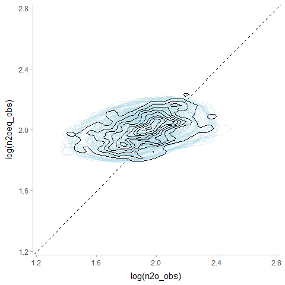

#### 3.6.2.3 Saturation

The saturation ratio PPCs below show similar behavior as with models 4
and 5 above, but with perhaps slightly less bias in the predictions for
the proportion of undersaturated waterbodies and fewer extreme
predictions for the means and standard deviations. The observed *vs.*
predicted PPC also appears to have a better behaved variance and no
extreme predictions, compared to models 4 and 5 with the lognormal
errors.
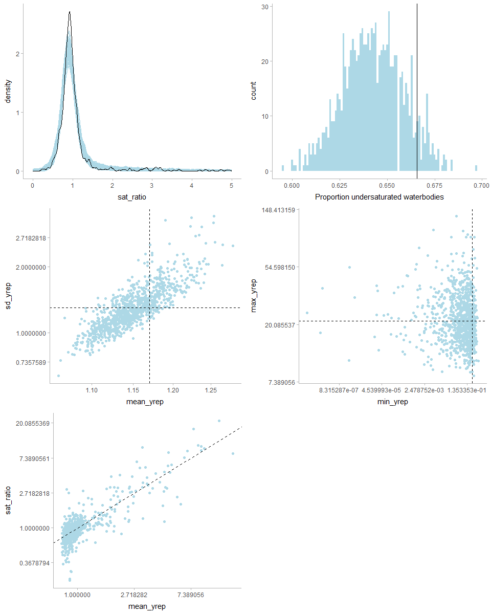

The plot below shows the same PPC, but for the “test” or second-vist
data. Overall, the model looked to perform similarly as with the data
used to fit it.


#### 3.6.2.4 R-square

Below are estimates for the Bayesian
, which were
largely similar for N2O and N2O-eq as with models 4 and 5 above. The
 for the surface
temperature response also suggested a fairly good fit.

    ##       Estimate Est.Error  Q2.5 Q97.5
    ## R2n2o    0.646     0.059 0.503 0.731

    ##         Estimate Est.Error  Q2.5 Q97.5
    ## R2n2oeq    0.863     0.006 0.851 0.874

    ##            Estimate Est.Error  Q2.5 Q97.5
    ## R2surftemp    0.744      0.01 0.723 0.763

Below are the same
 estimates, but
for the second-visit data. That these estimates are similar to those for
the data used to fit the model, suggesting that the model may perform
similarly well out-of-sample.

    ##       Estimate Est.Error  Q2.5 Q97.5
    ## R2n2o    0.607     0.137 0.325  0.85

    ##         Estimate Est.Error Q2.5 Q97.5
    ## R2n2oeq    0.857     0.008 0.84 0.872

    ##            Estimate Est.Error  Q2.5 Q97.5
    ## R2surftemp     0.75     0.018 0.715 0.783

### 3.6.3 Covariate effects

#### 3.6.3.1 Dissolved N2O

The conditional effects plot for the covariate effects N2O suggested a
similar effect of NO3, but interesting interactions between NO3 and lake
area and NO3 and surface temperature. For lake area, the effect was
estimated to be larger and more negative at the highest levels of NO3;
and slightly negative at the lowest level of NO3. For surface
temperature, the effect was estimated to be largest and positive at the
highest level of NO3; and negative at the lowest level of NO3.
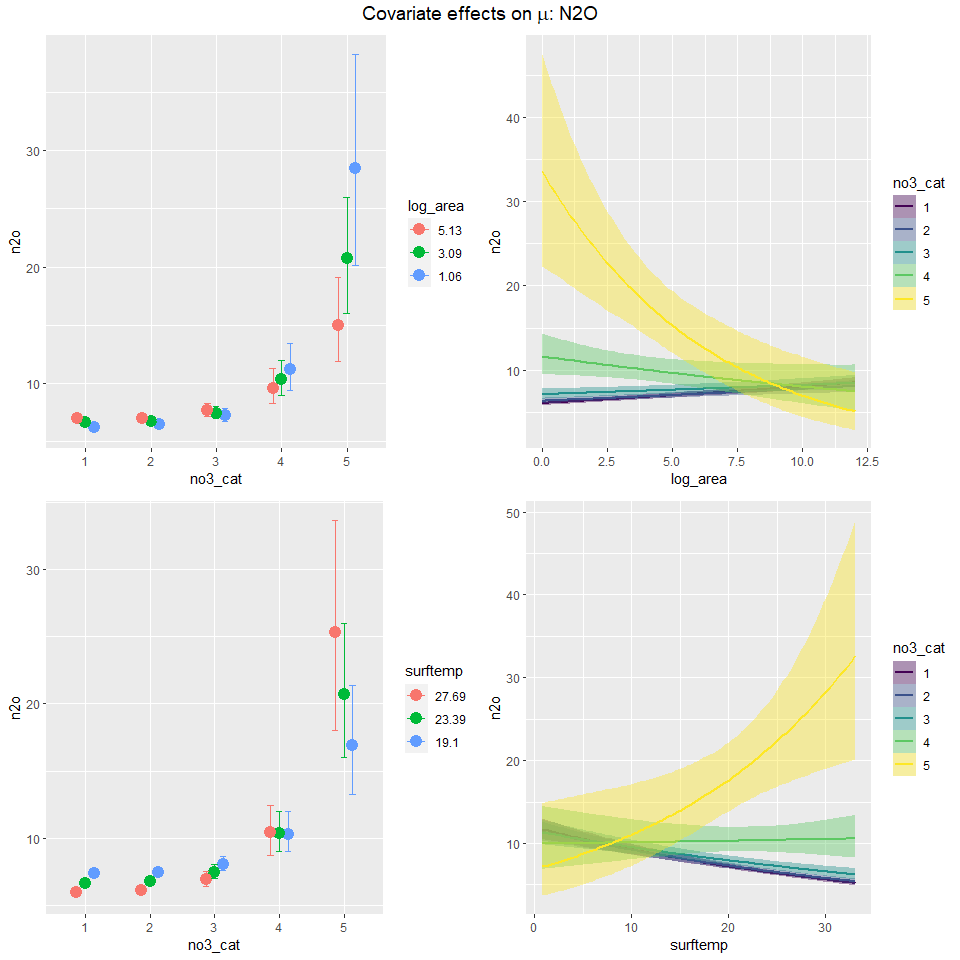

The estimated covariate effects on

suggested a negative relationship with log(area) and a positive
relationship, again, with NO3.
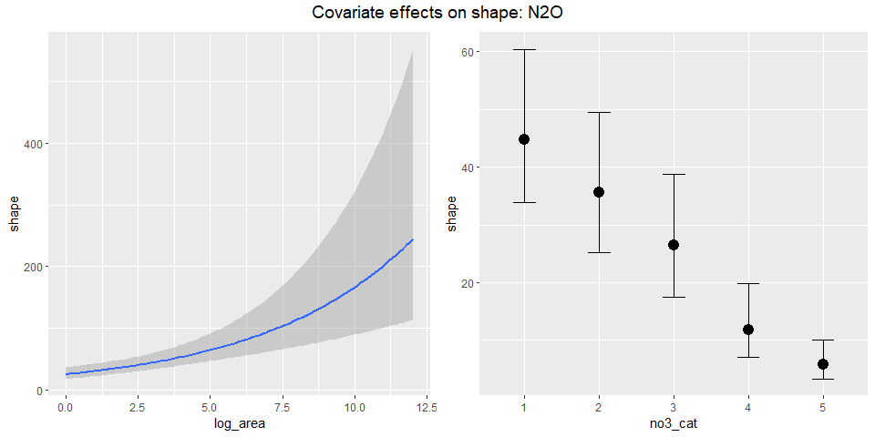

#### 3.6.3.2 Equilibrium N2O

The estimated covariate effect on N2O remained largely the same as
estimated in the previous model.
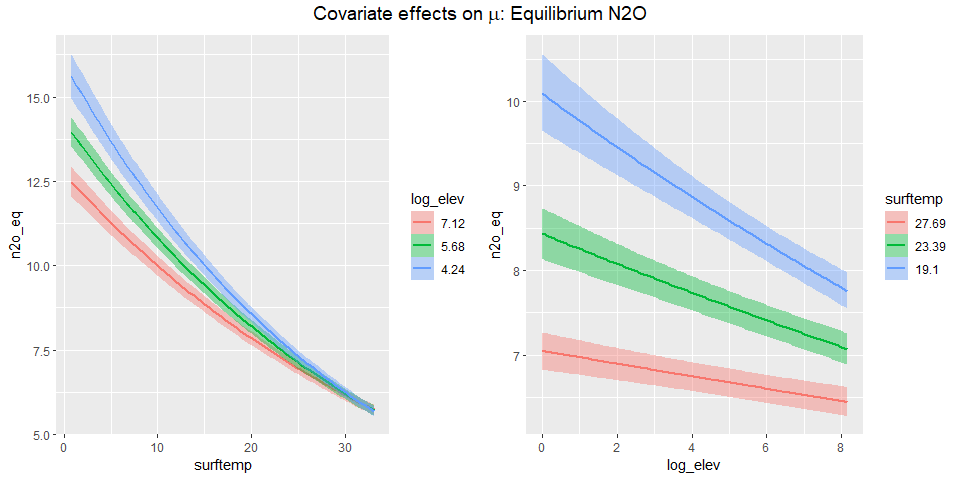


# 4 Predict to population

As previously described, in order to make inferences to the population
of interest, the final model above was used to, first, predict surface
temperature in the target population, since it depended only on the
fully observed covariates. Next, the predictive distribution for surface
temperature was used, along with the relevant fully observed covariates,
to predict NO3 in the target population. Finally, the predictive
distributions for temperature and NO3 were used to predict the N2O
responses. The code for these steps is outlined in the following.

The first step used the final model to predict to the population:

``` r
load("C:/Users/rmartin/OneDrive - Environmental Protection Agency (EPA)/Documents/AE_Reservoirs/DissolvedGasNla/modelFiles/sframe.rda")
load("C:/Users/rmartin/OneDrive - Environmental Protection Agency (EPA)/Documents/AE_Reservoirs/DissolvedGasNla/modelFiles/n2o_mod6.rda")

predict_temp <- sframe %>%
  mutate(jdate = 205) %>%
  add_predicted_draws(n2o_mod6, resp=c("surftemp"), 
                      allow_new_levels = TRUE, 
                      cores =1, 
                      ndraws = 500) %>%
  mutate(surftemp = .prediction)

save(predict_temp, file = "C:/Users/rmartin/OneDrive - Environmental Protection Agency (EPA)/Documents/AE_Reservoirs/DissolvedGasNla/modelFiles/predict_temp.rda")
```

NO3 was next predicted. Note that the posterior predictive distribution
for NO3 was subsampled in order to minimize excess simulations

``` r
load("C:/Users/rmartin/OneDrive - Environmental Protection Agency (EPA)/Documents/AE_Reservoirs/DissolvedGasNla/modelFiles/n2o_mod6.rda")
load("C:/Users/rmartin/OneDrive - Environmental Protection Agency (EPA)/Documents/AE_Reservoirs/DissolvedGasNla/modelFiles/predict_temp.rda")

temp_X <- predict_temp %>% # select relevant columns as predictors
  ungroup() %>%
  select(WSA9,
         state,
         size_cat,
         log_area,
         .row,
         .draw,
         surftemp) %>%
  select(WSA9, state, size_cat, log_area, surftemp)


rm(predict_temp) # reduce memory
gc()

# set number of cores to use for parallel predictions
# and register the workers
cl <- parallel::makeCluster(5) 
doSNOW::registerDoSNOW(cl) 

# make a progress bar
pb <- txtProgressBar(max = 1500, style = 3)
progress <- function(n) setTxtProgressBar(pb, n)
opts <- list(progress = progress)

system.time( # approx 26 hrs with 5 workers & 500 draws from PPD
predict_no3 <- foreach(sub_X = isplitRows(temp_X, chunkSize = 155299), 
                       .combine = 'c',
                       .packages = c("brms"),
                       .options.snow = opts
                       ) %dopar% {
                         apply(brms::posterior_predict(n2o_mod6,
                                                 newdata = sub_X,
                                                 resp = "no3cat",
                                                 allow_new_levels = T,
                                                 ndraws = 500,
                                                 cores = 1), 2, sample, 1)
                         }
)


close(pb)
parallel::stopCluster(cl)

save(predict_no3, file = "C:/Users/rmartin/OneDrive - Environmental Protection Agency (EPA)/Documents/AE_Reservoirs/DissolvedGasNla/modelFiles/predict_no3.rda")
```

Finally, N2O and N2O-eq were predicted using the surface temperature and
nitrate predictions along with the survey variables and known
covariates. Again, the posterior was subsampled in order to reduce
excess simulations.

``` r
load("C:/Users/rmartin/OneDrive - Environmental Protection Agency (EPA)/Documents/AE_Reservoirs/DissolvedGasNla/modelFiles/predict_no3.rda")
load("C:/Users/rmartin/OneDrive - Environmental Protection Agency (EPA)/Documents/AE_Reservoirs/DissolvedGasNla/modelFiles/predict_temp.rda")

# Assemble dataframe containing relevant covariates (known and predicted)
n2o_X <- predict_temp %>%
  ungroup() %>%
  mutate(no3_cat = predict_no3) %>%
  select(WSA9,
         state,
         size_cat,
         log_area,
         surftemp,
         log_elev,
         no3_cat)

# clear objects to reduce memory overhead
rm(predict_no3, predict_temp) 
gc()

# save the predictors for n2o and n2oeq
save(n2o_X, file = "C:/Users/rmartin/OneDrive - Environmental Protection Agency (EPA)/Documents/AE_Reservoirs/DissolvedGasNla/modelFiles/n2o_X.rda")
```

``` r
load("C:/Users/rmartin/OneDrive - Environmental Protection Agency (EPA)/Documents/AE_Reservoirs/DissolvedGasNla/modelFiles/n2o_mod6.rda")
load("C:/Users/rmartin/OneDrive - Environmental Protection Agency (EPA)/Documents/AE_Reservoirs/DissolvedGasNla/modelFiles/n2o_X.rda")

# set number of cores to use for parallel predictions
# and register the workers
cl <- parallel::makeCluster(6) 
doSNOW::registerDoSNOW(cl) 

# make a progress bar
pb <- txtProgressBar(max = 1500, style = 3)
progress <- function(n) setTxtProgressBar(pb, n)
opts <- list(progress = progress)

# make predictions in parallel
system.time(
predict_n2o <- foreach(sub_X = isplitRows(n2o_X, chunkSize = 155299),
                 .combine = rbind,
                 .options.snow = opts,
                 .packages = c("brms")) %dopar% {
  apply(posterior_predict(n2o_mod6,
                          newdata = sub_X,
                          resp = c("n2o", "n2oeq"),
                          allow_new_levels = T,
                          ndraws = 500,
                          cores = 1),
        2, sample, 1)
                   }
)

close(pb)
parallel::stopCluster(cl)

colnames(predict_n2o) <- c("n2o", "n2oeq")

save(predict_n2o, file = "C:/Users/rmartin/OneDrive - Environmental Protection Agency (EPA)/Documents/AE_Reservoirs/DissolvedGasNla/modelFiles/predict_n2o.rda")
```

Finally, the predictions for all four partially observed responses were
assembled into a new dataframe for use in inference.

``` r
load("C:/Users/rmartin/OneDrive - Environmental Protection Agency (EPA)/Documents/AE_Reservoirs/DissolvedGasNla/modelFiles/predict_n2o.rda")
load("C:/Users/rmartin/OneDrive - Environmental Protection Agency (EPA)/Documents/AE_Reservoirs/DissolvedGasNla/modelFiles/predict_no3.rda")
load("C:/Users/rmartin/OneDrive - Environmental Protection Agency (EPA)/Documents/AE_Reservoirs/DissolvedGasNla/modelFiles/predict_temp.rda")

all_predictions <- predict_temp %>%
  ungroup() %>%
  mutate(no3cat = predict_no3) %>%
  bind_cols(predict_n2o) %>%
  mutate(n2osat = n2o / n2oeq, # calculate saturation ratio
         .row = rep(1:465897, each = 500),
         .draw = rep(seq(1,500, 1), 465897)) %>%
  mutate(area_ha = exp(log_area)) %>% # include area on ha scale
  select(WSA9,
         state,
         size_cat,
         area_ha,
         lat,
         lon,
         .row,
         .draw,
         surftemp,
         no3cat,
         n2o,
         n2oeq,
         n2osat)

rm(predict_n2o, predict_temp, predict_no3) # clean up workspace for RAM
gc()
 

save(all_predictions, file = "C:/Users/rmartin/OneDrive - Environmental Protection Agency (EPA)/Documents/AE_Reservoirs/DissolvedGasNla/modelFiles/all_predictions.rda")
```

# 5 Population estimates

A number of estimates for the target population were assembled and
presented below. First, the full posterior predictive distributions for
dissolved N2O, equilibrium N2o, and the saturation ratio were assessed.
These distributions summarized the predicted distribution of
concentrations or ratios for all lakes in the population of interest and
included parameter uncertainty propagated through the model. Next,
population means were assessed, followed by comparisons of some
model-based estimates to previously calculated design-based estimates.

## 5.1 Posterior predictive distributions

Below, a density plot summarized the posterior predictive distribution
of N2O and N2O-eq concentrations across the target population of lakes,
based on 500 draws from the posterior predictive distribution. Note that
the x-axis was truncated at 50 nmol/L for a clearer visualization of the
bulk of the predicted distribution. For reference, the max predicted
value was 4403.2 nmol/L for dissolved N2O, 20.4 nmol/L for dissolved
N2O, and 793.5 for the saturation ratio.
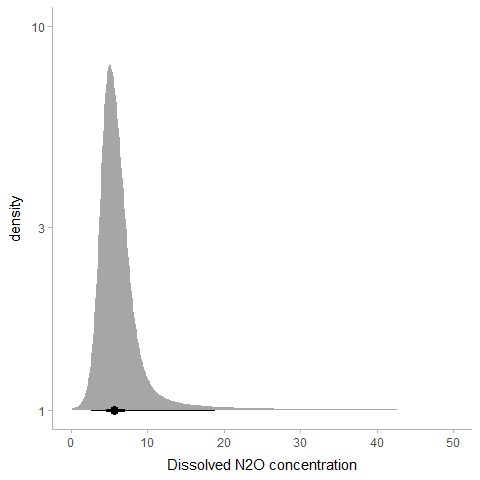


## 5.2 Estimated means

### 5.2.1 National

Below are density plots summarizing the posterior distribution of
*means* for N2O concentrations and the saturation ratio for the target
population (i.e., all US lakes \> 1ha in the lower 48 states).
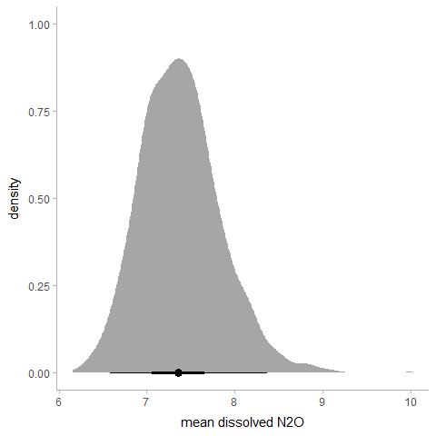


To illustrate the skewness in the predictive distribution for the
saturation ratio, an estimate for the median ratio is shown below. The
entire posterior distribution of the mean above is larger than 1, the
ratio representing the boundary of under- *vs.* oversaturation. By
comparison, the posterior estimate of the median below only included
values less than one, suggesting that though the mean saturation ratio
was greater than 1, most lakes in the national populaiton were
undersaturated (i.e., ratio less than 1). In distributions with
right-skew, the mean can often be considerably larger than the median.
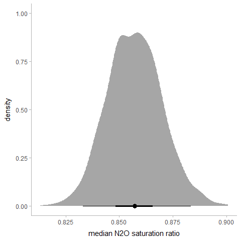

Below is a plot of the posterior mean estimate for the proportion of
unsaturated lakes at the national scale.
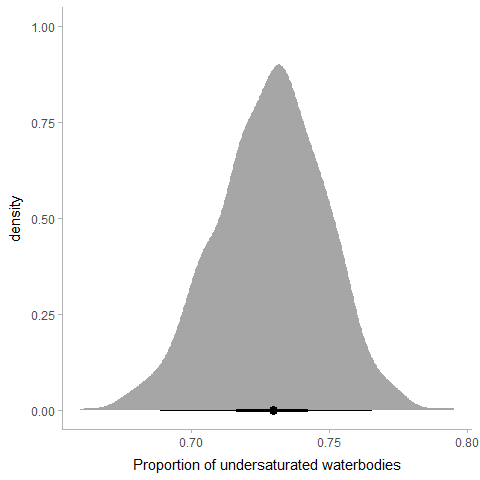

### 5.2.2 Ecoregion

Below are posterior estimates of the means for dissolved and equilibrium
N2O and the saturation ratio by WSA9 ecoregion.
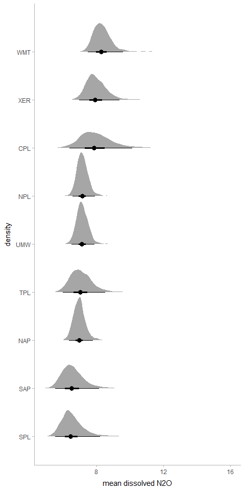

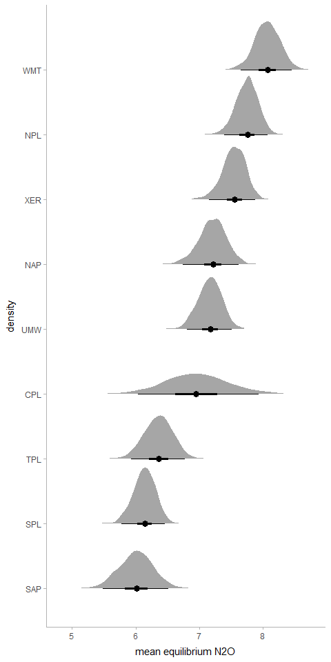


A plot of the posterior estimates for the median saturation ratio below
indicated, again, that most lakes in each ecoregion were undersaturated
(i.e., median \<\< 1).


A plot of the estimates of the proportion of under-saturated lakes by
ecoregion is below. A plot of the posterior estimates for the median
saturation ratio below indicated, again, that most lakes in each
ecoregion were undersaturated (i.e., median \<\< 1).
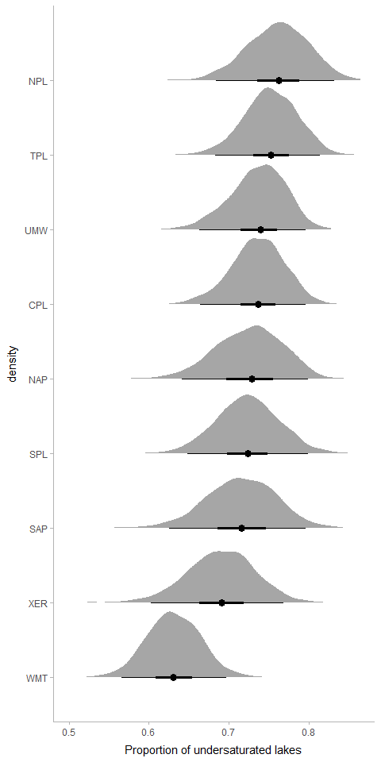

### 5.2.3 State

Comparisons of mean estimates (posterior median, upper and lower 95th
percentiles) by state are below. Density estimates were not included to
minimize plot space.


Below, a plot of estimates for the mean (black circles) and median (grey
circles) saturation ratio by state. A horizontal, dashed, black line is
shown at ratio = 1, indicating the boundary for under- *vs.*
oversaturation. Only a few states (e.g., NV, DE) had median estimates
that were 1 or greater, suggesting that, for most states, most lakes
were undersaturated.
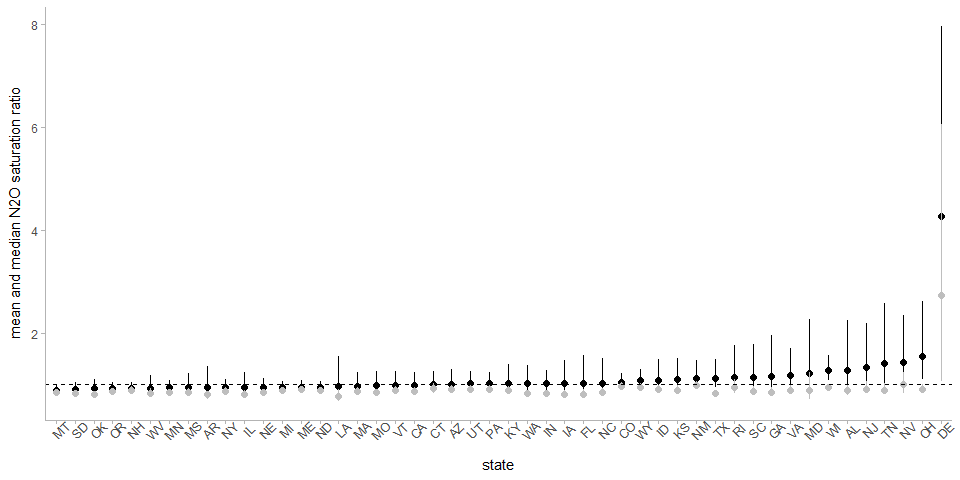

Finally, a plot of the estimated proportion of undersaturated lakes for
each state in the target population. Point estimates are the posterior
median of the proportion and bars are the upper and lower boundaries of
the central 95th percentile of the posterior distributions of
proportions.


### 5.2.4 Size category

The estimated means by size category are below for dissolved and
equilibrium N2O and the saturation ratio. Median estimates for the
saturation ratio are also shown.
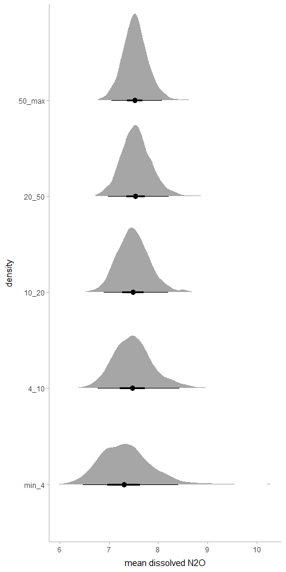


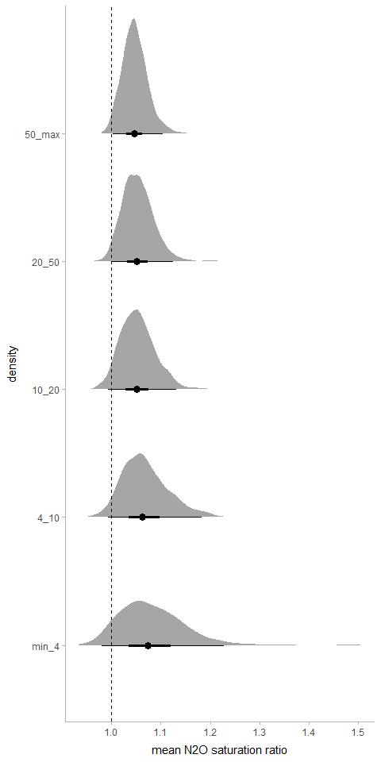

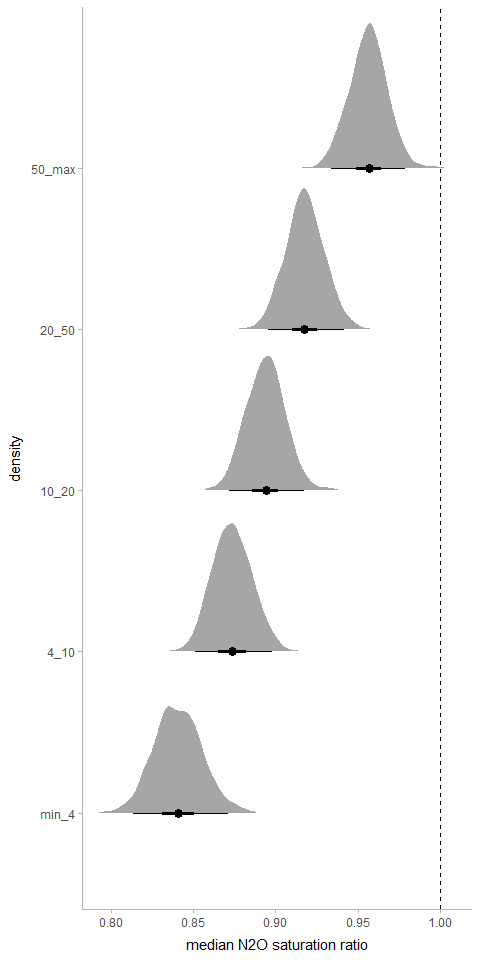

Mean *vs.* median below.


And, finally, the estimated proportion of undersaturated lakes in the
target population by size category
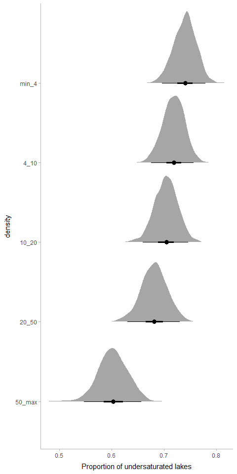

## 5.3 Model- *vs.* design-based

Below, estimates from the model-based approach are compared to
design-based estimates. In general, the model estimates were similar to
the design-based estimates. Model estimates were typically within the
confidence bounds of the design-based estimates, but with much greater
precision. Improved precision was expected due to the “shrinkage”
induced by the multilevel parameterization, which allowed some
“borrowing” of information across the various levels of the survey
factors.

### 5.3.1 Dissolved N2O

Below, National mean estimates for dissolved N2O from the model and
design-based approaches were compared. The sample-based estimate was
also included as a naive reference.

``` r
load("C:/Users/rmartin/OneDrive - Environmental Protection Agency (EPA)/Documents/AE_Reservoirs/DissolvedGasNla/modelFiles/df_model.rda")
load("C:/Users/rmartin/OneDrive - Environmental Protection Agency (EPA)/Documents/AE_Reservoirs/DissolvedGasNla/modelFiles/n2o_survey_ests.rda")
#load("C:/Users/rmartin/OneDrive - Environmental Protection Agency (EPA)/Documents/AE_Reservoirs/DissolvedGasNla/modelFiles/all_predictions.rda")

all_predictions %>%
  group_by(.draw) %>%
  summarise(mean_n2o = mean(n2o)) %>%
  summarise(estimate = round(median(mean_n2o), 2), # posterior median
    LCL = round(quantile(mean_n2o, probs = 0.025), 2),
    UCL = round(quantile(mean_n2o, probs = 0.975), 2)) %>% 
  mutate(type = "model") %>%
  bind_rows(cbind(n2o_survey_ests[10, 2:4], type = rep("survey", 1))) %>%
  add_row(estimate = round(mean(df_model$n2o), 2),
          type = "sample") %>%
  print()
```

    ## # A tibble: 3 x 4
    ##   estimate   LCL   UCL type  
    ##      <dbl> <dbl> <dbl> <chr> 
    ## 1     7.51  7.36  7.63 model 
    ## 2     8.1   7     9.1  survey
    ## 3     8.72 NA    NA    sample

The black, vertical, dashed line in the figure below represents the mean
of the sample.
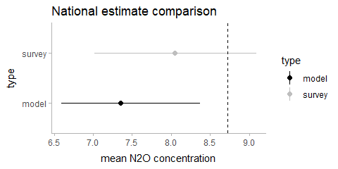

Below, estimates were compared by ecoregion.

``` r
#load("C:/Users/rmartin/OneDrive - Environmental Protection Agency (EPA)/Documents/AE_Reservoirs/DissolvedGasNla/modelFiles/all_predictions.rda")
#load("C:/Users/rmartin/OneDrive - Environmental Protection Agency (EPA)/Documents/AE_Reservoirs/DissolvedGasNla/modelFiles/n2o_survey_ests.rda")

all_predictions %>%
  group_by(WSA9, .draw) %>%
  summarise(mean_n2o = mean(n2o)) %>%
  group_by(WSA9, .groups = "drop") %>%
  summarise(estimate = round(median(mean_n2o), 2),
    LCL = round(quantile(mean_n2o, probs = 0.025), 2),
    UCL = round(quantile(mean_n2o, probs = 0.975), 2),
    .groups = "drop") %>% 
  mutate(ecoregion = factor(WSA9)) %>%
  mutate(type = "model") %>%
  select(ecoregion, estimate, LCL, UCL, type) %>%
  mutate(ecoregion = forcats::fct_reorder(ecoregion, estimate)) %>%
  bind_rows(cbind(n2o_survey_ests[-10,], type = rep("survey", 9))) %>%
  arrange(ecoregion) %>%
  print()
```

    ## # A tibble: 18 x 5
    ##    ecoregion estimate   LCL   UCL type  
    ##    <fct>        <dbl> <dbl> <dbl> <chr> 
    ##  1 NPL           6.95  6.8   7.1  model 
    ##  2 NPL           6.9   6.4   7.4  survey
    ##  3 SPL           7.07  6.84  7.31 model 
    ##  4 SPL           6.5   4.9   8.1  survey
    ##  5 NAP           7.33  7.15  7.5  model 
    ##  6 NAP           7.7   7.2   8.1  survey
    ##  7 CPL           7.49  7.23  7.7  model 
    ##  8 CPL           8.4   5.1  11.7  survey
    ##  9 UMW           7.57  7.43  7.72 model 
    ## 10 UMW          10.8   6.4  15.2  survey
    ## 11 SAP           7.62  7.37  7.85 model 
    ## 12 SAP           7.1   5.9   8.2  survey
    ## 13 XER           7.65  7.41  7.85 model 
    ## 14 XER          10.6   7.5  13.7  survey
    ## 15 WMT           7.8   7.66  7.93 model 
    ## 16 WMT           7.8   7.1   8.4  survey
    ## 17 TPL           7.96  7.76  8.18 model 
    ## 18 TPL           7.8   5.9   9.6  survey


Means were compared according to size categories below.

    ## # A tibble: 10 x 5
    ##    size   estimate   LCL   UCL type  
    ##    <ord>     <dbl> <dbl> <dbl> <chr> 
    ##  1 4_10        7.5   7.4   7.7 model 
    ##  2 4_10        7.6   6.5   8.8 survey
    ##  3 10_20       7.5   7.3   7.6 model 
    ##  4 10_20       7.6   7.1   8.1 survey
    ##  5 50_max      7.5   7.4   7.6 model 
    ##  6 50_max      8     7.4   8.5 survey
    ##  7 min_4       7.5   7.3   7.6 model 
    ##  8 min_4       8.2   6.4   9.9 survey
    ##  9 20_50       7.6   7.4   7.7 model 
    ## 10 20_50       8.6   7.7   9.5 survey

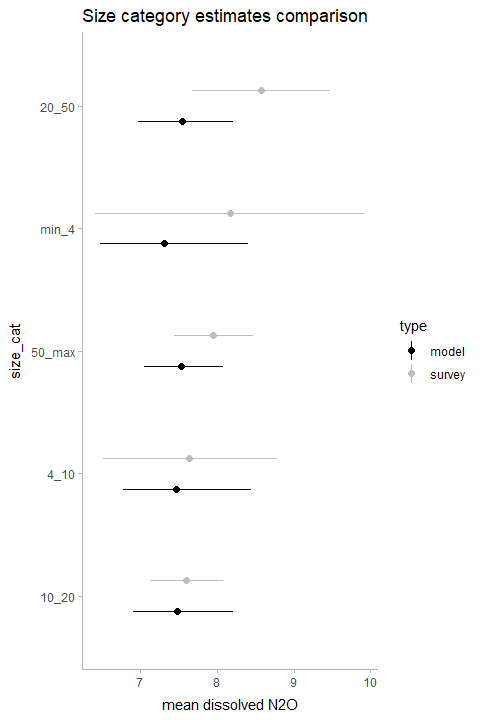

### 5.3.2 Saturation

Below, the same comparisons were made for the saturation estimates.

``` r
#load("C:/Users/rmartin/OneDrive - Environmental Protection Agency (EPA)/Documents/AE_Reservoirs/DissolvedGasNla/modelFiles/df_model.rda")
#load("C:/Users/rmartin/OneDrive - Environmental Protection Agency (EPA)/Documents/AE_Reservoirs/DissolvedGasNla/modelFiles/all_predictions.rda")
load("C:/Users/rmartin/OneDrive - Environmental Protection Agency (EPA)/Documents/AE_Reservoirs/DissolvedGasNla/modelFiles/sat_survey_ests.rda")

all_predictions %>%
  group_by(.draw) %>%
  summarise(mean_sat = mean(n2osat), .groups = "drop") %>%
  summarise(estimate = round(median(mean_sat), 3),
    LCL = round(quantile(mean_sat, probs = 0.025), 3),
    UCL = round(quantile(mean_sat, probs = 0.975), 3),
    .groups = "drop") %>% 
  mutate(type = "model") %>%
  bind_rows(cbind(sat_survey_ests[10, 2:4], type = rep("survey", 1))) %>%
  add_row(estimate = round(mean(df_model$n2o / df_model$n2o_eq), 3),
          type = "sample") %>%
  print()
```

    ## # A tibble: 3 x 4
    ##   estimate    LCL   UCL type  
    ##      <dbl>  <dbl> <dbl> <chr> 
    ## 1     1.11  1.10   1.11 model 
    ## 2     1.10  0.952  1.24 survey
    ## 3     1.17 NA     NA    sample


    ## # A tibble: 10 x 5
    ##    size   estimate   LCL   UCL type  
    ##    <ord>     <dbl> <dbl> <dbl> <chr> 
    ##  1 min_4      1.11 1.11   1.12 model 
    ##  2 min_4      1.12 0.874  1.37 survey
    ##  3 4_10       1.09 1.08   1.11 model 
    ##  4 4_10       1.02 0.889  1.15 survey
    ##  5 10_20      1.07 1.06   1.09 model 
    ##  6 10_20      1.02 0.956  1.08 survey
    ##  7 20_50      1.07 1.06   1.09 model 
    ##  8 20_50      1.14 1.02   1.27 survey
    ##  9 50_max     1.06 1.05   1.07 model 
    ## 10 50_max     1.06 0.987  1.12 survey


# 6 Session Info

``` r
sessionInfo()
```

    ## R version 4.1.2 (2021-11-01)
    ## Platform: x86_64-w64-mingw32/x64 (64-bit)
    ## Running under: Windows 10 x64 (build 22000)
    ## 
    ## Matrix products: default
    ## 
    ## locale:
    ## [1] LC_COLLATE=English_United States.1252 
    ## [2] LC_CTYPE=English_United States.1252   
    ## [3] LC_MONETARY=English_United States.1252
    ## [4] LC_NUMERIC=C                          
    ## [5] LC_TIME=English_United States.1252    
    ## 
    ## attached base packages:
    ## [1] stats     graphics  grDevices utils     datasets  methods   base     
    ## 
    ## other attached packages:
    ##  [1] brms_2.18.0      Rcpp_1.0.9       tidybayes_3.0.2  bayesplot_1.9.0 
    ##  [5] itertools_0.1-3  iterators_1.0.14 foreach_1.5.2    future_1.28.0   
    ##  [9] forcats_0.5.2    stringr_1.5.0    purrr_0.3.5      readr_2.1.3     
    ## [13] tidyr_1.2.1      tibble_3.1.8     tidyverse_1.3.2  dplyr_1.0.10    
    ## [17] ggrepel_0.9.2    kableExtra_1.3.4 gridExtra_2.3    ggExtra_0.10.0  
    ## [21] moments_0.14.1   ggpubr_0.4.0     ggplot2_3.4.0   
    ## 
    ## loaded via a namespace (and not attached):
    ##   [1] readxl_1.4.1         backports_1.4.1      systemfonts_1.0.4   
    ##   [4] plyr_1.8.8           igraph_1.3.5         splines_4.1.2       
    ##   [7] svUnit_1.0.6         crosstalk_1.2.0      listenv_0.8.0       
    ##  [10] inline_0.3.19        rstantools_2.2.0     digest_0.6.31       
    ##  [13] htmltools_0.5.4      fansi_1.0.3          magrittr_2.0.3      
    ##  [16] checkmate_2.1.0      googlesheets4_1.0.1  tzdb_0.3.0          
    ##  [19] globals_0.16.1       modelr_0.1.9         RcppParallel_5.1.5  
    ##  [22] matrixStats_0.62.0   xts_0.12.2           svglite_2.1.0       
    ##  [25] timechange_0.1.1     prettyunits_1.1.1    colorspace_2.0-3    
    ##  [28] rvest_1.0.3          ggdist_3.2.0         haven_2.5.1         
    ##  [31] xfun_0.35            callr_3.7.3          crayon_1.5.2        
    ##  [34] jsonlite_1.8.4       zoo_1.8-11           glue_1.6.2          
    ##  [37] gtable_0.3.1         gargle_1.2.1         webshot_0.5.4       
    ##  [40] V8_4.2.1             distributional_0.3.1 pkgbuild_1.3.1      
    ##  [43] car_3.1-1            rstan_2.26.11        abind_1.4-5         
    ##  [46] scales_1.2.1         mvtnorm_1.1-3        DBI_1.1.3           
    ##  [49] rstatix_0.7.0        miniUI_0.1.1.1       viridisLite_0.4.1   
    ##  [52] xtable_1.8-4         diffobj_0.3.5        StanHeaders_2.26.11 
    ##  [55] stats4_4.1.2         DT_0.26              htmlwidgets_1.6.0   
    ##  [58] httr_1.4.4           threejs_0.3.3        arrayhelpers_1.1-0  
    ##  [61] posterior_1.3.1      ellipsis_0.3.2       pkgconfig_2.0.3     
    ##  [64] loo_2.5.1            farver_2.1.1         dbplyr_2.2.1        
    ##  [67] utf8_1.2.2           labeling_0.4.2       tidyselect_1.2.0    
    ##  [70] rlang_1.0.6          reshape2_1.4.4       later_1.3.0         
    ##  [73] munsell_0.5.0        cellranger_1.1.0     tools_4.1.2         
    ##  [76] cli_3.4.1            generics_0.1.3       broom_1.0.1         
    ##  [79] ggridges_0.5.4       evaluate_0.19        fastmap_1.1.0       
    ##  [82] yaml_2.3.6           processx_3.8.0       knitr_1.41          
    ##  [85] fs_1.5.2             nlme_3.1-161         mime_0.12           
    ##  [88] xml2_1.3.3           shinythemes_1.2.0    compiler_4.1.2      
    ##  [91] rstudioapi_0.14      curl_4.3.3           ggsignif_0.6.3      
    ##  [94] reprex_2.0.2         stringi_1.7.8        highr_0.9           
    ##  [97] ps_1.7.2             Brobdingnag_1.2-9    lattice_0.20-45     
    ## [100] Matrix_1.5-3         markdown_1.1         shinyjs_2.1.0       
    ## [103] tensorA_0.36.2       vctrs_0.5.1          pillar_1.8.1        
    ## [106] lifecycle_1.0.3      bridgesampling_1.1-2 httpuv_1.6.6        
    ## [109] R6_2.5.1             promises_1.2.0.1     parallelly_1.32.1   
    ## [112] codetools_0.2-18     colourpicker_1.1.1   gtools_3.9.4        
    ## [115] assertthat_0.2.1     withr_2.5.0          shinystan_2.6.0     
    ## [118] mgcv_1.8-41          parallel_4.1.2       hms_1.1.2           
    ## [121] grid_4.1.2           coda_0.19-4          rmarkdown_2.19      
    ## [124] carData_3.0-5        googledrive_2.0.0    shiny_1.7.1         
    ## [127] lubridate_1.9.0      base64enc_0.1-3      dygraphs_1.1.1.6

# 7 References

<div id="refs" class="references csl-bib-body hanging-indent">

<div id="ref-Burkner_2017" class="csl-entry">

Bürkner, Paul-Christian. 2017. “Brms: An r Package for Bayesian
Multilevel Models Using Stan.” Journal Article. *2017* 80 (1): 28.
<https://doi.org/10.18637/jss.v080.i01>.

</div>

<div id="ref-Gelman_etal_2014" class="csl-entry">

Gelman, Andrew, John B. Carlin, Hal S. Stern, David B. Dunson, Aki
Vehtari, and Donald B. Rubin. 2014. *Bayesian Data Analysis*. Book. 4th
ed. New York: CRC Press.

</div>

<div id="ref-Gelman_etal_2020" class="csl-entry">

Gelman, Andrew, Jennifer Hill, and Aki. Vehtari. 2020. *Regression and
Other Stories: Analytical Methods for Social Research*. Book. 1st ed.
Cambridge: CRC Press.

</div>

<div id="ref-Gelman_Little_1997" class="csl-entry">

Gelman, Andrew, and Thomas Little. 1997. “Postratification into Many
Categories Using Hierarchical Logistic Regression.” Journal Article.
*Survey Methodology* 23 (2): 127–35.

</div>

<div id="ref-Kennedy_Gelman_2021" class="csl-entry">

Kennedy, Lauren, and Andrew Gelman. 2021. “Know Your Population and Know
Your Model: Using Model-Based Regression and Poststratification to
Generalize Findings Beyond the Observed Sample.” Journal Article.
*Psychological Methods* 26 (5): 547–58.
<https://psycnet.apa.org/doi/10.1037/met0000362>.

</div>

<div id="ref-Link_Barker_2010" class="csl-entry">

Link, William A., and Richard J. Barker. 2010. *Bayesian Inference: With
Ecological Applications*. Book. 1st ed. Boston: Academic Press.

</div>

<div id="ref-McElreath_2020" class="csl-entry">

McElreath, Richard. 2020. *Statistical Rethinking: A Bayesian Course
with Examples in r and Stan*. Book. 2nd ed. Boca Raton: CRC Press.

</div>

<div id="ref-Merkle_etal_2021" class="csl-entry">

Merkle, Edgar C., Ellen Fitzsimmons, James Uanhoro, and Ben Goodrich.
2021. “Efficient Bayesian Structural Equation Modeling in Stan.” Journal
Article. *Journal of Statistical Software* 100 (6): 1–22.
https://doi.org/<https://doi.org/10.18637/jss.v100.i06>.

</div>

<div id="ref-Merkle_Rosseel_2018" class="csl-entry">

Merkle, Edgar C., and Yves Rosseel. 2018. “Blavaan: Bayesian Structural
Equation Models via Parameter Expansion.” Journal Article. *Journal of
Statistical Software* 85 (4): 1–30.
https://doi.org/<https://doi.org/10.18637/jss.v085.i04>.

</div>

<div id="ref-Park_etal_2004" class="csl-entry">

Park, David K., Andrew Gelman, and Joseph Bafumi. 2004. “Bayesian
Multilevel Estimation with Poststratification: State-Level Estimates
from National Polls.” Journal Article. *Political Analysis* 12 (4):
375–85. <https://doi.org/10.1093/pan/mph024>.

</div>

<div id="ref-Poggiato_etal_2021" class="csl-entry">

Poggiato, Giovanni, Tamara Munkemuller, Daria Bystrova, Julyan Arbel,
James S. Clark, and Wilfried Thuiller. 2021. “On the Interpretations of
Joint Modeling in Community Ecology.” Journal Article. *Trends in
Ecology & Evolution* 36 (5): 391–401.
https://doi.org/<https://doi.org/10.1016/j.tree.2021.01.002>.

</div>

<div id="ref-R_Core_Team_2021" class="csl-entry">

R Core Team. 2021. *R: A Language and Environment for Statistical
Computing*. Vienna, Austria: R Foundation for Statistical Computing.
<https://www.R-project.org/>.

</div>

<div id="ref-Stan_Development_Team_2018_c" class="csl-entry">

Stan Development Team. 2018a. “RStan: The r Interface to Stan.” Journal
Article. <http://mc-stan.org>.

</div>

<div id="ref-Stan_Development_Team_2018_a" class="csl-entry">

———. 2018b. “Stan Modeling Language Users Guide and Reference Manual,
Version 2.18.0.” Journal Article. <http://mc-stan.org>.

</div>

<div id="ref-Stan_Development_Team_2018_b" class="csl-entry">

———. 2018c. “The Stan Core Library, Version 2.18.0.” Journal Article.
<http://mc-stan.org>.

</div>

<div id="ref-Warton_etal_2015" class="csl-entry">

Warton, David I., Guillame F. Blanchet, Robert B. O’Hara, Otso
Ovaskainen, Sara Taskinen, Steven C. Walker, and Francis K. C. Hui.
2015. “So Many Variables: Joint Modeling in Community Ecology.” Journal
Article. *Trends in Ecology & Evolution* 30 (12): 766–79.
https://doi.org/<https://doi.org/10.1016/j.tree.2015.09.007.>

</div>

<div id="ref-Webb_etal_2019" class="csl-entry">

Webb, Jackie R., Nicole M. Hayes, Gavin L. Simpson, Peter R. Leavitt,
Helen M. Baulch, and Kerri Finlay. 2019. “Widespread Nitrous Oxide
Undersaturation in Farm Waterbodies Creates an Unexpected Greenhouse Gas
Sink.” Journal Article. *Proceedings of the National Academy of
Sciences* 116 (20): 9814–19. <https://doi.org/10.1073/pnas.1820389116>.

</div>

<div id="ref-Zachmann_etal_2022" class="csl-entry">

Zachmann, Luke J., Erin M. Borgman, Dana L. Witwicki, Megan C. Swan,
Cheryl McIntyre, and N. Thompson Hobbs. 2022. “Bayesian Models for
Analysis of Inventory and Monitoring Data with Non-Ignorable
Missingness.” Journal Article. *Journal of Agricultural, Biological and
Environmental Statistics* 27: 125–48.
https://doi.org/<https://doi.org/10.1007/s13253-021-00473-z>.

</div>

</div>
